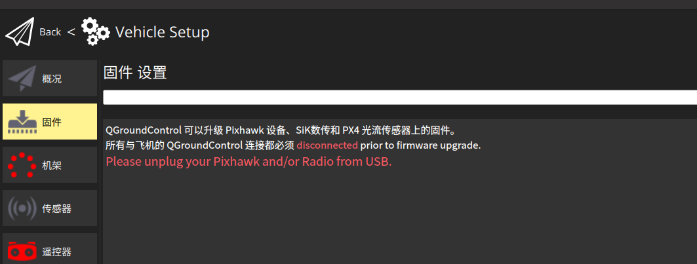

# PX4_xjc

px4开发学习

用来把扫地机底板的各种信息数据通过窜口传输到px4中

| 内容                             | 作者 | 日期       |
| -------------------------------- | ---- | ---------- |
| 实现从串口接收到扫地机的底板数据 | xjc  | 2025-01-03 |
|                                  |      |            |
|                                  |      |            |
|                                  |      |            |

## 注意

1、使用的串口uart要注意px4中的配置，避免和其他串口冲突
这里使用了uart4，也可按照自己的需求更改

重点注意在px4中开发 c++的支持甚少，主要还是用C比较稳妥，尽量用nuttx支持的api

**PX4串口映射**

-  TELEM1 -> UART2
-  TELEM2 -> UART4
-  TELEM3-> UART7 (ESC Telemetry)
-  TELEM4 -> UART8
-  GPS1 -> UART1
-  GPS2 -> UART3
-  RC -> UART5

## 使用

1、配置

2、增项

3、编译

4、烧录

插拔

5、验证

