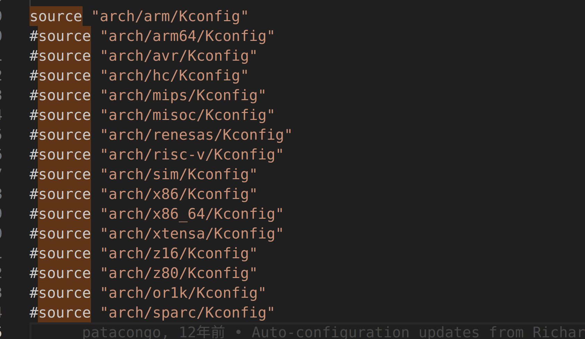
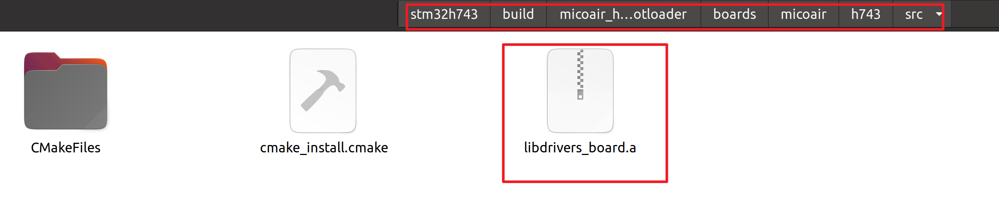
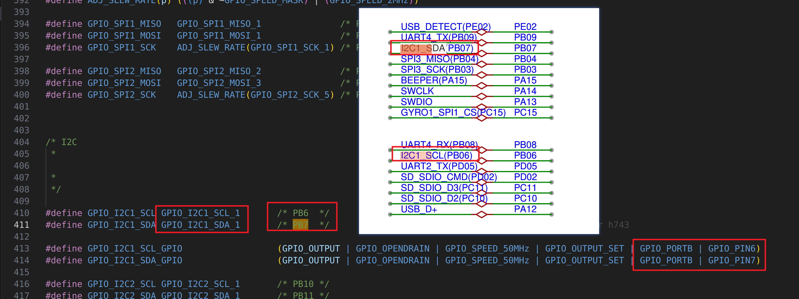
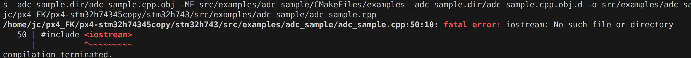
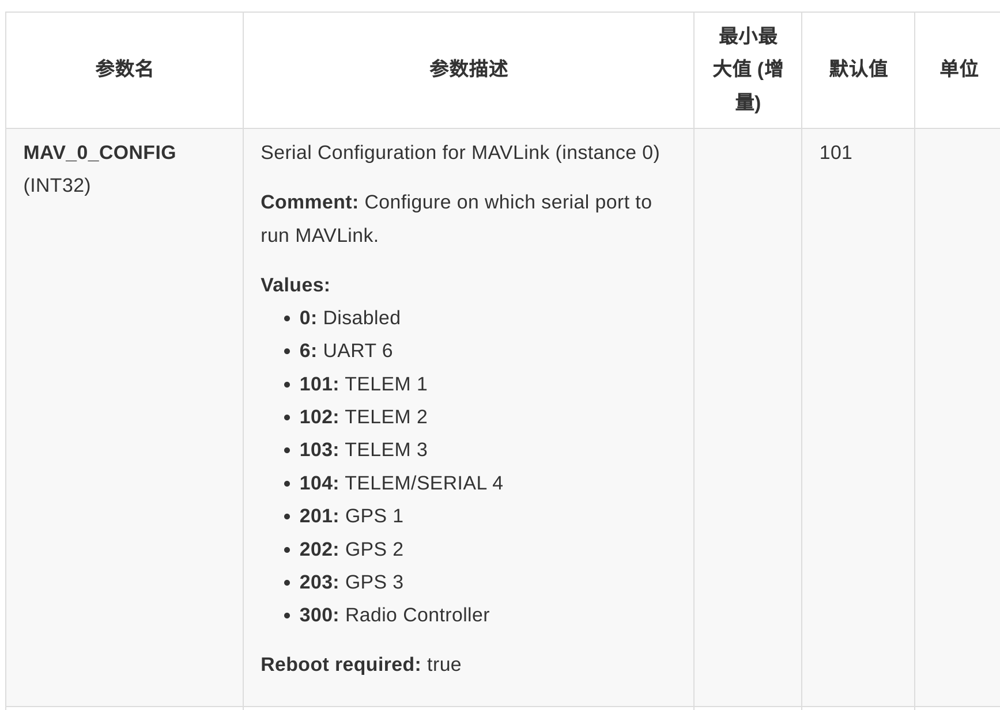
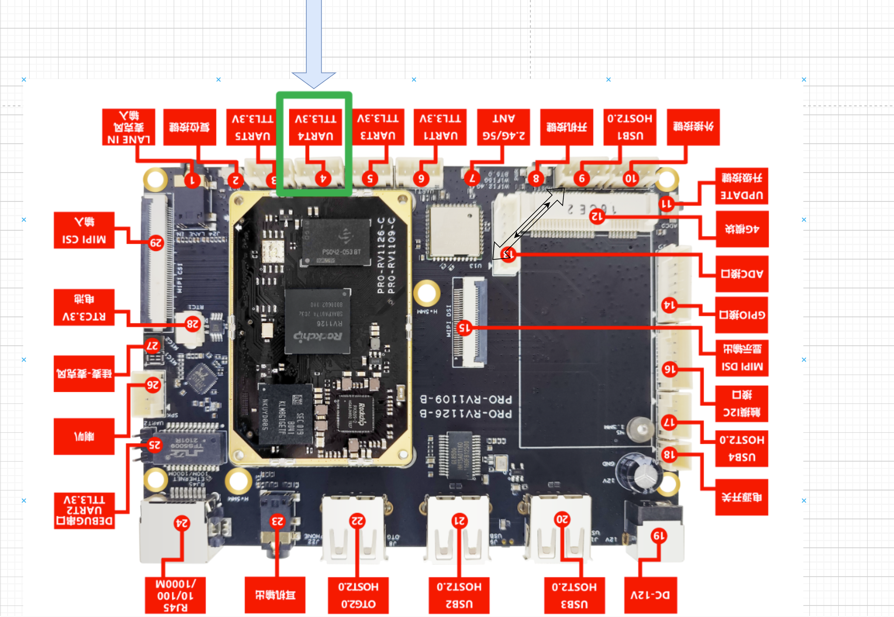
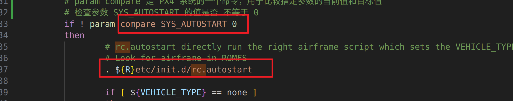
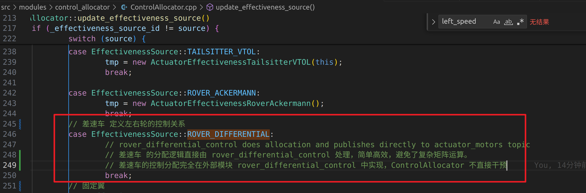
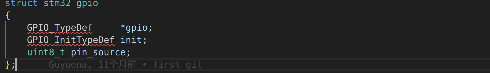
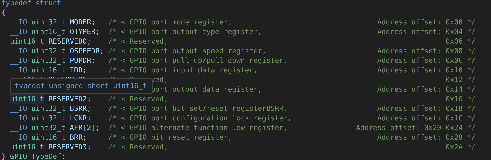

#  **PX4 Autopilot**


file:///home/jc/%E4%B8%8B%E8%BD%BD/stm32f405rg.pdf


https://micoair.cn/docs/MicoAir405v2-fei-kong-yong-hu-shou-ce


## 源码目录


**airmind, ark, atl, av** 等目录： 这些目录通常代表不同的制造商或系列产品。例如，`airmind`、`ark` 和 `atl` 可能对应各自品牌的飞行控制板。

**beaglebone**: 支持 BeagleBone 开发板，它是一种功能强大的微型计算机，常用于无人机或机器人项目。

**bitcraze**: 支持 Bitcraze 公司的硬件，例如 Crazyflie 系列微型无人机控制板。

**cuav**: 包含对 CUAV 硬件的支持，如 CUAV V5+ 等飞行控制板。

**cubepilot**: 支持 CubePilot 公司生产的 Cube 系列飞控硬件（例如 Cube Black、Cube Orange），这些板子常用于 Pixhawk 项目。

**diatone**: 支持 Diatone 公司生产的飞行控制器，常用于竞速无人机。

**emlid**: 包含对 Emlid 公司的硬件支持，例如 Emlid Edge 等飞行控制板，广泛用于无人机和精确定位项目。

**freefly**: 支持 Freefly 公司的飞行控制器，例如 Freefly Alta 系列，用于工业级无人机。

**holybro**: 支持 Holybro 公司的硬件，例如 Pixhawk 4 飞控板。

**matek**: 支持 Matek 的硬件，包括 Matek F4 和 F7 系列飞控板，通常用于小型无人机和竞速无人机。

**modalai**: 包含对 ModalAI 硬件的支持，例如 VOXL 系列开发板，通常用于视觉和 AI 无人机系统。

**mro**: 支持 MRO 公司（Mini Quad Pixhawk OEM）的硬件，通常是 Pixhawk 兼容的飞控板。

**nxp**: 包含对 NXP 半导体公司的开发板支持，例如 NXP 的 i.MX 系列。

**omnibus**: 支持 Omnibus 系列飞行控制器，通常用于小型无人机。

**px4**: 包含原生的 PX4 官方硬件支持，如 FMUv5 等 Pixhawk 系列硬件，通常是 PX4 项目的主要测试和支持平台。

**raspberrypi**: 支持 Raspberry Pi 平台，用于运行 PX4 的伴随计算（companion computer）或作为低功耗无人机控制器。

**scumaker**: 支持 Scumaker 公司的飞控硬件，可能是专用的或定制化的无人机控制板。

**sky-drones**: 包含 Sky-Drones 公司的硬件支持，例如一些商用和工业无人机控制器。

**spracing**: 支持 SP Racing 系列飞控板，通常用于竞速无人机和小型飞控板。

**uvify**: 包含对 UVify 公司的硬件支持，例如竞速无人机控制器。


## Kconfig

在嵌入式工程中，**Kconfig** 的主要作用是提供一种灵活、结构化的方式来管理和配置系统构建选项。具体来说，Kconfig 的作用包括以下几点：

1. 模块化配置系统

- Kconfig 是一种模块化的配置文件系统，它允许开发者将复杂的嵌入式系统配置分解为多个模块，每个模块可以独立配置和管理。通过 Kconfig，开发者可以选择性地启用或禁用系统的某些模块或功能（如驱动程序、协议栈、硬件外设等），从而减少不必要的代码，提高系统效率。

2. 跨平台配置管理

- 在支持多平台（如不同架构的芯片、操作系统）的嵌入式工程中，Kconfig 可以对不同平台的配置进行统一管理。它可以根据目标平台来自动选择相关配置，使得同一套代码能够轻松适配多个不同的硬件平台。

3. **简化配置操作**

- Kconfig 提供了用户友好的界面（如`menuconfig`命令）来选择和配置选项。开发者可以通过图形化或文本菜单界面直接选择所需功能，而无需手动编辑配置文件，降低了出错率和维护难度。

4. **构建系统集成**

- 嵌入式工程中通常会结合 Kconfig 和构建系统（如 Makefile、CMake 等）来动态生成配置文件，这些文件会在编译过程中指定编译选项。通过集成 Kconfig，构建系统能够根据配置自动调整编译流程和依赖关系，确保生成的二进制文件符合所需的配置。

5. **条件编译支持**

- Kconfig 定义的配置项可以用在代码中作为编译条件。例如，可以根据某一配置选项是否启用来控制某段代码是否参与编译。这种灵活的条件编译机制在资源有限的嵌入式系统中尤为重要，有助于生成最小化和最优化的可执行文件。

6. **配置依赖关系管理**

- Kconfig 提供了依赖管理功能，允许开发者为配置项设置依赖关系或条件限制。例如，某个配置选项可能依赖于其他选项的启用或禁用，Kconfig 可以确保只有在满足依赖条件时才允许选择该选项。这种管理可以防止冲突和错误配置，提高系统稳定性。


**Kconfig** 是一种配置管理工具，用于定义系统的配置选项。它本身不是直接被编译器识别的，而是作为嵌入式系统构建工具链（如 **Makefile** 或 **CMake** 系统）的配置接口来使用的。以下是使用 Kconfig 的步骤以及具体说明：

**使用 Kconfig 的基本步骤**

1. **创建 Kconfig 文件**

   - 在项目根目录下创建一个 `Kconfig` 文件。文件中定义了系统配置选项、依赖关系以及各个配置模块的入口。
   - Kconfig 文件可以在项目的子目录中递归调用，使用 `source` 语句将子模块的 Kconfig 文件包含进来。

2. **编写配置选项**

   - 在 Kconfig 文件中定义配置选项，使用 `config` 关键字声明配置项。

   - 可以使用 

     bool、int、string

      等类型来定义选项类型，例如：

     ```
     config FEATURE_ENABLE
         bool "Enable Feature X"
         default n
         help
             This option enables Feature X in the system.
     ```

3. **定义选项之间的依赖关系**

   - 可以使用 depends on或 select

     等关键字指定配置选项之间的依赖关系。例如：

     ```
     config DRIVER_UART
         bool "Enable UART Driver"
         depends on ARCH_ARM
         help
             Enable support for UART driver on ARM architecture.
     ```

4. **菜单化配置项**

   - 通过 menu和 endmenu

     关键字来组织配置项，以便用户通过菜单界面选择和配置。例如：

     ```
     menu "Device Drivers"
     
     config DRIVER_SPI
         bool "Enable SPI Driver"
     
     endmenu
     ```

5. **运行配置界面**

   - 在命令行运行 `make menuconfig` 或 `make nconfig`（通常需要依赖 **GNU Make** 和 **ncurses** 库），进入图形化的配置界面，查看和修改配置选项。
   - 选择配置后，Kconfig 会生成 `.config` 文件，存储所有的选项。

**使用 Kconfig 的工具**

通常情况下，Kconfig 由 Linux 内核的构建工具识别，主要有以下几个工具：

- **menuconfig**：基于文本的菜单界面（最常用）。
- **nconfig**：改进的文本界面，具备更多的界面特性。
- **xconfig**：基于 Qt 的图形界面（需要安装 Qt）。
- **gconfig**：基于 GTK 的图形界面（需要安装 GTK）。

例如，在项目目录下可以执行以下命令进入配置界面：

```
make menuconfig
```

**编译器的关联**

Kconfig 本身并不直接由编译器（如 GCC、Clang）识别，而是被构建系统解析，将配置结果生成 `.config` 文件等，然后通过 Makefile 或 CMake 来控制编译流程。构建系统会根据 Kconfig 的配置，将相应的预编译选项（如 `-D` 选项）传递给编译器，从而使代码中的条件编译生效。例如：

```
#ifdef CONFIG_FEATURE_ENABLE
// 代码逻辑
#endif
```

这种条件编译的逻辑最终会被编译器解析和执行，但前提是构建系统根据 Kconfig 的配置生成了 `CONFIG_FEATURE_ENABLE` 宏定义。


## __EXPORT


在 PX4 的代码中，`__EXPORT` 是一个宏定义，通常用于声明函数或变量可以被其他文件或模块使用（即导出到链接器可见范围）。

**1. 宏的定义**

`__EXPORT` 的定义依赖于所使用的编译器或平台。

```c
#define __EXPORT __attribute__((visibility("default")))
```

在这种定义下：

- `__attribute__((visibility("default"))`

  ：

  - 是 GCC/Clang 提供的一个属性，用于控制符号的可见性。
  - 使函数或变量的符号在编译后的共享库或二进制中对外可见。
  - 如果未设置该属性，则符号可能默认是内部可见（`hidden`），仅在当前编译单元中可用。

**2. 使用场景**

在 PX4 中，`__EXPORT` 通常用于以下场景：

**2.1 导出模块接口**

- 当一个模块需要提供函数给其他模块调用时，使用 `__EXPORT` 声明这些函数。

```
#include <.h>

__EXPORT void my_module_function() {
    // 该函数可以被其他模块调用
}
```

**2.2 驱动和设备注册**

- PX4 中的设备驱动程序通常需要导出一些关键函数（例如 `main` 或初始化函数），以便飞控系统能正确调用它们。

```
__EXPORT int my_driver_main(int argc, char *argv[]) {
    // 驱动的主入口
}
```

**2.3 uORB 消息发布**

- 在某些情况下，PX4 中的 `uORB` 消息发布功能也可能使用 `__EXPORT`，以确保这些函数能被正确地调用。

------

**3. 示例：模块的初始化与导出**

以下是一个典型的模块使用 `__EXPORT` 的示例：

```
#include <px4_platform_common/px4_config.h>
#include <px4_platform_common/log.h>

// 导出模块主入口函数
__EXPORT int my_module_main(int argc, char *argv[]) {
    PX4_INFO("Hello from my module!");
    return 0;
}
```

- `__EXPORT` 的作用

  ：

  - 确保 `my_module_main` 函数在最终的二进制文件中是全局可见的。
  - 这样，系统可以通过反射机制找到并调用该模块。

------

**4. 与 `__IMPORT` 的对比**

在某些项目中，你可能会看到 `__IMPORT`，它通常与 `__EXPORT` 配合使用：

```
#define __IMPORT extern
```

- **`__IMPORT`**：声明某个符号是从外部模块引入的。
- **`__EXPORT`**：声明某个符号是要导出的，可以被其他模块使用。

在 PX4 中，`__IMPORT` 使用较少，而 `__EXPORT` 更常见。

------

**5. 背后的机制**

- 在 C 和 C++ 中，符号的可见性由链接器管理。
- 默认情况下，所有的全局函数和变量都可能被导出，但现代编译器允许通过设置符号的可见性来优化代码。
- 使用 `__EXPORT` 显式声明导出符号，可以提高代码的模块化和链接器性能，同时避免不必要的符号暴露。

------

**6. 总结**

- `__EXPORT` 是 PX4 中的一个宏，用于声明函数或变量为全局可见，允许它们被其他文件或模块调用。
- 它通常用于模块接口、驱动程序入口点和关键功能的导出。
- 通过使用 `__EXPORT`，PX4 确保模块化设计的灵活性和代码可维护性。


# 编译


## 权限

PX4官方警告：“永远不要使用sudo来修复权限问题，否则会带来更多的权限问题，需要重装系统来解决”
 所以给普通用户一点权限来解决编译时使用sudo可能带来的危机

```
sudo usermod -a -G dialout $USER

```


## 环境配置

注意不要在conda的虚拟环境中，有虚拟环境先退出

```bash
bash ./PX4-Autopilot/Tools/setup/ubuntu.sh
```


## 构建代码

https://docs.px4.io/v1.14/zh/dev_setup/building_px4.html

he `_default` suffix is optional. For example, `make px4_fmu-v5` and `px4_fmu-v5_default` result in the same firmware. 若要在您的计算机上获得*最新的*版本，请在终端中输入以下命令：

The following list shows the build commands for the [Pixhawk standard](https://docs.px4.io/v1.14/zh/flight_controller/autopilot_pixhawk_standard.html) boards:

- [Holybro Pixhawk 6X (FMUv6X)](https://docs.px4.io/v1.14/zh/flight_controller/pixhawk6x.html): `make px4_fmu-v6x_default`
- [Holybro Pixhawk 6C (FMUv6C)](https://docs.px4.io/v1.14/zh/flight_controller/pixhawk6c.html): `make px4_fmu-v6c_default`
- [Holybro Pixhawk 6C Mini (FMUv6C)](https://docs.px4.io/v1.14/zh/flight_controller/pixhawk6c_mini.html): `make px4_fmu-v6c_default`
- [Holybro Pix32 v6 (FMUv6C)](https://docs.px4.io/v1.14/zh/flight_controller/holybro_pix32_v6.html): `make px4_fmu-v6c_default`
- [Holybro Pixhawk 5X (FMUv5X)](https://docs.px4.io/v1.14/zh/flight_controller/pixhawk5x.html): `make px4_fmu-v5x_default`
- [Pixhawk 4 (FMUv5)](https://docs.px4.io/v1.14/zh/flight_controller/pixhawk4.html): `make px4_fmu-v5_default`
- [Pixhawk 4 Mini (FMUv5)](https://docs.px4.io/v1.14/zh/flight_controller/pixhawk4_mini.html): `make px4_fmu-v5_default`
- [CUAV V5+ (FMUv5)](https://docs.px4.io/v1.14/zh/flight_controller/cuav_v5_plus.html): `make px4_fmu-v5_default`
- [CUAV V5 nano (FMUv5)](https://docs.px4.io/v1.14/zh/flight_controller/cuav_v5_nano.html): `make px4_fmu-v5_default`
- [Pixracer (FMUv4)](https://docs.px4.io/v1.14/zh/flight_controller/pixracer.html): `make px4_fmu-v4_default`
- [Pixhawk 3 Pro](https://docs.px4.io/v1.14/zh/flight_controller/pixhawk3_pro.html): `make px4_fmu-v4pro_default`
- [Pixhawk Mini](https://docs.px4.io/v1.14/zh/flight_controller/pixhawk_mini.html): `make px4_fmu-v3_default`
- [Pixhawk 2 (Cube Black) (FMUv3)](https://docs.px4.io/v1.14/zh/flight_controller/pixhawk-2.html): `make px4_fmu-v3_default`
- [mRo Pixhawk (FMUv3)](https://docs.px4.io/v1.14/zh/flight_controller/mro_pixhawk.html): `make px4_fmu-v3_default` (supports 2MB Flash)
- [Holybro pix32 (FMUv2)](https://docs.px4.io/v1.14/zh/flight_controller/holybro_pix32.html): `make px4_fmu-v2_default`
- [Pixfalcon (FMUv2)](https://docs.px4.io/v1.14/zh/flight_controller/pixfalcon.html): `make px4_fmu-v2_default`
- [Dropix (FMUv2)](https://docs.px4.io/v1.14/zh/flight_controller/dropix.html): `make px4_fmu-v2_default`
- [Pixhawk 1 (FMUv2)](https://docs.px4.io/v1.14/zh/flight_controller/pixhawk.html): `make px4_fmu-v2_default`


## error 1：

```bash
CMake Error at platforms/posix/CMakeLists.txt:114 (configure_file):
  Operation not permitted


-- Configuring incomplete, errors occurred!
See also "/home/jc/px4_FK/PX4-Autopilot/build/px4_sitl_default/CMakeFiles/CMakeOutput.log".
Error: /home/jc/px4_FK/PX4-Autopilot/build/px4_sitl_default is not a directory
make: *** [Makefile:230：px4_sitl_default] 错误 1
```


## error2


## error3

**不要在虚拟环境中**


## error4：


修改此代码片段：

找到如下代码：

```
interpreter = em.Interpreter(output=ofile, globals=em_globals, options={
                             em.RAW_OPT: True, em.BUFFERED_OPT: True
                             })
```

并将其改为：

```
interpreter = em.Interpreter(output=ofile, globals=em_globals)
```

这样可以完全去掉 `RAW_OPT` 和 `BUFFERED_OPT` 的选项参数。

找到以下代码行（约在第 128 行）：

```
interpreter = em.Interpreter(output=ofile, globals=merged_em_globals, options={em.RAW_OPT: True, em.BUFFERED_OPT: True})
```

修改为：

```
interpreter = em.Interpreter(output=ofile, globals=merged_em_globals)
```


##  最小的应用程序


https://docs.px4.io/v1.14/zh/modules/hello_sky.html


```bash
jc@jc:~/px4_FK/PX4-Autopilot$ make
-- PX4_GIT_TAG: v1.15.0-beta1-2622-gc9f64aeea8
-- Found PythonInterp: /usr/bin/python3 (found suitable version "3.8.10", minimum required is "3") 
-- PX4 config file: /home/jc/px4_FK/PX4-Autopilot/boards/px4/sitl/default.px4board
-- PLATFORM posix
-- ROMFSROOT px4fmu_common
-- ROOTFSDIR .
-- TESTING y
-- ETHERNET y
-- ROOT_PATH .
-- PARAM_FILE /fs/mtd_params
-- PX4 config: px4_sitl_default
-- PX4 platform: posix
-- PX4 lockstep: enabled
-- The CXX compiler identification is GNU 9.4.0
-- The C compiler identification is GNU 9.4.0
-- The ASM compiler identification is GNU
-- Found assembler: /usr/bin/cc
-- Detecting CXX compiler ABI info
-- Detecting CXX compiler ABI info - done
-- Check for working CXX compiler: /usr/bin/c++ - skipped
-- Detecting CXX compile features
-- Detecting CXX compile features - done
-- Detecting C compiler ABI info
-- Detecting C compiler ABI info - done
-- Check for working C compiler: /usr/bin/cc - skipped
-- Detecting C compile features
-- Detecting C compile features - done
-- cmake build type: RelWithDebInfo
/usr/bin/python3: Error while finding module specification for 'symforce.symbolic' (ModuleNotFoundError: No module named 'symforce')
-- Looking for gz-transport12 -- found version 12.2.1
-- Searching for dependencies of gz-transport12
-- Found Protobuf: /usr/lib/x86_64-linux-gnu/libprotobuf.so;-lpthread (found version "3.6.1") 
-- Config-file not installed for ZeroMQ -- checking for pkg-config
-- Checking for module 'libzmq >= 4'
--   Found libzmq , version 4.1.6
-- Found ZeroMQ: TRUE (Required is at least version "4") 
-- Checking for module 'uuid'
--   Found uuid, version 2.31.1
-- Found UUID: TRUE  
-- Looking for gz-utils2 -- found version 2.2.0
-- Searching for dependencies of gz-utils2
-- Searching for <gz-utils2> component [cli]
-- Looking for gz-utils2-cli -- found version 2.2.0
-- Searching for dependencies of gz-utils2-cli
-- Looking for gz-msgs9 -- found version 9.5.0
-- Searching for dependencies of gz-msgs9
-- Looking for gz-math7 -- found version 7.5.1
-- Searching for dependencies of gz-math7
-- Looking for gz-utils2 -- found version 2.2.0
-- Checking for module 'tinyxml2'
--   Found tinyxml2, version 6.2.0
-- Could NOT find Java (missing: Java_JAVA_EXECUTABLE Java_JAR_EXECUTABLE Java_JAVAC_EXECUTABLE Java_JAVAH_EXECUTABLE Java_JAVADOC_EXECUTABLE) 
-- ROMFS: ROMFS/px4fmu_common
Architecture:  amd64
==> CPACK_INSTALL_PREFIX = @DEB_INSTALL_PREFIX@
-- Configuring done
-- Generating done
-- Build files have been written to: /home/jc/px4_FK/PX4-Autopilot/build/px4_sitl_default
[0/1059] git submodule src/modules/uxrce_dds_client/Micro-XRCE-DDS-Client
```


**make px4_fmu-v2_default** 

```bash
jc@jc:~/px4_FK/PX4-Autopilot$ make px4_fmu-v2_default 
-- PX4_GIT_TAG: v1.15.0-beta1-2622-gc9f64aeea8
-- Found PythonInterp: /usr/bin/python3 (found suitable version "3.8.10", minimum required is "3") 
-- PX4 config file: /home/jc/px4_FK/PX4-Autopilot/boards/px4/fmu-v2/default.px4board
-- PLATFORM nuttx
-- TOOLCHAIN arm-none-eabi
-- ARCHITECTURE cortex-m4
-- ROMFSROOT px4fmu_common
-- IO px4_io-v2_default
-- CONSTRAINED_FLASH y
-- NO_HELP y
-- CONSTRAINED_MEMORY y
-- SERIAL_GPS1 /dev/ttyS3
-- SERIAL_TEL1 /dev/ttyS1
-- SERIAL_TEL2 /dev/ttyS2
-- SERIAL_TEL4 /dev/ttyS6
-- ROOT_PATH /fs/microsd
-- PARAM_FILE /fs/mtd_params
-- PX4 config: px4_fmu-v2_default
-- PX4 platform: nuttx
-- The CXX compiler identification is GNU 9.2.1
-- The C compiler identification is GNU 9.2.1
-- The ASM compiler identification is GNU
-- Found assembler: /usr/bin/arm-none-eabi-gcc
-- Detecting CXX compiler ABI info
-- Detecting CXX compiler ABI info - done
-- Check for working CXX compiler: /usr/bin/arm-none-eabi-g++ - skipped
-- Detecting CXX compile features
-- Detecting CXX compile features - done
-- Detecting C compiler ABI info
-- Detecting C compiler ABI info - done
-- Check for working C compiler: /usr/bin/arm-none-eabi-gcc - skipped
-- Detecting C compile features
-- Detecting C compile features - done
-- cmake build type: MinSizeRel
-- drivers/px4io: ROMFS including px4_io-v2_default
/usr/bin/python3: Error while finding module specification for 'symforce.symbolic' (ModuleNotFoundError: No module named 'symforce')
-- ROMFS: ROMFS/px4fmu_common
-- ROMFS:  Adding platforms/nuttx/init/stm32/rc.board_arch_defaults -> /etc/init.d/rc.board_arch_defaults
-- ROMFS:  Adding boards/px4/fmu-v2/init/rc.board_defaults -> /etc/init.d/rc.board_defaults
-- ROMFS:  Adding boards/px4/fmu-v2/init/rc.board_sensors -> /etc/init.d/rc.board_sensors
-- ROMFS:  Adding boards/px4/fmu-v2/extras/px4_fmu-v2_bootloader.bin -> /etc/extras/px4_fmu-v2_bootloader.bin
-- ROMFS:  Adding boards/px4/fmu-v2/extras/px4_io-v2_default.bin -> /etc/extras/px4_io-v2_default.bin
-- Configuring done
-- Generating done
-- Build files have been written to: /home/jc/px4_FK/PX4-Autopilot/build/px4_fmu-v2_default
[0/836] git submodule src/drivers/gps/devices
```


## **make micoair_h743_default**

```bash
make micoair_h743_default
```


```bash
jc@jc:~/px4_FK/PX4-Autopilot$ make micoair_h743_default
-- PX4_GIT_TAG: v1.15.0-beta1-2622-gc9f64aeea8
-- Found PythonInterp: /usr/bin/python3 (found suitable version "3.8.10", minimum required is "3") 
-- PX4 config file: /home/jc/px4_FK/PX4-Autopilot/boards/micoair/h743/default.px4board
-- PLATFORM nuttx
-- TOOLCHAIN arm-none-eabi
-- ARCHITECTURE cortex-m7
-- ROMFSROOT px4fmu_common
-- SERIAL_URT6 /dev/ttyS5
-- SERIAL_GPS1 /dev/ttyS2
-- SERIAL_TEL1 /dev/ttyS0
-- SERIAL_TEL2 /dev/ttyS1
-- SERIAL_TEL3 /dev/ttyS3
-- SERIAL_TEL4 /dev/ttyS6
-- SERIAL_RC /dev/ttyS4
-- ROOT_PATH /fs/microsd
-- PARAM_FILE /fs/mtd_params
-- UAVCAN_INTERFACES 1
-- PX4 config: micoair_h743_default
-- PX4 platform: nuttx
-- The CXX compiler identification is GNU 9.2.1
-- The C compiler identification is GNU 9.2.1
-- The ASM compiler identification is GNU
-- Found assembler: /usr/bin/arm-none-eabi-gcc
-- Detecting CXX compiler ABI info
-- Detecting CXX compiler ABI info - done
-- Check for working CXX compiler: /usr/bin/arm-none-eabi-g++ - skipped
-- Detecting CXX compile features
-- Detecting CXX compile features - done
-- Detecting C compiler ABI info
-- Detecting C compiler ABI info - done
-- Check for working C compiler: /usr/bin/arm-none-eabi-gcc - skipped
-- Detecting C compile features
-- Detecting C compile features - done
-- Enabling double FP precision hardware instructions
-- cmake build type: MinSizeRel
CMake Deprecation Warning at src/drivers/ins/vectornav/libvnc/CMakeLists.txt:1 (cmake_minimum_required):
  Compatibility with CMake < 2.8.12 will be removed from a future version of
  CMake.

  Update the VERSION argument <min> value or use a ...<max> suffix to tell
  CMake that the project does not need compatibility with older versions.


-- Found PythonInterp: /usr/bin/python3 (found version "3.8.10") 
-- Release build type: MinSizeRel
/usr/bin/python3: Error while finding module specification for 'symforce.symbolic' (ModuleNotFoundError: No module named 'symforce')
-- ROMFS: ROMFS/px4fmu_common
-- ROMFS:  Adding platforms/nuttx/init/stm32h7/rc.board_arch_defaults -> /etc/init.d/rc.board_arch_defaults
-- ROMFS:  Adding boards/micoair/h743/init/rc.board_defaults -> /etc/init.d/rc.board_defaults
-- ROMFS:  Adding boards/micoair/h743/init/rc.board_sensors -> /etc/init.d/rc.board_sensors
-- ROMFS:  Adding boards/micoair/h743/init/rc.board_extras -> /etc/init.d/rc.board_extras
-- Configuring done
-- Generating done
-- Build files have been written to: /home/jc/px4_FK/PX4-Autopilot/build/micoair_h743_default
[0/1162] git submodule src/modules/uxrce_dds_client/Micro-XRCE-DDS-Client
```


make  厂商名 _ 系列名 _  default


```bash
jc@jc:~/px4_FK/PX4-Autopilot/build/micoair_h743_default$ ls
actuators.json                                                            libuavcan_dsdlc_run.stamp
actuators.json.xz                                                         mavlink
airframes.xml                                                             micoair_h743_default.bin
boardconfig                                                               micoair_h743_default.elf
boards                                                                    micoair_h743_default.map
build.ninja                                                               micoair_h743_default.px4
CMakeCache.txt                                                            msg
CMakeFiles                                                                NuttX
cmake_install.cmake                                                       nuttx_olddefconfig.log
compile_commands.json                                                     parameters.json
component_general.json                                                    parameters.json.xz
component_general.json.xz                                                 parameters.xml
CPackConfig.cmake                                                         parameters.xml.xz
CPackSourceConfig.cmake                                                   platforms
defconfig_inflate_stamp                                                   px4_boardconfig.h
etc                                                                       ROMFS
events                                                                    romfs_extras
external                                                                  romfs_files.tar
gencromfs                                                                 src
generated_params                                                          uORB
git_init__home_jc_px4_FK_PX4-Autopilot_platforms_nuttx_NuttX_nuttx.stamp
jc@jc:~/px4_FK/PX4-Autopilot/build/micoair_h743_default$ 
```


[其他主板的构建命令在主板特定的飞行控制器页面](https://docs.px4.io/main/en/flight_controller/)中给出（通常在标题*“构建固件”*下）。

您还可以使用以下命令列出所有配置目标：

嘘

```bash
make list_config_targets
```

```bash
jc@jc:~/px4_FK/PX4-Autopilot$ make list_config_targets
3dr_ctrl-zero-h7-oem-revg_bootloader
3dr_ctrl-zero-h7-oem-revg[_default]
airmind_mindpx-v2[_default]
ark_can-flow_canbootloader
ark_can-flow[_default]
ark_can-gps_canbootloader
ark_can-gps[_default]
ark_cannode_canbootloader
ark_cannode[_default]
ark_can-rtk-gps_canbootloader
ark_can-rtk-gps[_default]
ark_fmu-v6x_bootloader
ark_fmu-v6x[_default]
ark_fpv_bootloader
ark_fpv[_default]
ark_pi6x_bootloader
ark_pi6x[_default]
ark_septentrio-gps_canbootloader
ark_septentrio-gps[_default]
atl_mantis-edu[_default]
av_x-v1[_default]
beaglebone_blue[_default]
bitcraze_crazyflie21[_default]
bitcraze_crazyflie[_default]
cuav_7-nano_bootloader
cuav_7-nano[_default]
cuav_can-gps-v1_canbootloader
cuav_can-gps-v1[_default]
cuav_nora_bootloader
cuav_nora[_default]
cuav_x7pro_bootloader
cuav_x7pro[_default]
cuav_x7pro_test
cubepilot_cubeorange_bootloader
cubepilot_cubeorange_console
cubepilot_cubeorange[_default]
cubepilot_cubeorangeplus_bootloader
cubepilot_cubeorangeplus_console
cubepilot_cubeorangeplus[_default]
cubepilot_cubeorangeplus_test
cubepilot_cubeorange_test
cubepilot_cubeyellow[_default]
cubepilot_io-v2[_default]
diatone_mamba-f405-mk2[_default]
emlid_navio2[_default]
flywoo_gn-f405[_default]
freefly_can-rtk-gps_canbootloader
freefly_can-rtk-gps[_default]
hkust_nxt-dual_bootloader
hkust_nxt-dual[_default]
hkust_nxt-v1_bootloader
hkust_nxt-v1[_default]
holybro_can-gps-v1_canbootloader
holybro_can-gps-v1[_default]
holybro_durandal-v1_bootloader
holybro_durandal-v1[_default]
holybro_h-flow_canbootloader
holybro_h-flow[_default]
holybro_kakutef7[_default]
holybro_kakuteh7_bootloader
holybro_kakuteh7[_default]
holybro_kakuteh7mini_bootloader
holybro_kakuteh7mini[_default]
holybro_kakuteh7v2_bootloader
holybro_kakuteh7v2[_default]
holybro_pix32v5[_default]
matek_gnss-m9n-f4_canbootloader
matek_gnss-m9n-f4[_default]
matek_h743_bootloader
matek_h743[_default]
matek_h743-mini_bootloader
matek_h743-mini[_default]
matek_h743-slim_bootloader
matek_h743-slim[_default]
micoair_h743_bootloader
micoair_h743[_default]
modalai_fc-v1[_default]
modalai_fc-v2_bootloader
modalai_fc-v2[_default]
modalai_voxl2[_default]
modalai_voxl2-io[_default]
modalai_voxl2-slpi[_default]
mro_ctrl-zero-classic_bootloader
mro_ctrl-zero-classic[_default]
mro_ctrl-zero-f7[_default]
mro_ctrl-zero-f7-oem[_default]
mro_ctrl-zero-h7_bootloader
mro_ctrl-zero-h7[_default]
mro_ctrl-zero-h7-oem_bootloader
mro_ctrl-zero-h7-oem[_default]
mro_pixracerpro_bootloader
mro_pixracerpro[_default]
mro_x21-777[_default]
mro_x21[_default]
nxp_fmuk66-e[_default]
nxp_fmuk66-e_socketcan
nxp_fmuk66-v3[_default]
nxp_fmuk66-v3_socketcan
nxp_fmuk66-v3_test
nxp_mr-canhubk3[_default]
nxp_mr-canhubk3_fmu
nxp_mr-canhubk3_sysview
nxp_mr-canhubk3_zenoh
nxp_ucans32k146_canbootloader
nxp_ucans32k146_cyphal
nxp_ucans32k146[_default]
omnibus_f4sd[_default]
omnibus_f4sd_icm20608g
px4_fmu-v2[_default]
px4_fmu-v2_fixedwing
px4_fmu-v2_lto
px4_fmu-v2_multicopter
px4_fmu-v2_rover
px4_fmu-v3[_default]
px4_fmu-v4[_default]
px4_fmu-v4pro[_default]
px4_fmu-v4pro_test
px4_fmu-v4_test
px4_fmu-v5_cryptotest
px4_fmu-v5_cyphal
px4_fmu-v5_debug
px4_fmu-v5[_default]
px4_fmu-v5_lto
px4_fmu-v5_protected
px4_fmu-v5_rover
px4_fmu-v5_stackcheck
px4_fmu-v5_test
px4_fmu-v5_uavcanv0periph
px4_fmu-v5x[_default]
px4_fmu-v5x_rover
px4_fmu-v5x_test
px4_fmu-v6c_bootloader
px4_fmu-v6c[_default]
px4_fmu-v6c_rover
px4_fmu-v6u_bootloader
px4_fmu-v6u[_default]
px4_fmu-v6u_rover
px4_fmu-v6x_bootloader
px4_fmu-v6x[_default]
px4_fmu-v6x_multicopter
px4_fmu-v6x_rover
px4_fmu-v6xrt_allyes
px4_fmu-v6xrt_bootloader
px4_fmu-v6xrt[_default]
px4_fmu-v6xrt_rover
px4_fmu-v6x_zenoh
px4_io-v2[_default]
px4_raspberrypi[_default]
px4_ros2[_default]
px4_sitl_allyes
px4_sitl[_default]
px4_sitl_nolockstep
px4_sitl_replay
px4_sitl_test
px4_sitl_zenoh
raspberrypi_pico[_default]
scumaker_pilotpi_arm64
scumaker_pilotpi[_default]
siyi_n7_bootloader
siyi_n7[_default]
sky-drones_smartap-airlink[_default]
spracing_h7extreme[_default]
thepeach_k1[_default]
thepeach_r1[_default]
uvify_core[_default]
x-mav_ap-h743v2_bootloader
x-mav_ap-h743v2[_default]
zeroone_x6_bootloader
zeroone_x6[_default]
jc@jc:~/px4_FK/PX4-Autopilot$ 
```


### 编译输出


```bash
(base) jc@jc:~/px4_FK/PX4-Autopilot/build/micoair_h743_default$ tree -L 1
.
├── actuators.json
├── actuators.json.xz
├── airframes.xml
├── boardconfig
├── boards
├── build.ninja
├── CMakeCache.txt
├── CMakeFiles
├── cmake_install.cmake
├── compile_commands.json
├── component_general.json
├── component_general.json.xz
├── CPackConfig.cmake
├── CPackSourceConfig.cmake
├── defconfig_inflate_stamp
├── etc
├── events
├── external
├── gencromfs
├── generated_params
├── git_init__home_jc_px4_FK_PX4-Autopilot_platforms_nuttx_NuttX_nuttx.stamp
├── libuavcan_dsdlc_run.stamp
├── mavlink
├── micoair_h743_default.bin
├── micoair_h743_default.elf
├── micoair_h743_default.map
├── micoair_h743_default.px4
├── msg
├── NuttX
├── nuttx_olddefconfig.log
├── parameters.json
├── parameters.json.xz
├── parameters.xml
├── parameters.xml.xz
├── platforms
├── px4_boardconfig.h
├── ROMFS
├── romfs_extras
├── romfs_files.tar
├── src
└── uORB

14 directories, 27 files
(base) jc@jc:~/px4_FK/PX4-Autopilot/build/micoair_h743_default$ 
```

2. 重要的文件和目录说明

- **actuators.json** 和 **actuators.json.xz**：包含关于执行器配置的信息（如电机和舵机的配置参数），`.xz` 是压缩文件，便于减少体积。
- **airframes.xml**：定义了各类飞行器的框架和布局信息，包括姿态控制、传感器布局等参数。
- **boardconfig**：包含特定板子的硬件配置，例如引脚映射、板级外设（UART、SPI 等）的配置。
- **boards**：存放与板子相关的文件和配置，这些文件会影响构建过程中的板子设置和代码生成。
- **build.ninja**：`Ninja` 构建系统生成的文件，包含所有的构建指令。在构建时，`Ninja` 工具会根据这个文件定义的指令完成编译和链接。
- **CMakeCache.txt**：CMake 生成的缓存文件，记录了构建过程中的变量值和配置，用于加速后续的重新编译。
- **CMakeFiles**：CMake 的构建辅助文件夹，包含构建过程中的中间文件和指令。
- **cmake_install.cmake**：CMake 生成的安装脚本，定义了如何将编译后的产物安装到指定路径。
- **compile_commands.json**：包含所有编译命令的 JSON 文件，通常用于代码编辑器或 IDE 的自动补全、代码导航和 linting。
- **component_general.json** 和 **component_general.json.xz**：包含关于组件的一般信息的配置文件，`.xz` 文件是压缩版。
- **CPackConfig.cmake** 和 **CPackSourceConfig.cmake**：CPack 用于打包的配置文件，可用于生成固件包。
- **defconfig_inflate_stamp**：NuttX 系统的配置文件，用于生成当前配置的默认选项。
- **etc**：包含运行时的初始配置文件，包括启动脚本、参数等信息。
- **events**：存储 PX4 系统中的事件文件，供系统调试和故障诊断使用。
- **external**：存放外部库或依赖项，通常是编译过程中引入的第三方库。
- **gencromfs**：生成的只读文件系统（CromFS）的映像文件，用于嵌入式系统的文件存储。
- **generated_params**：包含生成的参数文件，用于系统初始化和配置。
- **git_init__home_jc_px4_FK_PX4-Autopilot_platforms_nuttx_NuttX_nuttx.stamp**：记录 `NuttX` 初始化状态的标记文件，用于确保初始化过程的正确性。
- **libuavcan_dsdlc_run.stamp**：与 `UAVCAN` 的 `DSDLC` 编译器相关的标记文件，通常用于生成无人机通信的 UAVCAN 消息。
- **mavlink**：包含生成的 `MAVLink` 消息文件，用于 PX4 系统与地面站或其他设备的通信。

------

3. 输出固件文件

- **micoair_h743_default.bin**：生成的二进制固件文件，可以直接烧录到硬件设备上。
- **micoair_h743_default.elf**：包含调试信息的可执行文件，用于在调试器中运行和检查代码。
- **micoair_h743_default.map**：存储链接器生成的内存映射信息，帮助开发者了解内存和外设地址的分配情况。
- **micoair_h743_default.px4**：PX4 固件的固有格式文件，也可用于特定地面站或工具加载固件。

------

4. 其他文件和目录

- **msg**：存放编译过程中生成的消息定义，用于 uORB 消息的编译和发布订阅系统。
- **NuttX**：包含 `NuttX` 系统的源文件或编译后的文件，PX4 使用的实时操作系统（RTOS）。
- **nuttx_olddefconfig.log**：旧的 NuttX 默认配置文件，用于追踪配置更改。
- **parameters.json**、**parameters.json.xz**、**parameters.xml**、**parameters.xml.xz**：参数文件，以 JSON 和 XML 格式存储，包含 PX4 的配置参数。
- **platforms**：包含平台特定的配置和初始化代码（例如 NuttX 和 POSIX）。
- **px4_boardconfig.h**：板级配置的头文件，定义了与硬件平台相关的常量和宏。
- **ROMFS**：只读文件系统文件，包含嵌入式系统启动时的文件结构。
- **romfs_extras**：包含额外的 ROMFS 文件，用于扩展系统的文件系统内容。
- **romfs_files.tar**：打包的 ROMFS 文件，可以在构建过程中展开到特定位置。
- **src**：源码文件目录，可能包含编译后生成的对象文件。
- **uORB**：包含 PX4 消息发布订阅系统生成的文件，用于进程间通信（IPC）


在 PX4 固件的编译输出目录中，不是所有文件都需要烧录到硬件板子上。只有生成的固件文件和与烧录相关的文件才是必要的，其余文件主要用于开发、调试、配置和构建过程中，不需要上传到板子中。

1. **需要烧录到板子中的文件**

对于烧录到硬件的文件，通常是以下几种格式的文件：

- **micoair_h743_default.bin**：这是最终的二进制固件文件，通常是烧录到板子上的主要文件。在大多数情况下，使用 `.bin` 文件来进行烧录。
- **micoair_h743_default.px4**：这是 PX4 特有的固件格式文件，有些地面站工具或 PX4 特定的工具可能会使用此文件来加载固件。不过，一般情况下 `.bin` 文件更通用，`.px4` 文件通常在特定应用场景或特定工具下使用。
- **micoair_h743_default.elf**（可选）：包含调试信息的可执行文件，通常用于通过调试器（如 JTAG 或 SWD）直接运行或调试。如果不进行在线调试，可以忽略该文件。

在实际操作中，**将 `.bin` 文件或 `.px4` 文件上传到飞控板上即可**，大多数情况下使用 `.bin` 文件。

------

2. **多余的文件（无需烧录的文件）**

以下是一些在板子上不需要的文件和目录，它们主要用于开发过程或本地构建：

- **构建和配置文件**：
  - **build.ninja**、**CMakeCache.txt**、**CMakeFiles**、**cmake_install.cmake**：用于构建和配置过程，不需要烧录。
  - **compile_commands.json**：用于开发工具的代码分析，不需要烧录。
  - **CPackConfig.cmake**、**CPackSourceConfig.cmake**：与打包相关的文件，不需要烧录。
- **板级配置文件**：
  - **boardconfig**、**px4_boardconfig.h**：包含与板级配置相关的信息，用于构建时的硬件定义，不需要烧录。
- **工具生成的标记文件**：
  - **defconfig_inflate_stamp**、**git_init__home_jc_px4_FK_PX4-Autopilot_platforms_nuttx_NuttX_nuttx.stamp**、**libuavcan_dsdlc_run.stamp**：用于标记特定工具或流程的状态，无需烧录。
- **调试和日志文件**：
  - **nuttx_olddefconfig.log**：构建过程中生成的日志文件，不需要烧录。
  - **micoair_h743_default.map**：链接器生成的内存映射文件，帮助开发者了解内存分配，用于调试，不需要烧录。
- **JSON、XML 配置文件**：
  - **actuators.json**、**component_general.json**、**parameters.json**、**parameters.xml** 及其压缩文件（.xz）：包含系统配置和参数信息，但这些参数通常已经被包含在最终的固件文件中，不需要单独烧录。
- **外部依赖**：
  - **external**：存放的第三方依赖文件，不需要烧录到板子中。
- **源文件、ROMFS 和 uORB**：
  - **ROMFS**、**romfs_extras**、**romfs_files.tar**：只读文件系统的内容，通常已经集成在最终的固件文件中，不需要单独烧录。
  - **src**、**msg**、**uORB**：编译后的中间文件和消息定义，不需要烧录。

------

3. **可选文件**

- **micoair_h743_default.elf**：如前所述，此文件包含了调试信息，可用于在线调试，但在实际烧录时通常不需要。
- **parameters.json** 和 **parameters.xml**：如果你希望在地面站进行参数管理，这些文件可以用于查看默认参数设置，但不需要烧录到板子。


## PX4 平台类型編譯類型

在这一系列配置项中，确实没有直接显示 PX4 平台类型（例如 `nuttx` 或 `posix`），但是可以通过某些特定配置推断出它适用于哪种平台。这些配置项更多地描述了构建固件所需的硬件支持、模块、驱动等内容。

推断平台的方式：

1. **工具链和架构**：

   ```
   plaintext复制代码CONFIG_BOARD_TOOLCHAIN="arm-none-eabi"
   CONFIG_BOARD_ARCHITECTURE="cortex-m7"
   ```

   - `CONFIG_BOARD_TOOLCHAIN="arm-none-eabi"` 指定了 `arm-none-eabi` 工具链，它通常用于交叉编译 ARM 设备，而非 Linux 或 Windows 本地环境。因此，这意味着目标是一个嵌入式平台（如 `nuttx`）。
   - `CONFIG_BOARD_ARCHITECTURE="cortex-m7"` 表明该硬件架构是 ARM Cortex-M 系列，进一步表明这是一个嵌入式系统配置（如 STM32 等平台）。


## 屏蔽指定的芯片结构进行精简

要屏蔽特定的芯片架构（例如 `A1X`）的编译，你可以修改 `Kconfig` 文件，将其相关的 `config` 条目或 `source` 语句设置为条件性地包含或直接注释掉。例如：

### 方法 1：注释 `A1X` 相关的 `source` 语句

找到 `ARCH_CHIP_A1X` 的 `source` 语句，将其注释掉：

```
# if ARCH_CHIP_A1X
# source "arch/arm/src/a1x/Kconfig"
# endif
```

这样一来，`A1X` 架构的 Kconfig 配置文件将不会被加载，相关的配置项也不会显示和使用。


把要屏蔽的文件夹删除


### 只保留Stm32H7

**减少其他芯片架构代码阅读干扰**


**platforms/nuttx/NuttX/nuttx/arch/arm/Kconfig**


### 架构层配置精简





**从而屏蔽其他芯片架构的内容**


**经过精简后，各种函数跳转就是正确的**


# px4 bootloader


boards/micoair/h743/src/CMakeLists.txt





# 固件  BUG


用 stm32cube 烧录bootloader  https://micoair.cn/docs/fei-kong-gu-jian-shao-lu-jiao-cheng-Ardupilot-PX4-Betaflight-INAV

用群里的


使用make XXX upload 出现 Waiting for .... 问题，那就使用QGC进行固件升级


插拔一下


**用了QGC 后再用make XXX upload 就行了，太神奇了**

**估计：是因为某个原因导致px4中的ttyACM0在电脑中驱动失败，使用QGC又把ACM0给修复了**


## 用STM32CubeProgrammer 烧录

https://micoair.cn/docs/fei-kong-gu-jian-shao-lu-jiao-cheng-Ardupilot-PX4-Betaflight-INAV

在 STM32CubeProgrammer ，插入px4板前先按住复位键再插上电脑，按住起码2秒，不然STM32CubeProgrammer 中无法识别到DFU设备

先烧录bootloader，最好bootloader的编译版本的分支和固件是一样的，减少问题出现

至于px4固件就可以用QGC烧录了，当然STM32CubeProgrammer 烧录也可以的


# NxtPx4

https://micoair.com/flightcontroller_nxtpx4v2/

https://github.com/HKUST-Aerial-Robotics/Nxt-FC?tab=readme-ov-file


Bootloader:

```bash
make hkust_nxt-dual_bootloader
```

​    

Firmware:

```bash
make hkust_nxt-dual
```


# QGroundControl


On the command prompt enter:

1. sh

   ```
   sudo usermod -a -G dialout $USER
   sudo apt-get remove modemmanager -y
   sudo apt install gstreamer1.0-plugins-bad gstreamer1.0-libav gstreamer1.0-gl -y
   sudo apt install libqt5gui5 -y
   sudo apt install libfuse2 -y
   ```

2. Logout and login again to enable the change to user permissions.

 To install *QGroundControl*:

1. Download [QGroundControl.AppImage](https://d176tv9ibo4jno.cloudfront.net/latest/QGroundControl.AppImage).
2. 使用终端命令安装(并运行)： sh chmod +x ./QGroundControl.AppImage ./QGroundControl.AppImage (or double click)


给串口加权限，linux中串口没权限，飞控板和控制站连接不上


以下是参数的说明表格：

| **参数名称**       | **作用**                                           | **默认值/选项**                             |
| ------------------ | -------------------------------------------------- | ------------------------------------------- |
| `MAV_0_CONFIG`     | 配置 MAVLink 实例 0 的通信接口。                   | `Disabled`，`TELEM 1`，`TELEM 2`，`USB CDC` |
| `MAV_0_RATE`       | 设置 MAVLink 实例 0 的最大发送速率。               | 默认值：`1200 B/s`                          |
| `MAV_0_MODE`       | 设置 MAVLink 实例 0 的工作模式。                   | `Normal`, `Custom`, `Onboard`, `OSD`        |
| `MAV_0_FORWARD`    | 是否允许 MAVLink 消息的转发。                      | `Enabled`, `Disabled`                       |
| `MAV_COMP_ID`      | MAVLink 组件 ID，用于标识 PX4 飞控系统的组件编号。 | 默认值：`1`                                 |
| `MAV_SYS_ID`       | MAVLink 系统 ID，用于标识 PX4 飞控系统的 ID。      | 默认值：`1`                                 |
| `MAV_TYPE`         | 定义 MAVLink 系统的飞行器类型。                    | `Quadrotor`，`Fixed Wing`，`VTOL`，`Rover`  |
| `MAV_PROTO_VER`    | 设置 MAVLink 协议版本。                            | `1`（MAVLink 1），`2`（MAVLink 2）          |
| `MAV_USEHILGPS`    | 指定是否接受 HIL GPS 数据。                        | `Enabled`, `Disabled`                       |
| `MC_SLOW_DEF_HVEL` | 设置默认水平速度限制。                             | 默认值：`3.0 m/s`                           |
| `MC_SLOW_DEF_VVEL` | 设置默认垂直速度限制。                             | 默认值：`1.0 m/s`                           |
| `MC_SLOW_DEF_YAWR` | 设置默认的偏航速率限制。                           | 默认值：`45 deg/s`                          |
| `MAV_HASH_CHK_EN`  | 启用参数哈希校验检查。                             | `Enabled`, `Disabled`                       |
| `MAV_HB_FORW_EN`   | 启用心跳消息的转发。                               | `Enabled`, `Disabled`                       |
| `MAV_FWD_EXTSP`    | 转发外部设定点消息。                               | `Enabled`                                   |
| `MAV_RADIO_TOUT`   | 设置无线电状态报告的超时时间。                     | 默认值：`5 s`                               |
| `MAV_SIK_RADIO_ID` | 设置 SiK 电台的无线电 ID。                         | 默认值：`0`                                 |
| `SDLOG_PROFILE`    | 日志记录配置，定义记录的主题。                     | 整数掩码值，默认值：`1`                     |
| `SYS_FAILURE_EN`   | 启用故障注入功能。                                 | `Enabled`, `Disabled`                       |


# PX4 系统架构概述

https://docs.px4.io/main/zh/concept/architecture.html

PX4 由两个主要部分组成：一是 [飞行控制栈（flight stack）](https://docs.px4.io/main/zh/concept/architecture.html#flight-stack) ，该部分主要包括状态估计和飞行控制系统；另一个是 [中间件](https://docs.px4.io/main/zh/concept/architecture.html#middleware) ，该部分是一个通用的机器人应用层，可支持任意类型的自主机器人，主要负责机器人的内部/外部通讯和硬件整合。

所有的 PX4 支持的 [无人机机型](https://docs.px4.io/main/zh/airframes/README.html) （包括其他诸如无人船、无人车、无人水下航行器等平台）均共用同一个代码库。 整个系统采用了 [响应式（reactive）](http://www.reactivemanifesto.org) 设计，这意味着：

- 所有的功能都可以被分割成若干可替换、可重复使用的部件。
- 通过异步消息传递进行通信。
- 系统可以应对不同的工作负载。


## 飞行控制栈 


**结构图模块解析**

1. **Sensors (传感器)**：
   - **功能**：提供飞行器当前的状态数据（如位置、姿态、速度等）。
   - **输入**：传感器原始数据（IMU、GPS、气压计、磁力计等）。
   - **输出**：原始传感器数据。
   - 典型硬件：
     - 加速度计（检测线性加速度）。
     - 陀螺仪（检测角速度）。
     - GPS（提供位置和速度）。
     - 气压计（测量高度）。
     - 磁力计（提供航向参考）。
2. **Position & Attitude Estimator (位置与姿态估计器)**：
   - 功能：
     - 将传感器的原始数据融合，计算无人机的位置信息（如位置、速度、高度）和姿态信息（如俯仰角、滚转角、航向角）。
   - **输入**：传感器数据（IMU、GPS、气压计等）。
   - **输出**：估计的无人机位置、速度、姿态等状态。
   - **PX4实现**：`EKF2` 或 `LPE`（扩展卡尔曼滤波器或本地位置估计器）。
3. **Navigator (导航器)**：
   - 功能：
     - 负责飞行路径规划、任务管理和航点导航。
     - 根据目标任务计算无人机的目标位置和飞行轨迹。
   - **输入**：飞行任务或导航目标（来自地面站或遥控器）。
   - **输出**：期望的目标位置、速度。
   - **PX4实现**：`navigator` 模块。
4. **RC (遥控器)**：
   - 功能：
     - 接收来自用户的遥控输入（例如通过遥控器发送的俯仰、滚转、油门和航向指令）。
   - **输入**：用户输入（例如摇杆的位置）。
   - **输出**：用户期望的控制指令（如姿态、位置调整）。
   - 作用：
     - 在手动模式下，直接向飞控控制器传递用户指令。
5. **Position Controller (位置控制器)**：
   - 功能：
     - 控制无人机的位置和速度，使其达到导航器提供的目标位置。
   - 输入：
     - 当前无人机的位置和速度（来自估计器）。
     - 目标位置和速度（来自导航器或用户）。
   - **输出**：期望的姿态（俯仰角、滚转角）和油门控制指令。
   - **PX4实现**：`mc_pos_control`（多旋翼位置控制器）。
6. **Attitude & Rate Controller (姿态与角速度控制器)**：
   - 功能：
     - 根据期望的姿态控制无人机的实际姿态。
     - 在更低的层次上，根据期望的角速度控制无人机的角速度。
   - 输入：
     - 期望的姿态（来自位置控制器）。
     - 当前的姿态与角速度（来自估计器）。
   - **输出**：电机或舵机的控制量（例如电机的转速）。
   - PX4实现：
     - `mc_att_control`（多旋翼姿态控制器）。
     - `mc_rate_control`（多旋翼角速度控制器）。
7. **Mixer (混控器)**：
   - 功能：
     - 将控制器输出的控制量（如俯仰、滚转、油门）转换为具体的电机指令。
     - 负责将飞控命令分配给各个电机或舵机。
   - **输入**：姿态控制器的输出指令。
   - **输出**：各电机或舵机的控制信号（如 PWM 信号）。
   - **PX4实现**：`mixer` 模块。
8. **Actuator (执行机构)**：
   - 功能：
     - 执行控制指令，完成物理动作。
     - 包括电机、舵机等。
   - **输入**：来自混控器的控制信号。
   - **输出**：物理动作（如电机转速、舵机偏角）。
   - 典型硬件：
     - 电调（ESC）：控制电机转速。
     - 电机：提供推力。
     - 舵机：控制方向。


**整体流程解析**

1. **感知阶段**：
   - 传感器（Sensors）收集无人机的实时状态（如加速度、速度、位置、姿态等）。
   - 位置与姿态估计器（Estimator）融合传感器数据，计算无人机当前的状态。
2. **计划阶段**：
   - 导航器（Navigator）根据任务规划目标位置。
   - 用户输入（RC）用于手动操作或辅助任务。
3. **控制阶段**：
   - 位置控制器（Position Controller）计算达到目标位置所需的姿态和推力。
   - 姿态与角速度控制器（Attitude & Rate Controller）根据期望姿态控制无人机的角速度和实际姿态。
4. **执行阶段**：
   - 混控器（Mixer）将姿态控制器的输出信号转换为执行机构的具体控制指令。
   - 执行机构（Actuator）根据指令完成无人机的实际动作（如电机转速调整、舵机偏转）。


**核心模块在 PX4 中的实现**

1. **Sensors**：
   - `sensors` 模块。
   - 数据通过 `uORB` 消息总线发布。
2. **Position & Attitude Estimator**：
   - `ekf2` 模块（扩展卡尔曼滤波器）。
3. **Navigator**：
   - `navigator` 模块，用于任务和路径管理。
4. **Position Controller**：
   - `mc_pos_control`（多旋翼位置控制器）。
5. **Attitude & Rate Controller**：
   - `mc_att_control`（多旋翼姿态控制器）。
   - `mc_rate_control`（多旋翼角速度控制器）。
6. **Mixer**：
   - `mixer` 模块，用于信号分配。
7. **Actuator**：
   - 驱动程序直接控制电机和舵机。


## commander

```bash
(base) jc@jc:~/px4_FK/px4-stm32h74345/stm32h743/src/modules/commander$ tree -L 1
.
├── accelerometer_calibration.cpp
├── accelerometer_calibration.h
├── airspeed_calibration.cpp
├── airspeed_calibration.h
├── Arming
├── baro_calibration.cpp
├── baro_calibration.h
├── calibration_messages.h
├── calibration_routines.cpp
├── calibration_routines.h
├── CMakeLists.txt
├── Commander.cpp
├── commander_helper.cpp
├── commander_helper.h
├── Commander.hpp
├── commander_params.c
├── esc_calibration.cpp
├── esc_calibration.h
├── factory_calibration_storage.cpp
├── factory_calibration_storage.h
├── failsafe
├── failure_detector
├── gyro_calibration.cpp
├── gyro_calibration.h
├── HealthAndArmingChecks
├── HomePosition.cpp
├── HomePosition.hpp
├── Kconfig
├── level_calibration.cpp
├── level_calibration.h
├── lm_fit.cpp
├── lm_fit.hpp
├── mag_calibration.cpp
├── mag_calibration.h
├── mag_calibration_test.cpp
├── mag_calibration_test_data.h
├── ModeManagement.cpp
├── ModeManagement.hpp
├── ModeManagementTest.cpp
├── ModeUtil
├── module.yaml
├── MulticopterThrowLaunch
├── px4_custom_mode.h
├── rc_calibration.cpp
├── rc_calibration.h
├── Safety.cpp
├── Safety.hpp
├── UserModeIntention.cpp
├── UserModeIntention.hpp
├── worker_thread.cpp
└── worker_thread.hpp
```

`commander` 模块由多个文件和子模块组成，每个部分负责不同的功能。以下是各文件和子目录的功能解释：

**`Commander.cpp`**

- 主程序入口，定义 `commander` 模块的主任务循环。
- 负责处理飞行模式切换、状态管理（如解锁/加锁）、健康检查等核心任务。

**`Commander.hpp`**

- 与 `Commander.cpp` 配套的头文件。
- 声明了 `Commander` 类的接口和成员变量。

**`commander_helper.cpp` / `commander_helper.h`**

- 包含辅助函数，例如解锁和飞行模式相关的工具函数。
- 负责实现与主任务逻辑无关的通用功能。

**`commander_params.c`**

- 定义与 `commander` 模块相关的参数。
- 例如：解锁条件 (`COM_ARM_REQ`)、飞行模式切换时间等。

**`HomePosition.cpp` / `HomePosition.hpp`**

- 管理无人机的“返航点”位置（Home Position）。
- 实现设置和检查返航点的逻辑。

**`Safety.cpp` / `Safety.hpp`**

- 处理无人机安全开关（Safety Switch）相关的功能。
- 用于手动控制解锁/加锁。

**`ModeManagement.cpp` / `ModeManagement.hpp`**

- 管理飞行模式的切换逻辑。
- 例如从手动模式切换到任务模式的状态机逻辑。

**`UserModeIntention.cpp` / `UserModeIntention.hpp`**

- 用户意图管理模块，分析用户输入（例如遥控器操作）并转化为飞行模式。

**`Arming/`**

- 包含解锁（arming）和飞行前检查的相关代码。
- 例如：`ArmingState.cpp` 实现了解锁状态的条件检查。
- `PreFlightCheck.cpp` 用于检查飞行前的传感器、系统状态。

**`failsafe/`**

- 包含故障安全逻辑（failsafe）相关的代码。
- 例如低电量、GPS 信号丢失、通信中断时的应急处理。

**`failure_detector/`**

- 实现无人机的故障检测逻辑。
- 检查飞行过程中是否出现异常（如振动过大、电机异常等）。

**`HealthAndArmingChecks/`**

- 健康检查和解锁前的条件检查模块。
- 检测传感器状态、电池电量、GPS 等条件是否满足飞行要求。

**`ModeUtil/`**

- 包含与飞行模式切换相关的通用工具函数。

**`MulticopterThrowLaunch/`**

- 多旋翼的抛投启动逻辑模块。
- 用于检测抛投启动条件（例如从手中抛出后自动解锁并启动飞行）。


**校准相关文件**

1. **`accelerometer_calibration.cpp` / `.h`**
   - 加速度计校准逻辑。
2. **`gyro_calibration.cpp` / `.h`**
   - 陀螺仪校准逻辑。
3. **`mag_calibration.cpp` / `.h`**
   - 磁力计校准逻辑。
4. **`baro_calibration.cpp` / `.h`**
   - 气压计校准逻辑。
5. **`level_calibration.cpp` / `.h`**
   - 水平校准逻辑，用于设置无人机的水平参考。
6. **`rc_calibration.cpp` / `.h`**
   - 遥控器校准逻辑。
7. **`esc_calibration.cpp` / `.h`**
   - 电调（ESC）校准逻辑。
8. **`calibration_routines.cpp` / `.h`**
   - 通用校准逻辑，例如校准状态管理、结果存储等。


**测试和其他文件**

1. **`mag_calibration_test.cpp` / `mag_calibration_test_data.h`**
   - 磁力计校准的测试代码及测试数据。
2. **`ModeManagementTest.cpp`**
   - 飞行模式切换逻辑的单元测试代码。
3. **`worker_thread.cpp` / `.hpp`**
   - 实现了一个后台线程，用于异步执行耗时任务（如校准）。
4. **`lm_fit.cpp` / `.hpp`**
   - 使用最小二乘法（Least-Squares Method）进行数据拟合的工具函数。
5. **`px4_custom_mode.h`**
   - 定义了 PX4 自定义飞行模式的枚举和标志位。

------

**配置和构建文件**

1. **`CMakeLists.txt`**
   - 定义 `commander` 模块的构建规则，包括源文件、依赖模块等。
2. **`module.yaml`**
   - 模块元数据文件，描述了模块的功能、参数和依赖。
3. **`Kconfig`**
   - 配置文件，用于在构建系统中启用或禁用 `commander` 模块。


# STM32 Bootloader 

https://docs.px4.io/main/zh/software_update/stm32_bootloader.html


# 移植


https://docs.px4.io/main/zh/hardware/porting_guide.html

【经验分享】stm32h7 nuttx移植             https://shequ.stmicroelectronics.cn/thread-632614-1-1.html                           

**飞行控制器配置文件分布位置** 

电路板启动和配置文件位于每块电路板特定供应商目录下的 /boards（即 boards/VENDOR/MODEL/）。

例如，对于 FMUv5 飞控硬件平台：

- (All) Board-specific files: [/boards/px4/fmu-v5](https://github.com/PX4/PX4-Autopilot/tree/main/boards/px4/fmu-v5).

- Build configuration: [/boards/px4/fmu-v5/default.px4board](https://github.com/PX4/PX4-Autopilot/blob/main/boards/px4/fmu-v5/default.px4board).

- Board-specific initialisation file: 

  /boards/px4/fmu-v5/init/rc.board_defaults

  - 如果在飞控板平台目录下可以找到 **init/rc.board** 文件，则针对该飞控板平台的初始化文件将会自动包含在启动脚本中。
  - 该文件用于启动仅存在于特定主板上的传感器 (和其他东西)。 It may also be used to set a board's default parameters, UART  mappings, and any other special cases.
  - For FMUv5 you can see all the Pixhawk 4 sensors being started, and it also sets a larger LOGGER_BUF.


```bash
(base) jc@jc:~/px4_FK/PX4-Autopilot/boards/micoair/h743$ tree
.
├── bootloader.px4board
├── default.px4board
├── extras
│   └── micoair_h743_bootloader.bin
├── firmware.prototype
├── init
│   ├── rc.board_defaults
│   ├── rc.board_extras
│   └── rc.board_sensors
├── nuttx-config
│   ├── bootloader
│   │   └── defconfig
│   ├── include
│   │   ├── board_dma_map.h
│   │   └── board.h
│   ├── nsh
│   │   └── defconfig
│   └── scripts
│       ├── bootloader_script.ld
│       └── script.ld
└── src
    ├── board_config.h
    ├── bootloader_main.c
    ├── CMakeLists.txt
    ├── hw_config.h
    ├── i2c.cpp
    ├── init.c
    ├── led.c
    ├── sdio.c
    ├── spi.cpp
    ├── timer_config.cpp
    └── usb.c
```


**顶层文件**

- **bootloader.px4board**：定义引导加载程序的配置，用于指定启动时加载的固件位置和其他启动参数。
- **default.px4board**：定义板子的默认配置，包括默认的飞控设置、频率、外设启用等。用于在构建时读取该板子的配置。
- **firmware.prototype**：提供固件的基本原型文件，定义固件打包或构建过程中所需的文件布局和加载方式。

`extras` 文件夹

- **micoair_h743_bootloader.bin**：这是板子的引导加载程序的二进制文件。该文件在板子启动时会首先加载并初始化基本的硬件资源，然后引导主固件。

`init` 文件夹

板子的初始化脚本，包含多个启动配置文件。

- **rc.board_defaults**：定义板子的默认启动配置。用于设置 PX4 的一些基本参数，例如系统时钟、串口波特率等。
- **rc.board_extras**：包含额外的板级配置，可能用于启用特定的外设或功能模块，如传感器校准或外部通信。
- **rc.board_sensors**：配置传感器的初始化，例如 IMU、气压计、GPS 等。在板子启动时读取这些配置来初始化传感器。

`nuttx-config` 文件夹

用于定义 NuttX 实时操作系统在该板子上的配置和特定设置。

- bootloader

  ：存放引导加载程序的配置。

  - **defconfig**：为 NuttX 的引导加载程序定义的配置文件，控制其功能和初始化设置。

- include

  ：存放板子特定的头文件，定义硬件映射和配置。

  - **board_dma_map.h**：DMA 映射配置文件，定义外设和内存之间的 DMA 通道映射。
  - **board.h**：主板定义文件，包含板子硬件的关键配置，例如引脚定义、时钟设置等。

- nsh

  ：存放 NSH（NuttX Shell）配置。

  - **defconfig**：用于配置 NuttX 的命令行 shell 功能（NSH），包括串口通信、shell 提示符、可用命令等。

- scripts

  ：存放链接脚本，用于控制代码和数据在板子内存中的布局。

  - **bootloader_script.ld**：引导加载程序的链接脚本，定义引导加载程序在内存中的位置。
  - **script.ld**：主固件的链接脚本，定义应用程序的代码、数据和堆栈的内存布局。

**`src` 文件夹**

该文件夹包含该板子的硬件相关代码，用于初始化和控制各个硬件外设。

- **board_config.h**：板子的主要配置文件，定义该板子的基本信息，例如 CPU 频率、外设启用、引脚定义等。
- **bootloader_main.c**：引导加载程序的主函数，实现了板子启动后的初始加载流程，并在检测到主固件后跳转执行。
- **CMakeLists.txt**：CMake 的构建配置文件，用于定义该板子的构建规则，包括需要编译的源文件和依赖项。
- **hw_config.h**：硬件配置文件，定义硬件初始化所需的配置，例如外设引脚、端口、电源设置等。
- **i2c.cpp**：I2C 总线驱动文件，配置 I2C 总线，用于与 I2C 传感器和外设通信。
- **init.c**：板子的初始化代码，定义基本的硬件资源初始化，如系统时钟、GPIO 设置等。
- **led.c**：LED 控制文件，定义板上 LED 的控制逻辑，用于状态指示。
- **sdio.c**：SDIO 驱动文件，用于控制 SD 卡的读写功能。
- **spi.cpp**：SPI 驱动文件，用于与 SPI 传感器或外设通信。
- **timer_config.cpp**：定时器配置文件，定义定时器的初始化和中断，用于实现定时任务。
- **usb.c**：USB 驱动文件，配置 USB 外设，用于数据传输或与计算机通信。

**总结**

- **顶层配置文件**：提供引导加载程序、固件原型和默认板级配置。
- **extras**：包含板子的二进制引导加载程序。
- **init**：提供启动时读取的板级配置脚本，包括板级默认值、额外配置和传感器初始化。
- **nuttx-config**：提供板子在 NuttX 中的配置，包括引导加载程序、硬件映射、shell 设置和链接脚本。
- **src**：实现板级硬件控制和驱动，包括 GPIO、LED、SPI、I2C、USB 等外设的初始化和控制。


一、简介
       主要介绍stm32h7移植到nuttx的修改内容。当前修改是在nuttx已经支持的stm32  f7平台的基础上进行的，即相关驱动先拷贝f7的现有代码，然后进行修改以支持h7。修改主要分为两部分：一部分是以stm32h7芯片驱动为主，相关代码主要是nuttx的驱动代码；另一部分是与飞控板本身具体硬件相关的，相关代码在px4的drivers/boards的对应目录下。

### nuttx的芯片相关的驱动代码

 二、nuttx的芯片相关的驱动代码

​       nuttx与芯片驱动相关的代码主要在nuttx\arch目录下。对应stm32h7而言，有两个目录：nuttx\arch\arm\src\stm32h7，arch\arm\include\stm32h7。移植主要是增加这两个目录(从f7的对应目录copy过来)，然后进行具体的修改。


​       修改时需要参考stm32h7的datasheet,根据不同模块看对应章节的内容，然后分析与stm32 f7的差异，进行相关的修改。

​       头文件主要定义了对应模块(如i2c)支持了哪些寄存器，这些寄存器的相对地址，以及对应的比特定义。因此头文件需要仔细校对一遍，确保与h7对应。

   源文件要针对f7与h7的具体的不同进行相应的修改。例如，h7的dma机制与f7的不同，需要做额外的配置和修改，所以对应模块如果支持dma，就需要检查所有与dma相关的代码，分析是否需要进行相应修改。

   当前库上的代码已经支持stm32h7。因此，可以通过比较stm32h7与stm32f7对应的目录代码来了解当前所做的修改。

 三、与stm32h7飞控板本身硬件相关的修改

​       这部分代码主要在Firmware\src\drivers\boards\px4fmu-v6目录下，主要是适配具体飞控硬件的。其中最主要的是头文件board_config.h，这个文件定义了各个spi的片选，pwm输出使用的定时器等内容。其他代码不多并且不是很复杂，本文不再具体描述这部分代码。

 四、nuttx的移植

 1、nuttx简介

  nuttx支持多种芯片平台，高度可定制，是一个类linux的rtos。与linux一样，编译nuttx时首先需要一个配置文件，如.config。这个文件就是通过宏来定制nuttx，例如选择单板的芯片平台，具体的芯片型号，是否支持硬浮点，是否支持I2C,SPI,UART，以及具体支持哪几路I2C，SPI，UART,是否支持操作系统的某个特性，等等诸如此类。配置文件的生成一般也是类似linux，可以执行make config来生成。最终makefile文件会包含这个config文件，从而根据该文件中定义的宏来选择编译哪些文件以及文件里面的哪些函数。

 


### h7飞控nuttx的配置文件

​       针对我们的h7飞控，nuttx的配置文件在Firmware\nuttx-configs\px4fmu-v6\nsh目录下，文件名为defconfig。Firmware\nuttx-configs\px4fmu-v6目录的内容都是与nuttx配置相关的。    include目录下的board.h：定义了与stm32h7芯片相关的配置，是一个需要修改的重要文件。里面定义的内容nuttx的芯片驱动会使用到。


### ld.script

   scripts目录下的ld.script：编译器链接脚本，定义了编译的代码段数据段怎样放入到flash或ram中。也需要根据芯片进行对应修改。


 2、移植的大致过程

   基本的方法是根据系统的启动过程来进行移植和调试。找到系统最开始调用的函数，通过控制GPIO点灯或uart打印的方式，先确定系统调用了这个函数。然后再根据nuttx系统的启动过程，通过点灯或uart打印，逐步的调试


​       对于stm32系列芯片，上电后首先需要配置时钟rcc模块，具体配置可以参考stm32cubemx工具自动生成的代码。之后如果调试具体的模块如uart,这个模块也需要进行相关的时钟配置。

 3、nuttx编译的makefile简介


## io

**以uart1为例**





### stm32h7x3xx_pinmap_legacy.h` 和 `stm32h7x3xx_pinmap.h

`stm32h7x3xx_pinmap_legacy.h` 和 `stm32h7x3xx_pinmap.h` 都是用于 STM32H7 系列芯片的 GPIO 引脚映射定义，但它们的使用场景和定义方式有所不同：

1. **`stm32h7x3xx_pinmap_legacy.h`**：
   - 该文件通常包含较旧的引脚映射定义，符合 NuttX 项目中某些外设或功能的旧版接口。
   - “legacy” 表示遗留或兼容性版本，因此该文件主要是为了支持与旧版本硬件配置代码的兼容性。
   - 可能包含一些以旧格式定义的宏和特性，适用于较早的代码库中依赖的接口，便于在新旧版本代码迁移中保留兼容。
2. **`stm32h7x3xx_pinmap.h`**：
   - 该文件则是更标准化、现代化的引脚映射配置。
   - 可能采用了更符合当前 STM32 HAL 驱动库的命名方式和宏定义，包含更详细的定义以支持新外设或引脚功能。
   - 是新设计或基于更新的 NuttX 版本开发时优先使用的头文件，更适合与新版代码集成。


### SD-IO


**配置**


### ADC-IO


**board_app_initialize**

在 NuttX 中，`board_app_initialize()` 是通过 `boardctl()` 接口间接调用的。`boardctl()` 是一个系统调用接口，它允许用户或内核代码请求执行板级的初始化操作或控制特定硬件资源。

`boardctl()` 接口如何调用 `board_app_initialize()`

1. **boardctl() 系统调用的定义**：

   - `boardctl()` 系统调用在 NuttX 中定义于 `nuttX/include/sys/boardctl.h`，是一个通用接口，支持多种操作。不同操作通过传递特定的命令编号（比如 `BOARDIOC_INIT`）来区分。

   ```
   int boardctl(unsigned int cmd, uintptr_t arg);
   ```

   - `cmd` 参数指定操作类型，例如 `BOARDIOC_INIT`，表示调用板级初始化函数。
   - `arg` 参数用于传递给 `board_app_initialize()` 函数，具体内容视需求而定。

2. **BOARDIOC_INIT 命令**：

   - 当 `cmd` 为 `BOARDIOC_INIT` 时，`boardctl()` 调用会尝试调用 `board_app_initialize()` 函数。

   ```
   #define BOARDIOC_INIT 0x0001 /* Initialize the board */
   ```

3. **boardctl() 的内部实现**：

   - `boardctl()` 是通过 `nuttX/src/libs/libc/board/boardctl.c` 文件实现的。
   - 当 `boardctl()` 被调用时，它会检查传递的 `cmd` 是否为 `BOARDIOC_INIT`，如果是，就会调用 `board_app_initialize()`。

   ```
   case BOARDIOC_INIT:
       ret = board_app_initialize((uintptr_t)arg);
       break;
   ```

4. **调用时机**：

   - 在系统启动过程中或需要对硬件进行初始化时，通常由系统或应用程序调用 `boardctl(BOARDIOC_INIT, arg);`，这会执行 `board_app_initialize()`，完成硬件的初始化工作。

**调用过程示例**

假设在启动过程中调用 `boardctl(BOARDIOC_INIT, 0);`，具体流程如下：

1. 系统或应用调用 `boardctl(BOARDIOC_INIT, 0);`。
2. `boardctl()` 函数识别到命令 `BOARDIOC_INIT`，转而调用 `board_app_initialize(0)`。
3. `board_app_initialize()` 完成板级初始化操作。


#### adc_register()

**platforms/nuttx/NuttX/nuttx/drivers/analog/adc.c**

```c++
/****************************************************************************
 * "Upper-Half" ADC Driver Interfaces
 ****************************************************************************/

/****************************************************************************
 * Name: adc_register
 *
 * Description:
 *   Register a ADC driver. This function binds an instance of a "lower half"
 *   ADC driver with the "upper half" ADC device and registers that device
 *   so that can be used by application code.
 *
 * Input Parameters:
 *   path - The full path to the driver to be registers in the NuttX pseudo-
 *     filesystem.  The recommended convention is to name all PWM drivers
 *     as "/dev/adc", "/dev/adc1", etc.  where the driver path differs only
 *     in the "minor" number at the end of the device name.
 *   dev - A pointer to an instance of lower half ADC driver.  This instance
 *     is bound to the upper half ADC driver and must persists as long as the
 *     upper half driver driver persists.
 *
 * Returned Value:
 *   Zero on success; a negated errno value on failure.
 *
 ****************************************************************************/

int adc_register(FAR const char *path, FAR struct adc_dev_s *dev);


    
 这个函数会返回一个 adc_dev_s 结构体指针，代表 ADC 设备实例。该结构体封装了底层硬件的操作，包括初始化、数据读取等
```

`adc_register` 是一个用于注册 ADC 驱动的函数，用于将底层的 "lower half"（硬件相关） ADC 驱动与上层的 "upper half"（抽象设备层） ADC 驱动绑定，并将其注册到 NuttX 系统的伪文件系统中，以便应用代码可以通过文件系统接口访问这个 ADC 设备。

**函数参数**

1. **`path`**：表示设备在 NuttX 文件系统中的路径，通常格式为 `"/dev/adc0"`、`"/dev/adc1"` 等，路径后缀的数字用于区分不同的 ADC 设备实例。
2. **`dev`**：指向底层 ADC 驱动实例的指针，即 "lower half" 驱动，这个指针绑定到 "upper half" 驱动并需要保持生命周期至少与 "upper half" 驱动一致。

**返回值**

- 返回 `0` 表示注册成功。
- 返回负值（错误代码）表示失败。

**作用和实现步骤**

1. **绑定上层和下层驱动**：在 NuttX 系统中，ADC 驱动分为上层和下层部分。上层驱动（"upper half"）为应用层提供统一的接口（如打开、读取设备文件等），而下层驱动（"lower half"）负责与实际硬件交互。`adc_register` 通过将 `dev` 传入，把底层硬件绑定到上层驱动。
2. **创建设备文件**：`adc_register` 函数会在 NuttX 系统中创建一个设备文件节点，使得应用程序可以通过标准的文件操作接口（如 `open`、`read` 等）访问 ADC 数据。应用程序可通过设备路径（`/dev/adc0` 等）对 ADC 设备进行读取，底层驱动将返回采集的 ADC 数据。
3. **统一访问接口**：通过 `adc_register` 注册后，应用层可以在不关心具体硬件实现的情况下，直接通过 `open` 和 `read` 访问 `path` 指定的设备，从而提高了硬件抽象性和代码的可移植性。

**示例用法**

假设有一个下层 ADC 驱动实例 `adc_dev_s *dev`，可以通过以下方式注册 ADC 设备：

```
adc_register("/dev/adc0", dev);
```

然后，在应用代码中，便可以通过以下方式访问 ADC 数据：

```
int fd = open("/dev/adc0", O_RDONLY);
struct adc_msg_s sample;
read(fd, &sample, sizeof(sample));
```

在这个例子中，`adc_register` 函数将底层 `dev` 设备绑定到 `/dev/adc0` 路径，`open` 和 `read` 操作在伪文件系统中操作的是这个设备，数据最终由底层 `adc_dev_s` 驱动获取。


#### XXX_ADC1=y   XXX_ADC3=y

CONFIG_STM32H7_ADC1=y CONFIG_STM32H7_ADC3=y

在 PX4 项目的 `defconfig` 文件中，通过设置 `CONFIG_STM32H7_ADC1=y` 和 `CONFIG_STM32H7_ADC3=y`，表示启用了 STM32H7 系列芯片上的 ADC1 和 ADC3 模块。

配置项解释：

- **`CONFIG_STM32H7_ADC1=y`**：
  - 表示启用 STM32H7 微控制器的 ADC1 模块。
  - 此配置使能了与 ADC1 相关的底层驱动，NuttX 系统会根据此配置编译并集成 ADC1 的驱动，允许上层代码（如 PX4 驱动）调用 ADC1 进行数据采集。
- **`CONFIG_STM32H7_ADC3=y`**：
  - 表示启用 STM32H7 微控制器的 ADC3 模块。
  - 该配置与 ADC1 类似，使能 ADC3 模块的底层支持，以便上层代码能使用 ADC3 进行采样。

整体流程：

1. **配置解析**：
   - 在构建 PX4 的过程中，`defconfig` 文件的配置选项会被读取。
   - `CONFIG_STM32H7_ADC1=y` 和 `CONFIG_STM32H7_ADC3=y` 被识别后，系统会相应地编译与 STM32H7 ADC1 和 ADC3 相关的驱动代码。
2. **底层驱动支持**：
   - 在 NuttX 的 STM32H7 底层驱动中，会根据这些配置选项编译 `stm32h7_adc.c` 中的 ADC 驱动代码。
   - 在 STM32H7 的 `stm32_adc.c` 文件中，配置的 ADC 模块会初始化、设置采样速率、触发方式等。
3. **PX4 上层调用**：
   - PX4 上层通过其驱动层（如 `src/drivers/adc/board_adc/ADC.cpp`）与这些底层 ADC 配置对接。
   - 例如，电池电压、电流监控等信息通过 ADC 通道采集，上层逻辑可以从这些通道中获取数据，用于飞控的实时数据处理和监控。

这两个配置确保了 ADC1 和 ADC3 被初始化和配置，从而能为 PX4 提供有效的模拟信号采集功能


`CONFIG_STM32H7_ADC1=y` 和 `CONFIG_STM32H7_ADC3=y` 的配置项与图中的 ADC 模块直接相关。

在 NuttX 或 PX4 配置文件中设置这些选项会启用相应的 ADC 外设，从而允许使用 STM32H7 芯片的硬件 ADC 模块。

具体来说：

- `CONFIG_STM32H7_ADC1=y`：启用 STM32H7 的 **ADC1** 外设。这意味着软件会初始化并支持使用 ADC1，允许对 ADC1 所连接的通道进行采样和数据读取。
- `CONFIG_STM32H7_ADC3=y`：启用 **ADC3** 外设。这会让软件初始化 ADC3，使其能够采集 ADC3 上配置的引脚通道的数据。


#### CONFIG_ADC=y

针对STM32H743并没有开启这个来启动多个ADC输出，可以参考其他的板卡配置，在自己的配置中加入CONFIG_ADC=y


#### 为什么 px4中的电源ADC检测不需要adc_register()，而普通的ADC需要

在 PX4 中，电源相关的 ADC 通常不需要调用 `adc_register()`，而是通过直接访问的方式来进行采样和处理。以下是解释这种设计的原因：

1. **电源监控的紧耦合设计**

电源电压和电流监控属于飞控系统核心的安全监控功能，通常需要被周期性采样并且尽快处理，因此 PX4 直接将电源 ADC 的通道配置和初始化集成到核心代码中，而不通过标准的 `adc_register()` 流程。这种方式简化了初始化过程，并减少了额外的驱动层接口调用，以降低延迟和复杂性。

2. **直接访问寄存器或低层接口**

对于电源监控，PX4 通常在硬件配置阶段（例如在 `board_config.h` 中）指定电池电压和电流采样的 ADC 通道。然后，这些通道会通过低级硬件接口直接访问。例如，使用直接访问的低层 `stm32_adc_setup` 或其他初始化函数，PX4 可以直接采样电源相关数据，而不需要经过标准字符设备的注册。

3. **避免字符设备注册开销**

`adc_register()` 主要用于标准化的 ADC 驱动，将其注册为 `/dev/adcX` 这样的字符设备文件，以供用户空间或其他模块访问。这对于不需要作为系统资源公开的电源监控而言是多余的。PX4 的电源监控代码直接使用内部数据结构来读取 ADC 数据，而无需经过 `/dev/adcX` 接口，因此可以避免字符设备注册的开销。

4. **设计上的隔离和简化**

普通的 ADC 驱动通过 `adc_register()` 注册，符合通用驱动的设计模式，供各种应用模块访问。而电源监控的 ADC 采样在 PX4 中被专门设计为独立模块，它仅供系统核心模块使用，不会被其他普通模块访问，因此不通过 `adc_register()` 来公开。

总结

PX4 中电源 ADC 的实现方式是为了优化性能和简化设计，专注于核心飞控功能的需求。普通 ADC 设备则通过 `adc_register()` 注册为标准字符设备，以支持更通用的接口访问模式。这种分离确保了电源监控功能的高效和独立性，而普通 ADC 的设计则灵活、适用于各种外围设备的访问


其他ADC的引脚IO


#### STM32H743 的 GPIO 和 ADC 对应关系

以下是 STM32H743 的 GPIO 引脚与 ADC 输入通道的对应表：

**ADC1 和 ADC2 共享通道**

| ADC 通道 | GPIO 引脚 | 复用功能    | 描述          |
| -------- | --------- | ----------- | ------------- |
| IN0      | PA0       | ADC123_IN0  | ADC1/2/3 通用 |
| IN1      | PA1       | ADC123_IN1  | ADC1/2/3 通用 |
| IN2      | PA2       | ADC123_IN2  | ADC1/2/3 通用 |
| IN3      | PA3       | ADC123_IN3  | ADC1/2/3 通用 |
| IN4      | PA4       | ADC12_IN4   | ADC1/2 专用   |
| IN5      | PA5       | ADC12_IN5   | ADC1/2 专用   |
| IN6      | PA6       | ADC12_IN6   | ADC1/2 专用   |
| IN7      | PA7       | ADC12_IN7   | ADC1/2 专用   |
| IN8      | PB0       | ADC12_IN8   | ADC1/2 专用   |
| IN9      | PB1       | ADC12_IN9   | ADC1/2 专用   |
| IN10     | PC0       | ADC123_IN10 | ADC1/2/3 通用 |
| IN11     | PC1       | ADC123_IN11 | ADC1/2/3 通用 |
| IN12     | PC2       | ADC123_IN12 | ADC1/2/3 通用 |
| IN13     | PC3       | ADC123_IN13 | ADC1/2/3 通用 |
| IN14     | PC4       | ADC12_IN14  | ADC1/2 专用   |
| IN15     | PC5       | ADC12_IN15  | ADC1/2 专用   |


**ADC3 独立通道**

| ADC 通道 | GPIO 引脚 | 复用功能   | 描述      |
| -------- | --------- | ---------- | --------- |
| IN0      | PF3       | ADC3_INP3  | ADC3 专用 |
| IN1      | PF4       | ADC3_INP4  | ADC3 专用 |
| IN2      | PF5       | ADC3_INP5  | ADC3 专用 |
| IN3      | PF6       | ADC3_INP6  | ADC3 专用 |
| IN4      | PF7       | ADC3_INP7  | ADC3 专用 |
| IN5      | PF8       | ADC3_INP8  | ADC3 专用 |
| IN6      | PF9       | ADC3_INP9  | ADC3 专用 |
| IN7      | PF10      | ADC3_INP10 | ADC3 专用 |


**内部信号**

除了外部 GPIO 引脚，STM32H743 的 ADC 还支持一些内部信号的采样：

| ADC 通道 | 描述               |
| -------- | ------------------ |
| IN16     | 内部温度传感器     |
| IN17     | VBAT 电池电压监控  |
| IN18     | VREF+ 内部参考电压 |

------

**3. 如何选择可以复用为 ADC 的引脚**

1. **参考芯片手册**：
   - 在 STM32H743 的 **数据手册** 和 **参考手册**中，可以找到 ADC 和 GPIO 的复用表。
   - GPIO 的功能复用通常标注在芯片的 Pinout 图上。
2. **通过开发工具确认**：
   - 使用 STM32CubeMX 工具，可以快速可视化选择 GPIO 引脚，并配置为 ADC 功能。
3. **避免冲突**：
   - 一个引脚可能支持多个外设（如 GPIO、UART、SPI、ADC 等）。确保未与其他功能冲突。


#### ADC的差分模式 vs 单端模式


**INN && INP**

**1. 差分模式 vs 单端模式**

**单端模式**

- `ADC123_INP10`：指的是 ADC 的 正输入端口（Positive Input），用于单端信号采样。
  - 单端模式下，信号相对于固定参考点（通常是 **地（GND）**）进行采样。
  - 单个通道足够完成采样任务。

**差分模式**

- `ADC123_INN10`：指的是 ADC 的 负输入端口（Negative Input），用于差分信号采样。
  - 差分模式需要两个输入通道：正输入（`INP`）和负输入（`INN`）。
  - 差分采样测量的是两个输入信号之间的电压差： Vinput=VINP−VINNV_{\text{input}} = V_{\text{INP}} - V_{\text{INN}}Vinput=VINP−VINN
  - 差分模式能够更好地抑制噪声和共模干扰。

------

**2. 示例：ADC123_INN10 和 ADC123_INP10 在 STM32H743 中的功能**

以 **STM32H743** 的 ADC 为例：

- **`ADC123_INP10`**
  - **正输入**通道 10。
  - 可以用于单端模式，也可以与 `ADC123_INN10` 配合使用于差分模式。
  - 通常映射到特定 GPIO 引脚。
- **`ADC123_INN10`**
  - **负输入**通道 10。
  - 仅在差分模式下使用，作为负端输入，与 `ADC123_INP10` 配合使用。
  - 通常映射到特定 GPIO 引脚。

在硬件手册中，正负通道往往有明确的对应关系。例如：

- `ADC123_INP10` 映射到 GPIO 引脚 `PC0`。
- `ADC123_INN10` 映射到 GPIO 引脚 `PC1`。

------

**3. 差分模式的优势**

- 噪声抑制：
  - 差分模式可以消除共模噪声（即同时作用在正负输入上的噪声）。
- 信号完整性：
  - 对于长距离传输的模拟信号，差分采样可以显著减少信号衰减和干扰。

------

**4. STM32H743 的支持情况**

STM32H743 的 ADC 硬件支持 **单端模式** 和 **差分模式**：

1. 如果只需要单端采样，则只使用 `INP` 通道（例如 `ADC123_INP10`）。
2. 如果需要差分采样，则需要同时启用 `INP` 和 `INN` 通道（例如 `ADC123_INP10` 和 `ADC123_INN10`）。

差分模式和单端模式在 STM32 中的配置一般通过 ADC 配置寄存器（如 `ADC_CFGR`）来选择。

------

**5. 典型使用场景**

**单端模式（`ADC123_INP10`）**

- 测量电压信号，如：
  - 电池电压。
  - 电流传感器（如霍尔传感器）输出。

**差分模式（`ADC123_INP10` 和 `ADC123_INN10`）**

- 测量差分信号，如：
  - 精密电流测量（如使用分流电阻的电流测量电路）。
  - 模拟传感器的差分信号输出（如一些高精度加速度计的输出）。

------

**6. 结论**

| 名称               | 模式      | 作用                         |
| ------------------ | --------- | ---------------------------- |
| **`ADC123_INP10`** | 单端/差分 | 正输入通道，单端模式必需。   |
| **`ADC123_INN10`** | 差分模式  | 负输入通道，仅差分模式使用。 |

- **单端模式**：只使用 `INP10`。
- **差分模式**：同时使用 `INP10` 和 `INN10`，采样差分信号。

具体使用哪种模式，取决于实际的应用场景和电路设计需求。如果是单端信号，如电池电压监控，只需使用 `INP10`。如果是需要更高精度的信号采集，如差分电流测量，则需要配置差分模式。


#### 配置使用


**屏蔽了ttyS4原来的配置，系统会自动向前替补，原来的ttyS4的符号就会被之前的ttyS5的配置替代，物理上的uart4就失效了**


**得到新增的两个ADC采样通道结果**


**给16 17 通道输出一个外部的电压量**


**最终得到的还是底层ADC驱动发布了一个ADC的结果话题**


#### ADC测试

```bash
nsh> board_adc test
DeviceID: -1
Resolution: 65536
Voltage Reference: 3.300000
 4 :  107 5 :  987 20 : 10344
 4 :  107 5 :  992 20 : 10338
 4 :  110 5 : 1066 20 : 10317
 4 :  112 5 :  900 20 : 10337
 4 :  108 5 :  977 20 : 10335
 4 :  103 5 :  983 20 : 10329
 4 :  108 5 :  972 20 : 10343
 4 :  105 5 :  896 20 : 10327
 4 :  107 5 :  982 20 : 10353
 4 :  109 5 :  967 20 : 10324
 4 :  106 5 :  988 20 : 10334
 4 :  105 5 :  897 20 : 10349
 4 :  103 5 :  979 20 : 10325
 4 :  106 5 :  979 20 : 10314
 4 :  103 5 :  987 20 : 10330
 4 :  101 5 :  879 20 : 10336
 4 :  107 5 :  995 20 : 10333
 4 :  101 5 :  883 20 : 10353
 4 :  105 5 :  888 20 : 10322
 4 :  109 5 :  965 20 : 10334
   ADC test successful.
nsh> 
```


#### stm32H743 ADC 映射

**platforms/nuttx/NuttX/nuttx/arch/arm/src/stm32h7/hardware/stm32h7x3xx_pinmap_legacy.h**

**ADC1**


**ADC2**


### uart

```pascal
+-------------------------------------+
|           PX4 用户层应用程序           |
|                                     |
|       +--------------------+        |
|       | open("/dev/ttyS1") |        |
|       | write() / read()   |        |
|       +--------------------+        |
|                  |                  |
+------------------|------------------+
                   |
                   v
+-------------------------------------+
|         文件系统接口层 (VFS)          |
|-------------------------------------|
|   /dev/ttyS1 -> NuttX UART 驱动接口   |
|-------------------------------------|
|       调用 UART 驱动接口的 read,     |
|       write, open, close 操作        |
+------------------|------------------+
                   |
                   v
+-------------------------------------+
|      NuttX UART 驱动接口             |
|-------------------------------------|
|  将设备接口映射到底层硬件驱动         |
|  uart_register("/dev/ttyS1", ops)   |
|-------------------------------------|
|   +-------------------------------+ |
|   | UART 操作函数（ops）           | |
|   |  - setup() -> 初始化硬件         | |
|   |  - txint() -> 发送数据           | |
|   |  - rxint() -> 接收数据           | |
|   +-------------------------------+ |
+------------------|------------------+
                   |
                   v
+-------------------------------------+
|       STM32H7 UART HAL 驱动层         |
|-------------------------------------|
|     stm32h7_uart_ops 结构体           |
|    包含以下函数指针，指向具体硬件操作   |
|    - stm32h7_uart_setup()           |
|    - stm32h7_uart_transmit()        |
|    - stm32h7_uart_receive()         |
|-------------------------------------|
|   调用具体 STM32H7 硬件寄存器操作       |
+------------------|------------------+
                   |
                   v
+-------------------------------------+
|      STM32H7 硬件寄存器 (UART)        |
|-------------------------------------|
|   配置、读取和写入硬件寄存器           |
|   - 配置波特率、数据位等               |
|   - 发送和接收数据                     |
+-------------------------------------+

```


#### 屏蔽&&解锁UART

**/boards/hkust/nxt-dual/nuttx-config/nsh/defconfig**


**串口映射**

https://docs.px4.io/main/zh/hardware/serial_port_mapping.html


**串口**：**USART1 USART2 USART3 UART4  UART5 USART6  UART7 UART8**    APM固件USART在UART基础上增加了同步功能，即USART是UART的增强型，USART功能只在APM中使用其他固件都是UART

**在APM固件中USART2** **USART3加入了USART_RTS,USART_CTS引脚功能**，**可以接入电调/数传**，（**接线时也要交叉接线**），（这个功能用于限流，控制串口发送数据量）
 RTS：用于MCU通知模块，MCU是否准备好，模块是否可向MCU发送信息
 CTS：用于模块通知MCU，模块是否准备好，MCU是否可向模块发送信息


#### 查看板载串口与 `TELEM` 的对应关系


理解下面的轉換關係


**make micoair_h743_default boardconfig**


#### arm_serialinit

**platforms/nuttx/NuttX/nuttx/arch/arm/src/stm32h7/stm32_serial.c**

函数 `arm_serialinit()` 的作用是初始化并注册 STM32H7 平台上所有串口设备，使其可在系统中被其他模块访问。这个函数确保了串口的初始化顺序，并将串口设备注册为系统的 `/dev/ttySx` 等设备节点。

```c++
/****************************************************************************
 * Name: arm_serialinit
 *
 * Description:
 *   Register serial console and serial ports.  This assumes
 *   that arm_earlyserialinit was called previously.
 *   函数 arm_serialinit() 的作用是初始化并注册 STM32H7 平台上所有串口设备，使其可在系统中被其他模块访问
 ****************************************************************************/

void arm_serialinit(void)
{
#ifdef HAVE_UART
  char devname[16];
  unsigned i;
  unsigned minor = 0;
#ifdef CONFIG_PM
  int ret;
#endif

#ifdef CONFIG_PM
  /* Register to receive power management callbacks */

  ret = pm_register(&g_serialpm.pm_cb);
  DEBUGASSERT(ret == OK);
  UNUSED(ret);
#endif

  /* Register the console
     注册串口控制台
  */

#if CONSOLE_UART > 0
  uart_register("/dev/console", &g_uart_devs[CONSOLE_UART - 1]->dev);

#ifndef CONFIG_STM32H7_SERIAL_DISABLE_REORDERING
  /* If not disabled, register the console UART to ttyS0 and exclude
   * it from initializing it further down
   */

  uart_register("/dev/ttyS0", &g_uart_devs[CONSOLE_UART - 1]->dev);
  minor = 1;
#endif

#if defined(SERIAL_HAVE_CONSOLE_RXDMA) || defined(SERIAL_HAVE_CONSOLE_TXDMA)
  /* If we need to re-initialise the console to enable DMA do that here. */

  up_dma_setup(&g_uart_devs[CONSOLE_UART - 1]->dev);
#endif
#endif /* CONSOLE_UART > 0  注册串口控制台 */

  /* Register all remaining USARTs */

  strcpy(devname, "/dev/ttySx");
// 注册其他串口设备
  for (i = 0; i < STM32_NSERIAL; i++)
    {
      /* Don't create a device for non-configured ports. */

      if (g_uart_devs[i] == 0)
        {
          continue;
        }

#ifndef CONFIG_STM32H7_SERIAL_DISABLE_REORDERING
      /* Don't create a device for the console - we did that above */

      if (g_uart_devs[i]->dev.isconsole)
        {
          continue;
        }
#endif

      /* Register USARTs as devices in increasing order */

      devname[9] = '0' + minor++;
      uart_register(devname, &g_uart_devs[i]->dev);
    }
#endif /* HAVE UART */
}
```


在文件 `stm32_serial.c` 中，以下是主要函数的分析以及它们的作用：

1. `void arm_earlyserialinit(void)`

- **作用**：初始化早期串口，用于调试或早期阶段的日志输出。该函数确保在系统其他部分初始化之前，串口硬件的设置已经完成，以便可以捕获调试输出。

2. `void arm_serialinit(void)`

- **作用**：注册串口控制台和串口设备。调用此函数后，串口设备在系统的伪文件系统中作为字符设备注册，从而应用程序可以通过文件系统路径（如 `/dev/ttyS0` 等）来访问串口。

3. `void stm32_serial_dma_poll(void)`

- **作用**：轮询 DMA 串口设备的状态，用于检查和管理通过 DMA 传输数据的串口设备。该函数确保在 DMA 操作过程中不会发生缓冲区溢出或数据丢失。

4. `int up_dma_setup(struct uart_dev_s *dev)`

- **作用**：设置 DMA 配置，将串口设备与 DMA 控制器绑定，使数据传输可以使用 DMA 功能。通过这种方式，可以实现更高效的串口数据传输，尤其是大数据量传输时。

5. `int up_dma_shutdown(struct uart_dev_s *dev)`

- **作用**：关闭 DMA 配置，释放 DMA 资源。这通常用于在不再需要 DMA 功能时释放资源，以减少系统负载。

6. `int up_dma_receive(struct uart_dev_s *dev, uint32_t *status)`

- **作用**：处理 DMA 接收操作，读取数据并更新接收状态。该函数通常在接收数据时调用，以便从 DMA 接收缓冲区中获取数据。

7. `int up_dma_transmit(struct uart_dev_s *dev)`

- **作用**：处理 DMA 传输操作，将数据写入到 DMA 发送缓冲区并触发数据传输。该函数在发送数据时调用，用于高效地通过 DMA 发送数据。

8. `void up_dma_rxcallback(DMA_HANDLE handle, uint8_t status, void *arg)`

- **作用**：接收 DMA 中断回调函数。当 DMA 接收完成或遇到错误时触发该回调函数，以便更新接收状态或进行错误处理。

9. `void up_dma_txcallback(DMA_HANDLE handle, uint8_t status, void *arg)`

- **作用**：传输 DMA 中断回调函数。该回调在 DMA 传输完成时触发，以便通知传输操作已完成，并可以开始处理下一个传输请求。

10. `static int up_setup(struct uart_dev_s *dev)`

- **作用**：设置和初始化串口设备的硬件，包括波特率、数据位、停止位和奇偶校验等参数。该函数通常在串口设备打开时调用，以确保设备配置正确。

11. `static void up_shutdown(struct uart_dev_s *dev)`

- **作用**：关闭串口设备，释放与设备相关的资源。通常在串口设备关闭时调用，以确保资源的正确释放。

12. `static int up_attach(struct uart_dev_s *dev)`

- **作用**：配置串口中断，并将中断处理函数绑定到特定的串口中断。这使得串口设备可以响应数据接收或发送完成的中断。

13. `static void up_detach(struct uart_dev_s *dev)`

- **作用**：分离串口中断处理程序，通常在串口设备不再需要响应中断时调用。

14. `static int up_ioctl(struct file *filep, int cmd, unsigned long arg)`

- **作用**：处理 I/O 控制命令，用于执行特殊的设备操作，例如设置波特率或切换到 DMA 模式。

15. `static int up_receive(struct uart_dev_s *dev, uint32_t *status)`

- **作用**：接收数据，读取 UART 接收缓冲区中的数据并返回。该函数在数据接收时调用，用于将接收到的数据保存到指定的缓冲区中。

16. `static void up_rxint(struct uart_dev_s *dev, bool enable)`

- **作用**：启用或禁用接收中断，允许或禁止串口接收数据时触发中断。

17. `static bool up_rxavailable(struct uart_dev_s *dev)`

- **作用**：检查是否有数据可供接收，如果有数据在接收缓冲区中则返回 `true`，否则返回 `false`。

18. `static void up_send(struct uart_dev_s *dev, int ch)`

- **作用**：发送一个字符到串口。该函数在需要发送数据时调用，将指定的字符写入到 UART 发送寄存器。

19. `static void up_txint(struct uart_dev_s *dev, bool enable)`

- **作用**：启用或禁用发送中断。启用发送中断后，当发送缓冲区空闲时会触发中断。

20. `static bool up_txready(struct uart_dev_s *dev)`

- **作用**：检查是否可以发送数据，如果发送缓冲区空闲则返回 `true`，否则返回 `false`。

21. `static bool up_txempty(struct uart_dev_s *dev)`

- **作用**：检查发送缓冲区是否完全为空，如果为空则返回 `true`，否则返回 `false`。

这些函数共同实现了 STM32H7 上串口设备的配置、初始化、发送和接收数据的功能。在 NuttX 中，这些函数被分为低层（硬件）接口和上层接口，上层接口通过调用这些函数来实现对串口设备的具体操作。


**platforms/nuttx/NuttX/nuttx/arch/arm/src/stm32h7/stm32_serial.c**

`stm32_serial.c` 文件属于 **HAL 层（硬件抽象层）**，并兼具底层驱动的功能。

**详细解释：**

1. **HAL 层的抽象**：
   - `stm32_serial.c` 中的代码封装了对 STM32 芯片上串口（USART/UART）的底层硬件访问，提供了一个抽象接口，使上层代码不必直接操作硬件寄存器，而是通过一组通用函数接口完成串口数据的读写、初始化等功能。
   - 这一层实现了硬件无关的接口，使得代码在不同的 STM32 系列处理器（如 H7、F4）间具备较好的通用性和移植性。
2. **底层驱动功能**：
   - `stm32_serial.c` 配置了具体的硬件寄存器、UART 引脚、DMA 通道、中断服务函数等，是直接与硬件交互的代码，实际完成数据发送、接收、DMA 传输等底层操作。
   - 它负责初始化 STM32 MCU 内部的硬件资源，例如 UART 控制寄存器和 DMA 配置。

**所处位置和作用**

在 PX4 的系统架构中，这类文件扮演了 HAL 层角色，封装了硬件访问细节。NuttX 操作系统会将这些硬件抽象层代码与其他系统资源管理模块进行集成，使得 PX4 可在更高层应用中通过抽象接口（如 `/dev/ttySx`）来访问串口功能。


### px4 与 pc之间串口之间通讯

pc:

```c++
#include <ros/ros.h>
#include <geometry_msgs/PoseStamped.h>
#include <fcntl.h>
#include <unistd.h>
#include <termios.h>
#include <cstring>  // For snprintf


// 串口初始化函数
int init_uart(const char *uart_name, int baudrate) {
    int fd = open(uart_name, O_RDWR | O_NOCTTY | O_NONBLOCK);  // 打开串口
    if (fd < 0) {
        perror("Failed to open UART");
        return -1;
    }

    // 配置串口
    struct termios uart_config;
    if (tcgetattr(fd, &uart_config) < 0) {
        perror("Failed to get UART configuration");
        close(fd);
        return -1;
    }

    cfsetispeed(&uart_config, baudrate);  // 设置输入波特率
    cfsetospeed(&uart_config, baudrate);  // 设置输出波特率
    uart_config.c_cflag |= (CLOCAL | CREAD);  // 打开接收器，忽略调制解调器状态线
    uart_config.c_cflag &= ~CSIZE;  // 清空数据位大小
    uart_config.c_cflag |= CS8;     // 设置数据位为8位
    uart_config.c_cflag &= ~PARENB; // 无校验位
    uart_config.c_cflag &= ~CSTOPB; // 1个停止位
    uart_config.c_cflag &= ~CRTSCTS; // 禁用硬件流控制

    uart_config.c_iflag &= ~(IXON | IXOFF | IXANY);  // 禁用软件流控制
    uart_config.c_lflag &= ~(ICANON | ECHO | ECHOE | ISIG);  // 非规范模式
    uart_config.c_oflag &= ~OPOST;  // 原始输出

    // 应用配置
    if (tcsetattr(fd, TCSANOW, &uart_config) < 0) {
        perror("Failed to set UART configuration");
        close(fd);
        return -1;
    }

    return fd;
}
int main(int argc, char **argv) {
    // 初始化 ROS 节点
    ros::init(argc, argv, "serial_pose_sender");
    ros::NodeHandle nh;

    // 串口初始化
    const char *uart_name = "/dev/ttyUSB0";
    int fd = init_uart(uart_name, B57600);
    if (fd < 0) {
        ROS_ERROR("Failed to initialize UART");
        return -1;
    }

    // 订阅目标位置
    geometry_msgs::PoseStamped pose;
    ros::Publisher pose_pub = nh.advertise<geometry_msgs::PoseStamped>("pose_topic", 10);

    ros::Rate loop_rate(10);  // 10 Hz
    while (ros::ok()) {
        // 模拟目标位置
        pose.pose.position.x = 55.0;
        pose.pose.position.y = 66.0;
        pose.pose.position.z = 22.0;

        // 发布目标位置到 ROS
        pose_pub.publish(pose);

        // 打包数据并通过串口发送
        char buffer[128];
        snprintf(buffer, sizeof(buffer), "X:%.2f,Y:%.2f,Z:%.2f\n",
                 pose.pose.position.x, pose.pose.position.y, pose.pose.position.z);
        if (write(fd, buffer, strlen(buffer)) < 0) {
            perror("Failed to write to UART");
        } else {
            ROS_INFO("Sent to UART: %s", buffer);
        }

        ros::spinOnce();
        loop_rate.sleep();
    }

    // 关闭串口
    close(fd);

    return 0;
}

```


px4:

```c++
#include <px4_platform_common/posix.h>
#include <stdio.h>
#include <fcntl.h>
#include <unistd.h>
#include <termios.h>
#include <string.h>  // for strtok

extern "C" __EXPORT int diy_serial_main(int argc, char **argv);

int diy_serial_main(int argc, char **argv) {
    const char *uart_name = "/dev/ttyS1";
    int baudrate = B57600;

    // 打开串口
    int fd = open(uart_name, O_RDWR | O_NOCTTY | O_NONBLOCK);
    if (fd < 0) {
        perror("Failed to open UART");
        return -1;
    }

    // 配置串口
    struct termios uart_config;
    tcgetattr(fd, &uart_config);
    cfsetispeed(&uart_config, baudrate);
    cfsetospeed(&uart_config, baudrate);
    uart_config.c_cflag |= (CLOCAL | CREAD);
    tcsetattr(fd, TCSANOW, &uart_config);

    // 接收数据
    char buffer[256];
    char *token;
    float x = 0, y = 0, z = 0;

    while (true) {
        int n = read(fd, buffer, sizeof(buffer) - 1);
        if (n > 0) {
            buffer[n] = '\0';  // 确保字符串以 '\0' 结尾
            printf("Raw Received: %s\n", buffer);

            // 解析串口数据
            token = strtok(buffer, ",");
            while (token != NULL) {
                if (strncmp(token, "X:", 2) == 0) {
                    x = atof(token + 2);
                } else if (strncmp(token, "Y:", 2) == 0) {
                    y = atof(token + 2);
                } else if (strncmp(token, "Z:", 2) == 0) {
                    z = atof(token + 2);
                }
                token = strtok(NULL, ",");
            }

            // 强制转换为 double 以避免警告
            printf("Parsed Data - X: %.2f, Y: %.2f, Z: %.2f\n",
                   static_cast<double>(x), static_cast<double>(y), static_cast<double>(z));
        }
        usleep(10000);  // 等待 10ms
    }

    close(fd);
    return 0;
}

```


## PWM

```bash
nsh> pwm_out status
pwm_out: cycle: 1561 events, 9958us elapsed, 6.38us avg, min 3us max 250us 18.712us rms
pwm_out: interval: 1561 events, 299615.68us avg, min 277us max 301149us 7589.307us rms
INFO  [mixer_module] Param prefix: PWM_MAIN
control latency: 0 events, 0us elapsed, 0.00us avg, min 0us max 0us 0.000us rms
Channel Configuration:
Channel 0: func:   0, value: 1000, failsafe: 1000, disarmed: 1000, min: 1000, max: 2000
Channel 1: func:   0, value: 1000, failsafe: 1000, disarmed: 1000, min: 1000, max: 2000
Channel 2: func:   0, value: 1000, failsafe: 1000, disarmed: 1000, min: 1000, max: 2000
Channel 3: func:   0, value: 1000, failsafe: 1000, disarmed: 1000, min: 1000, max: 2000
Channel 4: func:   0, value: 1000, failsafe: 1000, disarmed: 1000, min: 1000, max: 2000
Channel 5: func:   0, value: 1000, failsafe: 1000, disarmed: 1000, min: 1000, max: 2000
Channel 6: func:   0, value: 1000, failsafe: 1000, disarmed: 1000, min: 1000, max: 2000
Channel 7: func:   0, value: 1000, failsafe: 1000, disarmed: 1000, min: 1000, max: 2000
Timer 1: rate: 400 channels: 4 5 
Timer 2: rate: 400 channels: 6 7 
```

`Channel Configuration`：列出所有 PWM 通道的状态。

- **`value`**：当前输出的 PWM 脉宽（单位：微秒）。
- **`failsafe`**：失效保护时的输出值。
- **`disarmed`**：未解锁状态的输出值。
- **`min` / `max`**：输出的最小值和最大值。

```bash
nsh> param show PWM*
Symbols: x = used, + = saved, * = unsaved
x   PWM_MAIN_DIS1 [650,1152] : 1000
x   PWM_MAIN_DIS2 [651,1153] : 1000
x   PWM_MAIN_DIS3 [652,1154] : 1000
x   PWM_MAIN_DIS4 [653,1155] : 1000
x   PWM_MAIN_DIS5 [654,1156] : 1000
x   PWM_MAIN_DIS6 [655,1157] : 1000
x   PWM_MAIN_DIS7 [656,1158] : 1000
x   PWM_MAIN_DIS8 [657,1159] : 1000
>...
```


这些 `PWM_MAIN_*` 参数是 **PX4 飞控** 系统中用来控制 **PWM 输出** 的配置项，通常与电调（ESC）、伺服电机等相关。以下是每个参数的作用说明：

1. **PWM_MAIN_DIS1 - PWM_MAIN_DIS8**

这些参数控制的是各个 PWM 输出通道的 **禁用状态**。

- `PWM_MAIN_DIS1` 到 `PWM_MAIN_DIS8`：对应于 PWM 输出的 1 至 8 通道。
- 当这些参数的值设置为 **1000** 时，表示 **禁用**（通常是将输出信号设为最低，避免输出电压）。
- 如果设置为 **-1**，表示该通道不被禁用，并保持默认输出。

例如：

- `PWM_MAIN_DIS1` : 1000 表示禁用第一个 PWM 通道。
- `PWM_MAIN_FAIL1` : 2000 代表的是第一个 PWM 通道故障时的动作（比如某个硬件故障）。

2. **PWM_MAIN_FAIL1 - PWM_MAIN_FAIL8**

这些参数定义了当相应的 PWM 输出发生故障时的行为。

- `PWM_MAIN_FAIL1` 到 `PWM_MAIN_FAIL8`：这些设置通常用于指示一个故障事件或在发生故障时的 PWM 输出行为。
- 通常，这些值用于控制 PWM 输出信号的 "故障保护" 行为。例如，如果设置为 **2000**，可能表示出现故障时，PWM 输出会转到最大值（2000）。
- 设置为 **-1** 时，表示故障保护未启用或无效。

3. **PWM_MAIN_FUNC1 - PWM_MAIN_FUNC8**

这些参数设置每个 PWM 输出通道的 **功能**，即指定该 PWM 通道连接的是哪个设备或功能。

- `PWM_MAIN_FUNC1` 到 `PWM_MAIN_FUNC8`：指定每个 PWM 通道的功能，例如电机、舵机、灯光等。
- 例如：
  - **100** 可能表示电机（Motor）。
  - **0** 表示该通道没有配置功能，或者该通道不启用。

常见功能值：

- `100`：表示控制 **电机**。
- `0`：表示没有分配给任何设备。

4. **PWM_MAIN_MAX1 - PWM_MAIN_MAX8**

这些参数控制每个 PWM 输出通道的 **最大脉宽值**，通常以微秒为单位。

- `PWM_MAIN_MAX1` 到 `PWM_MAIN_MAX8`：每个 PWM 输出通道的最大值，通常用来限制电调或伺服的最大信号。
- 一般而言，PWM 信号的范围是 1000 到 2000 微秒，代表信号的最小和最大输出。
- 例如，`PWM_MAIN_MAX1` : 2000 表示第一个 PWM 通道的最大输出值为 2000 微秒。

5. **PWM_MAIN_MIN1 - PWM_MAIN_MIN8**

这些参数控制每个 PWM 输出通道的 **最小脉宽值**。

- `PWM_MAIN_MIN1` 到 `PWM_MAIN_MIN8`：这些值通常用于定义电调或舵机的最小信号。
- 例如，`PWM_MAIN_MIN1` : 1000 表示第一个 PWM 输出通道的最小信号为 1000 微秒。

6. **PWM_MAIN_REV**

此参数控制是否反转 PWM 输出信号的方向。

- `PWM_MAIN_REV` : **0** 表示 PWM 信号不反转，**1** 表示信号反转（也就是方向反转，通常在控制舵机方向时使用）。
- 例如，如果你反转了舵机信号，可能需要将其设置为 **1**。

7. **PWM_MAIN_TIM0 - PWM_MAIN_TIM2**

这些参数控制每个 PWM 输出的 **定时器**，用于 PWM 信号的调度和周期。

- `PWM_MAIN_TIM0` 到 `PWM_MAIN_TIM2`：控制不同通道的 PWM 信号的调度时间或周期。在 PX4 中，每个 PWM 通道通常会映射到一个硬件定时器。
- `PWM_MAIN_TIM0` : -4 可能表示一些特定的定时器配置或禁用该通道的定时器。
- `PWM_MAIN_TIM1` 和 `PWM_MAIN_TIM2` : 400 可能表示定时器的周期配置，具体值与定时器的工作频率或周期相关。

总结：

这些参数主要用于 **配置与控制 PWM 输出通道**，它们涵盖了如下几个方面：

- **PWM 输出禁用**（如 `PWM_MAIN_DIS1` 等）。
- **故障保护输出**（如 `PWM_MAIN_FAIL1` 等）。
- **PWM 功能分配**（如 `PWM_MAIN_FUNC1` 等，用于指定通道是用来控制电机、舵机等）。
- **PWM 输出信号的最大和最小值**（如 `PWM_MAIN_MAX1`、`PWM_MAIN_MIN1`）。
- **PWM 输出信号的反向控制**（如 `PWM_MAIN_REV`）。
- **PWM 定时器控制**（如 `PWM_MAIN_TIM0` 等）。

这些参数通常会影响飞行器控制的硬件输出（如电机、舵机等）的行为。调整这些参数时需要小心，因为不正确的配置可能会导致飞行器控制系统不稳定或出现故障。


PWM 信号本质上是一个 **方波**，其特征是周期性地切换高低电平。在飞控系统中，PWM 信号通常用于控制电调（ESC）、舵机等设备的输入信号。而我们讨论的 `PWM_MAIN_MAX1` 参数中的 **2000 微秒** 并不是指方波的频率，而是 **方波的脉冲宽度**，即“高电平”的持续时间。

### PWM 方波的基本原理

PWM（脉宽调制）信号是通过控制信号的 **占空比**（即“高电平”占整个周期的时间比）来实现不同的输出。具体来说：

- **占空比**：高电平持续时间与周期的比例。
- **频率**：周期的长度（通常是固定的）决定了信号的频率。

一个典型的 PWM 信号通常有两个参数：

1. **频率**：控制信号的周期（周期越短，频率越高）。
2. **脉宽（或占空比）**：控制高电平持续的时间（脉宽越长，占空比越高）。

在飞控系统中的 PWM 信号

在飞控系统中，PWM 信号的频率通常是 **固定的**，例如 50Hz（每秒 50 次周期），这意味着每个周期的时间是 20 毫秒（20000 微秒）。在每个周期内，PWM 信号的 **高电平持续时间** 就是我们通常称为 **脉宽** 或 **占空比**。

- 如果脉宽为 1000 微秒（1 毫秒），那么高电平会持续 1 毫秒，剩余的 19 毫秒是低电平。
- 如果脉宽为 2000 微秒（2 毫秒），那么高电平会持续 2 毫秒，剩余的 18 毫秒是低电平。

`PWM_MAIN_MAX1` 的含义

在 PX4 中，`PWM_MAIN_MAX1`（如 `2000`）表示 **第一个 PWM 通道的最大脉宽**，即 PWM 信号中的 **高电平持续时间的最大值**。

- `PWM_MAIN_MAX1: 2000` 表示 **第一个 PWM 输出通道的最大脉冲宽度为 2000 微秒**，即控制该通道的设备（如电调、舵机等）将在信号的每个周期中接收一个持续 **2000 微秒** 的高电平。这通常会导致该通道的输出设备（例如电调）运行在 **最大功率** 或 **最大控制状态**。

如何理解这个参数：

1. **PWM 频率**：在飞控系统中，PWM 通道的频率通常是 **50Hz**，即每秒钟有 50 个周期，每个周期时长 **20 毫秒（20000 微秒）**。
2. **PWM 脉宽**：每个周期内，高电平的持续时间决定了设备的行为。例如：
   - **1000 微秒（1 毫秒）** 通常对应于 PWM 输出信号的最小脉宽，这时电调会接收到最小的信号（通常表示关闭或最低功率）。
   - **1500 微秒** 通常对应于一个中间值，表示设备处于 **中立状态**（例如，舵机处于中心位置，电调的功率为中等）。
   - **2000 微秒** 表示最大脉宽，设备会接收到最大的信号（如电调的最大功率或舵机的最大偏转角）。
3. **`PWM_MAIN_MAX1`**：设置为 `2000` 表示当该通道的 PWM 信号达到其最大脉宽时，**高电平的持续时间为 2000 微秒**。这是 PWM 控制系统中对应最大控制输出的一种设置。例如，如果这是一个电调控制通道，则可能表示电调的最大转速。

典型的 PWM 信号周期

假设 PWM 信号的频率是 **50Hz**，每个周期时长是 **20毫秒（20000微秒）**，并且 **`PWM_MAIN_MAX1`** 被设置为 **2000微秒**，则在每个周期内：

- 高电平持续 **2000 微秒**（占周期的 10%）。
- 低电平持续 **18000 微秒**（占周期的 90%）。

其他相关的参数

- **`PWM_MAIN_MIN1`**：表示该 PWM 通道的 **最小脉宽**，通常设置为 **1000 微秒**。这意味着信号的最小脉冲宽度是 1000 微秒，设备将在这个脉宽下运行在最小功率状态。
- **`PWM_MAIN_FUNC1`**：指定该 PWM 通道的功能，例如它是用于控制电机、舵机等。

总结

- **PWM 信号的方波**：是由 **周期（频率）** 和 **脉宽（占空比）** 决定的。在飞控系统中，常见的 PWM 信号周期是 **20 毫秒**，对应 **50Hz** 的频率。
- **`PWM_MAIN_MAX1`**：表示第一个 PWM 通道的最大脉宽，即高电平持续的最大时间（例如 **2000 微秒**），这决定了设备在该 PWM 通道上的最大输出。
- **脉宽与设备行为的关系**：通过调整脉宽值（如 1000 到 2000 微秒），你可以控制电调的功率、舵机的偏转角等设备的行为。


** `listener actuator_outputs` 查看实际控制的 PWM**

PX4 系统通过 `actuator_outputs` 消息发布实际输出的 PWM 值。可以通过 `listener` 命令查看：

```
listener actuator_outputs
```


`timestamp`：消息的时间戳。

`noutputs`：当前有效的 PWM 输出通道数。

`output[]`：每个通道的 PWM 脉宽值（单位：微秒）。


**使用 `uorb top` 监控 PWM 输出速率**

通过以下命令查看 `actuator_outputs` 的实时更新情况：

```
uorb top actuator_outputs
```


- **`RATE`**：输出更新速率（单位：Hz）。
- **`#SUB`**：订阅该消息的节点数。


### pwm IO

**/hkust/nxt-dual/src/timer_config.cpp**


boards/hkust/nxt-dual/src/timer_config.cpp 

 platforms/nuttx/src/px4/stm/stm32_common/io_pins/io_timer.c


### initIOTimerChannel


### io_pins/io_timer.c

在 **`platforms/nuttx/src/px4/stm/stm32_common/io_pins/io_timer.c`** 文件中，主要涉及到 STM32 系列微控制器的 **定时器 (Timer)** 配置和操作。这些定时器通常用于 **PWM输出**、**信号产生** 和 **硬件定时任务**，并且是飞行控制系统（例如 PX4）与硬件平台之间的接口之一。

这个文件可能会包含以下几个方面的内容：

1. **IO 定时器初始化与配置**

STM32 微控制器提供多个硬件定时器（如 TIM1、TIM2、TIM3 等），每个定时器可以用来生成 PWM 信号、捕获输入信号，或者用于系统定时任务等。在 `io_timer.c` 文件中，通常会有针对这些定时器的初始化和配置函数。这些定时器可能会控制与传感器、伺服电机、舵机、马达等硬件设备的通信。

具体来说，文件中的函数会根据不同的 **PWM 输出通道** 和 **定时器组**，配置定时器的时钟、预分频器、自动重装载值等参数。这样可以精确控制 PWM 输出的频率和占空比。

2. **定时器与 IO 通道的映射**

定时器不仅与单个硬件模块相关联，还可能与多个 **I/O 引脚**（GPIO）关联，形成定时器和 IO 引脚的映射关系。该文件中可能包含的逻辑会负责设置各个引脚与定时器的连接。例如，特定的定时器可能会控制多个 PWM 输出通道，并且这些通道的信号会被发送到特定的硬件引脚。

对于一个特定的定时器，代码会设置其相关的引脚模式、复用功能，并确保正确的信号映射到 PWM 输出引脚上。

3. **定时器中断处理**

定时器经常需要配置为中断模式，以便在定时器溢出、比较匹配或其他事件时执行特定操作。在 `io_timer.c` 文件中，可能会有定时器中断的相关配置和处理逻辑。这些中断可以用于触发定时器周期性的操作，更新 PWM 信号、读取传感器数据或执行其他任务。

例如，某个定时器可能每隔一段时间触发一次中断，然后中断服务程序会执行与 I/O 操作相关的任务，比如调整 PWM 输出的占空比，或者刷新硬件控制信号。

4. **定时器和 PWM 输出的控制**

该文件可能会提供与 PWM 输出相关的配置和控制功能。比如，定时器的输出比较匹配可以用于生成 PWM 波形，代码中可能会设置定时器的比较寄存器来控制 PWM 信号的周期和占空比。

在飞控系统中，PWM 信号通常用于驱动伺服电机、舵机、调速器（ESC）等设备，因此定时器的精确控制对系统的性能至关重要。

5. **与 PX4 系统其他模块的交互**

`io_timer.c` 文件还可能涉及与 **PX4 中其他模块**（如 PWM 驱动模块、硬件抽象层、IO 处理模块等）的交互。它会根据从这些模块接收到的控制命令来配置定时器和输出信号。例如，当飞控系统中的某个控制器输出新的 PWM 参数时，`io_timer.c` 负责根据这些参数来调整硬件定时器的设置，从而实现期望的输出。

6. **不同定时器的使用与分配**

STM32 微控制器通常具有多个硬件定时器，在该文件中可能有逻辑来 **分配定时器** 给不同的 PWM 输出通道。由于每个定时器控制的通道数有限，因此需要在多个定时器之间合理分配通道，以最大限度地利用硬件资源。

7. **文件组织**

文件名为 `io_timer.c`，它可能与 IO 相关的定时器控制功能相关。与此相关的头文件通常是 `io_timer.h`，它定义了相关函数的原型和常量。

8. **与硬件平台的兼容性**

由于这个文件位于 STM32 相关的目录下，它是针对 STM32 微控制器的特定实现。因此，文件的内容和实现细节会根据所使用的具体 STM32 设备（比如 STM32F4、STM32F7、STM32H7 等系列）有所不同。它可能会使用 STM32 的硬件抽象层（HAL）或直接使用寄存器级的操作来配置定时器。


## board_config.h

boards/hkust/nxt-dual/src/board_config.h

在 PX4 中，`board_config.h` 文件是**特定飞控硬件板卡的配置文件**。它定义了板级硬件配置和初始化参数，是连接 PX4 软件和硬件平台的关键文件之一。

对于 `boards/hkust/nxt-dual/src/board_config.h` 文件，它的主要作用是为 **HKUST NXT-Dual 板卡** 提供以下功能：

`board_config.h` 包含了与板卡硬件资源相关的配置，例如引脚映射、外设初始化、ADC 通道、I2C 和 SPI 总线配置等。这些定义使 PX4 软件能够正确操作板卡的硬件资源。

在 PX4 中，`board_config.h` 文件是特定板卡的核心配置文件，主要作用包括：

1. **硬件资源的定义**：GPIO、PWM、ADC、I2C、SPI 等。
2. **板卡初始化支持**：提供定时器、外设初始化函数。
3. **硬件特性声明**：指定板卡支持的功能和特性。
4. **驱动支持**：为 PX4 的硬件抽象层提供必要的信息。
5. **调试和检查**：通过编译时检查确保配置正确。

#### 硬件抽象层支持

PX4 中的硬件抽象层（HAL）依赖 `board_config.h` 文件提供的定义。例如，ADC 驱动、PWM 驱动、LED 驱动等都会从该文件中获取硬件信息

在 PX4 系统中，硬件抽象层（HAL, Hardware Abstraction Layer）是一个重要的组件，它在飞控软件和硬件之间充当桥梁。HAL 使得 PX4 能够适配不同的硬件平台，而无需修改核心飞控逻辑。

`board_config.h` 文件在 HAL 中的作用是提供特定板卡的硬件配置信息，使 HAL 的驱动模块能够正确地操作硬件资源，例如 ADC、PWM 和 LED 驱动等。以下是对其具体作用的详细解释：

**1. ADC 驱动（模拟数字转换器）**

**HAL 中的 ADC 驱动**

HAL 提供了一个通用的 ADC 驱动接口，负责从硬件的 ADC 采样模拟信号，并将其转换为数字值供上层逻辑使用。

**`board_config.h` 的作用**

在 `board_config.h` 中定义了与 ADC 相关的通道和引脚信息，例如：

```c
#define ADC_CHANNELS \
	((1 << ADC_BATTERY_VOLTAGE_CHANNEL) | \
	 (1 << ADC_BATTERY_CURRENT_CHANNEL))

```


- **驱动获取配置信息**：ADC 驱动在初始化时会读取 `board_config.h` 中定义的通道和 GPIO 配置，确保采样操作与硬件对应。

- 采样数据传递

  ：

  - 驱动根据 `ADC_BATTERY_VOLTAGE_CHANNEL` 和 `ADC_BATTERY_CURRENT_CHANNEL` 等定义，采集电池电压、电流等信息。
  - 驱动将采集的数据发布到 `uORB` 系统，供上层模块（如电池监测模块）使用。


# EVENTOUT


```shell
#define GPIO_PA12_EVENTOUT        (GPIO_ALT|GPIO_AF15|GPIO_PORTA|GPIO_PIN12)

```

各部分解析：

1. **`GPIO_ALT`**:
   - 这是 GPIO 引脚的一个模式配置，表示该引脚被配置为替代功能模式（Alternate Function）。STM32 微控制器的每个 GPIO 引脚可以配置为不同的功能，比如普通输入、普通输出、或者其他替代功能（如定时器、USART、SPI 等）。在这里，它指示该引脚不再作为普通 I/O 引脚，而是作为某个外设的功能引脚。
2. **`GPIO_AF15`**:
   - 这是选择的具体替代功能模式。STM32 提供多个替代功能（Alternate Function），每个引脚支持多个功能选项，而这些功能被编号（例如，`GPIO_AF1`、`GPIO_AF2` 等）。`GPIO_AF15` 表示 PA12 引脚将用作 STM32 微控制器的第 15 号替代功能。具体来说，`GPIO_AF15` 在许多 STM32 系列中用于事件输出（`EVENTOUT`）功能。
3. **`GPIO_PORTA`**:
   - 这是指定了 GPIO 引脚所在的端口。在此，`GPIO_PORTA` 表示引脚是位于 A 端口。STM32 微控制器有多个 GPIO 端口，如 A、B、C 等。
4. **`GPIO_PIN12`**:
   - 这是指定了具体的 GPIO 引脚。在此，`GPIO_PIN12` 表示第 12 号引脚，即 PA12。


# __start()


## 启动入口地址

**查看编译生成的 ELF 文件**

如果你生成的是 ELF 格式的固件文件（通常用于调试），你可以使用工具如 `objdump` 来查看固件的内存布局。`objdump` 可以显示 ELF 文件的头部信息，包括入口点和各个段的地址。

```
objdump -x <firmware.elf>
```

这会输出 ELF 文件的详细信息，包括各个段的位置和入口点


### 入口函数分析


结合 NuttX 的典型启动流程，`stm32_start.c` 中的 `__start` 函数很可能是启动的实际入口函数。这是 NuttX 的通用启动点，负责初始化硬件和调用主程序。

**`stm32_start.c` 的作用**：

1. 配置系统时钟。
2. 初始化中断向量表。
3. 设置堆栈指针。
4. 调用主程序入口（如 `os_start` 或应用程序）。


结合 ELF 文件和 NuttX 的常规流程：

1. 上电后，MCU 的启动 ROM 将 PC 设置为 `0x08020000`，从这里开始执行代码。
2. 从 Flash 的 `0x08020000` 位置加载 `.text` 段。
3. `.text` 段的第一部分是 `__start` 函数，负责系统的初始设置和跳转到应用程序。

你可以在 `arm_vectors.c` 或 `stm32_start.c` 中找到 `__start` 的实现，确认具体的硬件初始化和应用启动过程。


如果需要进一步验证，可以用 `objdump` 提取符号表，查找 `__start` 的具体地址：

```shell
objdump -t hkust_nxt-dual_default.elf | grep __start
```

或者检查编译日志，找到链接时是否有特定的入口配置（如 `-e __start`）。


# STM32H743II 单片机的链接脚本（`script.ld`）


2. **内存布局 (Memory Layout)**

在 `MEMORY` 部分，定义了目标系统的内存区域，包括 Flash 和 SRAM 区域的起始地址和长度。每个内存区域的定义如下：

- **ITCM_RAM**：位于地址 `0x00000000`，大小为 64KB。用于存储实时数据或代码，Cortex-M7 的 ITCM 接口直接连接此 RAM。
- **FLASH**：位于 `0x08020000`，大小为 1792KB（约 1.75MB）。用于存储程序代码。该区域是 STM32H743II 的主 Flash 存储区域。
- **DTCM1_RAM 和 DTCM2_RAM**：位于地址 `0x20000000` 和 `0x20010000`，每个大小为 64KB。DTCM RAM 用于高效的实时数据存取，具有零等待状态，适合用于中断服务例程或堆栈/堆内存。
- **AXI_SRAM**：位于 `0x24000000`，大小为 512KB。该区域用于存储临时数据，通常由系统总线通过 AXI 接口访问。
- **SRAM1, SRAM2, SRAM3**：位于 `0x30000000` 到 `0x30040000`，这些区域的总大小为 288KB，属于 D2 域 AHB 总线，通过 AHB 总线访问。
- **SRAM4**：位于 `0x38000000`，大小为 64KB。属于 D3 域，通过 AHB 总线访问。
- **BKPRAM**：位于 `0x38800000`，大小为 4KB。用于备份数据。

3. **启动模式**

在 STM32H743II 中，有两种启动模式通过 BOOT 引脚来选择：

1. **BOOT = 0**：从用户 Flash 中的地址 `0x08000000` 启动。
2. **BOOT = 1**：从系统 Flash 中的地址 `0x1FF00000` 启动。

通过设置 BOOT0 引脚，STM32H743II 会选择启动地址。如果 BOOT0 引脚为低电平（接地），则从 Flash 启动；如果 BOOT0 引脚为高电平，则从系统引导程序（位于 `0x1FF00000`）启动。

4. **程序入口和节定义**

- **ENTRY(_stext)**：指定程序的入口点为 `_stext`，这通常是程序的实际启动位置。入口点函数通常位于 `.text` 段，并包含初始化硬件和跳转到主程序的代码。
- **EXTERN(_vectors)**：声明 `_vectors` 为外部符号，这通常是中断向量表的起始地址。
- **EXTERN(abort)**：声明 `abort` 函数为外部符号。`abort()` 是 C 标准库函数，可能用于处理异常或错误。
- **SECTIONS**：在此部分，定义了内存中各个段的布局和位置。

5. **段布局和分配**

- **.text**：此段包含程序的代码。代码会被加载到 Flash 的 `0x08020000` 地址，并且程序的起始点 `_stext` 被设置为该地址。此段还包括中断向量表、代码段以及只读数据段等。
- **.init_section**：包含初始化函数（如静态构造函数），这些函数会在程序启动时执行。
- **.ARM.extab** 和 **.ARM.exidx**：这些段包含 ARM 异常处理程序的相关信息（异常表和异常索引表）。
- **.data**：数据段，包含已初始化的数据。该段的数据会被加载到 AXI SRAM 中，运行时会从 Flash 中加载到该段的起始位置。
- **.bss**：未初始化的数据段。在程序运行时，操作系统会为此段分配内存并清零。该段的数据会被放置在 AXI SRAM 中。
- **.sram4_reserve (NOLOAD)**：该段不加载任何内容，仅用于为 BDMA（总线直接存取）数据保留内存。
- **调试信息段**：包括各种调试信息段，如 `.stab`、`.comment`、`.debug_*` 等，通常用于调试器生成和源代码跟踪。

6. **其他重要定义和填充**

- **FILL(0xffecc2925d7d05c5)**：在某些特定位置填充指定的值。这可能用于与引导程序之间的延迟或标记。
- **ALIGN(16)** 和 **ALIGN(4)**：保证段的对齐，确保每个段的位置在内存中按适当的边界对齐。STM32H743II 的 Flash 写入操作是 32 字节（256 位），因此需要保证段的对齐。
- **KEEP**：该指令确保 `init_array` 和 `init_array.*` 段中的内容在链接时不会被丢弃，即使没有显式引用它们。


# STM32H7 Nuttx板级支持包

（BSP, Board Support Package）

https://github.com/apache/nuttx/tree/master/boards/arm/stm32h7


# 驱动配置

https://docs.px4.io/v1.13/en/uart/user_configurable_serial_driver.html


# 驱动开发

https://docs.px4.io/main/zh/middleware/drivers.html

PX4 device drivers are based on the [Device](https://github.com/PX4/PX4-Autopilot/tree/main/src/lib/drivers/device) framework.

## 创建驱动程序

**PX4 几乎只消耗来自 [uORB](https://docs.px4.io/main/zh/middleware/uorb.html) 的数据。** 常见外设类型的驱动程序必须发布正确的 uORB 消息（例如: 陀螺仪、加速度计、压力传感器等）。

The best approach for creating a new driver is to start with a similar driver as a template (see [src/drivers](https://github.com/PX4/PX4-Autopilot/tree/main/src/drivers)).


# stm32cudeMx 生成代码

**参考**

https://blog.csdn.net/as480133937/article/details/99073783

https://doc.embedfire.com/mcu/stm32/f103mini/hal/zh/latest/book/CubeMX.html


# 抽象硬件层


在 PX4 中移植 STM32H743 芯片的关键在于利用 `platforms` 目录提供的多层次硬件抽象，这一抽象层允许 PX4 通过平台相关的配置和 HAL（硬件抽象层）代码，适配不同的硬件平台。

具体实现步骤包括以下几个方面：

1. **配置 `platforms/nuttx` 目录**：
   - 在 `platforms/nuttx` 目录中，有针对 NuttX 系统的特定配置和实现代码，这里包含了 PX4 如何与 NuttX RTOS 交互的部分。
   - `platforms/nuttx/NuttX` 子目录包含了 NuttX 相关的代码，而 `NuttX` 是 PX4 常用的 RTOS，能很好地支持 STM32 等微控制器。对 `NuttX` 的特定配置和裁剪可以保证系统资源的合理使用。
2. **定义 `board_config.h` 文件**：
   - `board_config.h` 是一个特定于板卡的配置文件，通常位于 `boards` 目录的对应子目录中（例如，`boards/micoair/h743`）。
   - 在 `board_config.h` 中，定义了 STM32H743 硬件的关键参数，如引脚映射、外设配置（如 UART、SPI、I2C 等）以及系统时钟设置。
   - 通过精确配置 STM32H743 芯片的外设引脚，这样的定义使得 PX4 可以调用 HAL 层的标准接口来控制这些硬件资源。
3. **修改 HAL 层代码**：
   - 在 `platforms/nuttx/src/px4/nuttx` 或其他平台相关的路径下，PX4 提供了一系列 HAL 层代码，这些代码为上层提供标准接口来访问底层硬件。
   - HAL 层对 STM32H743 芯片的外设，如 ADC、GPIO、UART、SPI 等进行适配，使得上层代码无需关注硬件细节，直接调用接口即可实现控制。
   - 如果 STM32H743 芯片的某些外设需要特殊的初始化或配置，可以在 HAL 层进行定制化调整。
4. **多层次硬件抽象**：
   - `platforms` 目录中的抽象层分为多个级别，包括通用接口定义、RTOS 适配层、板级支持包（BSP）等。
   - 这种分层架构可以使代码模块化和可移植性更强，从而在移植到不同硬件平台时，只需修改与硬件相关的抽象层，而不影响上层应用逻辑。
5. **编译配置**：
   - 在 `boards/micoair/h743`（或类似路径）中，为 STM32H743 定义了相关的编译选项和 `defconfig` 文件，确保 NuttX 系统和 PX4 系统能正确编译适配 STM32H743 的硬件。
   - 编译过程中会根据 `board_config.h` 和 HAL 层的适配代码，将芯片的特定硬件支持编译进系统。

通过上述配置与代码修改，使得 PX4 在 STM32H743 芯片上运行时能够正确识别并控制该芯片的硬件特性，实现对该芯片的完整适配。


引入 HAL（硬件抽象层，Hardware Abstraction Layer）主要是为了提升系统的可移植性、代码复用性和开发效率。对于一个像 PX4 这样复杂的嵌入式系统，硬件抽象层是不可或缺的，因为它可以屏蔽底层硬件的细节，并提供统一的接口供上层代码调用。下面是具体的原因：

1. **增强代码的可移植性**：
   - 硬件抽象层将不同硬件平台的接口标准化，提供一组通用的 API，屏蔽了硬件的差异。
   - 这样一来，无论底层芯片是 STM32、NXP，还是其他架构，只需修改 HAL 层适配代码，上层应用逻辑代码不需要改变就可以运行在不同平台上。
   - 对于跨平台的项目，移植工作仅需在 HAL 层进行，从而降低了开发成本。
2. **提高代码的复用性**：
   - HAL 层允许代码的模块化，上层应用程序只需调用 HAL 层提供的接口，而不必关心具体硬件的实现细节。
   - 例如，所有芯片的 GPIO、UART、ADC 等功能可以通过 HAL 层暴露出相同的接口，避免不同平台在上层逻辑代码中插入过多硬件相关的代码，从而提升代码复用性。
3. **降低开发复杂度**：
   - 对于开发者而言，直接编写底层硬件驱动需要掌握芯片的寄存器操作等细节，而 HAL 层的引入简化了这些细节。
   - 开发者可以通过 HAL 层提供的抽象接口访问硬件功能，从而加快开发速度，并减少硬件相关错误的发生。
4. **易于维护和升级**：
   - 有了 HAL 层，任何硬件上的修改（如替换新芯片、调整外设配置等）都可以集中在 HAL 层中进行，而不影响系统的上层代码。
   - 这使得系统的维护更加集中且简便，也便于后续系统硬件的更新换代。
5. **标准化开发流程**：
   - HAL 层提供了一个统一的开发标准，使得开发流程规范化。
   - 比如，对于 UART 通信，上层只需调用 HAL 层定义的 `HAL_UART_Transmit` 和 `HAL_UART_Receive` 接口即可，不论底层芯片是 STM32 还是 NXP。
6. **便于测试和模拟**：
   - 在开发和测试过程中，HAL 层提供的抽象接口还可以通过模拟来验证，从而在硬件尚未准备好的情况下，通过 HAL 层的接口模拟硬件响应，为调试和测试提供了灵活性。

总之，HAL 层是嵌入式系统实现硬件无关性的关键。对于像 PX4 这样的系统，HAL 层使其在不同硬件平台之间的移植工作更加高效，显著提高了系统的扩展性和开发效率。


# NuttX 配置

你收到的错误信息说明 NuttX 还没有被配置。你需要先选择一个特定的硬件配置来生成默认的 `.config` 文件，然后才能进入 `menuconfig` 界面。可以按照以下步骤操作：

**1. 查看可用的 NuttX 配置**

在 `NuttX` 目录下运行以下命令以列出所有可用的配置：

```
cd platforms/nuttx/NuttX/nuttx
./tools/configure.sh -L
```

这将显示所有可用的配置。找到与你的硬件匹配的配置

**2. 选择并应用一个配置**

找到合适的配置后，使用 `configure.sh` 脚本来应用该配置


例如ADC


**shift + y  选择  shift + n取消**


# ROMFS 根文件系统


```cmake
# optional board architecture defaults
set(board_arch_rc_file "rc.board_arch_defaults")
if(EXISTS "${PX4_SOURCE_DIR}/platforms/${PX4_PLATFORM}/init/${CONFIG_ARCH_CHIP}/${board_arch_rc_file}")
	file(RELATIVE_PATH rc_file_relative ${PX4_SOURCE_DIR} ${PX4_SOURCE_DIR}/platforms/${PX4_PLATFORM}/init/${CONFIG_ARCH_CHIP}/${board_arch_rc_file})
	message(STATUS "ROMFS:  Adding ${rc_file_relative} -> /etc/init.d/${board_arch_rc_file}")

	add_custom_command(
		OUTPUT
			${romfs_gen_root_dir}/init.d/${board_arch_rc_file}
			${board_arch_rc_file}.stamp
		COMMAND ${CMAKE_COMMAND} -E copy_if_different ${PX4_SOURCE_DIR}/platforms/${PX4_PLATFORM}/init/${CONFIG_ARCH_CHIP}/${board_arch_rc_file} ${romfs_gen_root_dir}/init.d/${board_arch_rc_file}
		COMMAND ${CMAKE_COMMAND} -E touch ${board_arch_rc_file}.stamp
		DEPENDS
			${PX4_SOURCE_DIR}/platforms/${PX4_PLATFORM}/init/${CONFIG_ARCH_CHIP}/${board_arch_rc_file}
			romfs_copy.stamp
		COMMENT "ROMFS: copying ${board_arch_rc_file}"
	)

	list(APPEND extras_dependencies
		${board_arch_rc_file}.stamp
	)
endif()
```


## platforms/nuttx/init/stm32h7/rc.board_arch_defaults


```shell
#!/bin/sh
#
# STM32H7 specific defaults
#------------------------------------------------------------------------------

# Multi-EKF
param set-default -s EKF2_MULTI_IMU 3
param set-default SENS_IMU_MODE 0
param set-default -s IMU_GYRO_FFT_EN 1
param set-default -s MC_AT_EN 1
param set-default -s UAVCAN_ENABLE 2
set LOGGER_BUF 64
```

`param set-default -s EKF2_MULTI_IMU 3`：这条命令设置了`EKF2_MULTI_IMU`参数的默认值为3。这通常表示启用多IMU配置，`EKF2`是PX4的扩展卡尔曼滤波器（EKF）算法，配置为3可能代表启用三组IMU（惯性测量单元）。

`param set-default SENS_IMU_MODE 0`：这条命令设置了`SENS_IMU_MODE`参数的默认值为0。`SENS_IMU_MODE`参数通常控制IMU的工作模式，0可能表示标准模式（如单一IMU或基础模式）。

`param set-default -s IMU_GYRO_FFT_EN 1`：这条命令启用了IMU陀螺仪的快速傅里叶变换（FFT）功能，值为1表示启用FFT。FFT通常用于分析信号的频率特性，有助于优化传感器数据的处理。

`param set-default -s MC_AT_EN 1`：这条命令启用了`MC_AT_EN`，通常与自动化任务（Auto-Tuning）相关，值为1表示启用该功能。自动化任务（MC_AT）可能用于飞控系统的自适应调节。

`param set-default -s UAVCAN_ENABLE 2`：这条命令设置`UAVCAN_ENABLE`参数的默认值为2。`UAVCAN`是用于无人系统的开放式通信协议，`2`可能表示启用`UAVCAN`的某个特定功能或协议

`set LOGGER_BUF 64`：这条命令设置了`LOGGER_BUF`环境变量的值为64，通常表示日志缓冲区的大小为64。该值可能影响飞控系统中日志存储的行为，例如日志的记录频率或大小。


## boards/hkust/nxt-dual/init/rc.board_defaults

```sh
#!/bin/sh
#
# board specific defaults
#------------------------------------------------------------------------------
param set-default BAT1_A_PER_V 17
param set-default BAT1_N_CELLS 4
param set-default BAT1_V_CHARGED 4.2
param set-default BAT1_V_DIV 10.1
param set-default BAT1_V_EMPTY 3.2

param set-default SYS_HAS_MAG 0
param set-default PWM_MAIN_TIM0 -4
param set-default RC_INPUT_PROTO -1

param set-default IMU_GYRO_RATEMAX 2000
param set-default SYS_AUTOSTART 4001
param set-default MC_PITCHRATE_K 0.4
param set-default MC_ROLLRATE_K 0.35
param set-default MC_YAWRATE_K 1.2
param set-default MC_YAWRATE_MAX 360
param set-default MAV_TYPE 2
param set-default CA_AIRFRAME 0
param set-default CA_ROTOR_COUNT 4
param set-default CBRK_SUPPLY_CHK 894281
```

`BAT1_A_PER_V` 是电池相关的一个参数，表示电池电压与电流的关系。这里设置了电池电压与电流的比例为17。

`BAT1_N_CELLS` 设置了电池单体电池的数量为4（例如，如果是LiPo电池，这意味着电池组有4个串联的单体）。

`BAT1_V_CHARGED` 设置了电池完全充电时的电压为4.2V（这通常是LiPo电池的充满电电压）

`BAT1_V_DIV` 设置了电池电压分压的比例为10.1。这通常是用于传感器读取电池电压时的分压比。

`BAT1_V_EMPTY` 设置了电池电压的空电压为3.2V，通常意味着电池在3.2V时接近放空状态。

`SYS_HAS_MAG` 设置磁力计是否存在。`0`表示没有磁力计。

`PWM_MAIN_TIM0` 设置了PWM主输出定时器（Timer 0）的偏移量。值为`-4`可能表示调整PWM信号的延迟或时间步长

`RC_INPUT_PROTO` 设置遥控输入协议的类型，`-1`通常表示未定义或默认协议。

`IMU_GYRO_RATEMAX` 设置陀螺仪最大测量频率为2000 Hz。这个值决定了IMU（惯性测量单元）数据的更新频率。

`SYS_AUTOSTART` 设置自动启动的模式或配置文件。`4001`可能是一个特定的飞行配置文件的ID（例如特定的飞行模式或操作）。

`MC_PITCHRATE_K` 设置了飞行控制器的俯仰速率控制增益为0.4。这影响飞行器响应俯仰命令的速度。

`MC_ROLLRATE_K` 设置了飞行控制器的滚转速率控制增益为0.35。这影响飞行器响应滚转命令的速度。

`MC_YAWRATE_K` 设置了飞行控制器的偏航速率控制增益为1.2。这影响飞行器响应偏航命令的速度。

`MC_YAWRATE_MAX` 设置了飞行器的最大偏航速率为360°/秒。这个值限制了飞行器在偏航方向的最大旋转速度。

`MAV_TYPE` 设置了MAVLink协议中飞行器的类型。`2`通常代表四旋翼（Quadcopter）类型的无人机。

`CA_AIRFRAME` 设置了飞行器机架类型。`0`通常代表某种默认的或未定义的机架类型。

`CA_ROTOR_COUNT` 设置了飞行器的转子数量为4，通常是四旋翼无人机的配置。

`CBRK_SUPPLY_CHK` 设置了一个供应检查的参数值，`894281`可能是一个特定的检查标识符或硬件配置值。这个参数可能与电源检查或电池监控有关。

这段脚本主要用于配置与硬件相关的参数，确保在启动时飞控系统能够正确识别和配置传感器、电池、电机以及控制参数等。参数的配置包括：

1. **电池设置**：包括电池电压、单体电池数量等。
2. **传感器设置**：是否启用磁力计等。
3. **飞行控制参数**：如飞行器的最大速率、控制增益等。
4. **飞行器类型和机架设置**：配置为四旋翼等类型的飞行器。


## boards/hkust/nxt-dual/init/rc.board_sensors

```sh
#!/bin/sh
#
# board specific sensors init
#------------------------------------------------------------------------------
board_adc start
# # Internal SPI bus BMI088 accel/gyro
bmi088 -s -b 1 -A -R 2 start
bmi088 -s -b 1 -G -R 2 start
bmi088 -s -b 4 -A -R 2 start
bmi088 -s -b 4 -G -R 2 start
# internal baro
spl06 -X -a 0x77 start
```

```shell
#!/bin/sh
#
# board specific sensors init
#------------------------------------------------------------------------------
# 该脚本用于初始化与硬件板卡相关的传感器

# 启动板卡的ADC（模数转换器），用于读取模拟传感器的值
board_adc start

# 启动内置SPI总线上的BMI088加速度计和陀螺仪传感器
# -s：表示使用SPI协议
# -b 1：指定使用SPI总线1
# -A：表示启动加速度计（Accelerometer）
# -R 2：选择传感器的某个设置（如采样率或滤波器）
# start：表示启动传感器
bmi088 -s -b 1 -A -R 2 start   # 启动SPI总线1上的加速度计
bmi088 -s -b 1 -G -R 2 start   # 启动SPI总线1上的陀螺仪

# 启动SPI总线4上的BMI088加速度计和陀螺仪传感器
bmi088 -s -b 4 -A -R 2 start   # 启动SPI总线4上的加速度计
bmi088 -s -b 4 -G -R 2 start   # 启动SPI总线4上的陀螺仪

# 启动内置的气压计（Barometer）
# -X：表示使用I2C总线
# -a 0x77：指定气压计的I2C地址为0x77
# start：表示启动气压计传感器
spl06 -X -a 0x77 start        # 启动内置气压计，使用I2C地址0x77

```


## boards/hkust/nxt-dual/init/rc.board_extras


```sh
#!/bin/sh
#
# board specific extras init
#------------------------------------------------------------------------------

# NxtV1 does not have OSD
# if ! param compare OSD_ATXXXX_CFG 0
# then
# 	atxxxx start -s
# fi

# DShot telemetry is always on UART7
# dshot telemetry /dev/ttyS5
```

```sh
#!/bin/sh
#
# board specific extras init
#------------------------------------------------------------------------------
# 该脚本用于初始化与硬件板卡相关的附加功能或设置

# NxtV1 does not have OSD
# 如果当前板卡配置中没有OSD（On-Screen Display）功能，则不启动相关操作
# 如果参数`OSD_ATXXXX_CFG`不为0，表示启用了OSD功能
# 在这种情况下，将会启动`atxxxx`模块。当前注释掉的代码块仅用于演示如何启动OSD功能：
# if ! param compare OSD_ATXXXX_CFG 0
# then
#   atxxxx start -s   # 启动OSD（On-Screen Display）模块，-s表示启动模式
# fi
#
# 由于NxtV1板卡没有OSD功能，这部分代码被注释掉，OSD不会被启用。

# DShot telemetry is always on UART7
# 启用DShot遥测系统，DShot遥测协议默认配置为通过UART7接口进行通信
# /dev/ttyS5：表示UART7设备文件，DShot遥测数据将通过该串口进行发送
dshot telemetry /dev/ttyS5

```


## 根目录结构说明

**`bin/`**：存放二进制可执行文件。

**`dev/`**：包含设备文件和设备节点，用于访问硬件设备。

**`etc/`**：系统配置文件和脚本目录。

**`fs/`**：文件系统目录，可能包含挂载点。

**`obj/`**：通常存放编译时生成的对象文件和临时文件。

**`proc/`**：伪文件系统，用于显示系统状态和进程信息。

**`var/`**：存放可变数据，例如日志文件或状态信息。


# 系统启动 

https://docs.px4.io/main/zh/concept/system_startup.html

PX4 系统的启动由 shell 脚本文件控制。 在 NuttX 平台上这些脚本文件位于 [ROMFS/px4fmu_common/init.d](https://github.com/PX4/PX4-Autopilot/tree/main/ROMFS/px4fmu_common/init.d) 文件夹下 - 该文件夹下的部分脚本文件也适用于 Posix (Linux/MacOS) 平台。 仅适用于 Posix 平台的启动脚本文件可以在 [ROMFS/px4fmu_common/init.d-posix](https://github.com/PX4/PX4-Autopilot/tree/main/ROMFS/px4fmu_common/init.d-posix) 文件夹下找到。

其它的文件则是系统常规启动逻辑的一部分。 在启动过程中第一个被系统执行的脚本文件是 [init.d/rcS](https://github.com/PX4/PX4-Autopilot/blob/main/ROMFS/px4fmu_common/init.d/rcS) （Posix 平台则为 [init.d-posix/rcS](https://github.com/PX4/PX4-Autopilot/blob/main/ROMFS/px4fmu_common/init.d-posix/rcS) on Posix)），该脚本会调用所有的其它脚本。

- 这是 PX4 的主启动脚本，启动时首先加载并执行 `rcS`。它负责加载其他配置脚本、初始化系统主要功能，并设置飞控的工作环境。

- 主要流程

  ：

  - 初始化基本系统环境。
  - 根据硬件配置加载必要的模块和驱动。
  - 启动其他辅助脚本（如 `rc.board_defaults`、`rc.board_sensors` 等）。
  - 配置飞行模式、参数等系统设置。


### Dynamic Modules 


### 自定义系统的启动文件 

可以通过在microSD卡中创建新的配置文件 `/etc/rc.xt`来替换整个启动过程(旧配置中的任何内容都不会自动启动，如果该文件为空，则不会启动任何内容)。

根据默认启动程序来进行定制化是一个比较好地开始。 文档如下。


自定义系统启动的最佳方式是引入一个 [新机架配置](https://docs.px4.io/main/zh/dev_airframes/adding_a_new_frame.html)。 机架配置文件可以在固件中，也可以在SD卡上。

如果您只需要“调整”现有的配置，如启动另一个应用程序或设置几个参数的值， 您可以在 `/etc/` 目录中创建两个文件来处理：

- [/etc/config.txt](https://docs.px4.io/main/zh/concept/system_startup.html#customizing-the-configuration-config-txt): 修改参数值
- [/etc/extras.txt](https://docs.px4.io/main/zh/concept/system_startup.html#starting-additional-applications-extras-txt): 启动应用程序

```
WARNING

系统启动文件是 UNIX 文件，该文件要求以UNIX规范的LF作为行结束符。 如果在Windows上编辑，需要使用合适的编辑器。
```

:::note 这些文件在 PX4 代码中被引用为 `/fs/microsd/etc/config.txt` 和 `/fs/microsd/etc/extras.xt`, microsd卡的根文件夹路径为 `/fs/microsd`。 :::

#### 自定义配置（config.txt） 

`config.txt` 文件可以用来修改参数。 It is loaded after the main system has been configured and *before* it is booted.

例如，您可以在 SD 卡上创建一个文件， `etc/config.txt` 该文件设置的参数值如下所示：

```
param set-default PWM_MAIN_DIS3 1000
param set-default PWM_MAIN_MIN3 1120
```

#### 启动附加应用程序 (extras.txt) 

`extras.txt` 可用于在主系统启动后启动额外的应用程序。 通常，额外启动的将是有效载荷控制器或类似的可选自定义组件。

```
WARNING

在系统启动文件中调用未知命令可能导致启动失败。 通常情况下系统在启动失败后不会发送 mavlink 消息，在这种情况下请检查系统控制台上输出的的错误消息。
```

下面的示例演示了如何启动自定义应用程序:

- 在 SD 卡上创建一个文件 `etc/extras.txt` ，包含如下内容：

```
custom_app start
```

搭配使用 `set +e` 和 `set -e` 可以将命令设置为可选命令：

- sh

  ```
  set +e
  optional_app start      # Will not result in boot failure if optional_app is unknown or fails
  set -e
  mandatory_app start     # Will abort boot if mandatory_app is unknown or fails
  ```

[ Edit translation on Crowdin](https://crowdin.com/project/px4-user-guide)


## PX4系统的自动运行流程

在PX4飞控系统中，完整的飞行控制系统会在启动时自动加载和运行，不需要手动逐一启动每个功能应用。PX4系统在启动时会自动加载一系列初始化脚本，这些脚本会根据具体的硬件平台、配置和任务需求自动启动相应的模块和应用。以下是一个典型的PX4系统自动启动和运行的流程。

1. 系统启动流程

PX4的启动流程是由一系列脚本控制的。这些脚本负责自动启动所有必要的模块和应用程序，确保系统能够在无人机启动时自动运行。

**启动脚本流程**

- **`rcS`脚本**：这是PX4系统的主启动脚本，位于`/etc/init.d/rcS`。在系统启动时，PX4会自动运行`rcS`脚本。
- **`rc.board_defaults`和`rc.board_sensors`**：在`rcS`脚本中，会根据特定的硬件平台调用`rc.board_defaults`（板卡默认配置）和`rc.board_sensors`（板卡传感器初始化）脚本。
- **`rc.board_extras`**：用于加载一些额外的模块或配置，如额外的传感器驱动、通信模块等。
- **任务/飞行模式初始化**：最后，根据不同的飞行任务和模式，启动与飞行控制、导航、遥测等相关的模块。

这些脚本按照预定的顺序执行，在初始化过程中会启动所有需要的模块和应用程序。

2. **启动脚本的内容**

这些脚本会根据飞控硬件平台的配置来自动加载所有必需的模块。例如，`rcS`脚本会包含类似以下的命令：

```
# 初始化传感器
sensors start
# 启动飞行控制器
mc_att_control start
mc_pos_control start
# 启动导航
navigator start
# 启动通信模块
mavlink start -d /dev/ttyS1
# 启动日志记录器
logger start
```

这些命令由系统自动运行，确保无人机在启动后可以采集传感器数据、执行控制算法并进行数据记录和通信。

3. **自动加载的核心模块**

在启动脚本中会加载多个核心模块，包括：

- **传感器模块**：自动启动IMU、气压计、GPS等传感器驱动（例如`bmi088`、`ms5611`等），采集飞行数据。
- **控制模块**：自动启动姿态控制、位置控制、速率控制等飞行控制模块（如`mc_att_control`、`mc_pos_control`等），用于稳定和控制无人机的飞行姿态和位置。
- **导航模块**：自动启动`navigator`模块，用于管理飞行任务和自动化操作，比如自动巡航、航点导航、返回起点（RTL）等。
- **通信模块**：启动`mavlink`通信协议，使飞控系统能够与地面站软件（如QGroundControl）通信，发送飞行数据并接收控制指令。
- **状态监控和日志记录**：启动`logger`模块，记录飞行器的状态和传感器数据，以便于调试和数据分析。

4. **通过`uORB`实现模块间的通信**

PX4飞控系统通过一个发布/订阅消息系统（`uORB`）实现模块之间的数据交换。各模块（例如传感器、控制算法、导航等）会将数据发布到`uORB`，而其他模块可以订阅这些数据进行处理。这种架构使得模块之间的数据传递无需直接调用，降低了耦合性。

例如：

- 传感器模块（IMU、气压计等）将数据发布到`uORB`。
- 姿态控制模块订阅IMU数据，以计算姿态误差并输出控制指令。
- 控制指令通过`uORB`传递到输出模块（如PWM输出），控制电机的转速和方向。

这种架构可以确保不同模块之间的数据交换及时且可靠，并且简化了模块之间的依赖关系。

5. **系统的自动运行**

PX4系统启动后会根据飞行模式或任务的需求自动运行。例如，当无人机切换到不同的飞行模式时（如手动模式、定高模式、导航模式等），系统会自动调整控制算法的参数和流程。常见的飞行模式包括：

- **手动模式**：飞行员通过遥控器直接控制无人机，姿态控制和速率控制模块会根据输入的控制指令输出相应的电机控制信号。
- **定高模式**：系统使用气压计和IMU来维持无人机的高度，位置控制模块负责高度的保持。
- **位置保持模式**：系统使用GPS和IMU数据来维持无人机的位置和高度，位置控制模块和姿态控制模块协同工作。
- **导航模式**：系统使用导航模块执行自动化任务，如航点飞行或返回起点。

不同的飞行模式会启动和调整不同的控制模块来满足当前的任务需求。

6. 地面站软件的支持

地面站软件（如QGroundControl）提供了与PX4飞控系统的通信接口，允许用户通过MAVLink协议远程管理和监控飞控系统。地面站可以发送指令、切换飞行模式、上传飞行任务，还可以实时接收飞控系统的遥测数据。

地面站与飞控系统的互动包括：

- **飞行模式切换**：例如切换到定高模式、位置保持模式、自动模式等。
- **任务规划**：上传航点任务，执行自动飞行。
- **参数设置**：调整飞行控制器的增益、传感器校准参数等。
- **状态监控**：实时监控无人机的高度、速度、姿态、GPS位置、电池状态等。

7. **总结：PX4系统的自动运行流程**

综上所述，PX4飞控系统的自动运行流程如下：

1. **启动脚本**：系统启动后，自动执行`rcS`和其他初始化脚本，加载所有必要的模块和驱动。
2. **模块间通信**：各模块通过`uORB`发布和订阅数据，形成传感器—控制算法—执行器的闭环控制。
3. **自动化模式切换**：根据飞行模式和任务需求，自动调整和启动相应的控制模块。
4. **地面站支持**：地面站与飞控系统保持通信，允许用户监控、指挥和调整飞行控制。

这样，一个完整的飞行控制系统便在启动后能够自动加载、运行并进入待机状态，等待飞行员的指令或自动执行飞行任务。


### **nsh中查看启动的bin目录中哪些应用**

top

ps

listener fake_gps


## rcS

**`rcS`**：主启动脚本，会初始化系统并加载其他脚本。


**ROMFS/px4fmu_common/init.d/rcS**

```bash
set R /                      # 根目录
set FCONFIG /fs/microsd/etc/config.txt     # 配置文件路径，用于存储系统配置
set FEXTRAS /fs/microsd/etc/extras.txt     # 额外配置文件路径，用于额外的启动配置
set FRC /fs/microsd/etc/rc.txt             # 启动脚本文件路径，系统启动时会执行的脚本
set IOFW "/etc/extras/px4_io-v2_default.bin" # IO固件路径，通常是用于I/O处理的固件文件
set LOGGER_ARGS ""            # 日志记录参数，留空表示使用默认参数
set LOGGER_BUF 8              # 日志缓冲区大小，单位为KB
set PARAM_FILE ""             # 参数文件路径，用于存储飞控参数
set PARAM_BACKUP_FILE ""      # 参数备份文件路径，用于备份飞控参数
set RC_INPUT_ARGS ""          # 遥控输入参数，用于配置遥控输入选项
set STORAGE_AVAILABLE no      # 存储是否可用的标志，默认为不可用
set SDCARD_EXT_PATH /fs/microsd/ext_autostart # 外部启动脚本路径，SD卡中的启动脚本位置
set SDCARD_FORMAT no          # 是否格式化SD卡的标志，默认为不格式化
set STARTUP_TUNE 1            # 启动音乐的标志，设置为1表示启用启动音乐
set VEHICLE_TYPE none         # 车辆类型，默认为未指定

# Airframe parameter versioning
# 飞行器参数版本控制
# Value set to 1 by default but can optionally be overridden in the airframe configuration startup script.
# 默认值设置为1，但可以在飞行器配置启动脚本中覆盖。
# Airframe maintainers can ensure a reset to the airframe defaults during an update by increasing by one.
# 飞行器维护人员可以通过增加这个值来确保在更新时重置飞行器的默认参数。
# e.g. add line "set PARAM_DEFAULTS_VER 2" in your airframe file to build the first update that enforces a reset.
# 例如，在飞行器配置文件中添加 "set PARAM_DEFAULTS_VER 2" 以构建第一个强制重置的更新。
set PARAM_DEFAULTS_VER 1      # 参数版本号，默认值为1
#
# Print full system version.
# 打印完整的系统版本信息。
#
ver all

#
# Try to mount the microSD card.
# 尝试挂载 microSD 卡。
#
if [ -b "/dev/mmcsd0" ]  # 检查 /dev/mmcsd0 是否为块设备，确认 microSD 卡存在
then
	if mount -t vfat /dev/mmcsd0 /fs/microsd  # 挂载 microSD 卡到 /fs/microsd
	then
		if [ -f "/fs/microsd/.format" ]  # 检查 microSD 卡根目录下是否存在 .format 文件
		then
			echo "INFO [init] format /dev/mmcsd0 requested (/fs/microsd/.format)"
			set SDCARD_FORMAT yes  # 标记需要格式化 microSD 卡
			rm /fs/microsd/.format  # 删除 .format 文件，防止重复格式化
			umount /fs/microsd  # 卸载 microSD 卡以进行格式化操作

		else
			set STORAGE_AVAILABLE yes  # 如果没有 .format 文件，设置存储为可用状态
		fi
	fi

	# 如果存储不可用或需要格式化 microSD 卡，则进行格式化操作
	if [ $STORAGE_AVAILABLE = no -o $SDCARD_FORMAT = yes ]
	then
		echo "INFO [init] formatting /dev/mmcsd0"
		set STARTUP_TUNE 15 # 设置启动音调为 15，表示 SD 卡错误 (将会在格式化成功后覆盖为 SD 初始化成功音调)

		if mkfatfs -F 32 /dev/mmcsd0  # 使用 FAT32 格式化 microSD 卡
		then
			echo "INFO [init] card formatted"

			# 格式化成功后再次尝试挂载 microSD 卡
			if mount -t vfat /dev/mmcsd0 /fs/microsd
			then
				set STORAGE_AVAILABLE yes  # 设置存储为可用状态
				set STARTUP_TUNE 14 # 设置启动音调为 14，表示 SD 初始化成功
			else
				echo "ERROR [init] card mount failed"  # 如果挂载失败，输出错误信息
			fi
		else
			echo "ERROR [init] format failed"  # 如果格式化失败，输出错误信息
		fi
	fi
else
	# 检查是否有其他设备被挂载为存储设备
	if mft query -q -k MTD -s MTD_PARAMETERS -v /mnt/microsd
	then
		set STORAGE_AVAILABLE yes  # 如果查询成功，设置存储为可用状态
	fi
fi

# 如果存储可用，执行以下操作
if [ $STORAGE_AVAILABLE = yes ]
then
	# 检查是否存在硬故障日志
	if hardfault_log check
	then
		set STARTUP_TUNE 2 # 设置启动音调为 2，表示 ERROR_TUNE
		if hardfault_log commit
		then
			hardfault_log reset  # 提交并重置硬故障日志
		fi
	fi

	# 检查 ext_autostart_new 文件夹是否存在，如果存在则替换旧的自动启动文件
	if [ -e /fs/microsd/ext_autostart_new ]
	then
		echo "Updating external autostart files"
		rm -r $SDCARD_EXT_PATH  # 删除旧的 ext_autostart 文件夹
		mv /fs/microsd/ext_autostart_new $SDCARD_EXT_PATH  # 将新文件夹移动为 ext_autostart
	fi

	set PARAM_FILE /fs/microsd/params  # 设置参数文件路径
	set PARAM_BACKUP_FILE "/fs/microsd/parameters_backup.bson"  # 设置参数备份文件路径
fi

#
# Look for an init script on the microSD card.
# 在 microSD 卡上查找初始化脚本。如果找到此脚本则禁用自动启动。
#
if [ -f $FRC ]
then
	. $FRC  # 执行 microSD 卡上的初始化脚本
else
	# Load param file location from kconfig
	# 从 kconfig 文件加载参数文件路径
	. ${R}etc/init.d/rc.filepaths

	# Check if /fs/mtd_params is a valid BSON file
	# 检查 /fs/mtd_caldata 是否为有效的 BSON 文件
	if ! bsondump docsize /fs/mtd_caldata
	then
		echo "New /fs/mtd_caldata size is:"
		bsondump docsize /fs/mtd_caldata
	fi

	#
	# Load parameters.
	# 加载参数
	#
	# if the board has a storage for (factory) calibration data
	# 如果板载存储器中存在校准数据，则加载它们
	if mft query -q -k MTD -s MTD_CALDATA -v /fs/mtd_caldata
	then
		param load /fs/mtd_caldata
	fi

	# 从参数文件加载配置
	param select $PARAM_FILE
	if ! param import
	then
		echo "ERROR [init] param import failed"
		set STARTUP_TUNE 2 # 设置启动音调为错误音调

		bsondump $PARAM_FILE  # 打印参数文件内容以供调试

		# 如果存在 microSD 卡，尝试备份
		if [ -d "/fs/microsd" ]
		then
			cp $PARAM_FILE /fs/microsd/param_import_fail.bson  # 备份失败的参数文件

			# 尝试从备份文件导入
			if [ -f $PARAM_BACKUP_FILE ]
			then
				echo "[init] importing from parameter backup"
				bsondump $PARAM_BACKUP_FILE  # 打印备份文件内容
				param import $PARAM_BACKUP_FILE
				cp $PARAM_BACKUP_FILE $PARAM_FILE  # 用备份文件覆盖无效的参数文件
			fi

			param status
			dmesg >> /fs/microsd/param_import_fail.txt &
		fi
	fi

	# 如果存储可用，选择备份文件路径
	if [ $STORAGE_AVAILABLE = yes ]
	then
		param select-backup $PARAM_BACKUP_FILE
	fi

	# 如果 Ethernet 被启用，启动网络管理器
	if mft query -q -k MFT -s MFT_ETHERNET -v 1
	then
		netman update -i eth0
	fi

	# 在启动时重置参数（如果 SYS_AUTCONFIG 被设置为 1）
	if param greater SYS_AUTOCONFIG 0
	then
		param reset_all SYS_AUTOSTART SYS_PARAM_VER RC* CAL_* COM_FLTMODE* LND_FLIGHT* TC_* COM_FLIGHT*
	fi

	#
	# Optional board architecture defaults: rc.board_arch_defaults
	# 可选的板架构默认设置
	#
	set BOARD_ARCH_RC_DEFAULTS ${R}etc/init.d/rc.board_arch_defaults
	if [ -f $BOARD_ARCH_RC_DEFAULTS ]
	then
		echo "Board architecture defaults: ${BOARD_ARCH_RC_DEFAULTS}"
		. $BOARD_ARCH_RC_DEFAULTS
	fi
	unset BOARD_ARCH_RC_DEFAULTS

	#
	# Optional board defaults: rc.board_defaults
	# 可选的板默认设置
	#
	set BOARD_RC_DEFAULTS ${R}etc/init.d/rc.board_defaults
	if [ -f $BOARD_RC_DEFAULTS ]
	then
		echo "Board defaults: ${BOARD_RC_DEFAULTS}"
		. $BOARD_RC_DEFAULTS
	fi
	unset BOARD_RC_DEFAULTS

	# Load airframe configuration based on SYS_AUTOSTART parameter
	# 根据 SYS_AUTOSTART 参数加载飞行器配置
	if ! param compare SYS_AUTOSTART 0
	then
		. ${R}etc/init.d/rc.autostart

		if [ ${VEHICLE_TYPE} == none ]
		then
			if [ $STORAGE_AVAILABLE = yes ]
			then
				. ${R}etc/init.d/rc.autostart_ext
			else
				echo "ERROR [init] SD card not mounted - can't load external airframe"
			fi
		fi

		if [ ${VEHICLE_TYPE} == none ]
		then
			echo "ERROR [init] No airframe file found for SYS_AUTOSTART value"
			param set SYS_AUTOSTART 0
			tune_control play error
		fi
	fi

	# Check parameter version and reset upon airframe configuration version mismatch.
	# 参数版本检查，如果不匹配则重置参数并重启。
	if ! param compare SYS_PARAM_VER ${PARAM_DEFAULTS_VER}
	then
		echo "Switched to different parameter version. Resetting parameters."
		param set SYS_PARAM_VER ${PARAM_DEFAULTS_VER}
		param set SYS_AUTOCONFIG 1
		param save
		reboot
	fi

	# Start the tone_alarm driver after loading parameters
	# 参数加载完毕后启动音调报警驱动
	tone_alarm start

	# Waypoint storage (后台启动)
	# 航点数据存储
	if param compare -s SYS_DM_BACKEND 1
	then
		dataman start -r
	else
		if param compare SYS_DM_BACKEND 0
		then
			dataman start
		fi
	fi

	# Start the socket communication send_event handler
	# 启动事件发送管理器
	send_event start

	# Start the resource load monitor
	# 启动资源负载监视器
	load_mon start

	# Start system state indicator
	# 启动系统状态指示器
	rgbled start -X -q
	rgbled_ncp5623c start -X -q
	rgbled_lp5562 start -X -q
	rgbled_is31fl3195 start -X -q

	# Override parameters from user configuration file
	# 从用户配置文件加载自定义参数
	if [ -f $FCONFIG ]
	then
		echo "Custom: ${FCONFIG}"
		. $FCONFIG
	fi

	if px4io supported
	then
		# Check if PX4IO present and update firmware if needed
		if [ -f $IOFW ]
		then
			if ! px4io checkcrc ${IOFW}
			then
				tune_control play -t 16  # PX4IO 程序更新开始音
				if px4io update ${IOFW}
				then
					usleep 10000
					tune_control stop
					if px4io checkcrc ${IOFW}
					then
						tune_control play -t 17  # PX4IO 程序更新成功音
					else
						tune_control play -t 18  # PX4IO 程序更新错误音
					fi
				else
					tune_control stop
				fi
			fi
			if ! px4io start
			then
				echo "PX4IO start failed"
				set STARTUP_TUNE 2 # 错误音
			fi
		fi
	fi

	# RC update and control initialization
	# 遥控器更新和手动控制
	rc_update start
	manual_control start

	# Sensors and Commander initialization
	# 传感器和指挥模块初始化
	if param greater SYS_HITL 0
	then
		if ! pwm_out_sim start -m hil
		then
			tune_control play error
		fi

		sensors start -h
		commander start -h
		param set GPS_1_CONFIG 0  # 禁用 GPS

		# Hardware simulator initialization
		if param compare SYS_HITL 2
		then
			simulator_sih start
			sensor_baro_sim start
			sensor_mag_sim start
			sensor_gps_sim start
		fi
	else
		# Real sensor initialization
		. ${R}etc/init.d/rc.sensors
		sensors start
		commander start
		dshot start
		pwm_out start
	fi

	# Start state estimator based on configuration
	# 启动状态估计器
	if param compare -s EKF2_EN 1
	then
		ekf2 start &
	fi
	if param compare -s LPE_EN 1
	then
		local_position_estimator start
	fi
	if param compare -s ATT_EN 1
	then
		attitude_estimator_q start
	fi

	# Configure vehicle type specific parameters
	# 配置车辆类型的特定参数
	. ${R}etc/init.d/rc.vehicle_setup

	# Optional MAVLink setup based on configuration
	# MAVLink 初始化
	set BOARD_RC_MAVLINK ${R}etc/init.d/rc.board_mavlink
	if [ -f $BOARD_RC_MAVLINK ]
	then
		echo "Board mavlink: ${BOARD_RC_MAVLINK}"
		. $BOARD_RC_MAVLINK
	fi
	unset BOARD_RC_MAVLINK

	# Start serial devices
	# 启动串口设备
	. ${R}etc/init.d/rc.serial

	# USB and MAVLink management
	if ! cdcacm_autostart start
	then
		sercon
		echo "Starting MAVLink on /dev/ttyACM0"
		mavlink start -d /dev/ttyACM0
	fi

	# Play startup tune if enabled
	# 启动音
	param compare CBRK_BUZZER 782090
	if [ "$?" != "0" -o "$STARTUP_TUNE" != "1" ]
	then
		tune_control play -t $STARTUP_TUNE
	fi

	# Start the navigator
	# 启动导航模块
	navigator start

	# Thermal calibration
	# 热校准
	set RC_THERMAL_CAL ${R}etc/init.d/rc.thermal_cal
	if [ -f ${RC_THERMAL_CAL} ]
	then
		. ${RC_THERMAL_CAL}
	fi
	unset RC_THERMAL_CAL

	# Start gimbal control if enabled
	# 启动云台控制
	if param greater -s MNT_MODE_IN -1
	then
		gimbal start
	fi

	# Telemetry modules
	if param compare -s TEL_BST_EN 1
	then
		bst start -X
	fi

	if param compare -s IMU_GYRO_FFT_EN 1
	then
		gyro_fft start
	fi

	if param compare -s IMU_GYRO_CAL_EN 1
	then
		gyro_calibration start
	fi

	# PX4Flow optical flow sensor
	if param compare -s SENS_EN_PX4FLOW 1
	then
		px4flow start -X &
	fi

	# Payload delivery module if enabled
	if param compare -s PD_GRIPPER_EN 1
	then
		payload_deliverer start
	fi

	# Board specific extras and logging
	# 板载特定功能和日志
	set BOARD_RC_EXTRAS ${R}etc/init.d/rc.board_extras
	if [ -f $BOARD_RC_EXTRAS ]
	then
		echo "Board extras: ${BOARD_RC_EXTRAS}"
		. $BOARD_RC_EXTRAS
	fi
	unset BOARD_RC_EXTRAS

	# Start custom addons from the SD card
	# 从 SD 卡启动自定义扩展
	if [ -f $FEXTRAS ]
	then
		echo "Addons script: ${FEXTRAS}"
		. $FEXTRAS
	fi

	# Start the logger
	# 启动日志记录器
	set RC_LOGGING ${R}etc/init.d/rc.logging
	if [ -f ${RC_LOGGING} ]
	then
		. ${RC_LOGGING}
	fi
	unset RC_LOGGING

	# Set additional parameters for selected AUTOSTART
	# 设置 AUTOSTART 特定参数
	if ! param compare SYS_AUTOSTART 0
	then
		. ${R}etc/init.d/rc.autostart.post
	fi

	# Check for UAVCAN or Cyphal and start if enabled
	if param greater -s UAVCAN_ENABLE 0
	then
		if ! uavcan start
		then
			tune_control play error
		fi
	else
		if param greater -s CYPHAL_ENABLE 0
		then
			cyphal start
		fi
	fi

	if param greater -s ZENOH_ENABLE 0
	then
		zenoh start
	fi

#
# End of autostart.
# 自动启动结束
#
fi

```


| **命令**                         | **作用说明**                                                 |
| -------------------------------- | ------------------------------------------------------------ |
| `zenoh start`                    | 启动 **Zenoh** 数据传输协议模块，主要用于分布式通信和数据共享。适用于低延迟、高效率的网络数据流传输场景。 |
| `cyphal start`                   | 启动 **Cyphal** 通信协议模块，用于 UAV 和机器人之间的通信，类似于 UAVCAN，但更现代化。支持 CAN 和其他传输介质。 |
| `uavcan start`                   | 启动 **UAVCAN** 协议模块，用于支持基于 CAN 总线的设备（如 ESC、电源模块、传感器等）与 PX4 之间的通信。 |
| `payload_deliverer start`        | 启动 **Payload Deliverer** 模块，主要用于控制无人机的有效载荷交付（如投放包裹）。 |
| `px4flow start -X &`             | 启动 **PX4Flow** 光流传感器的驱动程序，用于非 GPS 环境下的水平速度估计。`-X` 表示连接的总线位置，`&` 表示后台运行。 |
| `gyro_calibration start`         | 启动陀螺仪校准模块，对陀螺仪传感器进行校准以确保测量数据准确性。 |
| `gyro_fft start`                 | 启动陀螺仪快速傅里叶变换（FFT）模块，用于检测陀螺仪信号中的振动频率并优化飞控系统的振动抑制能力。 |
| `bst start -X`                   | 启动 **BST** 模块，用于支持 BlackSheep Telemetry（遥测）设备。`-X` 参数指定了设备接口。 |
| `gimbal start`                   | 启动云台控制模块，用于控制云台姿态和跟踪功能。               |
| `navigator start`                | 启动导航模块，负责航点任务、返航和其他自动飞行功能。         |
| `mavlink start`                  | 启动 **MAVLink** 通信模块，负责无人机与地面站、外部设备之间的通信。 |
| `cdcacm_autostart start`         | 启动 USB CDC ACM 驱动，用于 USB 串口通信（例如，连接地面站）。 |
| `rc_input start $RC_INPUT_ARGS`  | 启动遥控器输入模块，使用配置参数 `$RC_INPUT_ARGS` 来设置输入类型（如 PPM、SBUS 等）。 |
| `mag_bias_estimator start`       | 启动磁力计偏置估计模块，用于补偿磁力计的软、硬铁偏差，提升航向测量精度。 |
| `attitude_estimator_q start`     | 启动四元数姿态估计器模块，用于估计无人机的姿态（俯仰、横滚、偏航）。 |
| `local_position_estimator start` | 启动本地位置估计模块，使用传感器数据（如 GPS、光流）估计无人机的相对位置。 |
| `ekf2 start &`                   | 启动第二代扩展卡尔曼滤波器（EKF2），用于状态估计，包括姿态、速度和位置估计。`&` 表示后台运行。 |
| `pwm_out start`                  | 启动 PWM 输出模块，用于控制电机和其他执行器（如舵机）。      |
| `dshot start`                    | 启动 DShot 协议模块，用于控制支持 DShot 的无刷电机（数字通信）。 |
| `commander start`                | 启动指挥模块，负责飞行模式管理和任务状态控制。               |
| `sensors start`                  | 启动传感器管理模块，负责初始化并读取传感器数据（如 IMU、气压计、磁力计）。 |
| `battery_status start`           | 启动电池状态监测模块，用于监测电池电压、电流、剩余容量等。   |
| `esc_battery start`              | 启动 ESC 和电池监测模块，用于监控集成电池和 ESC 的状态（如电压、温度等）。 |
| `simulator_sih start`            | 启动简单的硬件在环（SIH）仿真模块，用于在仿真环境中模拟飞行器状态。 |
| `sensor_baro_sim start`          | 启动气压计传感器仿真模块，用于仿真环境中的高度模拟。         |
| `sensor_mag_sim start`           | 启动磁力计传感器仿真模块，用于仿真环境中的航向模拟。         |
| `sensor_gps_sim start`           | 启动 GPS 传感器仿真模块，用于仿真环境中的位置模拟。          |
| `commander start -h`             | 启动指挥模块的硬件仿真模式（HITL，Hardware-In-The-Loop）。   |
| `sensors start -h`               | 启动传感器管理模块的硬件仿真模式（HITL）。                   |
| `pwm_out_sim start -m hil`       | 启动 PWM 输出仿真模块，并使用硬件在环模式（HIL）。           |
| `camera_capture start`           | 启动相机捕获模块，用于处理相机快门反馈信号。                 |
| `pps_capture start`              | 启动精确时间捕获模块，用于从 PPS（Pulse Per Second）信号捕获时间信息。 |
| `camera_feedback start`          | 启动相机反馈模块，用于记录快门触发时间和相关数据。           |
| `camera_trigger start`           | 启动相机触发模块，用于控制相机拍照（通过 GPIO 或 PWM 触发信号）。 |
| `manual_control start`           | 启动手动控制模块，用于解析遥控器输入并将命令发送给飞控系统。 |
| `rc_update start`                | 启动遥控器更新模块，用于将遥控器输入映射到飞控系统的手动控制命令。 |
| `px4io start`                    | 启动 PX4IO 驱动模块，用于 PX4IO（外部 I/O 控制器）与主飞控之间的通信。 |
| `rgbled start -X -q`             | 启动 RGB LED 模块，用于控制多彩 LED 灯。`-X` 和 `-q` 参数指定总线位置和静默模式。 |
| `rgbled_ncp5623c start -X -q`    | 启动 NCP5623C RGB LED 模块的驱动。                           |
| `rgbled_lp5562 start -X -q`      | 启动 LP5562 RGB LED 模块的驱动。                             |
| `rgbled_is31fl3195 start -X -q`  | 启动 IS31FL3195 RGB LED 模块的驱动。                         |
| `load_mon start`                 | 启动负载监控模块，用于监控飞控系统的 CPU、内存和任务负载情况。 |
| `send_event start`               | 启动事件发送模块，用于处理系统事件的发送任务。               |
| `dataman start`                  | 启动数据管理模块，用于存储和读取任务航点、参数等。           |
| `dataman start -r`               | 以只读模式启动数据管理模块，用于避免覆盖现有数据。           |
| `tone_alarm start`               | 启动音调报警模块，用于播放系统提示音或错误报警音。           |


### rcS分析图


## Tools/filepaths/generate_config.py

一个 Python 脚本，主要用于处理 PX4 系统中的飞行器框架（airframe）的相关配置和生成工作


# 搭建并运行一个应用程序

## CONFIG_EXAMPLES_FAKE_GPS=y


**Kconfig  中的 menuconfig EXAMPLES_FAKE_GPS  是会自动把CONFIG_EXAMPLES_FAKE_GPS的 CONFIG_取除吗？**


是的，`Kconfig` 中定义的 `menuconfig EXAMPLES_FAKE_GPS` 会自动生成以 `CONFIG_` 开头的配置项。在这个例子中，定义 `menuconfig EXAMPLES_FAKE_GPS` 会自动生成配置宏 `CONFIG_EXAMPLES_FAKE_GPS`。

自动添加 `CONFIG_` 前缀

`Kconfig` 文件中的配置项名称，如 `EXAMPLES_FAKE_GPS`，在生成配置文件时会自动加上 `CONFIG_` 前缀。这是 `Kconfig` 系统的标准行为。具体来说：

- 在 `Kconfig` 中定义 `menuconfig EXAMPLES_FAKE_GPS` 时，`Kconfig` 系统会自动生成 `CONFIG_EXAMPLES_FAKE_GPS` 宏。
- 无需手动添加 `CONFIG_`，这是 `Kconfig` 系统的自动处理规则。

生成的配置文件

当你启用 `EXAMPLES_FAKE_GPS` 配置项时，构建系统会将其写入生成的配置文件中（通常是 `.config` 文件或头文件如 `px4_config.h`），内容如下：

```
#define CONFIG_EXAMPLES_FAKE_GPS 1
```

如果在 `Kconfig` 中禁用了 `EXAMPLES_FAKE_GPS`，则该宏不会出现在配置文件中，或者会被定义为 `0`，表示未启用。

总结

- `Kconfig` 文件中定义的选项（如 `EXAMPLES_FAKE_GPS`）在生成配置文件时会自动添加 `CONFIG_` 前缀。
- 生成的宏为 `CONFIG_EXAMPLES_FAKE_GPS`，不需要手动添加 `CONFIG_`。


```
menuconfig EXAMPLES_FAKE_GPS
	bool "fake_gps"
	default n
	---help---
		Enable support for fake_gps
那么我在boards/hkust/nxt-dual/default.px4board 配置了 CONFIG_EXAMPLES_FAKE_GPS=y 是不是就会生效
```


是的，在 `boards/hkust/nxt-dual/default.px4board` 文件中配置 `CONFIG_EXAMPLES_FAKE_GPS=y` 将会生效。这一配置会启用 `fake_gps` 模块的编译，并将其包含在固件中，但前提是构建系统正确地解析并应用了此配置。以下是详细的解释流程：

1. **配置文件的作用**

当你在 `default.px4board` 文件中设置 `CONFIG_EXAMPLES_FAKE_GPS=y` 时，这一选项将会被构建系统识别，并生成对应的宏定义 `#define CONFIG_EXAMPLES_FAKE_GPS 1`。这个宏定义会在构建过程中用于控制 `fake_gps` 模块的编译。

2. **构建系统解析 `Kconfig`**

PX4 使用 `Kconfig` 系统来解析配置文件中的选项，并在生成的配置文件（如 `.config`、`autoconf.h` 或 `px4_config.h`）中写入对应的宏定义。`CONFIG_EXAMPLES_FAKE_GPS=y` 设置会被写入这些文件，以便在构建时应用。


**即使没有使用 `make menuconfig`，**直接在 `default.px4board` 文件中手动设置 `CONFIG_EXAMPLES_FAKE_GPS=y` 也应该生效。这种手动配置的方法会在构建时被读取，并且生成对应的配置宏，只要满足以下条件：

1. **正确的配置文件格式**：在 `boards/hkust/nxt-dual/default.px4board` 中直接添加 `CONFIG_EXAMPLES_FAKE_GPS=y` 是一种有效的方法，构建系统会读取这个文件并将其写入生成的配置文件中。
2. **Kconfig 解析系统的参与**：在构建过程中，PX4 的构建系统会解析所有包含的 `Kconfig` 文件，将配置项写入生成的 `.config` 文件和 C 头文件（如 `px4_config.h` 或 `autoconf.h`），从而生成 `#define CONFIG_EXAMPLES_FAKE_GPS 1` 的宏定义。这一过程是自动的，不依赖于 `make menuconfig`，手动编辑 `default.px4board` 文件也可以达到同样的效果。
3. **CMake 构建的自动检测**：PX4 的 CMake 构建系统会根据生成的配置宏来决定是否编译 `fake_gps` 模块。只要在构建系统中定义了 `CONFIG_EXAMPLES_FAKE_GPS`，并且 `fake_gps` 模块的 `CMakeLists.txt` 使用 `px4_add_module` 这种通用方式添加模块，它就会被自动编译，不需要显式的条件判断。

手动设置与 `make menuconfig` 的差异

- `make menuconfig` 是一个交互式的工具，用于方便地修改配置选项。当你手动修改 `default.px4board` 时，实际上是直接指定了相应的配置项，跳过了 `menuconfig` 的交互步骤。
- 手动设置和 `make menuconfig` 本质上都是对配置项进行赋值。构建系统在解析这些配置项时，不区分它们是通过 `menuconfig` 生成的还是手动添加的，只要配置项存在且被正确解析，它们的效果是一样的。

总结

直接在 `default.px4board` 文件中手动设置 `CONFIG_EXAMPLES_FAKE_GPS=y` 是可以生效的。这种方法无需 `make menuconfig`，构建系统会自动处理配置文件并编译相应模块。


## px4_add_module()


```cmake
px4_add_module(
    MODULE modules__fake_gps
    MAIN fake_gps
    COMPILE_FLAGS
    SRCS
        FakeGps.cpp
        FakeGps.hpp
    DEPENDS
        px4_work_queue
)

```


**`px4_add_module` 关键参数解释**

1. **`MODULE`**：这里的 `modules__fake_gps` 是模块的标识符，用于构建系统识别模块的名称和路径。`modules__fake_gps` 命名方式使用了双下划线（`__`）分隔，这在 PX4 中通常是为了在内部表示路径或模块名称层次关系。在生成的可执行文件中，这个模块会被命名为 `fake_gps`。
2. **`MAIN`**：指定模块的入口文件或主文件名。在这里，`MAIN fake_gps` 表示构建时生成的可执行文件将被命名为 `fake_gps`。
3. **`COMPILE_FLAGS`**：此字段用于指定编译选项，当前为空，表示没有特殊编译标志。
4. **`SRCS`**：定义该模块的源文件和头文件。在这里，`FakeGps.cpp` 是模块的主实现文件，而 `FakeGps.hpp` 是头文件。`px4_add_module` 会编译这些文件，并生成名为 `fake_gps` 的可执行文件。
5. **`DEPENDS`**：指定模块的依赖项。在这里，`fake_gps` 模块依赖于 `px4_work_queue`，这是一个 PX4 中的工作队列模块，用于处理任务调度。

**`modules__fake_gps` 和 `CONFIG_EXAMPLES_FAKE_GPS` 的关联**

`modules__fake_gps` 与 `CONFIG_EXAMPLES_FAKE_GPS` 的关联并不是直接的代码引用，而是通过 PX4 构建系统的配置流程和模块注册机制来间接关联的。

**具体的关联步骤**

1. **`Kconfig` 定义选项**：在 `Kconfig` 文件中定义了 `CONFIG_EXAMPLES_FAKE_GPS` 配置项，并将其默认设置为禁用 (`n`)：

   ```
   menuconfig EXAMPLES_FAKE_GPS
       bool "fake_gps"
       default n
       ---help---
           Enable support for fake_gps
   ```

   当在构建配置文件（如 `default.px4board`）中设置 `CONFIG_EXAMPLES_FAKE_GPS=y` 时，表示启用了 `fake_gps` 模块。

2. **配置文件解析**：构建系统解析 `CONFIG_EXAMPLES_FAKE_GPS` 配置项，并将它添加到生成的配置文件中（例如 `.config` 或 `px4_config.h` 文件），其中会定义以下内容：

   ```
   #define CONFIG_EXAMPLES_FAKE_GPS 1
   ```

   这样，`CONFIG_EXAMPLES_FAKE_GPS` 宏会在整个构建过程中生效。

3. **CMake 中的 `px4_add_module` 自动识别**：`px4_add_module` 在 PX4 构建系统中具有自动检测机制，会检查当前配置中的宏（如 `CONFIG_EXAMPLES_FAKE_GPS`）是否启用。由于 `modules__fake_gps` 与 `CONFIG_EXAMPLES_FAKE_GPS` 在模块命名上存在逻辑关联（例如 `modules__fake_gps` 通常对应于 `EXAMPLES_FAKE_GPS` 的配置项），`px4_add_module` 会自动将 `fake_gps` 模块添加到构建过程中。

4. **自动包含或排除模块**：构建系统会根据 `CONFIG_EXAMPLES_FAKE_GPS` 的值来决定是否编译 `fake_gps` 模块：

   - 如果 `CONFIG_EXAMPLES_FAKE_GPS=y`，则 `px4_add_module` 会将 `modules__fake_gps` 编译为 `fake_gps` 可执行文件。
   - 如果 `CONFIG_EXAMPLES_FAKE_GPS=n`，则构建系统会忽略 `modules__fake_gps`，从而减少固件的大小。

小结

- **`CONFIG_EXAMPLES_FAKE_GPS`** 是一个控制模块是否编译的配置项。
- **`modules__fake_gps`** 是 `fake_gps` 模块在 CMake 中的标识符，用于关联模块的源文件和依赖项。
- PX4 构建系统通过 `Kconfig` 配置、生成的配置宏和 `px4_add_module` 自动检测机制，间接地将 `CONFIG_EXAMPLES_FAKE_GPS` 配置项与 `modules__fake_gps` 模块关联，使得 `CONFIG_EXAMPLES_FAKE_GPS=y` 时该模块会被编译为固件的一部分。


## Kconfig


**c++ 支持 依赖  至关重要**

```
 depends on PLATFORM_POSIX
```


## px4  c++ 支持问题

 depends on PLATFORM_POSIX  虽然能解决 c++头文件依赖库的编译问题，但是这个平台不是对stm32的，所以烧录后px4中仍没有添加的应用节点程序




https://discuss.px4.io/t/cannot-include-iostream-for-external-modules/37477


在 PX4 的 NuttX 平台中，默认确实 **不支持完整的 C++ 标准库（STL）**，例如 `iostream` 和其他 `libstdc++` 相关组件。这是因为 NuttX 是一个轻量级的嵌入式实时操作系统，PX4 为了适应嵌入式设备的资源限制，默认禁用了许多高级特性，包括 C++ 的异常、RTTI、线程安全静态变量，以及标准库（如 `iostream`、`std::vector`）。

------

### **PX4/NuttX 不支持 C++ STL 的原因**

1. **资源限制**：嵌入式设备（如 STM32H743）通常只有几百 KB 的 RAM 和有限的存储空间。完整的 C++ STL 需要较多的内存和存储。
2. **嵌入式性能优化**：标准库特性如动态内存分配（`std::vector`、`std::string` 等）可能导致实时性问题，因此 PX4 禁用了这些功能。
3. **构建配置**：PX4 默认使用编译器选项（如 `-fno-exceptions`、`-fno-rtti`、`-nostdinc++`）禁用 STL 相关功能以减小固件体积和编译时间。

------

**解决方案**

方法 1：避免使用 STL，改用 PX4 提供的工具

PX4 提供了一些轻量级工具，可以替代 STL 的常见功能。例如：

- **日志**：使用 `PX4_INFO` 代替 `std::cout`。
- **数据结构**：使用 PX4 的容器（如 `containers::List`）替代 `std::vector`。


**src/examples/px4_simple_app**

如何是自己新增任务功能，可以参考自带的设计参考demo

很多c++操作在px4中需要转为px4 nuttx中支持的C代码模式


# uorb消息


在PX4的NuttX Shell（NSH）中，可以使用 `uorb` 命令来查看当前发布的 `uORB` 消息。`uORB` 是 PX4 的发布-订阅消息系统，负责在模块之间传递数据。

### 1. 列出所有发布的 `uORB` 消息

首先，使用以下命令列出所有正在发布的 `uORB` 消息：

```
uorb top
```

该命令会显示当前所有正在发布的 `uORB` 消息，包括每条消息的发布频率、数据大小、订阅数等信息。这可以帮助你快速查看哪些消息正在发布。

### 2. 查看并打印特定 `uORB` 消息

如果你想查看某一条特定消息的内容，可以使用 `listener` 命令，指定消息名称：

```
listener <message_name>
```

例如，如果你想查看加速度计的数据，可以使用：

```
listener sensor_accel
```

此命令会显示 `sensor_accel` 消息的最新数据，输出的内容包括消息的各个字段值，例如加速度值、时间戳等。

### 3. 持续监控某条 `uORB` 消息

如果希望实时监控某条 `uORB` 消息，可以使用 `listener` 命令的循环选项。例如：

```
listener sensor_accel -n 5
```

这将会连续打印5次 `sensor_accel` 消息的内容，间隔为该消息的发布频率。你可以通过调整`-n`后面的数字来指定打印的次数。

### 4. 监控所有 `uORB` 消息的发布

如果需要对整个系统中的 `uORB` 消息进行持续监控，可以使用以下命令：

```
uorb top -a
```

这将显示所有正在发布的 `uORB` 消息的频率、订阅数等信息，并会持续更新输出，以便实时监控系统中的消息发布情况。

假设你想查看无人机的位置估计信息，可以运行：

```
listener vehicle_local_position
```

这将显示 `vehicle_local_position` 消息的详细信息，如位置坐标、速度、姿态角等。


### 5-订阅消息

在 PX4 的 NuttX Shell（nsh）中，可以通过 `uorb top` 命令查看所有 `uORB` 消息的发布和订阅信息，举例ADC

`uorb top` 查看所有消息状态


**`TOPIC NAME`**：uORB 消息的名称，例如 `adc_report`。

**`INST`**：消息的实例编号（通常为 0）。

**`#SUB`**：当前订阅该消息的节点数量。

**`RATE`**：消息的更新速率（Hz）。

**`#Q`**：消息队列的深度（未处理的消息数量）。

**`SIZE`**：每条消息的大小（字节）。


 **使用 `listener` 查看消息发布内容**


**查看哪些节点订阅了** 

当前环境不直接支持列出具体的订阅模块，但可以通过以下方法进一步确认：

1. **模块日志检查**： 各订阅模块通常会输出日志，指示它们订阅了哪些消息。如果 `battery_monitor` 或其他模块需要 `adc_report`，启动时可能会输出订阅日志。
2. **查看模块源代码**： 在 PX4 中，订阅消息通常通过 `uORB::Subscription` 实现。可以在模块的代码中搜索 `ORB_ID(adc_report)` 来确认订阅关系。


# PX4任务调度

## ScheduledWorkItem

**以ADC为例 ：src/drivers/adc/board_adc/ADC.cpp**


在 PX4 中，`ADC::Run()` 是通过 **PX4 的工作队列机制** 调度和执行的。这种调度机制确保 `Run()` 方法会被周期性调用，而不是其他方法。

以下是解释为什么会调用 `ADC::Run()` 的关键步骤：

------

**1. PX4 的任务调度机制**

**ScheduledWorkItem**

`ADC` 类继承自 `ScheduledWorkItem`：

```
class ADC : public ScheduledWorkItem {
```

- **`ScheduledWorkItem`** 是 PX4 的任务管理基类，支持基于时间的任务调度。
- 任何继承 `ScheduledWorkItem` 的类都需要实现一个名为 `Run()` 的方法。
- **PX4 的调度机制** 会在调度周期内自动调用派生类的 `Run()` 方法。

------

**2. 定时任务的注册**

在 `ADC::init()` 中注册了一个定时任务：

```
ScheduleOnInterval(kINTERVAL, kINTERVAL);
```

**关键点**：

- `ScheduleOnInterval(interval, interval)`

  ：

  - 表示以 `kINTERVAL` 为周期调用 `Run()` 方法。
  - 第一个参数是任务的初次启动延迟（可以是 0，表示立即开始），第二个参数是任务的周期时间。

- 调用 `ScheduleOnInterval()` 后，工作队列会将任务的执行权交给调度器。

------

**3. 调用 `Run()` 的流程**

1. **继承类的约定**：
   - `ScheduledWorkItem` 基类规定，每个子类都必须实现 `Run()` 方法。
   - 在工作队列调度到任务时，`Run()` 方法会被系统调用。
2. **调度流程**：
   - `ScheduleOnInterval()` 将任务加入工作队列。
   - 工作队列管理器在特定时间点检查任务，并自动调用子类的 `Run()` 方法。
3. **自动调用 `Run()`**：
   - 无需手动调用 `ADC::Run()`，因为 PX4 工作队列会根据调度计划自动完成。

------

**4. 为什么是 `Run()` 而不是其他方法？**

这是 PX4 的约定和机制决定的：

- 继承关系

  ：

  - `ADC` 类继承自 `ScheduledWorkItem`，而 `ScheduledWorkItem` 要求实现 `Run()` 方法。

- 任务调度接口

  ：

  - `ScheduleOnInterval()` 是 `ScheduledWorkItem` 的方法，它只调用与该对象绑定的 `Run()`。

- 无法替换

  ：

  - 如果类没有正确实现 `Run()`，任务调度会报错。

------

**5. 相关代码示例**

`ScheduledWorkItem` 基类的定义（简化版）：

```
class ScheduledWorkItem {
public:
    // 子类需要实现的接口
    virtual void Run() = 0;

    // 定时任务的注册
    void ScheduleOnInterval(uint32_t initial_delay_us, uint32_t interval_us) {
        // 将任务注册到工作队列
        // 工作队列会定期调用 Run()
    }
};
```

`ADC` 类的实现：

```
class ADC : public ScheduledWorkItem {
public:
    void Run() override {
        // 实现采样逻辑
    }
};
```

------

**6. 如何验证 `Run()` 的调用？**

可以通过以下方式验证：

1. **日志输出**：

   - 在 ADC::Run()中添加调试日志，观察是否被周期性调用：

     ```
     void ADC::Run() {
         PX4_INFO("ADC::Run() called");
         // 采样逻辑
     }
     ```

2. **修改调度周期**：

   - 调整 `ScheduleOnInterval(kINTERVAL, kINTERVAL)` 的参数，观察调用频率变化。

3. **代码分析**：

   - 检查 `ScheduledWorkItem` 的实现，确认 `Run()` 是在任务调度器中注册的方法。

------

**7. 总结**

`ADC::Run()` 被调用是因为：

- PX4 的工作队列机制依赖 `ScheduledWorkItem`。
- `ScheduleOnInterval()` 注册了定时任务，并与 `Run()` 方法绑定。
- PX4 的调度器会在指定的时间间隔内自动调用子类的 `Run()` 方法。

无需手动调用 `Run()`，这是由 PX4 框架自动完成的。


# MAVLink


(Micro Air Vehicle Communication Protocol

**MAVLink** 是一种轻量级的消息传递协议，专为无人机（Micro Air Vehicles, MAVs）和机器人系统设计，用于在飞控系统、地面站（GCS, Ground Control Station）、外部设备（如传感器、相机）之间传输信息。


**MAVLink 的主要使用场景**

1. **飞控与地面站通信**：
   - 飞控（如 PX4、ArduPilot）与地面站（如 QGroundControl、Mission Planner）之间的实时数据传输。
   - 地面站发送任务和指令，飞控报告状态信息。
2. **多无人机协作**：
   - 在集群飞行中，无人机之间通过 MAVLink 交换状态和任务信息。
3. **外部设备控制**：
   - 外部设备（如摄像头、激光雷达）通过 MAVLink 接口与飞控系统通信。
4. **数据日志记录**：
   - 收集飞行器的传感器数据和飞行状态，供后续分析。


```
Usage: mavlink <command> [arguments...]
 Commands:

   start         Start a new instance
     [-d <val>]  Select Serial Device
                 values: <file:dev>, default: /dev/ttyS1
     [-b <val>]  Baudrate (can also be p:<param_name>)
                 default: 57600
     [-r <val>]  Maximum sending data rate in B/s (if 0, use baudrate / 20)
                 default: 0
     [-m <val>]  Mode: sets default streams and rates
                 values: custom|camera|onboard|osd|magic|config|iridium|minimal|extvision|extvisionmin|gimbal|uavionix, defaul
     [-n <val>]  wifi/ethernet interface name
                 values: <interface_name>
     [-F <val>]  Sets the transmission frequency for iridium mode
                 default: 0.0
     [-f]        Enable message forwarding to other Mavlink instances
     [-w]        Wait to send, until first message received
     [-x]        Enable FTP
     [-z]        Force hardware flow control always on
     [-Z]        Force hardware flow control always off

   stop-all      Stop all instances

   stop          Stop a running instance
     [-d <val>]  Select Mavlink instance via Serial Device
                 values: <file:dev>

   status        Print status for all instances
     [streams  ] Print all enabled streams

   stream        Configure the sending rate of a stream for a running instance
     [-d <val>]  Select Mavlink instance via Serial Device
                 values: <file:dev>
     -s <val>    Mavlink stream to configure
     -r <val>    Rate in Hz (0 = turn off, -1 = set to default)

   boot_complete Enable sending of messages. (Must be) called as last step in startup script.
```


`-d <serial_device>`：指定串口设备（默认是 `/dev/ttyS1`）。

`-b <baudrate>`：设置串口波特率（默认 57600）。

`-m <mode>`：指定 MAVLink 的工作模式，支持以下模式：

- `custom`：自定义流
- `onboard`：机载计算机模式
- `osd`：OSD 视频叠加模式
- `camera`：相机模式
- `uavionix`：特定硬件支持
- `minimal`：最少流量模式（低带宽）

`-f`：启用消息转发到其他 MAVLink 实例。

`-w`：等待收到第一条消息后再发送消息（启动时等待）。

`-x`：启用 FTP 支持。

`-z`：强制启用硬件流控。

`-Z`：强制禁用硬件流控。

`-s <stream_name>`：要配置的流的名称，如 `HEARTBEAT`、`ATTITUDE` 等。

`-r <rate>`：数据流速率（单位：Hz，`0` 表示关闭，`-1` 表示默认速率）。

-o <UDP_PORT>

- **作用**：指定 MAVLink 实例的本地 UDP 端口号。

- 用法：

  - 当 MAVLink 通过 UDP 通信时，可以通过此选项指定该实例监听的本地端口号。
  - 如果不指定，默认会使用端口 `14550`

  ```
  mavlink start -o 14560 -u 14550
  ```

启动一个 MAVLink 实例，监听本地 `14560` 端口，并通过远程端口 `14550` 进行通信

-u <REMOTE_UDP_PORT>

- **作用**：指定 MAVLink 实例的远程 UDP 端口号。

- 用法：

  - 结合 `-o` 一起使用，用于设置本地和远程的 UDP 通信端口。
  - MAVLink 的 UDP 通信通常涉及地面站或机载计算机，这里的端口号决定了数据的发送和接收路径。

- 示例：

  ```
  mavlink start -o 14560 -u 14550
  ```

  在本地监听 14560 端口，同时将数据发送到远程的 14550 端口。


```
nsh> param show MAV_*
Symbols: x = used, + = saved, * = unsaved
x   MAV_0_CONFIG [502,938] : 101
x   MAV_0_FLOW_CTRL [503,939] : 2
x   MAV_0_FORWARD [504,940] : 1
x   MAV_0_MODE [505,942] : 0
x   MAV_0_RADIO_CTL [506,943] : 1
x   MAV_0_RATE [507,944] : 1200
x + MAV_1_CONFIG [508,945] : 101
x   MAV_2_CONFIG [509,952] : 0
x   MAV_COMP_ID [510,959] : 1
x   MAV_FWDEXTSP [511,960] : 1
x   MAV_HASH_CHK_EN [512,961] : 1
x   MAV_HB_FORW_EN [513,962] : 1
x   MAV_PROTO_VER [514,963] : 0
x   MAV_RADIO_TOUT [515,964] : 5
x   MAV_SIK_RADIO_ID [516,965] : 0
x   MAV_SYS_ID [517,966] : 1
x   MAV_TYPE [518,967] : 2
x   MAV_USEHILGPS [519,968] : 0

```

在 PX4 中，`101` 是用来标识 MAVLink 的默认配置的参数值。这种设计选择和代码实现方式背后有一定的历史原因和设计逻辑。下面详细解释为什么是 `101`，而不是其他值：

------

1. **分层逻辑**

在 PX4 的参数系统中，设计了一个分层逻辑来简化 MAVLink 的配置，`MAV_*_CONFIG` 参数的值通常用于表示串口启用和设备编号：

- **第一位数（`100`）** 表示 MAVLink 功能启用。
- **个位数（`1`）** 表示具体的实例或设备编号（如第一个串口设备）。

**值 `101` 表示：**

- `100`：启用 MAVLink。
- `1`：绑定到第一个串口设备（通常是 `/dev/ttyACM0` 或 `/dev/ttyS0`）。

**其他值：**

- `0`：表示 MAVLink 不启用。
- `102`：表示第二个串口设备（如 `/dev/ttyS1`）。

通过这种方式，`101` 和其他值很容易扩展和维护，避免了直接硬编码设备名称的问题

##  MAVLink 实例

https://docs.px4.io/v1.11/zh/peripherals/mavlink_peripherals.html


##  MAVLink 參數對照表

https://docs.px4.io/v1.11/zh/advanced_config/parameter_reference.html#mavlink

https://docs.px4.io/v1.11/zh/peripherals/mavlink_peripherals.html




## MAVLink消息包的ID列表

https://mavlink.io/en/messages/common.html


## mavlink 与主控电脑


```
sudo apt install ros-noetic-mavros ros-noetic-mavros-extras

roslaunch mavros px4.launch fcu_url:=/dev/ttyUSB0:921600


```


```
sudo apt-get install ros-noetic-mavros ros-noetic-mavros-extras -y
sudo wget https://raw.githubusercontent.com/mavlink/mavros/master/mavros/scripts/install_geographiclib_datasets.sh
chmod +x ./install_geographiclib_datasets.sh
sudo sh ./install_geographiclib_datasets.sh

roscd mavros
sudo vi ./launch/px4.launch

修改串口和波特率

roslaunch mavros px4.launch

rostopic echo /mavros/imu/data
```


https://blog.csdn.net/qq_44998513/article/details/133036005


## mavlink 通信头文件生成

https://github.com/mavlink/mavlink


### Generate C headers

To install the minimal MAVLink environment on Ubuntu LTS 20.04 or 22.04, enter the following on a terminal:

```bash
# Dependencies
sudo apt install python3-pip

# Clone mavlink into the directory of your choice
git clone https://github.com/mavlink/mavlink.git --recursive
cd mavlink

python3 -m pip install -r pymavlink/requirements.txt
```


You can then build the MAVLink2 C-library for `message_definitions/v1.0/common.xml` from the `/mavlink` directory as shown:

```bash
python3 -m pymavlink.tools.mavgen --lang=C --wire-protocol=2.0 --output=generated/include/mavlink/v2.0 message_definitions/v1.0/common.xml
```





## mavlink 与 nsh 


```
nsh> top

 PID COMMAND                   CPU(ms) CPU(%)  USED/STACK PRIO(BASE) STATE FD
   0 Idle Task                 3042019 37.675   272/  768   0 (  0)  READY  3
   1 hpwork                          0  0.000   292/ 1224 249 (249)  w:sem  3
   2 lpwork                          0  0.000   292/ 1576  50 ( 50)  w:sem  3
   3 nsh_main                        0  0.000  2316/ 3144 100 (100)  w:sem  3
   4 wq:manager                      0  0.000   548/ 1232 255 (255)  w:sem  5
   5 wq:lp_default                  26  0.142  1364/ 2320 205 (205)  w:sem  5
1076 mavlink_shell                   0  0.000  1012/ 2000 100 (100)  w:sem  3
 375 wq:hp_default                 262  1.310  1100/ 2776 237 (237)  w:sem  5
 399 dataman                         0  0.001   884/ 1376  90 ( 90)  w:sem  5
 445 wq:SPI1                      2766 15.190  1340/ 2368 253 (253)  w:sem  5
 456 wq:SPI4                      2607 14.342  1328/ 2368 250 (250)  w:sem  5
 459 wq:I2C1                        13  0.072   792/ 2312 246 (246)  w:sem  5
 634 wq:nav_and_controllers        757  4.155  1356/ 2216 242 (242)  w:sem  5
 636 wq:rate_ctrl                 1457  8.011  2332/ 3120 255 (255)  w:sem  5
 638 wq:INS0                       912  5.004  3620/ 5976 241 (241)  w:sem  5
 646 wq:INS1                       887  4.868  3620/ 5976 240 (240)  w:sem  5
 650 commander                      87  0.483  1548/ 3192 140 (140)  w:sig  5
1078 top                           111  0.627  2036/ 4056 237 (237)  RUN    3
 807 gps                            16  0.097  1204/ 1936 205 (205)  w:sem  4
 895 mavlink_if0                   182  0.995  1996/ 2704 100 (100)  w:sig  5
 905 mavlink_rcv_if0                27  0.148  1228/ 4752 175 (175)  w:sem  5
 953 wq:ttyS4                       43  0.239   804/ 1704 230 (230)  w:sem  5
 977 navigator                      16  0.091  1524/ 2144 105 (105)  w:sem 11
1043 logger                         28  0.155  3060/ 3616 230 (230)  w:sem  3
1045 log_writer_file                 0  0.000   388/ 1144  60 ( 60)  w:sem  3
1070 mavlink_if1                   890  4.894  1932/ 2792 100 (100)  READY  7
1074 mavlink_rcv_if1                30  0.178  1580/ 4752 175 (175)  w:sem  7
```


**1. MAVLink 相关任务**

在你的输出中，以下任务与 MAVLink 通信相关：

| **任务名**        | **PID** | **描述**                  | **CPU(%)** | **栈使用情况** |
| ----------------- | ------- | ------------------------- | ---------- | -------------- |
| `mavlink_if0`     | 895     | MAVLink 实例 0 的发送线程 | 0.995      | 1996/2704      |
| `mavlink_rcv_if0` | 905     | MAVLink 实例 0 的接收线程 | 0.148      | 1228/4752      |
| `mavlink_if1`     | 1070    | MAVLink 实例 1 的发送线程 | 4.894      | 1932/2792      |
| `mavlink_rcv_if1` | 1074    | MAVLink 实例 1 的接收线程 | 0.178      | 1580/4752      |

**任务功能**

- **`mavlink_ifX`**：
  - 负责向串口或网络设备发送 MAVLink 消息（如心跳、状态信息等）。
  - CPU 占用取决于数据流的发送频率。
- **`mavlink_rcv_ifX`**：
  - 负责从串口或网络设备接收 MAVLink 消息，并调用相应的处理逻辑。
  - 栈使用较多，因为需要解析 MAVLink 消息。

#### **多个实例的原因**

PX4 支持多个 MAVLink 实例（如串口或网络通信），每个实例独立运行，通常用于以下场景：

- **实例 0 (`mavlink_if0`)**：一般绑定地面站（如 QGroundControl）的串口。
- **实例 1 (`mavlink_if1`)**：一般绑定板载设备（如 companion computer）的串口或 UDP 通信。


## mavlink 与制定串口调试

在src/modules/mavlink/mavlink_receiver.cpp  中添加好调试信息

在nsh中

先暂停再启动

```bash
mavlink  stop -d /dev/ttyS1

mavlink  start -d /dev/ttyS1
```


在pc中启动mavros通讯任务节点

```bash
jc@jc:~/px4_FK/ros-mavlink/catkin_ws$ roslaunch mavros px4.launch 

jc@jc:~/px4_FK/ros-mavlink/catkin_ws$ rosrun offboard_control offboard_position_node 
```


**测试用例**

```c++
#include <ros/ros.h>
#include <geometry_msgs/PoseStamped.h>
#include <mavros_msgs/State.h>
#include <mavros_msgs/CommandBool.h>
#include <mavros_msgs/SetMode.h>

// 记录当前无人机状态
mavros_msgs::State current_state;
void state_cb(const mavros_msgs::State::ConstPtr& msg) {
    current_state = *msg;
}

int main(int argc, char **argv) {
    ros::init(argc, argv, "offboard_position_node");
    ros::NodeHandle nh;

    // 订阅飞控状态话题
    ros::Subscriber state_sub = nh.subscribe<mavros_msgs::State>("mavros/state", 10, state_cb);

    // 发布位置信息
    ros::Publisher local_pos_pub = nh.advertise<geometry_msgs::PoseStamped>("mavros/setpoint_position/local", 10);

    // 服务客户端：解锁无人机和设置模式
    ros::ServiceClient arming_client = nh.serviceClient<mavros_msgs::CommandBool>("mavros/cmd/arming");
    ros::ServiceClient set_mode_client = nh.serviceClient<mavros_msgs::SetMode>("mavros/set_mode");

    ros::Rate rate(50.0);  // 设置循环频率50Hz

    // 等待MAVROS连接到PX4
    while (ros::ok() && !current_state.connected) {
        ROS_INFO("Waiting for FCU connection...");
        ros::spinOnce();
        rate.sleep();
    }
    ROS_INFO("FCU connected!");

    // 设置目标位置
    geometry_msgs::PoseStamped pose;
    pose.header.stamp = ros::Time::now();  // 设置时间戳
    pose.pose.position.x = 55;  // 目标位置X坐标
    pose.pose.position.y = 66;  // 目标位置Y坐标
    pose.pose.position.z = 22;  // 高度2米

    // 修复四元数问题，设置默认朝向
    pose.pose.orientation.x = 0.0;
    pose.pose.orientation.y = 0.0;
    pose.pose.orientation.z = 0.0;
    pose.pose.orientation.w = 1.0;  // 有效的四元数

    // 在进入OFFBOARD模式前，必须发送一段时间的位置指令
    for (int i = 0; i < 100 && ros::ok(); ++i) {
        local_pos_pub.publish(pose);  // 发布目标位置
        ros::spinOnce();
        rate.sleep();
    }

    // 发送设置模式的请求
    mavros_msgs::SetMode offb_set_mode;
    offb_set_mode.request.custom_mode = "OFFBOARD";

    // 发送解锁请求
    mavros_msgs::CommandBool arm_cmd;
    arm_cmd.request.value = true;

    ros::Time last_request = ros::Time::now();

    while (ros::ok()) {
        // 如果飞控未进入OFFBOARD模式，尝试切换模式
        if (current_state.mode != "OFFBOARD" &&
            (ros::Time::now() - last_request > ros::Duration(1.0))) {
            if (set_mode_client.call(offb_set_mode) && offb_set_mode.response.mode_sent) {
                ROS_INFO("OFFBOARD mode enabled");
            } else {
                ROS_WARN("Failed to set OFFBOARD mode. Retrying...");
            }
            last_request = ros::Time::now();
        } 

        // 如果飞控未解锁，尝试解锁
        if (!current_state.armed &&
            (ros::Time::now() - last_request > ros::Duration(1.0))) {
            if (arming_client.call(arm_cmd) && arm_cmd.response.success) {
                ROS_INFO("Vehicle armed");
            } else {
                ROS_WARN("Failed to arm vehicle. Retrying...");
            }
            last_request = ros::Time::now();
        }

        // 持续发布目标位置，确保OFFBOARD模式的有效性
        local_pos_pub.publish(pose);

        ros::spinOnce();
        rate.sleep();
    }

    return 0;
}


```


## mavlink RV1126

**把在pc的ros节点放入RV1126 进行编译**


**QGC 接收查看**

 

```bash
mavlink stop -d /dev/ttyS1

mavlink start -d /dev/ttyS1
```


## pymavlink

```bash
pip install pymavlink
```


测试与px4的mavlink通信

```python
from pymavlink import mavutil
import time

def connect_px4(port, baudrate):
    """
    建立与 PX4 的串口连接。
    """
    print(f"Connecting to PX4 via {port} at {baudrate} baud...")
    connection = mavutil.mavlink_connection(port, baud=baudrate)
    connection.wait_heartbeat()
    print("Connected to PX4!")
    print("Supported modes:", connection.mode_mapping())
    return connection

def arm_drone(connection):
    """
    解锁无人机（解锁电机）。
    """
    print("Arming the drone...")
    connection.mav.command_long_send(
        connection.target_system,
        connection.target_component,
        mavutil.mavlink.MAV_CMD_COMPONENT_ARM_DISARM,
        0,
        1,  # 解锁
        0, 0, 0, 0, 0, 0
    )
    ack = connection.recv_match(type='COMMAND_ACK', blocking=True)
    if ack and ack.command == mavutil.mavlink.MAV_CMD_COMPONENT_ARM_DISARM and ack.result == 0:
        print("Drone armed successfully!")
    else:
        print("Failed to arm the drone!")
        exit(1)

def set_mode(connection, mode):
    """
    设置飞行模式（如 OFFBOARD）。
    """
    print(f"Setting mode to {mode}...")
    if mode not in connection.mode_mapping():
        print(f"Error: Mode {mode} is not supported by PX4.")
        exit(1)

    mode_id = connection.mode_mapping()[mode]
    connection.mav.set_mode_send(
        connection.target_system,
        connection.target_component,
        mavutil.mavlink.MAV_MODE_FLAG_CUSTOM_MODE_ENABLED,
        mode_id
    )
    ack = connection.recv_match(type='COMMAND_ACK', blocking=True)
    if ack and ack.command == mavutil.mavlink.MAV_CMD_DO_SET_MODE and ack.result == 0:
        print(f"Mode set to {mode} successfully!")
    else:
        print(f"Failed to set mode to {mode}!")
        exit(1)

def send_target_local_position(connection, x, y, z, yaw=0):
    """
    发送目标位置到本地 NED 坐标。
    """
    type_mask = 0b100111111000  # 忽略速度和加速度，仅控制位置和偏航角
    connection.mav.set_position_target_local_ned_send(
        0,  # 时间戳
        connection.target_system,  # 目标系统
        connection.target_component,  # 目标组件
        mavutil.mavlink.MAV_FRAME_LOCAL_NED,  # 本地 NED 坐标系
        type_mask,  # 控制掩码
        x, y, z,  # 目标位置
        0, 0, 0,  # 忽略速度
        0, 0, 0,  # 忽略加速度
        yaw, 0  # 偏航角和偏航速率
    )
    print(f"Sent local position: x={x}, y={y}, z={z}, yaw={yaw}")

def main():
    # 连接 PX4
    port = "/dev/ttyUSB0"
    baudrate = 57600
    connection = connect_px4(port, baudrate)

    # 解锁无人机
    arm_drone(connection)

    # 设置飞行模式为 OFFBOARD
    set_mode(connection, "OFFBOARD")

    # 循环发送本地 NED 目标位置
    target_x = 0   # 前方 0 米
    target_y = 0   # 右方 0 米
    target_z = -5  # 向下 5 米（NED 坐标中，z 为负值）
    target_yaw = 0 # 偏航角，保持朝向

    print("Starting local position update loop...")
    try:
        while True:
            send_target_local_position(connection, target_x, target_y, target_z, target_yaw)
            time.sleep(1)  # 每秒发送一次
    except KeyboardInterrupt:
        print("Local position update loop stopped.")

if __name__ == "__main__":
    main()

```


## mavlink 源码

https://www.kancloud.cn/feisilab/rflysim/2512583#327_QGCMAVLink_84


## ros1与mavlink


在 ROS 1 中，如果你希望通过创建一个新的 **catkin 包** 来订阅 MAVLink 数据并处理它，可以按照以下步骤进行操作。这里我会指导你如何创建一个新的 ROS 1 节点并订阅 MAVROS 发布的相关话题。

步骤 1：创建一个新的 catkin 包

首先，你需要创建一个新的 catkin 包，这个包将包含你要编写的节点。假设你已经设置好了 ROS 1 的工作空间，并且已经执行了 `source devel/setup.bash` 来配置环境。

1. **进入你的 catkin 工作空间**：

   ```
   cd ~/catkin_ws/src
   ```

2. **创建一个新的 catkin 包**： 假设我们叫这个包 `mavros_listener`，并且我们需要依赖 `roscpp` 和 `sensor_msgs`，因为我们会订阅来自 `mavros` 的 IMU 或其他数据。

   使用以下命令创建包：

   ```
   catkin_create_pkg mavros_listener roscpp sensor_msgs
   ```

   这里，`mavros_listener` 是包的名字，`roscpp` 和 `sensor_msgs` 是这个包的依赖，`roscpp` 是用来编写 C++ 节点的，`sensor_msgs` 是用来处理 IMU 和 GPS 等消息的。

步骤 2：编写 ROS 节点

接下来，你需要编写一个 ROS 节点来订阅 MAVROS 发布的 IMU 数据或其他话题。假设我们要订阅 `/mavros/imu/data` 话题，下面是如何用 C++ 编写这个节点。

1. **进入 `src` 目录**：

   ```
   cd ~/catkin_ws/src/mavros_listener/src
   ```

2. **创建一个新的 C++ 文件**：

   比如，我们可以创建一个名为 `imu_listener.cpp` 的文件，用来订阅 `/mavros/imu/data` 话题。

   ```c++
   #include <ros/ros.h>
   #include <sensor_msgs/Imu.h>
   
   // 订阅回调函数
   void imuCallback(const sensor_msgs::Imu::ConstPtr& msg)
   {
       ROS_INFO("IMU Data: Orientation -> x: [%f], y: [%f], z: [%f], w: [%f]",
                msg->orientation.x, msg->orientation.y,
                msg->orientation.z, msg->orientation.w);
   }
   
   int main(int argc, char** argv)
   {
       ros::init(argc, argv, "imu_listener");  // 初始化节点
       ros::NodeHandle nh;
   
       // 订阅 mavros 发布的 IMU 数据
       ros::Subscriber sub = nh.subscribe("/mavros/imu/data", 10, imuCallback);
   
       // 进入循环等待回调
       ros::spin();
   
       return 0;
   }
   ```

   上面的代码定义了一个订阅者 `imuCallback`，用于处理 `/mavros/imu/data` 话题上的消息，并打印 IMU 数据中的四元数（orientation）信息。

步骤 3：修改 `CMakeLists.txt` 和 `package.xml`

为了能够编译这个节点，你需要确保 `CMakeLists.txt` 和 `package.xml` 文件中包含了正确的依赖项。

1. **修改 `CMakeLists.txt`**：

   打开 `CMakeLists.txt` 文件，确保它包含了以下内容：

   ```
   cmake_minimum_required(VERSION 3.0.2)
   project(mavros_listener)
   
   # 找到依赖包
   find_package(catkin REQUIRED COMPONENTS
     roscpp
     sensor_msgs
   )
   
   # 声明一个 catkin 包
   catkin_package()
   
   include_directories(
     ${catkin_INCLUDE_DIRS}
   )
   
   # 添加可执行文件
   add_executable(imu_listener src/imu_listener.cpp)
   
   # 链接到 ROS 依赖库
   target_link_libraries(imu_listener
     ${catkin_LIBRARIES}
   )
   ```

   上面这段代码做了以下几件事：

   - 在 `find_package` 中声明了 `roscpp` 和 `sensor_msgs`，这些是我们需要的依赖。
   - 使用 `add_executable` 来添加 `imu_listener.cpp` 文件。
   - 使用 `target_link_libraries` 来链接 ROS 相关的库。

2. **修改 `package.xml`**：

   打开 `package.xml`，确保它包含了以下依赖项：

   ```
   <package format="2">
     <name>mavros_listener</name>
     <version>0.0.0</version>
     <description>The mavros_listener package</description>
   
     <maintainer email="youremail@domain.com">Your Name</maintainer>
     <license>BSD</license>
   
     <depend>roscpp</depend>
     <depend>sensor_msgs</depend>
   </package>
   ```

   这个 XML 文件声明了包的依赖项。

步骤 4：编译你的包

现在，你已经完成了节点的编写和包的配置，接下来是编译你的包。

1. **返回到工作空间的根目录**：

   ```
   cd ~/catkin_ws
   ```

2. **编译包**：

   ```
   catkin_make
   ```

   如果一切顺利，编译应该会通过，并生成可执行文件。

步骤 5：运行节点

1. **源 ROS 环境**（如果没有提前设置）：

   ```
   source devel/setup.bash
   ```

2. **运行 `imu_listener` 节点**：

   ```
   roslaunch mavros px4.launch fcu_url:=/dev/ttyS4:115200
   rosrun mavros_listener imu_listener
   ```

   这将启动你的节点，并开始订阅 `/mavros/imu/data` 话题，输出 IMU 数据。

步骤 6：调试与验证

- 你可以使用 `rostopic echo` 命令来查看 IMU 数据是否正确发布：

  ```
  rostopic echo /mavros/imu/data
  ```

- 检查你的 `imu_listener` 节点是否成功订阅了该话题并打印了 IMU 数据。


## nsh 查看参数


```bash
param show

列出与某个关键字相关的参数 如果你不记得参数的全名，可以使用部分关键字过滤：
param show COM_

```

## nsh 修改参数

```
修改参数值 使用 param set 命令更改参数值
param set COM_RC_IN_MODE 4

保存参数 修改参数后，使用以下命令保存到飞控的非易失存储中
param save

恢复单个参数默认值 使用 param reset 恢复某个特定参数为默认值：
param reset COM_RC_IN_MODE

恢复所有参数默认值 如果需要将飞控的所有参数恢复为出厂设置：
param reset

```


# mavros


## mavros 编译的一些问题

### catkin_create_pkg 使用


**注意在anaconda虚拟环境中得是和系统中的是不一样的，虚拟环境中可能会由于python版本太高，导致和ros编译时的不兼容**


所以先退出虚拟环境，然后再使用 catkin_create_pkg 

```bash
conda deactivate 
```


### mavros+rqt_graph


## mavros  话题


```bash
jc@jc:~$ rosnode info /mavros
--------------------------------------------------------------------------------
Node [/mavros]
Publications: 
 * /diagnostics [diagnostic_msgs/DiagnosticArray]
 * /mavlink/from [mavros_msgs/Mavlink]
 * /mavlink/gcs_ip [std_msgs/String]
 * /mavros/adsb/vehicle [mavros_msgs/ADSBVehicle]
 * /mavros/altitude [mavros_msgs/Altitude]
 * /mavros/battery [sensor_msgs/BatteryState]
 * /mavros/cam_imu_sync/cam_imu_stamp [mavros_msgs/CamIMUStamp]
 * /mavros/camera/image_captured [mavros_msgs/CameraImageCaptured]
 * /mavros/debug_value/debug [mavros_msgs/DebugValue]
 * /mavros/debug_value/debug_float_array [mavros_msgs/DebugValue]
 * /mavros/debug_value/debug_vector [mavros_msgs/DebugValue]
 * /mavros/debug_value/named_value_float [mavros_msgs/DebugValue]
 * /mavros/debug_value/named_value_int [mavros_msgs/DebugValue]
 * /mavros/esc_info [mavros_msgs/ESCInfo]
 * /mavros/esc_status [mavros_msgs/ESCStatus]
 * /mavros/esc_telemetry [mavros_msgs/ESCTelemetry]
 * /mavros/estimator_status [mavros_msgs/EstimatorStatus]
 * /mavros/extended_state [mavros_msgs/ExtendedState]
 * /mavros/geofence/waypoints [mavros_msgs/WaypointList]
 * /mavros/global_position/compass_hdg [std_msgs/Float64]
 * /mavros/global_position/global [sensor_msgs/NavSatFix]
 * /mavros/global_position/gp_lp_offset [geometry_msgs/PoseStamped]
 * /mavros/global_position/gp_origin [geographic_msgs/GeoPointStamped]
 * /mavros/global_position/local [nav_msgs/Odometry]
 * /mavros/global_position/raw/fix [sensor_msgs/NavSatFix]
 * /mavros/global_position/raw/gps_vel [geometry_msgs/TwistStamped]
 * /mavros/global_position/raw/satellites [std_msgs/UInt32]
 * /mavros/global_position/rel_alt [std_msgs/Float64]
 * /mavros/gps_rtk/rtk_baseline [mavros_msgs/RTKBaseline]
 * /mavros/gpsstatus/gps1/raw [mavros_msgs/GPSRAW]
 * /mavros/gpsstatus/gps1/rtk [mavros_msgs/GPSRTK]
 * /mavros/gpsstatus/gps2/raw [mavros_msgs/GPSRAW]
 * /mavros/gpsstatus/gps2/rtk [mavros_msgs/GPSRTK]
 * /mavros/hil/actuator_controls [mavros_msgs/HilActuatorControls]
 * /mavros/hil/controls [mavros_msgs/HilControls]
 * /mavros/home_position/home [mavros_msgs/HomePosition]
 * /mavros/imu/data [sensor_msgs/Imu]
 * /mavros/imu/data_raw [sensor_msgs/Imu]
 * /mavros/imu/diff_pressure [sensor_msgs/FluidPressure]
 * /mavros/imu/mag [sensor_msgs/MagneticField]
 * /mavros/imu/static_pressure [sensor_msgs/FluidPressure]
 * /mavros/imu/temperature_baro [sensor_msgs/Temperature]
 * /mavros/imu/temperature_imu [sensor_msgs/Temperature]
 * /mavros/landing_target/lt_marker [geometry_msgs/Vector3Stamped]
 * /mavros/landing_target/pose_in [geometry_msgs/PoseStamped]
 * /mavros/local_position/accel [geometry_msgs/AccelWithCovarianceStamped]
 * /mavros/local_position/odom [nav_msgs/Odometry]
 * /mavros/local_position/pose [geometry_msgs/PoseStamped]
 * /mavros/local_position/pose_cov [geometry_msgs/PoseWithCovarianceStamped]
 * /mavros/local_position/velocity_body [geometry_msgs/TwistStamped]
 * /mavros/local_position/velocity_body_cov [geometry_msgs/TwistWithCovarianceStamped]
 * /mavros/local_position/velocity_local [geometry_msgs/TwistStamped]
 * /mavros/log_transfer/raw/log_data [mavros_msgs/LogData]
 * /mavros/log_transfer/raw/log_entry [mavros_msgs/LogEntry]
 * /mavros/mag_calibration/report [mavros_msgs/MagnetometerReporter]
 * /mavros/mag_calibration/status [std_msgs/UInt8]
 * /mavros/manual_control/control [mavros_msgs/ManualControl]
 * /mavros/mission/reached [mavros_msgs/WaypointReached]
 * /mavros/mission/waypoints [mavros_msgs/WaypointList]
 * /mavros/mount_control/orientation [geometry_msgs/Quaternion]
 * /mavros/mount_control/status [geometry_msgs/Vector3Stamped]
 * /mavros/nav_controller_output [mavros_msgs/NavControllerOutput]
 * /mavros/odometry/in [nav_msgs/Odometry]
 * /mavros/param/param_value [mavros_msgs/Param]
 * /mavros/px4flow/ground_distance [sensor_msgs/Range]
 * /mavros/px4flow/raw/optical_flow_rad [mavros_msgs/OpticalFlowRad]
 * /mavros/px4flow/temperature [sensor_msgs/Temperature]
 * /mavros/radio_status [mavros_msgs/RadioStatus]
 * /mavros/rallypoint/waypoints [mavros_msgs/WaypointList]
 * /mavros/rc/in [mavros_msgs/RCIn]
 * /mavros/rc/out [mavros_msgs/RCOut]
 * /mavros/setpoint_raw/target_attitude [mavros_msgs/AttitudeTarget]
 * /mavros/setpoint_raw/target_global [mavros_msgs/GlobalPositionTarget]
 * /mavros/setpoint_raw/target_local [mavros_msgs/PositionTarget]
 * /mavros/setpoint_trajectory/desired [nav_msgs/Path]
 * /mavros/state [mavros_msgs/State]
 * /mavros/statustext/recv [mavros_msgs/StatusText]
 * /mavros/sys_status [mavros_msgs/SysStatus]
 * /mavros/target_actuator_control [mavros_msgs/ActuatorControl]
 * /mavros/terrain/report [mavros_msgs/TerrainReport]
 * /mavros/time_reference [sensor_msgs/TimeReference]
 * /mavros/timesync_status [mavros_msgs/TimesyncStatus]
 * /mavros/trajectory/desired [mavros_msgs/Trajectory]
 * /mavros/tunnel/out [mavros_msgs/Tunnel]
 * /mavros/vfr_hud [mavros_msgs/VFR_HUD]
 * /mavros/wind_estimation [geometry_msgs/TwistWithCovarianceStamped]
 * /move_base_simple/goal [geometry_msgs/PoseStamped]
 * /rosout [rosgraph_msgs/Log]
 * /tf [tf2_msgs/TFMessage]
 * /tf_static [tf2_msgs/TFMessage]

Subscriptions: 
 * /mavlink/to [unknown type]
 * /mavros/actuator_control [unknown type]
 * /mavros/adsb/send [unknown type]
 * /mavros/cellular_status/status [unknown type]
 * /mavros/companion_process/status [unknown type]
 * /mavros/debug_value/send [unknown type]
 * /mavros/fake_gps/mocap/tf [unknown type]
 * /mavros/global_position/global [sensor_msgs/NavSatFix]
 * /mavros/global_position/gp_origin [geographic_msgs/GeoPointStamped]
 * /mavros/global_position/set_gp_origin [unknown type]
 * /mavros/gps_input/gps_input [unknown type]
 * /mavros/gps_rtk/send_rtcm [unknown type]
 * /mavros/hil/gps [unknown type]
 * /mavros/hil/imu_ned [unknown type]
 * /mavros/hil/optical_flow [unknown type]
 * /mavros/hil/rc_inputs [unknown type]
 * /mavros/hil/state [unknown type]
 * /mavros/home_position/home [mavros_msgs/HomePosition]
 * /mavros/home_position/set [unknown type]
 * /mavros/landing_target/pose [unknown type]
 * /mavros/local_position/pose [geometry_msgs/PoseStamped]
 * /mavros/manual_control/send [unknown type]
 * /mavros/mocap/pose [unknown type]
 * /mavros/mount_control/command [unknown type]
 * /mavros/obstacle/send [unknown type]
 * /mavros/odometry/out [unknown type]
 * /mavros/onboard_computer/status [unknown type]
 * /mavros/play_tune [unknown type]
 * /mavros/px4flow/raw/send [unknown type]
 * /mavros/rc/override [unknown type]
 * /mavros/setpoint_accel/accel [unknown type]
 * /mavros/setpoint_attitude/cmd_vel [unknown type]
 * /mavros/setpoint_attitude/thrust [unknown type]
 * /mavros/setpoint_position/global [unknown type]
 * /mavros/setpoint_position/global_to_local [unknown type]
 * /mavros/setpoint_position/local [unknown type]
 * /mavros/setpoint_raw/attitude [unknown type]
 * /mavros/setpoint_raw/global [unknown type]
 * /mavros/setpoint_raw/local [unknown type]
 * /mavros/setpoint_trajectory/local [unknown type]
 * /mavros/setpoint_velocity/cmd_vel [unknown type]
 * /mavros/setpoint_velocity/cmd_vel_unstamped [unknown type]
 * /mavros/statustext/send [unknown type]
 * /mavros/trajectory/generated [unknown type]
 * /mavros/trajectory/path [unknown type]
 * /mavros/tunnel/in [unknown type]
 * /mavros/vision_pose/pose [unknown type]
 * /mavros/vision_pose/pose_cov [unknown type]
 * /mavros/vision_speed/speed_twist_cov [unknown type]
 * /tf [tf2_msgs/TFMessage]
 * /tf_static [tf2_msgs/TFMessage]

Services: 
 * /mavros/cmd/arming
 * /mavros/cmd/command
 * /mavros/cmd/command_ack
 * /mavros/cmd/command_int
 * /mavros/cmd/land
 * /mavros/cmd/set_home
 * /mavros/cmd/takeoff
 * /mavros/cmd/trigger_control
 * /mavros/cmd/trigger_interval
 * /mavros/cmd/vtol_transition
 * /mavros/ftp/checksum
 * /mavros/ftp/close
 * /mavros/ftp/list
 * /mavros/ftp/mkdir
 * /mavros/ftp/open
 * /mavros/ftp/read
 * /mavros/ftp/remove
 * /mavros/ftp/rename
 * /mavros/ftp/reset
 * /mavros/ftp/rmdir
 * /mavros/ftp/truncate
 * /mavros/ftp/write
 * /mavros/geofence/clear
 * /mavros/geofence/pull
 * /mavros/geofence/push
 * /mavros/get_loggers
 * /mavros/home_position/req_update
 * /mavros/log_transfer/raw/log_request_data
 * /mavros/log_transfer/raw/log_request_end
 * /mavros/log_transfer/raw/log_request_erase
 * /mavros/log_transfer/raw/log_request_list
 * /mavros/mission/clear
 * /mavros/mission/pull
 * /mavros/mission/push
 * /mavros/mission/set_current
 * /mavros/mount_control/configure
 * /mavros/param/get
 * /mavros/param/pull
 * /mavros/param/push
 * /mavros/param/set
 * /mavros/rallypoint/clear
 * /mavros/rallypoint/pull
 * /mavros/rallypoint/push
 * /mavros/set_logger_level
 * /mavros/set_message_interval
 * /mavros/set_mode
 * /mavros/set_stream_rate
 * /mavros/setpoint_position/mav_frame
 * /mavros/setpoint_trajectory/mav_frame
 * /mavros/setpoint_trajectory/reset
 * /mavros/setpoint_velocity/mav_frame
 * /mavros/vehicle_info_get


contacting node http://jc:36835/ ...
Pid: 8989
Connections:
 * topic: /rosout
    * to: /rosout
    * direction: outbound (56527 - 127.0.0.1:42730) [17]
    * transport: TCPROS
 * topic: /tf
    * to: /mavros
    * direction: outbound
    * transport: INTRAPROCESS
 * topic: /tf_static
    * to: /mavros
    * direction: outbound
    * transport: INTRAPROCESS
 * topic: /mavros/global_position/global
    * to: /mavros
    * direction: outbound
    * transport: INTRAPROCESS
 * topic: /mavros/global_position/gp_origin
    * to: /mavros
    * direction: outbound
    * transport: INTRAPROCESS
 * topic: /mavros/home_position/home
    * to: /mavros
    * direction: outbound
    * transport: INTRAPROCESS
 * topic: /mavros/local_position/pose
    * to: /mavros
    * direction: outbound
    * transport: INTRAPROCESS
 * topic: /tf
    * to: /mavros (http://jc:36835/)
    * direction: inbound
    * transport: INTRAPROCESS
 * topic: /tf_static
    * to: /mavros (http://jc:36835/)
    * direction: inbound
    * transport: INTRAPROCESS
 * topic: /mavros/home_position/home
    * to: /mavros (http://jc:36835/)
    * direction: inbound
    * transport: INTRAPROCESS
 * topic: /mavros/global_position/gp_origin
    * to: /mavros (http://jc:36835/)
    * direction: inbound
    * transport: INTRAPROCESS
 * topic: /mavros/global_position/global
    * to: /mavros (http://jc:36835/)
    * direction: inbound
    * transport: INTRAPROCESS
 * topic: /mavros/local_position/pose
    * to: /mavros (http://jc:36835/)
    * direction: inbound
    * transport: INTRAPROCESS

```


# EKF2

**EKF2**（Extended Kalman Filter v2）是 PX4 中的状态估计模块，负责对飞行器的状态进行估计。它将来自传感器（IMU、GPS、气压计、磁力计等）的数据融合，提供平滑、准确的姿态、位置和速度估计。


### **1. EKF2 的作用**

EKF2 是飞行器控制系统的核心模块之一，提供以下功能：

1. 姿态估计

   ：

   - 使用 IMU 数据融合角速度和加速度，估计飞行器的姿态（俯仰、横滚、偏航角）。

2. 位置和速度估计

   ：

   - 利用 GPS、气压计、激光测距仪等传感器估计飞行器的位置和速度。

3. 状态输出

   ：

   - 输出飞行器的完整状态，包括线速度、角速度、姿态、位置、偏航角等。

4. 故障检测

   ：

   - 监测传感器数据的健康状态，检测异常并拒绝有问题的数据。

### **2. EKF2 数据流**

#### **输入数据**

EKF2 接收以下主要传感器数据：

1. IMU（惯性测量单元）：
   - 提供加速度和角速度，估计短时动态变化。
2. 气压计：
   - 测量高度信息，用于估计绝对高度。
3. GPS：
   - 提供全局位置和速度信息。
4. 磁力计：
   - 提供航向信息，用于偏航角估计。
5. 视觉/激光传感器（可选）：
   - 提供视觉里程计或距离信息，用于改进位置估计。

#### **输出数据**

EKF2 输出以下状态信息：

1. 姿态：
   - 俯仰角、横滚角、偏航角。
2. 位置和速度：
   - 本地坐标系和全球坐标系下的位置信息。
3. 偏航角速率：
   - 用于控制偏航角。
4. 其他派生状态：
   - 风速估计、高度估计等。

------

### **3. EKF2 运行原理**

EKF2 基于扩展卡尔曼滤波算法，利用传感器测量值和预测值之间的差异不断优化飞行器的状态估计。

#### **核心流程**

1. 状态预测：
   - 使用飞行器动力学模型，预测下一时刻的状态。
   - 根据 IMU 数据推算角速度、加速度的积分变化。
2. 状态更新：
   - 使用 GPS、气压计、磁力计等传感器数据校正预测值。
   - 对传感器数据加权（如 IMU 更新频率高，权重大）。
3. 数据融合：
   - 融合多个传感器数据，生成平滑、准确的状态估计。
4. 异常检测：
   - 检查传感器数据异常（如 GPS 信号丢失、磁力计失效等），并切换到冗余传感器。

#### **数学原理**

EKF 使用以下公式进行预测和更新：

- 状态预测：
  $$
  x^k∣k−1=f(x^k−1,uk−1)
  $$


  - 其中，
    $$
    x^k∣k−1
    $$
    是预测的状态。

  - fff 是非线性状态转移函数。

  - $$
    u_{k-1}
    $$

    是控制输入。

- 状态更新

  ：
  $$
  x^k∣k=x^k∣k−1+Kk(zk−h(x^k∣k−1))
  $$


  - zk 是观测值。
  - h是观测模型。
  - Kk是卡尔曼增益。

------

### **4. EKF2 在 PX4 中的实现**

#### **模块位置**

- **源代码路径**：`src/modules/ekf2/`
- 主要文件：
  - `ekf2_main.cpp`：EKF2 的入口文件，管理模块初始化和运行。
  - `ekf.cpp`：EKF 核心实现。
  - `ekf_helper.cpp`：辅助函数和工具。
  - `control.cpp`：卡尔曼滤波的控制逻辑。

#### **模块结构**

1. 主循环：
   - `ekf2_main.cpp` 的 `run()` 函数是模块的主循环，定期调用 EKF 更新。
2. uORB 通信：
   - 订阅传感器数据话题（如 `sensor_combined`、`vehicle_gps_position`）。
   - 发布估计结果（如 `vehicle_attitude`、`vehicle_local_position`）。

#### **配置参数**

EKF2 的行为可以通过 PX4 参数配置：

- EKF2_HGT_MODE：
  - 控制高度源（如气压计、高度传感器或 GPS）。
- EKF2_MAG_TYPE：
  - 磁力计数据类型。
- EKF2_AID_MASK：
  - 配置融合哪些传感器（如 GPS、气压计、视觉）。

------

### **5. EKF2 输出的关键话题**

EKF2 输出的状态数据可以通过 `uORB` 话题查看，以下是常见话题：

1. `vehicle_attitude`：
   - 输出飞行器的姿态（四元数、欧拉角）。
2. `vehicle_local_position`：
   - 输出飞行器在本地坐标系下的位置和速度。
3. `vehicle_global_position`：
   - 输出飞行器在全球坐标系下的位置和速度。
4. `wind_estimate`：
   - 风速估计，用于提高导航精度。
5. 航向与偏航速率
   - `vehicle_angular_velocity`：
     - 提供飞行器角速度，用于姿态控制。

------

### **6. 数据流与模块交互**

#### **EKF2 数据流示意**

```
rust复制代码传感器数据  -->  EKF2  -->  控制器  -->  飞行器控制
    |
    --> 异常检测
```

#### **与其他模块的交互**

1. 传感器模块：
   - 接收 `sensors` 模块发布的传感器数据。
2. 控制器模块：
   - 为控制器模块（如 `mc_att_control`）提供估计的姿态和位置。
3. 通信模块：
   - 通过 `Mavlink` 将估计数据发送到地面站。

------

### **7. 常见问题**

#### **1. EKF2 为什么会发散？**

- 原因：
  - 传感器数据异常（如磁力计失效或 GPS 信号丢失）。
  - 初始状态错误。
  - 参数配置不当。
- 解决方法：
  - 检查传感器状态。
  - 调整 EKF2 参数（如 `EKF2_AID_MASK`）。

#### **2. 如何调试 EKF2 输出？**

- 方法：

  - 使用 uORB命令查看 EKF2 输出：

    ```
    uorb top vehicle_attitude
    uorb top vehicle_local_position
    ```

  - 使用地面站（如 QGC）检查飞行器状态。


### 8.使用 EKF2 的模块

EKF2 的输出结果被多个模块广泛使用，以下是主要模块及其用途：

#### **2.1 姿态控制模块**

- **模块**：`mc_att_control`（多旋翼姿态控制）和 `fw_att_control`（固定翼姿态控制）。
- 用途：
  - 使用 `vehicle_attitude` 提供的姿态估计，生成控制输出（如电机转速或舵面角度）。
  - 使用 `vehicle_angular_velocity` 提供的角速度，实现姿态的闭环控制。

#### **2.2 位置控制模块**

- **模块**：`mc_pos_control`（多旋翼位置控制）和 `fw_pos_control`（固定翼位置控制）。
- 用途：
  - 使用 `vehicle_local_position` 提供的位置和速度估计，生成目标位置和速度。
  - 使用 `vehicle_global_position` 提供的全球坐标系位置，用于导航任务。

#### **2.3 导航模块**

- **模块**：`navigator`
- 用途：
  - 使用 `vehicle_global_position` 提供的全球坐标，实现任务导航（如航点飞行、轨迹跟踪）。
  - 结合 GPS 和其他传感器数据生成飞行任务。

#### **2.4 地面站通信模块**

- **模块**：`mavlink`
- 用途：
  - 使用 EKF2 输出的数据，通过 MAVLink 消息发送给地面站（如 QGroundControl）。
  - 包括飞行器位置、姿态、高度、速度等信息。

#### **2.5 风估计与控制模块**

- **模块**：`wind_estimator`
- 用途：
  - 使用 EKF2 输出的风速和高度信息，调整飞行器控制以补偿风的影响。

#### **2.6 避障与视觉模块**

- **模块**：`avoidance` 和 `vision_estimator`
- 用途：
  - 使用 EKF2 提供的位置、速度信息，结合视觉或激光数据，生成避障轨迹或视觉里程计。

#### **2.7 安全与故障检测模块**

- **模块**：`commander` 和 `failure_detector`
- 用途：
  - 使用 EKF2 提供的故障状态（如 GPS 信号丢失），触发安全模式（如返航或降落）。
  - 监控传感器健康状态。

#### **2.8 任务管理模块**

- **模块**：`mission`
- 用途：
  - 使用全球或本地位置，执行任务（如航点导航或特定区域巡逻）。


```diff
传感器数据输入 (IMU, GPS, 磁力计, 气压计)
           ↓
      EKF2 状态估计
           ↓
+-----------------------------------------------+
| 姿态与角速度       | 位置与速度                |
| `vehicle_attitude` | `vehicle_local_position` |
+-----------------------------------------------+
           ↓
+---------------------+   +---------------------+
| 姿态控制模块       |   | 位置控制模块       |
| `mc_att_control`    |   | `mc_pos_control`    |
+---------------------+   +---------------------+
           ↓                   ↓
     电机或舵面输出       轨迹控制与导航

```


# 导航

飞行控制栈是自主无人机的制导、导航和控制算法的集合。它包括固定翼、多旋翼和垂直起降机身的控制器以及姿态和位置估算。


导航系统使用各种传感器数据经过状态估计算法获取姿态、位置等状态数据，是PX4的核心算法。 状态估计的核心算法库位于 src/lib/ecl

多旋翼位置控制器 src/modules/mc_pos_control
多旋翼姿态控制器 src/modules/mc_att_control
多旋翼角速率控制器 src/modules/mc_rate_control
固定翼L1位置控制器 src/modules/fw_pos_control_l1
固定翼姿态控制器 src/modules/fw_att_control
垂起姿态控制器 src/modules/vtol_att_control
小车位置控制器 src/modules/rover_pos_control


### navigator节点的消息话题订阅


**commander 发布**


**mavlink 发布**


**{ORB_ID(vehicle_local_position) 发布**


### position_setpoint_triplet

1. **核心作用**：
   - 这个消息定义了飞行器的当前目标位置（航点）以及后续规划的路径。
   - 它包含了导航系统规划的飞行路径中的 **上一个航点（previous）**、**当前航点（current）** 和 **下一个航点（next）**。
   - 它是导航器和位置控制器（`Position Controller`）之间的主要接口。
2. **使用模块**：
   - **Position Controller**：接收 `position_setpoint_triplet`，并根据其规划的路径生成姿态控制指令。
   - **Attitude Controller**：最终使用这些指令调整飞行器的姿态和动力。
3. **关键字段**：
   - `previous`: 上一个已完成的目标点。
   - `current`: 当前飞行目标点。
   - `next`: 预定义的下一个目标点。
4. **实际应用**：
   - 在自动任务模式（Mission Mode）下，`position_setpoint_triplet` 是整个飞行任务规划的核心消息。
   - 在其他模式（如返航、悬停等）下，它也是飞行器执行这些动作的基础数据来源。


**发布**


**订阅**


### 控制器匹配

#### 位置控制器

```bash
nsh> listener vehicle_status

TOPIC: vehicle_status
 vehicle_status
    timestamp: 936789715 (0.099691 seconds ago)
    armed_time: 0
    takeoff_time: 0
    nav_state_timestamp: 555130
    valid_nav_states_mask: 2147411071
    can_set_nav_states_mask: 8307839
    failure_detector_status: 3
    arming_state: 1
    latest_arming_reason: 0
    latest_disarming_reason: 0
    nav_state_user_intention: 4
    nav_state: 4
    executor_in_charge: 0
    hil_state: 0
    vehicle_type: 1
    failsafe: False
    failsafe_and_user_took_over: False
    failsafe_defer_state: 0
    gcs_connection_lost: False
    gcs_connection_lost_counter: 0
    high_latency_data_link_lost: False
    is_vtol: False
    is_vtol_tailsitter: False
    in_transition_mode: False
    in_transition_to_fw: False
    system_type: 2
    system_id: 1
    component_id: 1
    safety_button_available: True
    safety_off: True
    power_input_valid: True
    usb_connected: True
    open_drone_id_system_present: False
    open_drone_id_system_healthy: False
    parachute_system_present: False
    parachute_system_healthy: False
    avoidance_system_required: False
    avoidance_system_valid: False
    rc_calibration_in_progress: False
    calibration_enabled: False
    pre_flight_checks_pass: False

nsh> 
```

**`vehicle_type: 1`**

- 表示飞行器类型为多旋翼（Multicopter, MC）。
- 对应的是 **多旋翼位置控制器（`mc_pos_control`）** 和 **多旋翼姿态控制器（`mc_att_control`）**。

**`nav_state: 4`**

- 表示当前导航状态（Navigation State）。`4` 对应的状态为 `AUTO_LOITER`，即飞行器处于悬停模式。

**`arming_state: 1`**

- 表示当前的解锁状态。`1` 表示 **预备状态（STANDBY）**，飞行器未解锁，无法起飞。

**`is_vtol: False`**

- 表示当前飞行器 **不是 VTOL（垂直起降飞行器）**，而是标准的多旋翼。

**`safety_off: True`**

- 表示安全开关已关闭，飞控允许解锁。

**`pre_flight_checks_pass: False`**

- 表示飞行前检查未通过，可能是因为未校准或有其他问题。

**`system_type: 2`**

- 表示系统的总体类型为无人机。


1. **查看当前的飞行器类型** 使用以下命令查看 `vehicle_status` 中的 `vehicle_type` 字段：

   ```
   listener vehicle_status
   ```

   输出中，`vehicle_type` 的值对应以下飞行器类型：

   - `0`：未知
   - `1`：多旋翼（Multicopter，MC）
   - `2`：固定翼（Fixed-wing，FW）
   - `3`：VTOL（垂直起降）
   - `4`：地面车辆（Rover）

   


**`timestamp`**

- 表示最近一次更新 `vehicle_control_mode` 数据的时间戳。

**`flag_armed`**

- **状态**: `False`
- 说明飞行器当前未解锁（未进入飞行状态）。

**`flag_multicopter_position_control_enabled`**

- **状态**: `True`
- 指示飞行器当前启用了多旋翼的位置控制模式。

**`flag_control_manual_enabled`**

- **状态**: `False`
- 飞行器未处于手动控制模式。

**`flag_control_auto_enabled`**

- **状态**: `True`
- 飞行器当前处于自动控制模式（例如导航控制）。

**`flag_control_offboard_enabled`**

- **状态**: `False`
- 飞行器未启用外部控制模式（Offboard Mode）。

**`flag_control_position_enabled`**

- **状态**: `True`
- 启用了位置控制，用于控制飞行器在全局或本地坐标系中的位置。

**`flag_control_velocity_enabled`**

- **状态**: `True`
- 启用了速度控制。

**`flag_control_altitude_enabled`**

- **状态**: `True`
- 启用了高度控制。

**`flag_control_climb_rate_enabled`**

- **状态**: `True`
- 启用了爬升速率控制。

**`flag_control_acceleration_enabled`**

- **状态**: `False`
- 飞行器未启用加速度控制。

**`flag_control_attitude_enabled`**

- **状态**: `True`
- 启用了姿态控制。

**`flag_control_rates_enabled`**

- **状态**: `True`
- 启用了角速度控制。

**`flag_control_allocation_enabled`**

- **状态**: `True`
- 启用了资源分配控制（例如电机分配）。

**`flag_control_termination_enabled`**

- **状态**: `False`
- 未启用飞行终止模式。

**`source_id`**

- **状态**: `0`
- 表示控制模式数据的来源（通常为默认值 0）


**当前状态分析**

- 飞行器处于 **自动控制模式（Auto Mode）**，启用了以下控制功能：
  - **位置控制**: 控制全局或局部位置。
  - **速度控制**: 控制飞行器的线速度。
  - **高度和爬升速率控制**: 控制飞行器的垂直高度和上升/下降速率。
  - **姿态控制**: 控制飞行器的姿态（如滚转、俯仰、偏航角）。
  - **角速度控制**: 控制飞行器的角速度。
  - **资源分配控制**: 用于电机或其他执行机构的控制分配。
- **未启用的功能**
  - **手动模式（Manual）**: 人为直接控制飞行器。
  - **外部控制模式（Offboard）**: 通过外部系统（例如 ROS 或其他 GCS）进行控制。
  - **加速度控制**: 未直接控制线加速度。
  - **飞行终止模式**: 未启用紧急终止飞行的功能。

------

**如何匹配控制器**

1. **自动模式**（`flag_control_auto_enabled: True`）启用了：
   - 多旋翼位置控制器（`mc_pos_control`）
     - 使用位置、速度、高度等信息计算目标位置和路径。
   - 多旋翼姿态控制器（`mc_att_control`）
     - 使用姿态和角速度控制飞行器的稳定性。
2. **未启用手动或外部控制**
   - 表明飞行器完全依赖自动控制，不受人工干预或外部系统指令。


#### 位姿控制器


#### 节点工作队列分析


在构造时把这个任务加入到对应的工作队列中


#### 启动的脚本SYS_AUTOSTART 参数

`SYS_AUTOSTART` 是一个核心参数，用于指定初始化时加载的 airframe（飞行器框架）配置。

在 `rc.autostart` 脚本中，它会根据 `SYS_AUTOSTART` 的值决定加载哪个配置文件

##### rc.board_defaults


```shell
#
# Optional board defaults: rc.board_defaults
#
set BOARD_RC_DEFAULTS ${R}etc/init.d/rc.board_defaults
# BOARD_RC_DEFAULTS 是一个变量，存储了文件路径 ${R}etc/init.d/rc.board_defaults
# ${R} 是 PX4 固件中用来表示资源路径的环境变量，通常指向 ROMFS 文件系统的根目录
# 检查 BOARD_RC_DEFAULTS 指向的文件是否存在
if [ -f $BOARD_RC_DEFAULTS ]
then
	echo "Board defaults: ${BOARD_RC_DEFAULTS}"
	# 点号 (.) 是一个 Shell 命令，表示执行该文件的内容。
	# 会将 rc.board_defaults 文件中的变量和配置加载到当前脚本中
	. $BOARD_RC_DEFAULTS
fi


```


##### rc.autostart  机型配置

```bash
nsh> cat rc.autostart
set AIRFRAME none
if param compare SYS_AUTOSTART 17002
then
set AIRFRAME 17002_TF-AutoG2
fi
if param compare SYS_AUTOSTART 17003
then
set AIRFRAME 17003_TF-G2
fi
if param compare SYS_AUTOSTART 18001
then
set AIRFRAME 18001_TF-B1
fi
if param compare SYS_AUTOSTART 24001
then
set AIRFRAME 24001_dodeca_cox
fi
if param compare SYS_AUTOSTART 16001
then
set AIRFRAME 16001_helicopter
fi
if param compare SYS_AUTOSTART 7001
then
set AIRFRAME 7001_hexa_+
fi
if param compare SYS_AUTOSTART 11001
then
set AIRFRAME 11001_hexa_cox
fi
if param compare SYS_AUTOSTART 6001
then
set AIRFRAME 6001_hexa_x
fi
if param compare SYS_AUTOSTART 6002
then
set AIRFRAME 6002_draco_r
fi
if param compare SYS_AUTOSTART 9001
then
set AIRFRAME 9001_octo_+
fi
if param compare SYS_AUTOSTART 12001
then
set AIRFRAME 12001_octo_cox
fi
if param compare SYS_AUTOSTART 8001
then
set AIRFRAME 8001_octo_x
fi
if param compare SYS_AUTOSTART 5001
then
set AIRFRAME 5001_quad_+
fi
if param compare SYS_AUTOSTART 4041
then
set AIRFRAME 4041_beta75x
fi
if param compare SYS_AUTOSTART 4001
then
set AIRFRAME 4001_quad_x
fi
if param compare SYS_AUTOSTART 4014
then
set AIRFRAME 4014_s500
fi
if param compare SYS_AUTOSTART 4015
then
set AIRFRAME 4015_holybro_s500
fi
if param compare SYS_AUTOSTART 4016
then
set AIRFRAME 4016_holybro_px4vision
fi
if param compare SYS_AUTOSTART 4017
then
set AIRFRAME 4017_nxp_hovergames
fi
if param compare SYS_AUTOSTART 4019
then
set AIRFRAME 4019_x500_v2
fi
if param compare SYS_AUTOSTART 4020
then
set AIRFRAME 4020_holybro_px4vision_v1_5
fi
if param compare SYS_AUTOSTART 4050
then
set AIRFRAME 4050_generic_250
fi
if param compare SYS_AUTOSTART 4052
then
set AIRFRAME 4052_holybro_qav250
fi
if param compare SYS_AUTOSTART 4053
then
set AIRFRAME 4053_holybro_kopis2
fi
if param compare SYS_AUTOSTART 4061
then
set AIRFRAME 4061_atl_mantis_edu
fi
if param compare SYS_AUTOSTART 4071
then
set AIRFRAME 4071_ifo
fi
if param compare SYS_AUTOSTART 4073
then
set AIRFRAME 4073_ifo-s
fi
if param compare SYS_AUTOSTART 4500
then
set AIRFRAME 4500_clover4
fi
if param compare SYS_AUTOSTART 4601
then
set AIRFRAME 4601_droneblocks_dexi_5
fi
if param compare SYS_AUTOSTART 4901
then
set AIRFRAME 4901_crazyflie21
fi
if param compare SYS_AUTOSTART 14001
then
set AIRFRAME 14001_generic_mc_with_tilt
fi
if param compare SYS_AUTOSTART 3000
then
set AIRFRAME 3000_generic_wing
fi
if param compare SYS_AUTOSTART 2106
then
set AIRFRAME 2106_albatross
fi
if param compare SYS_AUTOSTART 2100
then
set AIRFRAME 2100_standard_plane
fi
if param compare SYS_AUTOSTART 59000
then
set AIRFRAME 59000_generic_ground_vehicle
fi
if param compare SYS_AUTOSTART 59001
then
set AIRFRAME 59001_nxpcup_car_dfrobot_gpx
fi
if param compare SYS_AUTOSTART 13000
then
set AIRFRAME 13000_generic_vtol_standard
fi
if param compare SYS_AUTOSTART 13013
then
set AIRFRAME 13013_deltaquad
fi
if param compare SYS_AUTOSTART 13014
then
set AIRFRAME 13014_vtol_babyshark
fi
if param compare SYS_AUTOSTART 13200
then
set AIRFRAME 13200_generic_vtol_tailsitter
fi
if param compare SYS_AUTOSTART 13030
then
set AIRFRAME 13030_generic_vtol_quad_tiltrotor
fi
if param compare SYS_AUTOSTART 13100
then
set AIRFRAME 13100_generic_vtol_tiltrotor
fi
if [ ${AIRFRAME} != none ]
then
echo "Loading airframe: /etc/init.d/airframes/${AIRFRAME}"
. /etc/init.d/airframes/${AIRFRAME}
fi
unset AIRFRAM
```


`rc.autostart` 文件是由 CMake 构建系统通过 `Tools/px_process_airframes.py` 脚本生成的。

脚本会扫描所有 airframe 的配置文件（如 `4001_quad_x`），并根据文件名和内容，生成映射到 `SYS_AUTOSTART` 参数的逻辑。

脚本解析：如何决定加载哪个 Airframe 配置


**1**


**2**


**3**




**4**   rc.autostart  脚本处理

#  **PX4 Autopilot**


file:///home/jc/%E4%B8%8B%E8%BD%BD/stm32f405rg.pdf


https://micoair.cn/docs/MicoAir405v2-fei-kong-yong-hu-shou-ce


## 源码目录


**airmind, ark, atl, av** 等目录： 这些目录通常代表不同的制造商或系列产品。例如，`airmind`、`ark` 和 `atl` 可能对应各自品牌的飞行控制板。

**beaglebone**: 支持 BeagleBone 开发板，它是一种功能强大的微型计算机，常用于无人机或机器人项目。

**bitcraze**: 支持 Bitcraze 公司的硬件，例如 Crazyflie 系列微型无人机控制板。

**cuav**: 包含对 CUAV 硬件的支持，如 CUAV V5+ 等飞行控制板。

**cubepilot**: 支持 CubePilot 公司生产的 Cube 系列飞控硬件（例如 Cube Black、Cube Orange），这些板子常用于 Pixhawk 项目。

**diatone**: 支持 Diatone 公司生产的飞行控制器，常用于竞速无人机。

**emlid**: 包含对 Emlid 公司的硬件支持，例如 Emlid Edge 等飞行控制板，广泛用于无人机和精确定位项目。

**freefly**: 支持 Freefly 公司的飞行控制器，例如 Freefly Alta 系列，用于工业级无人机。

**holybro**: 支持 Holybro 公司的硬件，例如 Pixhawk 4 飞控板。

**matek**: 支持 Matek 的硬件，包括 Matek F4 和 F7 系列飞控板，通常用于小型无人机和竞速无人机。

**modalai**: 包含对 ModalAI 硬件的支持，例如 VOXL 系列开发板，通常用于视觉和 AI 无人机系统。

**mro**: 支持 MRO 公司（Mini Quad Pixhawk OEM）的硬件，通常是 Pixhawk 兼容的飞控板。

**nxp**: 包含对 NXP 半导体公司的开发板支持，例如 NXP 的 i.MX 系列。

**omnibus**: 支持 Omnibus 系列飞行控制器，通常用于小型无人机。

**px4**: 包含原生的 PX4 官方硬件支持，如 FMUv5 等 Pixhawk 系列硬件，通常是 PX4 项目的主要测试和支持平台。

**raspberrypi**: 支持 Raspberry Pi 平台，用于运行 PX4 的伴随计算（companion computer）或作为低功耗无人机控制器。

**scumaker**: 支持 Scumaker 公司的飞控硬件，可能是专用的或定制化的无人机控制板。

**sky-drones**: 包含 Sky-Drones 公司的硬件支持，例如一些商用和工业无人机控制器。

**spracing**: 支持 SP Racing 系列飞控板，通常用于竞速无人机和小型飞控板。

**uvify**: 包含对 UVify 公司的硬件支持，例如竞速无人机控制器。


## Kconfig

在嵌入式工程中，**Kconfig** 的主要作用是提供一种灵活、结构化的方式来管理和配置系统构建选项。具体来说，Kconfig 的作用包括以下几点：

1. 模块化配置系统

- Kconfig 是一种模块化的配置文件系统，它允许开发者将复杂的嵌入式系统配置分解为多个模块，每个模块可以独立配置和管理。通过 Kconfig，开发者可以选择性地启用或禁用系统的某些模块或功能（如驱动程序、协议栈、硬件外设等），从而减少不必要的代码，提高系统效率。

2. 跨平台配置管理

- 在支持多平台（如不同架构的芯片、操作系统）的嵌入式工程中，Kconfig 可以对不同平台的配置进行统一管理。它可以根据目标平台来自动选择相关配置，使得同一套代码能够轻松适配多个不同的硬件平台。

3. **简化配置操作**

- Kconfig 提供了用户友好的界面（如`menuconfig`命令）来选择和配置选项。开发者可以通过图形化或文本菜单界面直接选择所需功能，而无需手动编辑配置文件，降低了出错率和维护难度。

4. **构建系统集成**

- 嵌入式工程中通常会结合 Kconfig 和构建系统（如 Makefile、CMake 等）来动态生成配置文件，这些文件会在编译过程中指定编译选项。通过集成 Kconfig，构建系统能够根据配置自动调整编译流程和依赖关系，确保生成的二进制文件符合所需的配置。

5. **条件编译支持**

- Kconfig 定义的配置项可以用在代码中作为编译条件。例如，可以根据某一配置选项是否启用来控制某段代码是否参与编译。这种灵活的条件编译机制在资源有限的嵌入式系统中尤为重要，有助于生成最小化和最优化的可执行文件。

6. **配置依赖关系管理**

- Kconfig 提供了依赖管理功能，允许开发者为配置项设置依赖关系或条件限制。例如，某个配置选项可能依赖于其他选项的启用或禁用，Kconfig 可以确保只有在满足依赖条件时才允许选择该选项。这种管理可以防止冲突和错误配置，提高系统稳定性。


**Kconfig** 是一种配置管理工具，用于定义系统的配置选项。它本身不是直接被编译器识别的，而是作为嵌入式系统构建工具链（如 **Makefile** 或 **CMake** 系统）的配置接口来使用的。以下是使用 Kconfig 的步骤以及具体说明：

**使用 Kconfig 的基本步骤**

1. **创建 Kconfig 文件**

   - 在项目根目录下创建一个 `Kconfig` 文件。文件中定义了系统配置选项、依赖关系以及各个配置模块的入口。
   - Kconfig 文件可以在项目的子目录中递归调用，使用 `source` 语句将子模块的 Kconfig 文件包含进来。

2. **编写配置选项**

   - 在 Kconfig 文件中定义配置选项，使用 `config` 关键字声明配置项。

   - 可以使用 

     bool、int、string

      等类型来定义选项类型，例如：

     ```
     config FEATURE_ENABLE
         bool "Enable Feature X"
         default n
         help
             This option enables Feature X in the system.
     ```

3. **定义选项之间的依赖关系**

   - 可以使用 depends on或 select

     等关键字指定配置选项之间的依赖关系。例如：

     ```
     config DRIVER_UART
         bool "Enable UART Driver"
         depends on ARCH_ARM
         help
             Enable support for UART driver on ARM architecture.
     ```

4. **菜单化配置项**

   - 通过 menu和 endmenu

     关键字来组织配置项，以便用户通过菜单界面选择和配置。例如：

     ```
     menu "Device Drivers"
     
     config DRIVER_SPI
         bool "Enable SPI Driver"
     
     endmenu
     ```

5. **运行配置界面**

   - 在命令行运行 `make menuconfig` 或 `make nconfig`（通常需要依赖 **GNU Make** 和 **ncurses** 库），进入图形化的配置界面，查看和修改配置选项。
   - 选择配置后，Kconfig 会生成 `.config` 文件，存储所有的选项。

**使用 Kconfig 的工具**

通常情况下，Kconfig 由 Linux 内核的构建工具识别，主要有以下几个工具：

- **menuconfig**：基于文本的菜单界面（最常用）。
- **nconfig**：改进的文本界面，具备更多的界面特性。
- **xconfig**：基于 Qt 的图形界面（需要安装 Qt）。
- **gconfig**：基于 GTK 的图形界面（需要安装 GTK）。

例如，在项目目录下可以执行以下命令进入配置界面：

```
make menuconfig
```

**编译器的关联**

Kconfig 本身并不直接由编译器（如 GCC、Clang）识别，而是被构建系统解析，将配置结果生成 `.config` 文件等，然后通过 Makefile 或 CMake 来控制编译流程。构建系统会根据 Kconfig 的配置，将相应的预编译选项（如 `-D` 选项）传递给编译器，从而使代码中的条件编译生效。例如：

```
#ifdef CONFIG_FEATURE_ENABLE
// 代码逻辑
#endif
```

这种条件编译的逻辑最终会被编译器解析和执行，但前提是构建系统根据 Kconfig 的配置生成了 `CONFIG_FEATURE_ENABLE` 宏定义。


## __EXPORT


在 PX4 的代码中，`__EXPORT` 是一个宏定义，通常用于声明函数或变量可以被其他文件或模块使用（即导出到链接器可见范围）。

**1. 宏的定义**

`__EXPORT` 的定义依赖于所使用的编译器或平台。

```c
#define __EXPORT __attribute__((visibility("default")))
```

在这种定义下：

- `__attribute__((visibility("default"))`

  ：

  - 是 GCC/Clang 提供的一个属性，用于控制符号的可见性。
  - 使函数或变量的符号在编译后的共享库或二进制中对外可见。
  - 如果未设置该属性，则符号可能默认是内部可见（`hidden`），仅在当前编译单元中可用。

**2. 使用场景**

在 PX4 中，`__EXPORT` 通常用于以下场景：

**2.1 导出模块接口**

- 当一个模块需要提供函数给其他模块调用时，使用 `__EXPORT` 声明这些函数。

```
#include <.h>

__EXPORT void my_module_function() {
    // 该函数可以被其他模块调用
}
```

**2.2 驱动和设备注册**

- PX4 中的设备驱动程序通常需要导出一些关键函数（例如 `main` 或初始化函数），以便飞控系统能正确调用它们。

```
__EXPORT int my_driver_main(int argc, char *argv[]) {
    // 驱动的主入口
}
```

**2.3 uORB 消息发布**

- 在某些情况下，PX4 中的 `uORB` 消息发布功能也可能使用 `__EXPORT`，以确保这些函数能被正确地调用。

------

**3. 示例：模块的初始化与导出**

以下是一个典型的模块使用 `__EXPORT` 的示例：

```
#include <px4_platform_common/px4_config.h>
#include <px4_platform_common/log.h>

// 导出模块主入口函数
__EXPORT int my_module_main(int argc, char *argv[]) {
    PX4_INFO("Hello from my module!");
    return 0;
}
```

- `__EXPORT` 的作用

  ：

  - 确保 `my_module_main` 函数在最终的二进制文件中是全局可见的。
  - 这样，系统可以通过反射机制找到并调用该模块。

------

**4. 与 `__IMPORT` 的对比**

在某些项目中，你可能会看到 `__IMPORT`，它通常与 `__EXPORT` 配合使用：

```
#define __IMPORT extern
```

- **`__IMPORT`**：声明某个符号是从外部模块引入的。
- **`__EXPORT`**：声明某个符号是要导出的，可以被其他模块使用。

在 PX4 中，`__IMPORT` 使用较少，而 `__EXPORT` 更常见。

------

**5. 背后的机制**

- 在 C 和 C++ 中，符号的可见性由链接器管理。
- 默认情况下，所有的全局函数和变量都可能被导出，但现代编译器允许通过设置符号的可见性来优化代码。
- 使用 `__EXPORT` 显式声明导出符号，可以提高代码的模块化和链接器性能，同时避免不必要的符号暴露。

------

**6. 总结**

- `__EXPORT` 是 PX4 中的一个宏，用于声明函数或变量为全局可见，允许它们被其他文件或模块调用。
- 它通常用于模块接口、驱动程序入口点和关键功能的导出。
- 通过使用 `__EXPORT`，PX4 确保模块化设计的灵活性和代码可维护性。


# 编译


## 权限

PX4官方警告：“永远不要使用sudo来修复权限问题，否则会带来更多的权限问题，需要重装系统来解决”
 所以给普通用户一点权限来解决编译时使用sudo可能带来的危机

```
sudo usermod -a -G dialout $USER

```


## 环境配置

注意不要在conda的虚拟环境中，有虚拟环境先退出

```bash
bash ./PX4-Autopilot/Tools/setup/ubuntu.sh
```


## 构建代码

https://docs.px4.io/v1.14/zh/dev_setup/building_px4.html

he `_default` suffix is optional. For example, `make px4_fmu-v5` and `px4_fmu-v5_default` result in the same firmware. 若要在您的计算机上获得*最新的*版本，请在终端中输入以下命令：

The following list shows the build commands for the [Pixhawk standard](https://docs.px4.io/v1.14/zh/flight_controller/autopilot_pixhawk_standard.html) boards:

- [Holybro Pixhawk 6X (FMUv6X)](https://docs.px4.io/v1.14/zh/flight_controller/pixhawk6x.html): `make px4_fmu-v6x_default`
- [Holybro Pixhawk 6C (FMUv6C)](https://docs.px4.io/v1.14/zh/flight_controller/pixhawk6c.html): `make px4_fmu-v6c_default`
- [Holybro Pixhawk 6C Mini (FMUv6C)](https://docs.px4.io/v1.14/zh/flight_controller/pixhawk6c_mini.html): `make px4_fmu-v6c_default`
- [Holybro Pix32 v6 (FMUv6C)](https://docs.px4.io/v1.14/zh/flight_controller/holybro_pix32_v6.html): `make px4_fmu-v6c_default`
- [Holybro Pixhawk 5X (FMUv5X)](https://docs.px4.io/v1.14/zh/flight_controller/pixhawk5x.html): `make px4_fmu-v5x_default`
- [Pixhawk 4 (FMUv5)](https://docs.px4.io/v1.14/zh/flight_controller/pixhawk4.html): `make px4_fmu-v5_default`
- [Pixhawk 4 Mini (FMUv5)](https://docs.px4.io/v1.14/zh/flight_controller/pixhawk4_mini.html): `make px4_fmu-v5_default`
- [CUAV V5+ (FMUv5)](https://docs.px4.io/v1.14/zh/flight_controller/cuav_v5_plus.html): `make px4_fmu-v5_default`
- [CUAV V5 nano (FMUv5)](https://docs.px4.io/v1.14/zh/flight_controller/cuav_v5_nano.html): `make px4_fmu-v5_default`
- [Pixracer (FMUv4)](https://docs.px4.io/v1.14/zh/flight_controller/pixracer.html): `make px4_fmu-v4_default`
- [Pixhawk 3 Pro](https://docs.px4.io/v1.14/zh/flight_controller/pixhawk3_pro.html): `make px4_fmu-v4pro_default`
- [Pixhawk Mini](https://docs.px4.io/v1.14/zh/flight_controller/pixhawk_mini.html): `make px4_fmu-v3_default`
- [Pixhawk 2 (Cube Black) (FMUv3)](https://docs.px4.io/v1.14/zh/flight_controller/pixhawk-2.html): `make px4_fmu-v3_default`
- [mRo Pixhawk (FMUv3)](https://docs.px4.io/v1.14/zh/flight_controller/mro_pixhawk.html): `make px4_fmu-v3_default` (supports 2MB Flash)
- [Holybro pix32 (FMUv2)](https://docs.px4.io/v1.14/zh/flight_controller/holybro_pix32.html): `make px4_fmu-v2_default`
- [Pixfalcon (FMUv2)](https://docs.px4.io/v1.14/zh/flight_controller/pixfalcon.html): `make px4_fmu-v2_default`
- [Dropix (FMUv2)](https://docs.px4.io/v1.14/zh/flight_controller/dropix.html): `make px4_fmu-v2_default`
- [Pixhawk 1 (FMUv2)](https://docs.px4.io/v1.14/zh/flight_controller/pixhawk.html): `make px4_fmu-v2_default`


## error 1：

```bash
CMake Error at platforms/posix/CMakeLists.txt:114 (configure_file):
  Operation not permitted


-- Configuring incomplete, errors occurred!
See also "/home/jc/px4_FK/PX4-Autopilot/build/px4_sitl_default/CMakeFiles/CMakeOutput.log".
Error: /home/jc/px4_FK/PX4-Autopilot/build/px4_sitl_default is not a directory
make: *** [Makefile:230：px4_sitl_default] 错误 1
```


## error2


## error3

**不要在虚拟环境中**


## error4：


修改此代码片段：

找到如下代码：

```
interpreter = em.Interpreter(output=ofile, globals=em_globals, options={
                             em.RAW_OPT: True, em.BUFFERED_OPT: True
                             })
```

并将其改为：

```
interpreter = em.Interpreter(output=ofile, globals=em_globals)
```

这样可以完全去掉 `RAW_OPT` 和 `BUFFERED_OPT` 的选项参数。

找到以下代码行（约在第 128 行）：

```
interpreter = em.Interpreter(output=ofile, globals=merged_em_globals, options={em.RAW_OPT: True, em.BUFFERED_OPT: True})
```

修改为：

```
interpreter = em.Interpreter(output=ofile, globals=merged_em_globals)
```


##  最小的应用程序


https://docs.px4.io/v1.14/zh/modules/hello_sky.html


```bash
jc@jc:~/px4_FK/PX4-Autopilot$ make
-- PX4_GIT_TAG: v1.15.0-beta1-2622-gc9f64aeea8
-- Found PythonInterp: /usr/bin/python3 (found suitable version "3.8.10", minimum required is "3") 
-- PX4 config file: /home/jc/px4_FK/PX4-Autopilot/boards/px4/sitl/default.px4board
-- PLATFORM posix
-- ROMFSROOT px4fmu_common
-- ROOTFSDIR .
-- TESTING y
-- ETHERNET y
-- ROOT_PATH .
-- PARAM_FILE /fs/mtd_params
-- PX4 config: px4_sitl_default
-- PX4 platform: posix
-- PX4 lockstep: enabled
-- The CXX compiler identification is GNU 9.4.0
-- The C compiler identification is GNU 9.4.0
-- The ASM compiler identification is GNU
-- Found assembler: /usr/bin/cc
-- Detecting CXX compiler ABI info
-- Detecting CXX compiler ABI info - done
-- Check for working CXX compiler: /usr/bin/c++ - skipped
-- Detecting CXX compile features
-- Detecting CXX compile features - done
-- Detecting C compiler ABI info
-- Detecting C compiler ABI info - done
-- Check for working C compiler: /usr/bin/cc - skipped
-- Detecting C compile features
-- Detecting C compile features - done
-- cmake build type: RelWithDebInfo
/usr/bin/python3: Error while finding module specification for 'symforce.symbolic' (ModuleNotFoundError: No module named 'symforce')
-- Looking for gz-transport12 -- found version 12.2.1
-- Searching for dependencies of gz-transport12
-- Found Protobuf: /usr/lib/x86_64-linux-gnu/libprotobuf.so;-lpthread (found version "3.6.1") 
-- Config-file not installed for ZeroMQ -- checking for pkg-config
-- Checking for module 'libzmq >= 4'
--   Found libzmq , version 4.1.6
-- Found ZeroMQ: TRUE (Required is at least version "4") 
-- Checking for module 'uuid'
--   Found uuid, version 2.31.1
-- Found UUID: TRUE  
-- Looking for gz-utils2 -- found version 2.2.0
-- Searching for dependencies of gz-utils2
-- Searching for <gz-utils2> component [cli]
-- Looking for gz-utils2-cli -- found version 2.2.0
-- Searching for dependencies of gz-utils2-cli
-- Looking for gz-msgs9 -- found version 9.5.0
-- Searching for dependencies of gz-msgs9
-- Looking for gz-math7 -- found version 7.5.1
-- Searching for dependencies of gz-math7
-- Looking for gz-utils2 -- found version 2.2.0
-- Checking for module 'tinyxml2'
--   Found tinyxml2, version 6.2.0
-- Could NOT find Java (missing: Java_JAVA_EXECUTABLE Java_JAR_EXECUTABLE Java_JAVAC_EXECUTABLE Java_JAVAH_EXECUTABLE Java_JAVADOC_EXECUTABLE) 
-- ROMFS: ROMFS/px4fmu_common
Architecture:  amd64
==> CPACK_INSTALL_PREFIX = @DEB_INSTALL_PREFIX@
-- Configuring done
-- Generating done
-- Build files have been written to: /home/jc/px4_FK/PX4-Autopilot/build/px4_sitl_default
[0/1059] git submodule src/modules/uxrce_dds_client/Micro-XRCE-DDS-Client
```


**make px4_fmu-v2_default** 

```bash
jc@jc:~/px4_FK/PX4-Autopilot$ make px4_fmu-v2_default 
-- PX4_GIT_TAG: v1.15.0-beta1-2622-gc9f64aeea8
-- Found PythonInterp: /usr/bin/python3 (found suitable version "3.8.10", minimum required is "3") 
-- PX4 config file: /home/jc/px4_FK/PX4-Autopilot/boards/px4/fmu-v2/default.px4board
-- PLATFORM nuttx
-- TOOLCHAIN arm-none-eabi
-- ARCHITECTURE cortex-m4
-- ROMFSROOT px4fmu_common
-- IO px4_io-v2_default
-- CONSTRAINED_FLASH y
-- NO_HELP y
-- CONSTRAINED_MEMORY y
-- SERIAL_GPS1 /dev/ttyS3
-- SERIAL_TEL1 /dev/ttyS1
-- SERIAL_TEL2 /dev/ttyS2
-- SERIAL_TEL4 /dev/ttyS6
-- ROOT_PATH /fs/microsd
-- PARAM_FILE /fs/mtd_params
-- PX4 config: px4_fmu-v2_default
-- PX4 platform: nuttx
-- The CXX compiler identification is GNU 9.2.1
-- The C compiler identification is GNU 9.2.1
-- The ASM compiler identification is GNU
-- Found assembler: /usr/bin/arm-none-eabi-gcc
-- Detecting CXX compiler ABI info
-- Detecting CXX compiler ABI info - done
-- Check for working CXX compiler: /usr/bin/arm-none-eabi-g++ - skipped
-- Detecting CXX compile features
-- Detecting CXX compile features - done
-- Detecting C compiler ABI info
-- Detecting C compiler ABI info - done
-- Check for working C compiler: /usr/bin/arm-none-eabi-gcc - skipped
-- Detecting C compile features
-- Detecting C compile features - done
-- cmake build type: MinSizeRel
-- drivers/px4io: ROMFS including px4_io-v2_default
/usr/bin/python3: Error while finding module specification for 'symforce.symbolic' (ModuleNotFoundError: No module named 'symforce')
-- ROMFS: ROMFS/px4fmu_common
-- ROMFS:  Adding platforms/nuttx/init/stm32/rc.board_arch_defaults -> /etc/init.d/rc.board_arch_defaults
-- ROMFS:  Adding boards/px4/fmu-v2/init/rc.board_defaults -> /etc/init.d/rc.board_defaults
-- ROMFS:  Adding boards/px4/fmu-v2/init/rc.board_sensors -> /etc/init.d/rc.board_sensors
-- ROMFS:  Adding boards/px4/fmu-v2/extras/px4_fmu-v2_bootloader.bin -> /etc/extras/px4_fmu-v2_bootloader.bin
-- ROMFS:  Adding boards/px4/fmu-v2/extras/px4_io-v2_default.bin -> /etc/extras/px4_io-v2_default.bin
-- Configuring done
-- Generating done
-- Build files have been written to: /home/jc/px4_FK/PX4-Autopilot/build/px4_fmu-v2_default
[0/836] git submodule src/drivers/gps/devices
```


## **make micoair_h743_default**

```bash
make micoair_h743_default
```


```bash
jc@jc:~/px4_FK/PX4-Autopilot$ make micoair_h743_default
-- PX4_GIT_TAG: v1.15.0-beta1-2622-gc9f64aeea8
-- Found PythonInterp: /usr/bin/python3 (found suitable version "3.8.10", minimum required is "3") 
-- PX4 config file: /home/jc/px4_FK/PX4-Autopilot/boards/micoair/h743/default.px4board
-- PLATFORM nuttx
-- TOOLCHAIN arm-none-eabi
-- ARCHITECTURE cortex-m7
-- ROMFSROOT px4fmu_common
-- SERIAL_URT6 /dev/ttyS5
-- SERIAL_GPS1 /dev/ttyS2
-- SERIAL_TEL1 /dev/ttyS0
-- SERIAL_TEL2 /dev/ttyS1
-- SERIAL_TEL3 /dev/ttyS3
-- SERIAL_TEL4 /dev/ttyS6
-- SERIAL_RC /dev/ttyS4
-- ROOT_PATH /fs/microsd
-- PARAM_FILE /fs/mtd_params
-- UAVCAN_INTERFACES 1
-- PX4 config: micoair_h743_default
-- PX4 platform: nuttx
-- The CXX compiler identification is GNU 9.2.1
-- The C compiler identification is GNU 9.2.1
-- The ASM compiler identification is GNU
-- Found assembler: /usr/bin/arm-none-eabi-gcc
-- Detecting CXX compiler ABI info
-- Detecting CXX compiler ABI info - done
-- Check for working CXX compiler: /usr/bin/arm-none-eabi-g++ - skipped
-- Detecting CXX compile features
-- Detecting CXX compile features - done
-- Detecting C compiler ABI info
-- Detecting C compiler ABI info - done
-- Check for working C compiler: /usr/bin/arm-none-eabi-gcc - skipped
-- Detecting C compile features
-- Detecting C compile features - done
-- Enabling double FP precision hardware instructions
-- cmake build type: MinSizeRel
CMake Deprecation Warning at src/drivers/ins/vectornav/libvnc/CMakeLists.txt:1 (cmake_minimum_required):
  Compatibility with CMake < 2.8.12 will be removed from a future version of
  CMake.

  Update the VERSION argument <min> value or use a ...<max> suffix to tell
  CMake that the project does not need compatibility with older versions.


-- Found PythonInterp: /usr/bin/python3 (found version "3.8.10") 
-- Release build type: MinSizeRel
/usr/bin/python3: Error while finding module specification for 'symforce.symbolic' (ModuleNotFoundError: No module named 'symforce')
-- ROMFS: ROMFS/px4fmu_common
-- ROMFS:  Adding platforms/nuttx/init/stm32h7/rc.board_arch_defaults -> /etc/init.d/rc.board_arch_defaults
-- ROMFS:  Adding boards/micoair/h743/init/rc.board_defaults -> /etc/init.d/rc.board_defaults
-- ROMFS:  Adding boards/micoair/h743/init/rc.board_sensors -> /etc/init.d/rc.board_sensors
-- ROMFS:  Adding boards/micoair/h743/init/rc.board_extras -> /etc/init.d/rc.board_extras
-- Configuring done
-- Generating done
-- Build files have been written to: /home/jc/px4_FK/PX4-Autopilot/build/micoair_h743_default
[0/1162] git submodule src/modules/uxrce_dds_client/Micro-XRCE-DDS-Client
```


make  厂商名 _ 系列名 _  default


```bash
jc@jc:~/px4_FK/PX4-Autopilot/build/micoair_h743_default$ ls
actuators.json                                                            libuavcan_dsdlc_run.stamp
actuators.json.xz                                                         mavlink
airframes.xml                                                             micoair_h743_default.bin
boardconfig                                                               micoair_h743_default.elf
boards                                                                    micoair_h743_default.map
build.ninja                                                               micoair_h743_default.px4
CMakeCache.txt                                                            msg
CMakeFiles                                                                NuttX
cmake_install.cmake                                                       nuttx_olddefconfig.log
compile_commands.json                                                     parameters.json
component_general.json                                                    parameters.json.xz
component_general.json.xz                                                 parameters.xml
CPackConfig.cmake                                                         parameters.xml.xz
CPackSourceConfig.cmake                                                   platforms
defconfig_inflate_stamp                                                   px4_boardconfig.h
etc                                                                       ROMFS
events                                                                    romfs_extras
external                                                                  romfs_files.tar
gencromfs                                                                 src
generated_params                                                          uORB
git_init__home_jc_px4_FK_PX4-Autopilot_platforms_nuttx_NuttX_nuttx.stamp
jc@jc:~/px4_FK/PX4-Autopilot/build/micoair_h743_default$ 
```


[其他主板的构建命令在主板特定的飞行控制器页面](https://docs.px4.io/main/en/flight_controller/)中给出（通常在标题*“构建固件”*下）。

您还可以使用以下命令列出所有配置目标：

嘘

```bash
make list_config_targets
```

```bash
jc@jc:~/px4_FK/PX4-Autopilot$ make list_config_targets
3dr_ctrl-zero-h7-oem-revg_bootloader
3dr_ctrl-zero-h7-oem-revg[_default]
airmind_mindpx-v2[_default]
ark_can-flow_canbootloader
ark_can-flow[_default]
ark_can-gps_canbootloader
ark_can-gps[_default]
ark_cannode_canbootloader
ark_cannode[_default]
ark_can-rtk-gps_canbootloader
ark_can-rtk-gps[_default]
ark_fmu-v6x_bootloader
ark_fmu-v6x[_default]
ark_fpv_bootloader
ark_fpv[_default]
ark_pi6x_bootloader
ark_pi6x[_default]
ark_septentrio-gps_canbootloader
ark_septentrio-gps[_default]
atl_mantis-edu[_default]
av_x-v1[_default]
beaglebone_blue[_default]
bitcraze_crazyflie21[_default]
bitcraze_crazyflie[_default]
cuav_7-nano_bootloader
cuav_7-nano[_default]
cuav_can-gps-v1_canbootloader
cuav_can-gps-v1[_default]
cuav_nora_bootloader
cuav_nora[_default]
cuav_x7pro_bootloader
cuav_x7pro[_default]
cuav_x7pro_test
cubepilot_cubeorange_bootloader
cubepilot_cubeorange_console
cubepilot_cubeorange[_default]
cubepilot_cubeorangeplus_bootloader
cubepilot_cubeorangeplus_console
cubepilot_cubeorangeplus[_default]
cubepilot_cubeorangeplus_test
cubepilot_cubeorange_test
cubepilot_cubeyellow[_default]
cubepilot_io-v2[_default]
diatone_mamba-f405-mk2[_default]
emlid_navio2[_default]
flywoo_gn-f405[_default]
freefly_can-rtk-gps_canbootloader
freefly_can-rtk-gps[_default]
hkust_nxt-dual_bootloader
hkust_nxt-dual[_default]
hkust_nxt-v1_bootloader
hkust_nxt-v1[_default]
holybro_can-gps-v1_canbootloader
holybro_can-gps-v1[_default]
holybro_durandal-v1_bootloader
holybro_durandal-v1[_default]
holybro_h-flow_canbootloader
holybro_h-flow[_default]
holybro_kakutef7[_default]
holybro_kakuteh7_bootloader
holybro_kakuteh7[_default]
holybro_kakuteh7mini_bootloader
holybro_kakuteh7mini[_default]
holybro_kakuteh7v2_bootloader
holybro_kakuteh7v2[_default]
holybro_pix32v5[_default]
matek_gnss-m9n-f4_canbootloader
matek_gnss-m9n-f4[_default]
matek_h743_bootloader
matek_h743[_default]
matek_h743-mini_bootloader
matek_h743-mini[_default]
matek_h743-slim_bootloader
matek_h743-slim[_default]
micoair_h743_bootloader
micoair_h743[_default]
modalai_fc-v1[_default]
modalai_fc-v2_bootloader
modalai_fc-v2[_default]
modalai_voxl2[_default]
modalai_voxl2-io[_default]
modalai_voxl2-slpi[_default]
mro_ctrl-zero-classic_bootloader
mro_ctrl-zero-classic[_default]
mro_ctrl-zero-f7[_default]
mro_ctrl-zero-f7-oem[_default]
mro_ctrl-zero-h7_bootloader
mro_ctrl-zero-h7[_default]
mro_ctrl-zero-h7-oem_bootloader
mro_ctrl-zero-h7-oem[_default]
mro_pixracerpro_bootloader
mro_pixracerpro[_default]
mro_x21-777[_default]
mro_x21[_default]
nxp_fmuk66-e[_default]
nxp_fmuk66-e_socketcan
nxp_fmuk66-v3[_default]
nxp_fmuk66-v3_socketcan
nxp_fmuk66-v3_test
nxp_mr-canhubk3[_default]
nxp_mr-canhubk3_fmu
nxp_mr-canhubk3_sysview
nxp_mr-canhubk3_zenoh
nxp_ucans32k146_canbootloader
nxp_ucans32k146_cyphal
nxp_ucans32k146[_default]
omnibus_f4sd[_default]
omnibus_f4sd_icm20608g
px4_fmu-v2[_default]
px4_fmu-v2_fixedwing
px4_fmu-v2_lto
px4_fmu-v2_multicopter
px4_fmu-v2_rover
px4_fmu-v3[_default]
px4_fmu-v4[_default]
px4_fmu-v4pro[_default]
px4_fmu-v4pro_test
px4_fmu-v4_test
px4_fmu-v5_cryptotest
px4_fmu-v5_cyphal
px4_fmu-v5_debug
px4_fmu-v5[_default]
px4_fmu-v5_lto
px4_fmu-v5_protected
px4_fmu-v5_rover
px4_fmu-v5_stackcheck
px4_fmu-v5_test
px4_fmu-v5_uavcanv0periph
px4_fmu-v5x[_default]
px4_fmu-v5x_rover
px4_fmu-v5x_test
px4_fmu-v6c_bootloader
px4_fmu-v6c[_default]
px4_fmu-v6c_rover
px4_fmu-v6u_bootloader
px4_fmu-v6u[_default]
px4_fmu-v6u_rover
px4_fmu-v6x_bootloader
px4_fmu-v6x[_default]
px4_fmu-v6x_multicopter
px4_fmu-v6x_rover
px4_fmu-v6xrt_allyes
px4_fmu-v6xrt_bootloader
px4_fmu-v6xrt[_default]
px4_fmu-v6xrt_rover
px4_fmu-v6x_zenoh
px4_io-v2[_default]
px4_raspberrypi[_default]
px4_ros2[_default]
px4_sitl_allyes
px4_sitl[_default]
px4_sitl_nolockstep
px4_sitl_replay
px4_sitl_test
px4_sitl_zenoh
raspberrypi_pico[_default]
scumaker_pilotpi_arm64
scumaker_pilotpi[_default]
siyi_n7_bootloader
siyi_n7[_default]
sky-drones_smartap-airlink[_default]
spracing_h7extreme[_default]
thepeach_k1[_default]
thepeach_r1[_default]
uvify_core[_default]
x-mav_ap-h743v2_bootloader
x-mav_ap-h743v2[_default]
zeroone_x6_bootloader
zeroone_x6[_default]
jc@jc:~/px4_FK/PX4-Autopilot$ 
```


### 编译输出


```bash
(base) jc@jc:~/px4_FK/PX4-Autopilot/build/micoair_h743_default$ tree -L 1
.
├── actuators.json
├── actuators.json.xz
├── airframes.xml
├── boardconfig
├── boards
├── build.ninja
├── CMakeCache.txt
├── CMakeFiles
├── cmake_install.cmake
├── compile_commands.json
├── component_general.json
├── component_general.json.xz
├── CPackConfig.cmake
├── CPackSourceConfig.cmake
├── defconfig_inflate_stamp
├── etc
├── events
├── external
├── gencromfs
├── generated_params
├── git_init__home_jc_px4_FK_PX4-Autopilot_platforms_nuttx_NuttX_nuttx.stamp
├── libuavcan_dsdlc_run.stamp
├── mavlink
├── micoair_h743_default.bin
├── micoair_h743_default.elf
├── micoair_h743_default.map
├── micoair_h743_default.px4
├── msg
├── NuttX
├── nuttx_olddefconfig.log
├── parameters.json
├── parameters.json.xz
├── parameters.xml
├── parameters.xml.xz
├── platforms
├── px4_boardconfig.h
├── ROMFS
├── romfs_extras
├── romfs_files.tar
├── src
└── uORB

14 directories, 27 files
(base) jc@jc:~/px4_FK/PX4-Autopilot/build/micoair_h743_default$ 
```

2. 重要的文件和目录说明

- **actuators.json** 和 **actuators.json.xz**：包含关于执行器配置的信息（如电机和舵机的配置参数），`.xz` 是压缩文件，便于减少体积。
- **airframes.xml**：定义了各类飞行器的框架和布局信息，包括姿态控制、传感器布局等参数。
- **boardconfig**：包含特定板子的硬件配置，例如引脚映射、板级外设（UART、SPI 等）的配置。
- **boards**：存放与板子相关的文件和配置，这些文件会影响构建过程中的板子设置和代码生成。
- **build.ninja**：`Ninja` 构建系统生成的文件，包含所有的构建指令。在构建时，`Ninja` 工具会根据这个文件定义的指令完成编译和链接。
- **CMakeCache.txt**：CMake 生成的缓存文件，记录了构建过程中的变量值和配置，用于加速后续的重新编译。
- **CMakeFiles**：CMake 的构建辅助文件夹，包含构建过程中的中间文件和指令。
- **cmake_install.cmake**：CMake 生成的安装脚本，定义了如何将编译后的产物安装到指定路径。
- **compile_commands.json**：包含所有编译命令的 JSON 文件，通常用于代码编辑器或 IDE 的自动补全、代码导航和 linting。
- **component_general.json** 和 **component_general.json.xz**：包含关于组件的一般信息的配置文件，`.xz` 文件是压缩版。
- **CPackConfig.cmake** 和 **CPackSourceConfig.cmake**：CPack 用于打包的配置文件，可用于生成固件包。
- **defconfig_inflate_stamp**：NuttX 系统的配置文件，用于生成当前配置的默认选项。
- **etc**：包含运行时的初始配置文件，包括启动脚本、参数等信息。
- **events**：存储 PX4 系统中的事件文件，供系统调试和故障诊断使用。
- **external**：存放外部库或依赖项，通常是编译过程中引入的第三方库。
- **gencromfs**：生成的只读文件系统（CromFS）的映像文件，用于嵌入式系统的文件存储。
- **generated_params**：包含生成的参数文件，用于系统初始化和配置。
- **git_init__home_jc_px4_FK_PX4-Autopilot_platforms_nuttx_NuttX_nuttx.stamp**：记录 `NuttX` 初始化状态的标记文件，用于确保初始化过程的正确性。
- **libuavcan_dsdlc_run.stamp**：与 `UAVCAN` 的 `DSDLC` 编译器相关的标记文件，通常用于生成无人机通信的 UAVCAN 消息。
- **mavlink**：包含生成的 `MAVLink` 消息文件，用于 PX4 系统与地面站或其他设备的通信。

------

3. 输出固件文件

- **micoair_h743_default.bin**：生成的二进制固件文件，可以直接烧录到硬件设备上。
- **micoair_h743_default.elf**：包含调试信息的可执行文件，用于在调试器中运行和检查代码。
- **micoair_h743_default.map**：存储链接器生成的内存映射信息，帮助开发者了解内存和外设地址的分配情况。
- **micoair_h743_default.px4**：PX4 固件的固有格式文件，也可用于特定地面站或工具加载固件。

------

4. 其他文件和目录

- **msg**：存放编译过程中生成的消息定义，用于 uORB 消息的编译和发布订阅系统。
- **NuttX**：包含 `NuttX` 系统的源文件或编译后的文件，PX4 使用的实时操作系统（RTOS）。
- **nuttx_olddefconfig.log**：旧的 NuttX 默认配置文件，用于追踪配置更改。
- **parameters.json**、**parameters.json.xz**、**parameters.xml**、**parameters.xml.xz**：参数文件，以 JSON 和 XML 格式存储，包含 PX4 的配置参数。
- **platforms**：包含平台特定的配置和初始化代码（例如 NuttX 和 POSIX）。
- **px4_boardconfig.h**：板级配置的头文件，定义了与硬件平台相关的常量和宏。
- **ROMFS**：只读文件系统文件，包含嵌入式系统启动时的文件结构。
- **romfs_extras**：包含额外的 ROMFS 文件，用于扩展系统的文件系统内容。
- **romfs_files.tar**：打包的 ROMFS 文件，可以在构建过程中展开到特定位置。
- **src**：源码文件目录，可能包含编译后生成的对象文件。
- **uORB**：包含 PX4 消息发布订阅系统生成的文件，用于进程间通信（IPC）


在 PX4 固件的编译输出目录中，不是所有文件都需要烧录到硬件板子上。只有生成的固件文件和与烧录相关的文件才是必要的，其余文件主要用于开发、调试、配置和构建过程中，不需要上传到板子中。

1. **需要烧录到板子中的文件**

对于烧录到硬件的文件，通常是以下几种格式的文件：

- **micoair_h743_default.bin**：这是最终的二进制固件文件，通常是烧录到板子上的主要文件。在大多数情况下，使用 `.bin` 文件来进行烧录。
- **micoair_h743_default.px4**：这是 PX4 特有的固件格式文件，有些地面站工具或 PX4 特定的工具可能会使用此文件来加载固件。不过，一般情况下 `.bin` 文件更通用，`.px4` 文件通常在特定应用场景或特定工具下使用。
- **micoair_h743_default.elf**（可选）：包含调试信息的可执行文件，通常用于通过调试器（如 JTAG 或 SWD）直接运行或调试。如果不进行在线调试，可以忽略该文件。

在实际操作中，**将 `.bin` 文件或 `.px4` 文件上传到飞控板上即可**，大多数情况下使用 `.bin` 文件。

------

2. **多余的文件（无需烧录的文件）**

以下是一些在板子上不需要的文件和目录，它们主要用于开发过程或本地构建：

- **构建和配置文件**：
  - **build.ninja**、**CMakeCache.txt**、**CMakeFiles**、**cmake_install.cmake**：用于构建和配置过程，不需要烧录。
  - **compile_commands.json**：用于开发工具的代码分析，不需要烧录。
  - **CPackConfig.cmake**、**CPackSourceConfig.cmake**：与打包相关的文件，不需要烧录。
- **板级配置文件**：
  - **boardconfig**、**px4_boardconfig.h**：包含与板级配置相关的信息，用于构建时的硬件定义，不需要烧录。
- **工具生成的标记文件**：
  - **defconfig_inflate_stamp**、**git_init__home_jc_px4_FK_PX4-Autopilot_platforms_nuttx_NuttX_nuttx.stamp**、**libuavcan_dsdlc_run.stamp**：用于标记特定工具或流程的状态，无需烧录。
- **调试和日志文件**：
  - **nuttx_olddefconfig.log**：构建过程中生成的日志文件，不需要烧录。
  - **micoair_h743_default.map**：链接器生成的内存映射文件，帮助开发者了解内存分配，用于调试，不需要烧录。
- **JSON、XML 配置文件**：
  - **actuators.json**、**component_general.json**、**parameters.json**、**parameters.xml** 及其压缩文件（.xz）：包含系统配置和参数信息，但这些参数通常已经被包含在最终的固件文件中，不需要单独烧录。
- **外部依赖**：
  - **external**：存放的第三方依赖文件，不需要烧录到板子中。
- **源文件、ROMFS 和 uORB**：
  - **ROMFS**、**romfs_extras**、**romfs_files.tar**：只读文件系统的内容，通常已经集成在最终的固件文件中，不需要单独烧录。
  - **src**、**msg**、**uORB**：编译后的中间文件和消息定义，不需要烧录。

------

3. **可选文件**

- **micoair_h743_default.elf**：如前所述，此文件包含了调试信息，可用于在线调试，但在实际烧录时通常不需要。
- **parameters.json** 和 **parameters.xml**：如果你希望在地面站进行参数管理，这些文件可以用于查看默认参数设置，但不需要烧录到板子。


## PX4 平台类型編譯類型

在这一系列配置项中，确实没有直接显示 PX4 平台类型（例如 `nuttx` 或 `posix`），但是可以通过某些特定配置推断出它适用于哪种平台。这些配置项更多地描述了构建固件所需的硬件支持、模块、驱动等内容。

推断平台的方式：

1. **工具链和架构**：

   ```
   plaintext复制代码CONFIG_BOARD_TOOLCHAIN="arm-none-eabi"
   CONFIG_BOARD_ARCHITECTURE="cortex-m7"
   ```

   - `CONFIG_BOARD_TOOLCHAIN="arm-none-eabi"` 指定了 `arm-none-eabi` 工具链，它通常用于交叉编译 ARM 设备，而非 Linux 或 Windows 本地环境。因此，这意味着目标是一个嵌入式平台（如 `nuttx`）。
   - `CONFIG_BOARD_ARCHITECTURE="cortex-m7"` 表明该硬件架构是 ARM Cortex-M 系列，进一步表明这是一个嵌入式系统配置（如 STM32 等平台）。


## 屏蔽指定的芯片结构进行精简

要屏蔽特定的芯片架构（例如 `A1X`）的编译，你可以修改 `Kconfig` 文件，将其相关的 `config` 条目或 `source` 语句设置为条件性地包含或直接注释掉。例如：

### 方法 1：注释 `A1X` 相关的 `source` 语句

找到 `ARCH_CHIP_A1X` 的 `source` 语句，将其注释掉：

```
# if ARCH_CHIP_A1X
# source "arch/arm/src/a1x/Kconfig"
# endif
```

这样一来，`A1X` 架构的 Kconfig 配置文件将不会被加载，相关的配置项也不会显示和使用。


把要屏蔽的文件夹删除


### 只保留Stm32H7

**减少其他芯片架构代码阅读干扰**


**platforms/nuttx/NuttX/nuttx/arch/arm/Kconfig**


### 架构层配置精简


**从而屏蔽其他芯片架构的内容**


**经过精简后，各种函数跳转就是正确的**


# px4 bootloader


boards/micoair/h743/src/CMakeLists.txt


# 固件  BUG


用 stm32cube 烧录bootloader  https://micoair.cn/docs/fei-kong-gu-jian-shao-lu-jiao-cheng-Ardupilot-PX4-Betaflight-INAV

用群里的


使用make XXX upload 出现 Waiting for .... 问题，那就使用QGC进行固件升级


插拔一下


**用了QGC 后再用make XXX upload 就行了，太神奇了**

**估计：是因为某个原因导致px4中的ttyACM0在电脑中驱动失败，使用QGC又把ACM0给修复了**


## 用STM32CubeProgrammer 烧录

https://micoair.cn/docs/fei-kong-gu-jian-shao-lu-jiao-cheng-Ardupilot-PX4-Betaflight-INAV

在 STM32CubeProgrammer ，插入px4板前先按住复位键再插上电脑，按住起码2秒，不然STM32CubeProgrammer 中无法识别到DFU设备

先烧录bootloader，最好bootloader的编译版本的分支和固件是一样的，减少问题出现

至于px4固件就可以用QGC烧录了，当然STM32CubeProgrammer 烧录也可以的


# NxtPx4

https://micoair.com/flightcontroller_nxtpx4v2/

https://github.com/HKUST-Aerial-Robotics/Nxt-FC?tab=readme-ov-file


Bootloader:

```bash
make hkust_nxt-dual_bootloader
```

​    

Firmware:

```bash
make hkust_nxt-dual
```


# QGroundControl


On the command prompt enter:

1. sh

   ```
   sudo usermod -a -G dialout $USER
   sudo apt-get remove modemmanager -y
   sudo apt install gstreamer1.0-plugins-bad gstreamer1.0-libav gstreamer1.0-gl -y
   sudo apt install libqt5gui5 -y
   sudo apt install libfuse2 -y
   ```

2. Logout and login again to enable the change to user permissions.

 To install *QGroundControl*:

1. Download [QGroundControl.AppImage](https://d176tv9ibo4jno.cloudfront.net/latest/QGroundControl.AppImage).
2. 使用终端命令安装(并运行)： sh chmod +x ./QGroundControl.AppImage ./QGroundControl.AppImage (or double click)


给串口加权限，linux中串口没权限，飞控板和控制站连接不上


以下是参数的说明表格：

| **参数名称**       | **作用**                                           | **默认值/选项**                             |
| ------------------ | -------------------------------------------------- | ------------------------------------------- |
| `MAV_0_CONFIG`     | 配置 MAVLink 实例 0 的通信接口。                   | `Disabled`，`TELEM 1`，`TELEM 2`，`USB CDC` |
| `MAV_0_RATE`       | 设置 MAVLink 实例 0 的最大发送速率。               | 默认值：`1200 B/s`                          |
| `MAV_0_MODE`       | 设置 MAVLink 实例 0 的工作模式。                   | `Normal`, `Custom`, `Onboard`, `OSD`        |
| `MAV_0_FORWARD`    | 是否允许 MAVLink 消息的转发。                      | `Enabled`, `Disabled`                       |
| `MAV_COMP_ID`      | MAVLink 组件 ID，用于标识 PX4 飞控系统的组件编号。 | 默认值：`1`                                 |
| `MAV_SYS_ID`       | MAVLink 系统 ID，用于标识 PX4 飞控系统的 ID。      | 默认值：`1`                                 |
| `MAV_TYPE`         | 定义 MAVLink 系统的飞行器类型。                    | `Quadrotor`，`Fixed Wing`，`VTOL`，`Rover`  |
| `MAV_PROTO_VER`    | 设置 MAVLink 协议版本。                            | `1`（MAVLink 1），`2`（MAVLink 2）          |
| `MAV_USEHILGPS`    | 指定是否接受 HIL GPS 数据。                        | `Enabled`, `Disabled`                       |
| `MC_SLOW_DEF_HVEL` | 设置默认水平速度限制。                             | 默认值：`3.0 m/s`                           |
| `MC_SLOW_DEF_VVEL` | 设置默认垂直速度限制。                             | 默认值：`1.0 m/s`                           |
| `MC_SLOW_DEF_YAWR` | 设置默认的偏航速率限制。                           | 默认值：`45 deg/s`                          |
| `MAV_HASH_CHK_EN`  | 启用参数哈希校验检查。                             | `Enabled`, `Disabled`                       |
| `MAV_HB_FORW_EN`   | 启用心跳消息的转发。                               | `Enabled`, `Disabled`                       |
| `MAV_FWD_EXTSP`    | 转发外部设定点消息。                               | `Enabled`                                   |
| `MAV_RADIO_TOUT`   | 设置无线电状态报告的超时时间。                     | 默认值：`5 s`                               |
| `MAV_SIK_RADIO_ID` | 设置 SiK 电台的无线电 ID。                         | 默认值：`0`                                 |
| `SDLOG_PROFILE`    | 日志记录配置，定义记录的主题。                     | 整数掩码值，默认值：`1`                     |
| `SYS_FAILURE_EN`   | 启用故障注入功能。                                 | `Enabled`, `Disabled`                       |


# PX4 系统架构概述

https://docs.px4.io/main/zh/concept/architecture.html

PX4 由两个主要部分组成：一是 [飞行控制栈（flight stack）](https://docs.px4.io/main/zh/concept/architecture.html#flight-stack) ，该部分主要包括状态估计和飞行控制系统；另一个是 [中间件](https://docs.px4.io/main/zh/concept/architecture.html#middleware) ，该部分是一个通用的机器人应用层，可支持任意类型的自主机器人，主要负责机器人的内部/外部通讯和硬件整合。

所有的 PX4 支持的 [无人机机型](https://docs.px4.io/main/zh/airframes/README.html) （包括其他诸如无人船、无人车、无人水下航行器等平台）均共用同一个代码库。 整个系统采用了 [响应式（reactive）](http://www.reactivemanifesto.org) 设计，这意味着：

- 所有的功能都可以被分割成若干可替换、可重复使用的部件。
- 通过异步消息传递进行通信。
- 系统可以应对不同的工作负载。


## 飞行控制栈 


**结构图模块解析**

1. **Sensors (传感器)**：
   - **功能**：提供飞行器当前的状态数据（如位置、姿态、速度等）。
   - **输入**：传感器原始数据（IMU、GPS、气压计、磁力计等）。
   - **输出**：原始传感器数据。
   - 典型硬件：
     - 加速度计（检测线性加速度）。
     - 陀螺仪（检测角速度）。
     - GPS（提供位置和速度）。
     - 气压计（测量高度）。
     - 磁力计（提供航向参考）。
2. **Position & Attitude Estimator (位置与姿态估计器)**：
   - 功能：
     - 将传感器的原始数据融合，计算无人机的位置信息（如位置、速度、高度）和姿态信息（如俯仰角、滚转角、航向角）。
   - **输入**：传感器数据（IMU、GPS、气压计等）。
   - **输出**：估计的无人机位置、速度、姿态等状态。
   - **PX4实现**：`EKF2` 或 `LPE`（扩展卡尔曼滤波器或本地位置估计器）。
3. **Navigator (导航器)**：
   - 功能：
     - 负责飞行路径规划、任务管理和航点导航。
     - 根据目标任务计算无人机的目标位置和飞行轨迹。
   - **输入**：飞行任务或导航目标（来自地面站或遥控器）。
   - **输出**：期望的目标位置、速度。
   - **PX4实现**：`navigator` 模块。
4. **RC (遥控器)**：
   - 功能：
     - 接收来自用户的遥控输入（例如通过遥控器发送的俯仰、滚转、油门和航向指令）。
   - **输入**：用户输入（例如摇杆的位置）。
   - **输出**：用户期望的控制指令（如姿态、位置调整）。
   - 作用：
     - 在手动模式下，直接向飞控控制器传递用户指令。
5. **Position Controller (位置控制器)**：
   - 功能：
     - 控制无人机的位置和速度，使其达到导航器提供的目标位置。
   - 输入：
     - 当前无人机的位置和速度（来自估计器）。
     - 目标位置和速度（来自导航器或用户）。
   - **输出**：期望的姿态（俯仰角、滚转角）和油门控制指令。
   - **PX4实现**：`mc_pos_control`（多旋翼位置控制器）。
6. **Attitude & Rate Controller (姿态与角速度控制器)**：
   - 功能：
     - 根据期望的姿态控制无人机的实际姿态。
     - 在更低的层次上，根据期望的角速度控制无人机的角速度。
   - 输入：
     - 期望的姿态（来自位置控制器）。
     - 当前的姿态与角速度（来自估计器）。
   - **输出**：电机或舵机的控制量（例如电机的转速）。
   - PX4实现：
     - `mc_att_control`（多旋翼姿态控制器）。
     - `mc_rate_control`（多旋翼角速度控制器）。
7. **Mixer (混控器)**：
   - 功能：
     - 将控制器输出的控制量（如俯仰、滚转、油门）转换为具体的电机指令。
     - 负责将飞控命令分配给各个电机或舵机。
   - **输入**：姿态控制器的输出指令。
   - **输出**：各电机或舵机的控制信号（如 PWM 信号）。
   - **PX4实现**：`mixer` 模块。
8. **Actuator (执行机构)**：
   - 功能：
     - 执行控制指令，完成物理动作。
     - 包括电机、舵机等。
   - **输入**：来自混控器的控制信号。
   - **输出**：物理动作（如电机转速、舵机偏角）。
   - 典型硬件：
     - 电调（ESC）：控制电机转速。
     - 电机：提供推力。
     - 舵机：控制方向。


**整体流程解析**

1. **感知阶段**：
   - 传感器（Sensors）收集无人机的实时状态（如加速度、速度、位置、姿态等）。
   - 位置与姿态估计器（Estimator）融合传感器数据，计算无人机当前的状态。
2. **计划阶段**：
   - 导航器（Navigator）根据任务规划目标位置。
   - 用户输入（RC）用于手动操作或辅助任务。
3. **控制阶段**：
   - 位置控制器（Position Controller）计算达到目标位置所需的姿态和推力。
   - 姿态与角速度控制器（Attitude & Rate Controller）根据期望姿态控制无人机的角速度和实际姿态。
4. **执行阶段**：
   - 混控器（Mixer）将姿态控制器的输出信号转换为执行机构的具体控制指令。
   - 执行机构（Actuator）根据指令完成无人机的实际动作（如电机转速调整、舵机偏转）。


**核心模块在 PX4 中的实现**

1. **Sensors**：
   - `sensors` 模块。
   - 数据通过 `uORB` 消息总线发布。
2. **Position & Attitude Estimator**：
   - `ekf2` 模块（扩展卡尔曼滤波器）。
3. **Navigator**：
   - `navigator` 模块，用于任务和路径管理。
4. **Position Controller**：
   - `mc_pos_control`（多旋翼位置控制器）。
5. **Attitude & Rate Controller**：
   - `mc_att_control`（多旋翼姿态控制器）。
   - `mc_rate_control`（多旋翼角速度控制器）。
6. **Mixer**：
   - `mixer` 模块，用于信号分配。
7. **Actuator**：
   - 驱动程序直接控制电机和舵机。


## commander

```bash
(base) jc@jc:~/px4_FK/px4-stm32h74345/stm32h743/src/modules/commander$ tree -L 1
.
├── accelerometer_calibration.cpp
├── accelerometer_calibration.h
├── airspeed_calibration.cpp
├── airspeed_calibration.h
├── Arming
├── baro_calibration.cpp
├── baro_calibration.h
├── calibration_messages.h
├── calibration_routines.cpp
├── calibration_routines.h
├── CMakeLists.txt
├── Commander.cpp
├── commander_helper.cpp
├── commander_helper.h
├── Commander.hpp
├── commander_params.c
├── esc_calibration.cpp
├── esc_calibration.h
├── factory_calibration_storage.cpp
├── factory_calibration_storage.h
├── failsafe
├── failure_detector
├── gyro_calibration.cpp
├── gyro_calibration.h
├── HealthAndArmingChecks
├── HomePosition.cpp
├── HomePosition.hpp
├── Kconfig
├── level_calibration.cpp
├── level_calibration.h
├── lm_fit.cpp
├── lm_fit.hpp
├── mag_calibration.cpp
├── mag_calibration.h
├── mag_calibration_test.cpp
├── mag_calibration_test_data.h
├── ModeManagement.cpp
├── ModeManagement.hpp
├── ModeManagementTest.cpp
├── ModeUtil
├── module.yaml
├── MulticopterThrowLaunch
├── px4_custom_mode.h
├── rc_calibration.cpp
├── rc_calibration.h
├── Safety.cpp
├── Safety.hpp
├── UserModeIntention.cpp
├── UserModeIntention.hpp
├── worker_thread.cpp
└── worker_thread.hpp
```

`commander` 模块由多个文件和子模块组成，每个部分负责不同的功能。以下是各文件和子目录的功能解释：

**`Commander.cpp`**

- 主程序入口，定义 `commander` 模块的主任务循环。
- 负责处理飞行模式切换、状态管理（如解锁/加锁）、健康检查等核心任务。

**`Commander.hpp`**

- 与 `Commander.cpp` 配套的头文件。
- 声明了 `Commander` 类的接口和成员变量。

**`commander_helper.cpp` / `commander_helper.h`**

- 包含辅助函数，例如解锁和飞行模式相关的工具函数。
- 负责实现与主任务逻辑无关的通用功能。

**`commander_params.c`**

- 定义与 `commander` 模块相关的参数。
- 例如：解锁条件 (`COM_ARM_REQ`)、飞行模式切换时间等。

**`HomePosition.cpp` / `HomePosition.hpp`**

- 管理无人机的“返航点”位置（Home Position）。
- 实现设置和检查返航点的逻辑。

**`Safety.cpp` / `Safety.hpp`**

- 处理无人机安全开关（Safety Switch）相关的功能。
- 用于手动控制解锁/加锁。

**`ModeManagement.cpp` / `ModeManagement.hpp`**

- 管理飞行模式的切换逻辑。
- 例如从手动模式切换到任务模式的状态机逻辑。

**`UserModeIntention.cpp` / `UserModeIntention.hpp`**

- 用户意图管理模块，分析用户输入（例如遥控器操作）并转化为飞行模式。

**`Arming/`**

- 包含解锁（arming）和飞行前检查的相关代码。
- 例如：`ArmingState.cpp` 实现了解锁状态的条件检查。
- `PreFlightCheck.cpp` 用于检查飞行前的传感器、系统状态。

**`failsafe/`**

- 包含故障安全逻辑（failsafe）相关的代码。
- 例如低电量、GPS 信号丢失、通信中断时的应急处理。

**`failure_detector/`**

- 实现无人机的故障检测逻辑。
- 检查飞行过程中是否出现异常（如振动过大、电机异常等）。

**`HealthAndArmingChecks/`**

- 健康检查和解锁前的条件检查模块。
- 检测传感器状态、电池电量、GPS 等条件是否满足飞行要求。

**`ModeUtil/`**

- 包含与飞行模式切换相关的通用工具函数。

**`MulticopterThrowLaunch/`**

- 多旋翼的抛投启动逻辑模块。
- 用于检测抛投启动条件（例如从手中抛出后自动解锁并启动飞行）。


**校准相关文件**

1. **`accelerometer_calibration.cpp` / `.h`**
   - 加速度计校准逻辑。
2. **`gyro_calibration.cpp` / `.h`**
   - 陀螺仪校准逻辑。
3. **`mag_calibration.cpp` / `.h`**
   - 磁力计校准逻辑。
4. **`baro_calibration.cpp` / `.h`**
   - 气压计校准逻辑。
5. **`level_calibration.cpp` / `.h`**
   - 水平校准逻辑，用于设置无人机的水平参考。
6. **`rc_calibration.cpp` / `.h`**
   - 遥控器校准逻辑。
7. **`esc_calibration.cpp` / `.h`**
   - 电调（ESC）校准逻辑。
8. **`calibration_routines.cpp` / `.h`**
   - 通用校准逻辑，例如校准状态管理、结果存储等。


**测试和其他文件**

1. **`mag_calibration_test.cpp` / `mag_calibration_test_data.h`**
   - 磁力计校准的测试代码及测试数据。
2. **`ModeManagementTest.cpp`**
   - 飞行模式切换逻辑的单元测试代码。
3. **`worker_thread.cpp` / `.hpp`**
   - 实现了一个后台线程，用于异步执行耗时任务（如校准）。
4. **`lm_fit.cpp` / `.hpp`**
   - 使用最小二乘法（Least-Squares Method）进行数据拟合的工具函数。
5. **`px4_custom_mode.h`**
   - 定义了 PX4 自定义飞行模式的枚举和标志位。

------

**配置和构建文件**

1. **`CMakeLists.txt`**
   - 定义 `commander` 模块的构建规则，包括源文件、依赖模块等。
2. **`module.yaml`**
   - 模块元数据文件，描述了模块的功能、参数和依赖。
3. **`Kconfig`**
   - 配置文件，用于在构建系统中启用或禁用 `commander` 模块。


# STM32 Bootloader 

https://docs.px4.io/main/zh/software_update/stm32_bootloader.html


# 移植


https://docs.px4.io/main/zh/hardware/porting_guide.html

【经验分享】stm32h7 nuttx移植             https://shequ.stmicroelectronics.cn/thread-632614-1-1.html                           

**飞行控制器配置文件分布位置** 

电路板启动和配置文件位于每块电路板特定供应商目录下的 /boards（即 boards/VENDOR/MODEL/）。

例如，对于 FMUv5 飞控硬件平台：

- (All) Board-specific files: [/boards/px4/fmu-v5](https://github.com/PX4/PX4-Autopilot/tree/main/boards/px4/fmu-v5).

- Build configuration: [/boards/px4/fmu-v5/default.px4board](https://github.com/PX4/PX4-Autopilot/blob/main/boards/px4/fmu-v5/default.px4board).

- Board-specific initialisation file: 

  /boards/px4/fmu-v5/init/rc.board_defaults

  - 如果在飞控板平台目录下可以找到 **init/rc.board** 文件，则针对该飞控板平台的初始化文件将会自动包含在启动脚本中。
  - 该文件用于启动仅存在于特定主板上的传感器 (和其他东西)。 It may also be used to set a board's default parameters, UART  mappings, and any other special cases.
  - For FMUv5 you can see all the Pixhawk 4 sensors being started, and it also sets a larger LOGGER_BUF.


```bash
(base) jc@jc:~/px4_FK/PX4-Autopilot/boards/micoair/h743$ tree
.
├── bootloader.px4board
├── default.px4board
├── extras
│   └── micoair_h743_bootloader.bin
├── firmware.prototype
├── init
│   ├── rc.board_defaults
│   ├── rc.board_extras
│   └── rc.board_sensors
├── nuttx-config
│   ├── bootloader
│   │   └── defconfig
│   ├── include
│   │   ├── board_dma_map.h
│   │   └── board.h
│   ├── nsh
│   │   └── defconfig
│   └── scripts
│       ├── bootloader_script.ld
│       └── script.ld
└── src
    ├── board_config.h
    ├── bootloader_main.c
    ├── CMakeLists.txt
    ├── hw_config.h
    ├── i2c.cpp
    ├── init.c
    ├── led.c
    ├── sdio.c
    ├── spi.cpp
    ├── timer_config.cpp
    └── usb.c
```


**顶层文件**

- **bootloader.px4board**：定义引导加载程序的配置，用于指定启动时加载的固件位置和其他启动参数。
- **default.px4board**：定义板子的默认配置，包括默认的飞控设置、频率、外设启用等。用于在构建时读取该板子的配置。
- **firmware.prototype**：提供固件的基本原型文件，定义固件打包或构建过程中所需的文件布局和加载方式。

`extras` 文件夹

- **micoair_h743_bootloader.bin**：这是板子的引导加载程序的二进制文件。该文件在板子启动时会首先加载并初始化基本的硬件资源，然后引导主固件。

`init` 文件夹

板子的初始化脚本，包含多个启动配置文件。

- **rc.board_defaults**：定义板子的默认启动配置。用于设置 PX4 的一些基本参数，例如系统时钟、串口波特率等。
- **rc.board_extras**：包含额外的板级配置，可能用于启用特定的外设或功能模块，如传感器校准或外部通信。
- **rc.board_sensors**：配置传感器的初始化，例如 IMU、气压计、GPS 等。在板子启动时读取这些配置来初始化传感器。

`nuttx-config` 文件夹

用于定义 NuttX 实时操作系统在该板子上的配置和特定设置。

- bootloader

  ：存放引导加载程序的配置。

  - **defconfig**：为 NuttX 的引导加载程序定义的配置文件，控制其功能和初始化设置。

- include

  ：存放板子特定的头文件，定义硬件映射和配置。

  - **board_dma_map.h**：DMA 映射配置文件，定义外设和内存之间的 DMA 通道映射。
  - **board.h**：主板定义文件，包含板子硬件的关键配置，例如引脚定义、时钟设置等。

- nsh

  ：存放 NSH（NuttX Shell）配置。

  - **defconfig**：用于配置 NuttX 的命令行 shell 功能（NSH），包括串口通信、shell 提示符、可用命令等。

- scripts

  ：存放链接脚本，用于控制代码和数据在板子内存中的布局。

  - **bootloader_script.ld**：引导加载程序的链接脚本，定义引导加载程序在内存中的位置。
  - **script.ld**：主固件的链接脚本，定义应用程序的代码、数据和堆栈的内存布局。

**`src` 文件夹**

该文件夹包含该板子的硬件相关代码，用于初始化和控制各个硬件外设。

- **board_config.h**：板子的主要配置文件，定义该板子的基本信息，例如 CPU 频率、外设启用、引脚定义等。
- **bootloader_main.c**：引导加载程序的主函数，实现了板子启动后的初始加载流程，并在检测到主固件后跳转执行。
- **CMakeLists.txt**：CMake 的构建配置文件，用于定义该板子的构建规则，包括需要编译的源文件和依赖项。
- **hw_config.h**：硬件配置文件，定义硬件初始化所需的配置，例如外设引脚、端口、电源设置等。
- **i2c.cpp**：I2C 总线驱动文件，配置 I2C 总线，用于与 I2C 传感器和外设通信。
- **init.c**：板子的初始化代码，定义基本的硬件资源初始化，如系统时钟、GPIO 设置等。
- **led.c**：LED 控制文件，定义板上 LED 的控制逻辑，用于状态指示。
- **sdio.c**：SDIO 驱动文件，用于控制 SD 卡的读写功能。
- **spi.cpp**：SPI 驱动文件，用于与 SPI 传感器或外设通信。
- **timer_config.cpp**：定时器配置文件，定义定时器的初始化和中断，用于实现定时任务。
- **usb.c**：USB 驱动文件，配置 USB 外设，用于数据传输或与计算机通信。

**总结**

- **顶层配置文件**：提供引导加载程序、固件原型和默认板级配置。
- **extras**：包含板子的二进制引导加载程序。
- **init**：提供启动时读取的板级配置脚本，包括板级默认值、额外配置和传感器初始化。
- **nuttx-config**：提供板子在 NuttX 中的配置，包括引导加载程序、硬件映射、shell 设置和链接脚本。
- **src**：实现板级硬件控制和驱动，包括 GPIO、LED、SPI、I2C、USB 等外设的初始化和控制。


一、简介
       主要介绍stm32h7移植到nuttx的修改内容。当前修改是在nuttx已经支持的stm32  f7平台的基础上进行的，即相关驱动先拷贝f7的现有代码，然后进行修改以支持h7。修改主要分为两部分：一部分是以stm32h7芯片驱动为主，相关代码主要是nuttx的驱动代码；另一部分是与飞控板本身具体硬件相关的，相关代码在px4的drivers/boards的对应目录下。

### nuttx的芯片相关的驱动代码

 二、nuttx的芯片相关的驱动代码

       nuttx与芯片驱动相关的代码主要在nuttx\arch目录下。对应stm32h7而言，有两个目录：nuttx\arch\arm\src\stm32h7，arch\arm\include\stm32h7。移植主要是增加这两个目录(从f7的对应目录copy过来)，然后进行具体的修改。


       修改时需要参考stm32h7的datasheet,根据不同模块看对应章节的内容，然后分析与stm32 f7的差异，进行相关的修改。
    
       头文件主要定义了对应模块(如i2c)支持了哪些寄存器，这些寄存器的相对地址，以及对应的比特定义。因此头文件需要仔细校对一遍，确保与h7对应。

   源文件要针对f7与h7的具体的不同进行相应的修改。例如，h7的dma机制与f7的不同，需要做额外的配置和修改，所以对应模块如果支持dma，就需要检查所有与dma相关的代码，分析是否需要进行相应修改。

   当前库上的代码已经支持stm32h7。因此，可以通过比较stm32h7与stm32f7对应的目录代码来了解当前所做的修改。

 三、与stm32h7飞控板本身硬件相关的修改

       这部分代码主要在Firmware\src\drivers\boards\px4fmu-v6目录下，主要是适配具体飞控硬件的。其中最主要的是头文件board_config.h，这个文件定义了各个spi的片选，pwm输出使用的定时器等内容。其他代码不多并且不是很复杂，本文不再具体描述这部分代码。

 四、nuttx的移植

 1、nuttx简介

  nuttx支持多种芯片平台，高度可定制，是一个类linux的rtos。与linux一样，编译nuttx时首先需要一个配置文件，如.config。这个文件就是通过宏来定制nuttx，例如选择单板的芯片平台，具体的芯片型号，是否支持硬浮点，是否支持I2C,SPI,UART，以及具体支持哪几路I2C，SPI，UART,是否支持操作系统的某个特性，等等诸如此类。配置文件的生成一般也是类似linux，可以执行make config来生成。最终makefile文件会包含这个config文件，从而根据该文件中定义的宏来选择编译哪些文件以及文件里面的哪些函数。

 


### h7飞控nuttx的配置文件

       针对我们的h7飞控，nuttx的配置文件在Firmware\nuttx-configs\px4fmu-v6\nsh目录下，文件名为defconfig。Firmware\nuttx-configs\px4fmu-v6目录的内容都是与nuttx配置相关的。    include目录下的board.h：定义了与stm32h7芯片相关的配置，是一个需要修改的重要文件。里面定义的内容nuttx的芯片驱动会使用到。


### ld.script

   scripts目录下的ld.script：编译器链接脚本，定义了编译的代码段数据段怎样放入到flash或ram中。也需要根据芯片进行对应修改。


 2、移植的大致过程

   基本的方法是根据系统的启动过程来进行移植和调试。找到系统最开始调用的函数，通过控制GPIO点灯或uart打印的方式，先确定系统调用了这个函数。然后再根据nuttx系统的启动过程，通过点灯或uart打印，逐步的调试


       对于stm32系列芯片，上电后首先需要配置时钟rcc模块，具体配置可以参考stm32cubemx工具自动生成的代码。之后如果调试具体的模块如uart,这个模块也需要进行相关的时钟配置。

 3、nuttx编译的makefile简介


## io

**以uart1为例**


### stm32h7x3xx_pinmap_legacy.h` 和 `stm32h7x3xx_pinmap.h

`stm32h7x3xx_pinmap_legacy.h` 和 `stm32h7x3xx_pinmap.h` 都是用于 STM32H7 系列芯片的 GPIO 引脚映射定义，但它们的使用场景和定义方式有所不同：

1. **`stm32h7x3xx_pinmap_legacy.h`**：
   - 该文件通常包含较旧的引脚映射定义，符合 NuttX 项目中某些外设或功能的旧版接口。
   - “legacy” 表示遗留或兼容性版本，因此该文件主要是为了支持与旧版本硬件配置代码的兼容性。
   - 可能包含一些以旧格式定义的宏和特性，适用于较早的代码库中依赖的接口，便于在新旧版本代码迁移中保留兼容。
2. **`stm32h7x3xx_pinmap.h`**：
   - 该文件则是更标准化、现代化的引脚映射配置。
   - 可能采用了更符合当前 STM32 HAL 驱动库的命名方式和宏定义，包含更详细的定义以支持新外设或引脚功能。
   - 是新设计或基于更新的 NuttX 版本开发时优先使用的头文件，更适合与新版代码集成。


### SD-IO


**配置**


### ADC-IO


**board_app_initialize**

在 NuttX 中，`board_app_initialize()` 是通过 `boardctl()` 接口间接调用的。`boardctl()` 是一个系统调用接口，它允许用户或内核代码请求执行板级的初始化操作或控制特定硬件资源。

`boardctl()` 接口如何调用 `board_app_initialize()`

1. **boardctl() 系统调用的定义**：

   - `boardctl()` 系统调用在 NuttX 中定义于 `nuttX/include/sys/boardctl.h`，是一个通用接口，支持多种操作。不同操作通过传递特定的命令编号（比如 `BOARDIOC_INIT`）来区分。

   ```
   int boardctl(unsigned int cmd, uintptr_t arg);
   ```

   - `cmd` 参数指定操作类型，例如 `BOARDIOC_INIT`，表示调用板级初始化函数。
   - `arg` 参数用于传递给 `board_app_initialize()` 函数，具体内容视需求而定。

2. **BOARDIOC_INIT 命令**：

   - 当 `cmd` 为 `BOARDIOC_INIT` 时，`boardctl()` 调用会尝试调用 `board_app_initialize()` 函数。

   ```
   #define BOARDIOC_INIT 0x0001 /* Initialize the board */
   ```

3. **boardctl() 的内部实现**：

   - `boardctl()` 是通过 `nuttX/src/libs/libc/board/boardctl.c` 文件实现的。
   - 当 `boardctl()` 被调用时，它会检查传递的 `cmd` 是否为 `BOARDIOC_INIT`，如果是，就会调用 `board_app_initialize()`。

   ```
   case BOARDIOC_INIT:
       ret = board_app_initialize((uintptr_t)arg);
       break;
   ```

4. **调用时机**：

   - 在系统启动过程中或需要对硬件进行初始化时，通常由系统或应用程序调用 `boardctl(BOARDIOC_INIT, arg);`，这会执行 `board_app_initialize()`，完成硬件的初始化工作。

**调用过程示例**

假设在启动过程中调用 `boardctl(BOARDIOC_INIT, 0);`，具体流程如下：

1. 系统或应用调用 `boardctl(BOARDIOC_INIT, 0);`。
2. `boardctl()` 函数识别到命令 `BOARDIOC_INIT`，转而调用 `board_app_initialize(0)`。
3. `board_app_initialize()` 完成板级初始化操作。


#### adc_register()

**platforms/nuttx/NuttX/nuttx/drivers/analog/adc.c**

```c++
/****************************************************************************
 * "Upper-Half" ADC Driver Interfaces
 ****************************************************************************/

/****************************************************************************
 * Name: adc_register
 *
 * Description:
 *   Register a ADC driver. This function binds an instance of a "lower half"
 *   ADC driver with the "upper half" ADC device and registers that device
 *   so that can be used by application code.
 *
 * Input Parameters:
 *   path - The full path to the driver to be registers in the NuttX pseudo-
 *     filesystem.  The recommended convention is to name all PWM drivers
 *     as "/dev/adc", "/dev/adc1", etc.  where the driver path differs only
 *     in the "minor" number at the end of the device name.
 *   dev - A pointer to an instance of lower half ADC driver.  This instance
 *     is bound to the upper half ADC driver and must persists as long as the
 *     upper half driver driver persists.
 *
 * Returned Value:
 *   Zero on success; a negated errno value on failure.
 *
 ****************************************************************************/

int adc_register(FAR const char *path, FAR struct adc_dev_s *dev);


    
 这个函数会返回一个 adc_dev_s 结构体指针，代表 ADC 设备实例。该结构体封装了底层硬件的操作，包括初始化、数据读取等
```

`adc_register` 是一个用于注册 ADC 驱动的函数，用于将底层的 "lower half"（硬件相关） ADC 驱动与上层的 "upper half"（抽象设备层） ADC 驱动绑定，并将其注册到 NuttX 系统的伪文件系统中，以便应用代码可以通过文件系统接口访问这个 ADC 设备。

**函数参数**

1. **`path`**：表示设备在 NuttX 文件系统中的路径，通常格式为 `"/dev/adc0"`、`"/dev/adc1"` 等，路径后缀的数字用于区分不同的 ADC 设备实例。
2. **`dev`**：指向底层 ADC 驱动实例的指针，即 "lower half" 驱动，这个指针绑定到 "upper half" 驱动并需要保持生命周期至少与 "upper half" 驱动一致。

**返回值**

- 返回 `0` 表示注册成功。
- 返回负值（错误代码）表示失败。

**作用和实现步骤**

1. **绑定上层和下层驱动**：在 NuttX 系统中，ADC 驱动分为上层和下层部分。上层驱动（"upper half"）为应用层提供统一的接口（如打开、读取设备文件等），而下层驱动（"lower half"）负责与实际硬件交互。`adc_register` 通过将 `dev` 传入，把底层硬件绑定到上层驱动。
2. **创建设备文件**：`adc_register` 函数会在 NuttX 系统中创建一个设备文件节点，使得应用程序可以通过标准的文件操作接口（如 `open`、`read` 等）访问 ADC 数据。应用程序可通过设备路径（`/dev/adc0` 等）对 ADC 设备进行读取，底层驱动将返回采集的 ADC 数据。
3. **统一访问接口**：通过 `adc_register` 注册后，应用层可以在不关心具体硬件实现的情况下，直接通过 `open` 和 `read` 访问 `path` 指定的设备，从而提高了硬件抽象性和代码的可移植性。

**示例用法**

假设有一个下层 ADC 驱动实例 `adc_dev_s *dev`，可以通过以下方式注册 ADC 设备：

```
adc_register("/dev/adc0", dev);
```

然后，在应用代码中，便可以通过以下方式访问 ADC 数据：

```
int fd = open("/dev/adc0", O_RDONLY);
struct adc_msg_s sample;
read(fd, &sample, sizeof(sample));
```

在这个例子中，`adc_register` 函数将底层 `dev` 设备绑定到 `/dev/adc0` 路径，`open` 和 `read` 操作在伪文件系统中操作的是这个设备，数据最终由底层 `adc_dev_s` 驱动获取。


#### XXX_ADC1=y   XXX_ADC3=y

CONFIG_STM32H7_ADC1=y CONFIG_STM32H7_ADC3=y

在 PX4 项目的 `defconfig` 文件中，通过设置 `CONFIG_STM32H7_ADC1=y` 和 `CONFIG_STM32H7_ADC3=y`，表示启用了 STM32H7 系列芯片上的 ADC1 和 ADC3 模块。

配置项解释：

- **`CONFIG_STM32H7_ADC1=y`**：
  - 表示启用 STM32H7 微控制器的 ADC1 模块。
  - 此配置使能了与 ADC1 相关的底层驱动，NuttX 系统会根据此配置编译并集成 ADC1 的驱动，允许上层代码（如 PX4 驱动）调用 ADC1 进行数据采集。
- **`CONFIG_STM32H7_ADC3=y`**：
  - 表示启用 STM32H7 微控制器的 ADC3 模块。
  - 该配置与 ADC1 类似，使能 ADC3 模块的底层支持，以便上层代码能使用 ADC3 进行采样。

整体流程：

1. **配置解析**：
   - 在构建 PX4 的过程中，`defconfig` 文件的配置选项会被读取。
   - `CONFIG_STM32H7_ADC1=y` 和 `CONFIG_STM32H7_ADC3=y` 被识别后，系统会相应地编译与 STM32H7 ADC1 和 ADC3 相关的驱动代码。
2. **底层驱动支持**：
   - 在 NuttX 的 STM32H7 底层驱动中，会根据这些配置选项编译 `stm32h7_adc.c` 中的 ADC 驱动代码。
   - 在 STM32H7 的 `stm32_adc.c` 文件中，配置的 ADC 模块会初始化、设置采样速率、触发方式等。
3. **PX4 上层调用**：
   - PX4 上层通过其驱动层（如 `src/drivers/adc/board_adc/ADC.cpp`）与这些底层 ADC 配置对接。
   - 例如，电池电压、电流监控等信息通过 ADC 通道采集，上层逻辑可以从这些通道中获取数据，用于飞控的实时数据处理和监控。

这两个配置确保了 ADC1 和 ADC3 被初始化和配置，从而能为 PX4 提供有效的模拟信号采集功能


`CONFIG_STM32H7_ADC1=y` 和 `CONFIG_STM32H7_ADC3=y` 的配置项与图中的 ADC 模块直接相关。

在 NuttX 或 PX4 配置文件中设置这些选项会启用相应的 ADC 外设，从而允许使用 STM32H7 芯片的硬件 ADC 模块。

具体来说：

- `CONFIG_STM32H7_ADC1=y`：启用 STM32H7 的 **ADC1** 外设。这意味着软件会初始化并支持使用 ADC1，允许对 ADC1 所连接的通道进行采样和数据读取。
- `CONFIG_STM32H7_ADC3=y`：启用 **ADC3** 外设。这会让软件初始化 ADC3，使其能够采集 ADC3 上配置的引脚通道的数据。


#### CONFIG_ADC=y

针对STM32H743并没有开启这个来启动多个ADC输出，可以参考其他的板卡配置，在自己的配置中加入CONFIG_ADC=y


#### 为什么 px4中的电源ADC检测不需要adc_register()，而普通的ADC需要

在 PX4 中，电源相关的 ADC 通常不需要调用 `adc_register()`，而是通过直接访问的方式来进行采样和处理。以下是解释这种设计的原因：

1. **电源监控的紧耦合设计**

电源电压和电流监控属于飞控系统核心的安全监控功能，通常需要被周期性采样并且尽快处理，因此 PX4 直接将电源 ADC 的通道配置和初始化集成到核心代码中，而不通过标准的 `adc_register()` 流程。这种方式简化了初始化过程，并减少了额外的驱动层接口调用，以降低延迟和复杂性。

2. **直接访问寄存器或低层接口**

对于电源监控，PX4 通常在硬件配置阶段（例如在 `board_config.h` 中）指定电池电压和电流采样的 ADC 通道。然后，这些通道会通过低级硬件接口直接访问。例如，使用直接访问的低层 `stm32_adc_setup` 或其他初始化函数，PX4 可以直接采样电源相关数据，而不需要经过标准字符设备的注册。

3. **避免字符设备注册开销**

`adc_register()` 主要用于标准化的 ADC 驱动，将其注册为 `/dev/adcX` 这样的字符设备文件，以供用户空间或其他模块访问。这对于不需要作为系统资源公开的电源监控而言是多余的。PX4 的电源监控代码直接使用内部数据结构来读取 ADC 数据，而无需经过 `/dev/adcX` 接口，因此可以避免字符设备注册的开销。

4. **设计上的隔离和简化**

普通的 ADC 驱动通过 `adc_register()` 注册，符合通用驱动的设计模式，供各种应用模块访问。而电源监控的 ADC 采样在 PX4 中被专门设计为独立模块，它仅供系统核心模块使用，不会被其他普通模块访问，因此不通过 `adc_register()` 来公开。

总结

PX4 中电源 ADC 的实现方式是为了优化性能和简化设计，专注于核心飞控功能的需求。普通 ADC 设备则通过 `adc_register()` 注册为标准字符设备，以支持更通用的接口访问模式。这种分离确保了电源监控功能的高效和独立性，而普通 ADC 的设计则灵活、适用于各种外围设备的访问


其他ADC的引脚IO


#### STM32H743 的 GPIO 和 ADC 对应关系

以下是 STM32H743 的 GPIO 引脚与 ADC 输入通道的对应表：

**ADC1 和 ADC2 共享通道**

| ADC 通道 | GPIO 引脚 | 复用功能    | 描述          |
| -------- | --------- | ----------- | ------------- |
| IN0      | PA0       | ADC123_IN0  | ADC1/2/3 通用 |
| IN1      | PA1       | ADC123_IN1  | ADC1/2/3 通用 |
| IN2      | PA2       | ADC123_IN2  | ADC1/2/3 通用 |
| IN3      | PA3       | ADC123_IN3  | ADC1/2/3 通用 |
| IN4      | PA4       | ADC12_IN4   | ADC1/2 专用   |
| IN5      | PA5       | ADC12_IN5   | ADC1/2 专用   |
| IN6      | PA6       | ADC12_IN6   | ADC1/2 专用   |
| IN7      | PA7       | ADC12_IN7   | ADC1/2 专用   |
| IN8      | PB0       | ADC12_IN8   | ADC1/2 专用   |
| IN9      | PB1       | ADC12_IN9   | ADC1/2 专用   |
| IN10     | PC0       | ADC123_IN10 | ADC1/2/3 通用 |
| IN11     | PC1       | ADC123_IN11 | ADC1/2/3 通用 |
| IN12     | PC2       | ADC123_IN12 | ADC1/2/3 通用 |
| IN13     | PC3       | ADC123_IN13 | ADC1/2/3 通用 |
| IN14     | PC4       | ADC12_IN14  | ADC1/2 专用   |
| IN15     | PC5       | ADC12_IN15  | ADC1/2 专用   |


**ADC3 独立通道**

| ADC 通道 | GPIO 引脚 | 复用功能   | 描述      |
| -------- | --------- | ---------- | --------- |
| IN0      | PF3       | ADC3_INP3  | ADC3 专用 |
| IN1      | PF4       | ADC3_INP4  | ADC3 专用 |
| IN2      | PF5       | ADC3_INP5  | ADC3 专用 |
| IN3      | PF6       | ADC3_INP6  | ADC3 专用 |
| IN4      | PF7       | ADC3_INP7  | ADC3 专用 |
| IN5      | PF8       | ADC3_INP8  | ADC3 专用 |
| IN6      | PF9       | ADC3_INP9  | ADC3 专用 |
| IN7      | PF10      | ADC3_INP10 | ADC3 专用 |


**内部信号**

除了外部 GPIO 引脚，STM32H743 的 ADC 还支持一些内部信号的采样：

| ADC 通道 | 描述               |
| -------- | ------------------ |
| IN16     | 内部温度传感器     |
| IN17     | VBAT 电池电压监控  |
| IN18     | VREF+ 内部参考电压 |

------

**3. 如何选择可以复用为 ADC 的引脚**

1. **参考芯片手册**：
   - 在 STM32H743 的 **数据手册** 和 **参考手册**中，可以找到 ADC 和 GPIO 的复用表。
   - GPIO 的功能复用通常标注在芯片的 Pinout 图上。
2. **通过开发工具确认**：
   - 使用 STM32CubeMX 工具，可以快速可视化选择 GPIO 引脚，并配置为 ADC 功能。
3. **避免冲突**：
   - 一个引脚可能支持多个外设（如 GPIO、UART、SPI、ADC 等）。确保未与其他功能冲突。


#### ADC的差分模式 vs 单端模式


**INN && INP**

**1. 差分模式 vs 单端模式**

**单端模式**

- `ADC123_INP10`：指的是 ADC 的 正输入端口（Positive Input），用于单端信号采样。
  - 单端模式下，信号相对于固定参考点（通常是 **地（GND）**）进行采样。
  - 单个通道足够完成采样任务。

**差分模式**

- `ADC123_INN10`：指的是 ADC 的 负输入端口（Negative Input），用于差分信号采样。
  - 差分模式需要两个输入通道：正输入（`INP`）和负输入（`INN`）。
  - 差分采样测量的是两个输入信号之间的电压差： Vinput=VINP−VINNV_{\text{input}} = V_{\text{INP}} - V_{\text{INN}}Vinput=VINP−VINN
  - 差分模式能够更好地抑制噪声和共模干扰。

------

**2. 示例：ADC123_INN10 和 ADC123_INP10 在 STM32H743 中的功能**

以 **STM32H743** 的 ADC 为例：

- **`ADC123_INP10`**
  - **正输入**通道 10。
  - 可以用于单端模式，也可以与 `ADC123_INN10` 配合使用于差分模式。
  - 通常映射到特定 GPIO 引脚。
- **`ADC123_INN10`**
  - **负输入**通道 10。
  - 仅在差分模式下使用，作为负端输入，与 `ADC123_INP10` 配合使用。
  - 通常映射到特定 GPIO 引脚。

在硬件手册中，正负通道往往有明确的对应关系。例如：

- `ADC123_INP10` 映射到 GPIO 引脚 `PC0`。
- `ADC123_INN10` 映射到 GPIO 引脚 `PC1`。

------

**3. 差分模式的优势**

- 噪声抑制：
  - 差分模式可以消除共模噪声（即同时作用在正负输入上的噪声）。
- 信号完整性：
  - 对于长距离传输的模拟信号，差分采样可以显著减少信号衰减和干扰。

------

**4. STM32H743 的支持情况**

STM32H743 的 ADC 硬件支持 **单端模式** 和 **差分模式**：

1. 如果只需要单端采样，则只使用 `INP` 通道（例如 `ADC123_INP10`）。
2. 如果需要差分采样，则需要同时启用 `INP` 和 `INN` 通道（例如 `ADC123_INP10` 和 `ADC123_INN10`）。

差分模式和单端模式在 STM32 中的配置一般通过 ADC 配置寄存器（如 `ADC_CFGR`）来选择。

------

**5. 典型使用场景**

**单端模式（`ADC123_INP10`）**

- 测量电压信号，如：
  - 电池电压。
  - 电流传感器（如霍尔传感器）输出。

**差分模式（`ADC123_INP10` 和 `ADC123_INN10`）**

- 测量差分信号，如：
  - 精密电流测量（如使用分流电阻的电流测量电路）。
  - 模拟传感器的差分信号输出（如一些高精度加速度计的输出）。

------

**6. 结论**

| 名称               | 模式      | 作用                         |
| ------------------ | --------- | ---------------------------- |
| **`ADC123_INP10`** | 单端/差分 | 正输入通道，单端模式必需。   |
| **`ADC123_INN10`** | 差分模式  | 负输入通道，仅差分模式使用。 |

- **单端模式**：只使用 `INP10`。
- **差分模式**：同时使用 `INP10` 和 `INN10`，采样差分信号。

具体使用哪种模式，取决于实际的应用场景和电路设计需求。如果是单端信号，如电池电压监控，只需使用 `INP10`。如果是需要更高精度的信号采集，如差分电流测量，则需要配置差分模式。


#### 配置使用


**屏蔽了ttyS4原来的配置，系统会自动向前替补，原来的ttyS4的符号就会被之前的ttyS5的配置替代，物理上的uart4就失效了**


**得到新增的两个ADC采样通道结果**


**给16 17 通道输出一个外部的电压量**


**最终得到的还是底层ADC驱动发布了一个ADC的结果话题**


#### ADC测试

```bash
nsh> board_adc test
DeviceID: -1
Resolution: 65536
Voltage Reference: 3.300000
 4 :  107 5 :  987 20 : 10344
 4 :  107 5 :  992 20 : 10338
 4 :  110 5 : 1066 20 : 10317
 4 :  112 5 :  900 20 : 10337
 4 :  108 5 :  977 20 : 10335
 4 :  103 5 :  983 20 : 10329
 4 :  108 5 :  972 20 : 10343
 4 :  105 5 :  896 20 : 10327
 4 :  107 5 :  982 20 : 10353
 4 :  109 5 :  967 20 : 10324
 4 :  106 5 :  988 20 : 10334
 4 :  105 5 :  897 20 : 10349
 4 :  103 5 :  979 20 : 10325
 4 :  106 5 :  979 20 : 10314
 4 :  103 5 :  987 20 : 10330
 4 :  101 5 :  879 20 : 10336
 4 :  107 5 :  995 20 : 10333
 4 :  101 5 :  883 20 : 10353
 4 :  105 5 :  888 20 : 10322
 4 :  109 5 :  965 20 : 10334
   ADC test successful.
nsh> 
```


#### stm32H743 ADC 映射

**platforms/nuttx/NuttX/nuttx/arch/arm/src/stm32h7/hardware/stm32h7x3xx_pinmap_legacy.h**

**ADC1**


**ADC2**


### uart

```pascal
+-------------------------------------+
|           PX4 用户层应用程序           |
|                                     |
|       +--------------------+        |
|       | open("/dev/ttyS1") |        |
|       | write() / read()   |        |
|       +--------------------+        |
|                  |                  |
+------------------|------------------+
                   |
                   v
+-------------------------------------+
|         文件系统接口层 (VFS)          |
|-------------------------------------|
|   /dev/ttyS1 -> NuttX UART 驱动接口   |
|-------------------------------------|
|       调用 UART 驱动接口的 read,     |
|       write, open, close 操作        |
+------------------|------------------+
                   |
                   v
+-------------------------------------+
|      NuttX UART 驱动接口             |
|-------------------------------------|
|  将设备接口映射到底层硬件驱动         |
|  uart_register("/dev/ttyS1", ops)   |
|-------------------------------------|
|   +-------------------------------+ |
|   | UART 操作函数（ops）           | |
|   |  - setup() -> 初始化硬件         | |
|   |  - txint() -> 发送数据           | |
|   |  - rxint() -> 接收数据           | |
|   +-------------------------------+ |
+------------------|------------------+
                   |
                   v
+-------------------------------------+
|       STM32H7 UART HAL 驱动层         |
|-------------------------------------|
|     stm32h7_uart_ops 结构体           |
|    包含以下函数指针，指向具体硬件操作   |
|    - stm32h7_uart_setup()           |
|    - stm32h7_uart_transmit()        |
|    - stm32h7_uart_receive()         |
|-------------------------------------|
|   调用具体 STM32H7 硬件寄存器操作       |
+------------------|------------------+
                   |
                   v
+-------------------------------------+
|      STM32H7 硬件寄存器 (UART)        |
|-------------------------------------|
|   配置、读取和写入硬件寄存器           |
|   - 配置波特率、数据位等               |
|   - 发送和接收数据                     |
+-------------------------------------+

```


#### 屏蔽&&解锁UART

**/boards/hkust/nxt-dual/nuttx-config/nsh/defconfig**


**串口映射**

https://docs.px4.io/main/zh/hardware/serial_port_mapping.html


**串口**：**USART1 USART2 USART3 UART4  UART5 USART6  UART7 UART8**    APM固件USART在UART基础上增加了同步功能，即USART是UART的增强型，USART功能只在APM中使用其他固件都是UART

**在APM固件中USART2** **USART3加入了USART_RTS,USART_CTS引脚功能**，**可以接入电调/数传**，（**接线时也要交叉接线**），（这个功能用于限流，控制串口发送数据量）
 RTS：用于MCU通知模块，MCU是否准备好，模块是否可向MCU发送信息
 CTS：用于模块通知MCU，模块是否准备好，MCU是否可向模块发送信息


#### 查看板载串口与 `TELEM` 的对应关系


理解下面的轉換關係


**make micoair_h743_default boardconfig**


#### arm_serialinit

**platforms/nuttx/NuttX/nuttx/arch/arm/src/stm32h7/stm32_serial.c**

函数 `arm_serialinit()` 的作用是初始化并注册 STM32H7 平台上所有串口设备，使其可在系统中被其他模块访问。这个函数确保了串口的初始化顺序，并将串口设备注册为系统的 `/dev/ttySx` 等设备节点。

```c++
/****************************************************************************
 * Name: arm_serialinit
 *
 * Description:
 *   Register serial console and serial ports.  This assumes
 *   that arm_earlyserialinit was called previously.
 *   函数 arm_serialinit() 的作用是初始化并注册 STM32H7 平台上所有串口设备，使其可在系统中被其他模块访问
 ****************************************************************************/

void arm_serialinit(void)
{
#ifdef HAVE_UART
  char devname[16];
  unsigned i;
  unsigned minor = 0;
#ifdef CONFIG_PM
  int ret;
#endif

#ifdef CONFIG_PM
  /* Register to receive power management callbacks */

  ret = pm_register(&g_serialpm.pm_cb);
  DEBUGASSERT(ret == OK);
  UNUSED(ret);
#endif

  /* Register the console
     注册串口控制台
  */

#if CONSOLE_UART > 0
  uart_register("/dev/console", &g_uart_devs[CONSOLE_UART - 1]->dev);

#ifndef CONFIG_STM32H7_SERIAL_DISABLE_REORDERING
  /* If not disabled, register the console UART to ttyS0 and exclude
   * it from initializing it further down
   */

  uart_register("/dev/ttyS0", &g_uart_devs[CONSOLE_UART - 1]->dev);
  minor = 1;
#endif

#if defined(SERIAL_HAVE_CONSOLE_RXDMA) || defined(SERIAL_HAVE_CONSOLE_TXDMA)
  /* If we need to re-initialise the console to enable DMA do that here. */

  up_dma_setup(&g_uart_devs[CONSOLE_UART - 1]->dev);
#endif
#endif /* CONSOLE_UART > 0  注册串口控制台 */

  /* Register all remaining USARTs */

  strcpy(devname, "/dev/ttySx");
// 注册其他串口设备
  for (i = 0; i < STM32_NSERIAL; i++)
    {
      /* Don't create a device for non-configured ports. */

      if (g_uart_devs[i] == 0)
        {
          continue;
        }

#ifndef CONFIG_STM32H7_SERIAL_DISABLE_REORDERING
      /* Don't create a device for the console - we did that above */

      if (g_uart_devs[i]->dev.isconsole)
        {
          continue;
        }
#endif

      /* Register USARTs as devices in increasing order */

      devname[9] = '0' + minor++;
      uart_register(devname, &g_uart_devs[i]->dev);
    }
#endif /* HAVE UART */
}
```


在文件 `stm32_serial.c` 中，以下是主要函数的分析以及它们的作用：

1. `void arm_earlyserialinit(void)`

- **作用**：初始化早期串口，用于调试或早期阶段的日志输出。该函数确保在系统其他部分初始化之前，串口硬件的设置已经完成，以便可以捕获调试输出。

2. `void arm_serialinit(void)`

- **作用**：注册串口控制台和串口设备。调用此函数后，串口设备在系统的伪文件系统中作为字符设备注册，从而应用程序可以通过文件系统路径（如 `/dev/ttyS0` 等）来访问串口。

3. `void stm32_serial_dma_poll(void)`

- **作用**：轮询 DMA 串口设备的状态，用于检查和管理通过 DMA 传输数据的串口设备。该函数确保在 DMA 操作过程中不会发生缓冲区溢出或数据丢失。

4. `int up_dma_setup(struct uart_dev_s *dev)`

- **作用**：设置 DMA 配置，将串口设备与 DMA 控制器绑定，使数据传输可以使用 DMA 功能。通过这种方式，可以实现更高效的串口数据传输，尤其是大数据量传输时。

5. `int up_dma_shutdown(struct uart_dev_s *dev)`

- **作用**：关闭 DMA 配置，释放 DMA 资源。这通常用于在不再需要 DMA 功能时释放资源，以减少系统负载。

6. `int up_dma_receive(struct uart_dev_s *dev, uint32_t *status)`

- **作用**：处理 DMA 接收操作，读取数据并更新接收状态。该函数通常在接收数据时调用，以便从 DMA 接收缓冲区中获取数据。

7. `int up_dma_transmit(struct uart_dev_s *dev)`

- **作用**：处理 DMA 传输操作，将数据写入到 DMA 发送缓冲区并触发数据传输。该函数在发送数据时调用，用于高效地通过 DMA 发送数据。

8. `void up_dma_rxcallback(DMA_HANDLE handle, uint8_t status, void *arg)`

- **作用**：接收 DMA 中断回调函数。当 DMA 接收完成或遇到错误时触发该回调函数，以便更新接收状态或进行错误处理。

9. `void up_dma_txcallback(DMA_HANDLE handle, uint8_t status, void *arg)`

- **作用**：传输 DMA 中断回调函数。该回调在 DMA 传输完成时触发，以便通知传输操作已完成，并可以开始处理下一个传输请求。

10. `static int up_setup(struct uart_dev_s *dev)`

- **作用**：设置和初始化串口设备的硬件，包括波特率、数据位、停止位和奇偶校验等参数。该函数通常在串口设备打开时调用，以确保设备配置正确。

11. `static void up_shutdown(struct uart_dev_s *dev)`

- **作用**：关闭串口设备，释放与设备相关的资源。通常在串口设备关闭时调用，以确保资源的正确释放。

12. `static int up_attach(struct uart_dev_s *dev)`

- **作用**：配置串口中断，并将中断处理函数绑定到特定的串口中断。这使得串口设备可以响应数据接收或发送完成的中断。

13. `static void up_detach(struct uart_dev_s *dev)`

- **作用**：分离串口中断处理程序，通常在串口设备不再需要响应中断时调用。

14. `static int up_ioctl(struct file *filep, int cmd, unsigned long arg)`

- **作用**：处理 I/O 控制命令，用于执行特殊的设备操作，例如设置波特率或切换到 DMA 模式。

15. `static int up_receive(struct uart_dev_s *dev, uint32_t *status)`

- **作用**：接收数据，读取 UART 接收缓冲区中的数据并返回。该函数在数据接收时调用，用于将接收到的数据保存到指定的缓冲区中。

16. `static void up_rxint(struct uart_dev_s *dev, bool enable)`

- **作用**：启用或禁用接收中断，允许或禁止串口接收数据时触发中断。

17. `static bool up_rxavailable(struct uart_dev_s *dev)`

- **作用**：检查是否有数据可供接收，如果有数据在接收缓冲区中则返回 `true`，否则返回 `false`。

18. `static void up_send(struct uart_dev_s *dev, int ch)`

- **作用**：发送一个字符到串口。该函数在需要发送数据时调用，将指定的字符写入到 UART 发送寄存器。

19. `static void up_txint(struct uart_dev_s *dev, bool enable)`

- **作用**：启用或禁用发送中断。启用发送中断后，当发送缓冲区空闲时会触发中断。

20. `static bool up_txready(struct uart_dev_s *dev)`

- **作用**：检查是否可以发送数据，如果发送缓冲区空闲则返回 `true`，否则返回 `false`。

21. `static bool up_txempty(struct uart_dev_s *dev)`

- **作用**：检查发送缓冲区是否完全为空，如果为空则返回 `true`，否则返回 `false`。

这些函数共同实现了 STM32H7 上串口设备的配置、初始化、发送和接收数据的功能。在 NuttX 中，这些函数被分为低层（硬件）接口和上层接口，上层接口通过调用这些函数来实现对串口设备的具体操作。


**platforms/nuttx/NuttX/nuttx/arch/arm/src/stm32h7/stm32_serial.c**

`stm32_serial.c` 文件属于 **HAL 层（硬件抽象层）**，并兼具底层驱动的功能。

**详细解释：**

1. **HAL 层的抽象**：
   - `stm32_serial.c` 中的代码封装了对 STM32 芯片上串口（USART/UART）的底层硬件访问，提供了一个抽象接口，使上层代码不必直接操作硬件寄存器，而是通过一组通用函数接口完成串口数据的读写、初始化等功能。
   - 这一层实现了硬件无关的接口，使得代码在不同的 STM32 系列处理器（如 H7、F4）间具备较好的通用性和移植性。
2. **底层驱动功能**：
   - `stm32_serial.c` 配置了具体的硬件寄存器、UART 引脚、DMA 通道、中断服务函数等，是直接与硬件交互的代码，实际完成数据发送、接收、DMA 传输等底层操作。
   - 它负责初始化 STM32 MCU 内部的硬件资源，例如 UART 控制寄存器和 DMA 配置。

**所处位置和作用**

在 PX4 的系统架构中，这类文件扮演了 HAL 层角色，封装了硬件访问细节。NuttX 操作系统会将这些硬件抽象层代码与其他系统资源管理模块进行集成，使得 PX4 可在更高层应用中通过抽象接口（如 `/dev/ttySx`）来访问串口功能。


### px4 与 pc之间串口之间通讯

pc:

```c++
#include <ros/ros.h>
#include <geometry_msgs/PoseStamped.h>
#include <fcntl.h>
#include <unistd.h>
#include <termios.h>
#include <cstring>  // For snprintf


// 串口初始化函数
int init_uart(const char *uart_name, int baudrate) {
    int fd = open(uart_name, O_RDWR | O_NOCTTY | O_NONBLOCK);  // 打开串口
    if (fd < 0) {
        perror("Failed to open UART");
        return -1;
    }

    // 配置串口
    struct termios uart_config;
    if (tcgetattr(fd, &uart_config) < 0) {
        perror("Failed to get UART configuration");
        close(fd);
        return -1;
    }

    cfsetispeed(&uart_config, baudrate);  // 设置输入波特率
    cfsetospeed(&uart_config, baudrate);  // 设置输出波特率
    uart_config.c_cflag |= (CLOCAL | CREAD);  // 打开接收器，忽略调制解调器状态线
    uart_config.c_cflag &= ~CSIZE;  // 清空数据位大小
    uart_config.c_cflag |= CS8;     // 设置数据位为8位
    uart_config.c_cflag &= ~PARENB; // 无校验位
    uart_config.c_cflag &= ~CSTOPB; // 1个停止位
    uart_config.c_cflag &= ~CRTSCTS; // 禁用硬件流控制

    uart_config.c_iflag &= ~(IXON | IXOFF | IXANY);  // 禁用软件流控制
    uart_config.c_lflag &= ~(ICANON | ECHO | ECHOE | ISIG);  // 非规范模式
    uart_config.c_oflag &= ~OPOST;  // 原始输出

    // 应用配置
    if (tcsetattr(fd, TCSANOW, &uart_config) < 0) {
        perror("Failed to set UART configuration");
        close(fd);
        return -1;
    }

    return fd;
}
int main(int argc, char **argv) {
    // 初始化 ROS 节点
    ros::init(argc, argv, "serial_pose_sender");
    ros::NodeHandle nh;

    // 串口初始化
    const char *uart_name = "/dev/ttyUSB0";
    int fd = init_uart(uart_name, B57600);
    if (fd < 0) {
        ROS_ERROR("Failed to initialize UART");
        return -1;
    }

    // 订阅目标位置
    geometry_msgs::PoseStamped pose;
    ros::Publisher pose_pub = nh.advertise<geometry_msgs::PoseStamped>("pose_topic", 10);

    ros::Rate loop_rate(10);  // 10 Hz
    while (ros::ok()) {
        // 模拟目标位置
        pose.pose.position.x = 55.0;
        pose.pose.position.y = 66.0;
        pose.pose.position.z = 22.0;

        // 发布目标位置到 ROS
        pose_pub.publish(pose);

        // 打包数据并通过串口发送
        char buffer[128];
        snprintf(buffer, sizeof(buffer), "X:%.2f,Y:%.2f,Z:%.2f\n",
                 pose.pose.position.x, pose.pose.position.y, pose.pose.position.z);
        if (write(fd, buffer, strlen(buffer)) < 0) {
            perror("Failed to write to UART");
        } else {
            ROS_INFO("Sent to UART: %s", buffer);
        }

        ros::spinOnce();
        loop_rate.sleep();
    }

    // 关闭串口
    close(fd);

    return 0;
}

```


px4:

```c++
#include <px4_platform_common/posix.h>
#include <stdio.h>
#include <fcntl.h>
#include <unistd.h>
#include <termios.h>
#include <string.h>  // for strtok

extern "C" __EXPORT int diy_serial_main(int argc, char **argv);

int diy_serial_main(int argc, char **argv) {
    const char *uart_name = "/dev/ttyS1";
    int baudrate = B57600;

    // 打开串口
    int fd = open(uart_name, O_RDWR | O_NOCTTY | O_NONBLOCK);
    if (fd < 0) {
        perror("Failed to open UART");
        return -1;
    }

    // 配置串口
    struct termios uart_config;
    tcgetattr(fd, &uart_config);
    cfsetispeed(&uart_config, baudrate);
    cfsetospeed(&uart_config, baudrate);
    uart_config.c_cflag |= (CLOCAL | CREAD);
    tcsetattr(fd, TCSANOW, &uart_config);

    // 接收数据
    char buffer[256];
    char *token;
    float x = 0, y = 0, z = 0;

    while (true) {
        int n = read(fd, buffer, sizeof(buffer) - 1);
        if (n > 0) {
            buffer[n] = '\0';  // 确保字符串以 '\0' 结尾
            printf("Raw Received: %s\n", buffer);

            // 解析串口数据
            token = strtok(buffer, ",");
            while (token != NULL) {
                if (strncmp(token, "X:", 2) == 0) {
                    x = atof(token + 2);
                } else if (strncmp(token, "Y:", 2) == 0) {
                    y = atof(token + 2);
                } else if (strncmp(token, "Z:", 2) == 0) {
                    z = atof(token + 2);
                }
                token = strtok(NULL, ",");
            }

            // 强制转换为 double 以避免警告
            printf("Parsed Data - X: %.2f, Y: %.2f, Z: %.2f\n",
                   static_cast<double>(x), static_cast<double>(y), static_cast<double>(z));
        }
        usleep(10000);  // 等待 10ms
    }

    close(fd);
    return 0;
}

```


## PWM

```bash
nsh> pwm_out status
pwm_out: cycle: 1561 events, 9958us elapsed, 6.38us avg, min 3us max 250us 18.712us rms
pwm_out: interval: 1561 events, 299615.68us avg, min 277us max 301149us 7589.307us rms
INFO  [mixer_module] Param prefix: PWM_MAIN
control latency: 0 events, 0us elapsed, 0.00us avg, min 0us max 0us 0.000us rms
Channel Configuration:
Channel 0: func:   0, value: 1000, failsafe: 1000, disarmed: 1000, min: 1000, max: 2000
Channel 1: func:   0, value: 1000, failsafe: 1000, disarmed: 1000, min: 1000, max: 2000
Channel 2: func:   0, value: 1000, failsafe: 1000, disarmed: 1000, min: 1000, max: 2000
Channel 3: func:   0, value: 1000, failsafe: 1000, disarmed: 1000, min: 1000, max: 2000
Channel 4: func:   0, value: 1000, failsafe: 1000, disarmed: 1000, min: 1000, max: 2000
Channel 5: func:   0, value: 1000, failsafe: 1000, disarmed: 1000, min: 1000, max: 2000
Channel 6: func:   0, value: 1000, failsafe: 1000, disarmed: 1000, min: 1000, max: 2000
Channel 7: func:   0, value: 1000, failsafe: 1000, disarmed: 1000, min: 1000, max: 2000
Timer 1: rate: 400 channels: 4 5 
Timer 2: rate: 400 channels: 6 7 
```

`Channel Configuration`：列出所有 PWM 通道的状态。

- **`value`**：当前输出的 PWM 脉宽（单位：微秒）。
- **`failsafe`**：失效保护时的输出值。
- **`disarmed`**：未解锁状态的输出值。
- **`min` / `max`**：输出的最小值和最大值。

```bash
nsh> param show PWM*
Symbols: x = used, + = saved, * = unsaved
x   PWM_MAIN_DIS1 [650,1152] : 1000
x   PWM_MAIN_DIS2 [651,1153] : 1000
x   PWM_MAIN_DIS3 [652,1154] : 1000
x   PWM_MAIN_DIS4 [653,1155] : 1000
x   PWM_MAIN_DIS5 [654,1156] : 1000
x   PWM_MAIN_DIS6 [655,1157] : 1000
x   PWM_MAIN_DIS7 [656,1158] : 1000
x   PWM_MAIN_DIS8 [657,1159] : 1000
>...
```


这些 `PWM_MAIN_*` 参数是 **PX4 飞控** 系统中用来控制 **PWM 输出** 的配置项，通常与电调（ESC）、伺服电机等相关。以下是每个参数的作用说明：

1. **PWM_MAIN_DIS1 - PWM_MAIN_DIS8**

这些参数控制的是各个 PWM 输出通道的 **禁用状态**。

- `PWM_MAIN_DIS1` 到 `PWM_MAIN_DIS8`：对应于 PWM 输出的 1 至 8 通道。
- 当这些参数的值设置为 **1000** 时，表示 **禁用**（通常是将输出信号设为最低，避免输出电压）。
- 如果设置为 **-1**，表示该通道不被禁用，并保持默认输出。

例如：

- `PWM_MAIN_DIS1` : 1000 表示禁用第一个 PWM 通道。
- `PWM_MAIN_FAIL1` : 2000 代表的是第一个 PWM 通道故障时的动作（比如某个硬件故障）。

2. **PWM_MAIN_FAIL1 - PWM_MAIN_FAIL8**

这些参数定义了当相应的 PWM 输出发生故障时的行为。

- `PWM_MAIN_FAIL1` 到 `PWM_MAIN_FAIL8`：这些设置通常用于指示一个故障事件或在发生故障时的 PWM 输出行为。
- 通常，这些值用于控制 PWM 输出信号的 "故障保护" 行为。例如，如果设置为 **2000**，可能表示出现故障时，PWM 输出会转到最大值（2000）。
- 设置为 **-1** 时，表示故障保护未启用或无效。

3. **PWM_MAIN_FUNC1 - PWM_MAIN_FUNC8**

这些参数设置每个 PWM 输出通道的 **功能**，即指定该 PWM 通道连接的是哪个设备或功能。

- `PWM_MAIN_FUNC1` 到 `PWM_MAIN_FUNC8`：指定每个 PWM 通道的功能，例如电机、舵机、灯光等。
- 例如：
  - **100** 可能表示电机（Motor）。
  - **0** 表示该通道没有配置功能，或者该通道不启用。

常见功能值：

- `100`：表示控制 **电机**。
- `0`：表示没有分配给任何设备。

4. **PWM_MAIN_MAX1 - PWM_MAIN_MAX8**

这些参数控制每个 PWM 输出通道的 **最大脉宽值**，通常以微秒为单位。

- `PWM_MAIN_MAX1` 到 `PWM_MAIN_MAX8`：每个 PWM 输出通道的最大值，通常用来限制电调或伺服的最大信号。
- 一般而言，PWM 信号的范围是 1000 到 2000 微秒，代表信号的最小和最大输出。
- 例如，`PWM_MAIN_MAX1` : 2000 表示第一个 PWM 通道的最大输出值为 2000 微秒。

5. **PWM_MAIN_MIN1 - PWM_MAIN_MIN8**

这些参数控制每个 PWM 输出通道的 **最小脉宽值**。

- `PWM_MAIN_MIN1` 到 `PWM_MAIN_MIN8`：这些值通常用于定义电调或舵机的最小信号。
- 例如，`PWM_MAIN_MIN1` : 1000 表示第一个 PWM 输出通道的最小信号为 1000 微秒。

6. **PWM_MAIN_REV**

此参数控制是否反转 PWM 输出信号的方向。

- `PWM_MAIN_REV` : **0** 表示 PWM 信号不反转，**1** 表示信号反转（也就是方向反转，通常在控制舵机方向时使用）。
- 例如，如果你反转了舵机信号，可能需要将其设置为 **1**。

7. **PWM_MAIN_TIM0 - PWM_MAIN_TIM2**

这些参数控制每个 PWM 输出的 **定时器**，用于 PWM 信号的调度和周期。

- `PWM_MAIN_TIM0` 到 `PWM_MAIN_TIM2`：控制不同通道的 PWM 信号的调度时间或周期。在 PX4 中，每个 PWM 通道通常会映射到一个硬件定时器。
- `PWM_MAIN_TIM0` : -4 可能表示一些特定的定时器配置或禁用该通道的定时器。
- `PWM_MAIN_TIM1` 和 `PWM_MAIN_TIM2` : 400 可能表示定时器的周期配置，具体值与定时器的工作频率或周期相关。

总结：

这些参数主要用于 **配置与控制 PWM 输出通道**，它们涵盖了如下几个方面：

- **PWM 输出禁用**（如 `PWM_MAIN_DIS1` 等）。
- **故障保护输出**（如 `PWM_MAIN_FAIL1` 等）。
- **PWM 功能分配**（如 `PWM_MAIN_FUNC1` 等，用于指定通道是用来控制电机、舵机等）。
- **PWM 输出信号的最大和最小值**（如 `PWM_MAIN_MAX1`、`PWM_MAIN_MIN1`）。
- **PWM 输出信号的反向控制**（如 `PWM_MAIN_REV`）。
- **PWM 定时器控制**（如 `PWM_MAIN_TIM0` 等）。

这些参数通常会影响飞行器控制的硬件输出（如电机、舵机等）的行为。调整这些参数时需要小心，因为不正确的配置可能会导致飞行器控制系统不稳定或出现故障。


PWM 信号本质上是一个 **方波**，其特征是周期性地切换高低电平。在飞控系统中，PWM 信号通常用于控制电调（ESC）、舵机等设备的输入信号。而我们讨论的 `PWM_MAIN_MAX1` 参数中的 **2000 微秒** 并不是指方波的频率，而是 **方波的脉冲宽度**，即“高电平”的持续时间。

### PWM 方波的基本原理

PWM（脉宽调制）信号是通过控制信号的 **占空比**（即“高电平”占整个周期的时间比）来实现不同的输出。具体来说：

- **占空比**：高电平持续时间与周期的比例。
- **频率**：周期的长度（通常是固定的）决定了信号的频率。

一个典型的 PWM 信号通常有两个参数：

1. **频率**：控制信号的周期（周期越短，频率越高）。
2. **脉宽（或占空比）**：控制高电平持续的时间（脉宽越长，占空比越高）。

在飞控系统中的 PWM 信号

在飞控系统中，PWM 信号的频率通常是 **固定的**，例如 50Hz（每秒 50 次周期），这意味着每个周期的时间是 20 毫秒（20000 微秒）。在每个周期内，PWM 信号的 **高电平持续时间** 就是我们通常称为 **脉宽** 或 **占空比**。

- 如果脉宽为 1000 微秒（1 毫秒），那么高电平会持续 1 毫秒，剩余的 19 毫秒是低电平。
- 如果脉宽为 2000 微秒（2 毫秒），那么高电平会持续 2 毫秒，剩余的 18 毫秒是低电平。

`PWM_MAIN_MAX1` 的含义

在 PX4 中，`PWM_MAIN_MAX1`（如 `2000`）表示 **第一个 PWM 通道的最大脉宽**，即 PWM 信号中的 **高电平持续时间的最大值**。

- `PWM_MAIN_MAX1: 2000` 表示 **第一个 PWM 输出通道的最大脉冲宽度为 2000 微秒**，即控制该通道的设备（如电调、舵机等）将在信号的每个周期中接收一个持续 **2000 微秒** 的高电平。这通常会导致该通道的输出设备（例如电调）运行在 **最大功率** 或 **最大控制状态**。

如何理解这个参数：

1. **PWM 频率**：在飞控系统中，PWM 通道的频率通常是 **50Hz**，即每秒钟有 50 个周期，每个周期时长 **20 毫秒（20000 微秒）**。
2. **PWM 脉宽**：每个周期内，高电平的持续时间决定了设备的行为。例如：
   - **1000 微秒（1 毫秒）** 通常对应于 PWM 输出信号的最小脉宽，这时电调会接收到最小的信号（通常表示关闭或最低功率）。
   - **1500 微秒** 通常对应于一个中间值，表示设备处于 **中立状态**（例如，舵机处于中心位置，电调的功率为中等）。
   - **2000 微秒** 表示最大脉宽，设备会接收到最大的信号（如电调的最大功率或舵机的最大偏转角）。
3. **`PWM_MAIN_MAX1`**：设置为 `2000` 表示当该通道的 PWM 信号达到其最大脉宽时，**高电平的持续时间为 2000 微秒**。这是 PWM 控制系统中对应最大控制输出的一种设置。例如，如果这是一个电调控制通道，则可能表示电调的最大转速。

典型的 PWM 信号周期

假设 PWM 信号的频率是 **50Hz**，每个周期时长是 **20毫秒（20000微秒）**，并且 **`PWM_MAIN_MAX1`** 被设置为 **2000微秒**，则在每个周期内：

- 高电平持续 **2000 微秒**（占周期的 10%）。
- 低电平持续 **18000 微秒**（占周期的 90%）。

其他相关的参数

- **`PWM_MAIN_MIN1`**：表示该 PWM 通道的 **最小脉宽**，通常设置为 **1000 微秒**。这意味着信号的最小脉冲宽度是 1000 微秒，设备将在这个脉宽下运行在最小功率状态。
- **`PWM_MAIN_FUNC1`**：指定该 PWM 通道的功能，例如它是用于控制电机、舵机等。

总结

- **PWM 信号的方波**：是由 **周期（频率）** 和 **脉宽（占空比）** 决定的。在飞控系统中，常见的 PWM 信号周期是 **20 毫秒**，对应 **50Hz** 的频率。
- **`PWM_MAIN_MAX1`**：表示第一个 PWM 通道的最大脉宽，即高电平持续的最大时间（例如 **2000 微秒**），这决定了设备在该 PWM 通道上的最大输出。
- **脉宽与设备行为的关系**：通过调整脉宽值（如 1000 到 2000 微秒），你可以控制电调的功率、舵机的偏转角等设备的行为。


** `listener actuator_outputs` 查看实际控制的 PWM**

PX4 系统通过 `actuator_outputs` 消息发布实际输出的 PWM 值。可以通过 `listener` 命令查看：

```
listener actuator_outputs
```


`timestamp`：消息的时间戳。

`noutputs`：当前有效的 PWM 输出通道数。

`output[]`：每个通道的 PWM 脉宽值（单位：微秒）。


**使用 `uorb top` 监控 PWM 输出速率**

通过以下命令查看 `actuator_outputs` 的实时更新情况：

```
uorb top actuator_outputs
```


- **`RATE`**：输出更新速率（单位：Hz）。
- **`#SUB`**：订阅该消息的节点数。


### pwm IO

**/hkust/nxt-dual/src/timer_config.cpp**


boards/hkust/nxt-dual/src/timer_config.cpp 

 platforms/nuttx/src/px4/stm/stm32_common/io_pins/io_timer.c


### initIOTimerChannel


### io_pins/io_timer.c

在 **`platforms/nuttx/src/px4/stm/stm32_common/io_pins/io_timer.c`** 文件中，主要涉及到 STM32 系列微控制器的 **定时器 (Timer)** 配置和操作。这些定时器通常用于 **PWM输出**、**信号产生** 和 **硬件定时任务**，并且是飞行控制系统（例如 PX4）与硬件平台之间的接口之一。

这个文件可能会包含以下几个方面的内容：

1. **IO 定时器初始化与配置**

STM32 微控制器提供多个硬件定时器（如 TIM1、TIM2、TIM3 等），每个定时器可以用来生成 PWM 信号、捕获输入信号，或者用于系统定时任务等。在 `io_timer.c` 文件中，通常会有针对这些定时器的初始化和配置函数。这些定时器可能会控制与传感器、伺服电机、舵机、马达等硬件设备的通信。

具体来说，文件中的函数会根据不同的 **PWM 输出通道** 和 **定时器组**，配置定时器的时钟、预分频器、自动重装载值等参数。这样可以精确控制 PWM 输出的频率和占空比。

2. **定时器与 IO 通道的映射**

定时器不仅与单个硬件模块相关联，还可能与多个 **I/O 引脚**（GPIO）关联，形成定时器和 IO 引脚的映射关系。该文件中可能包含的逻辑会负责设置各个引脚与定时器的连接。例如，特定的定时器可能会控制多个 PWM 输出通道，并且这些通道的信号会被发送到特定的硬件引脚。

对于一个特定的定时器，代码会设置其相关的引脚模式、复用功能，并确保正确的信号映射到 PWM 输出引脚上。

3. **定时器中断处理**

定时器经常需要配置为中断模式，以便在定时器溢出、比较匹配或其他事件时执行特定操作。在 `io_timer.c` 文件中，可能会有定时器中断的相关配置和处理逻辑。这些中断可以用于触发定时器周期性的操作，更新 PWM 信号、读取传感器数据或执行其他任务。

例如，某个定时器可能每隔一段时间触发一次中断，然后中断服务程序会执行与 I/O 操作相关的任务，比如调整 PWM 输出的占空比，或者刷新硬件控制信号。

4. **定时器和 PWM 输出的控制**

该文件可能会提供与 PWM 输出相关的配置和控制功能。比如，定时器的输出比较匹配可以用于生成 PWM 波形，代码中可能会设置定时器的比较寄存器来控制 PWM 信号的周期和占空比。

在飞控系统中，PWM 信号通常用于驱动伺服电机、舵机、调速器（ESC）等设备，因此定时器的精确控制对系统的性能至关重要。

5. **与 PX4 系统其他模块的交互**

`io_timer.c` 文件还可能涉及与 **PX4 中其他模块**（如 PWM 驱动模块、硬件抽象层、IO 处理模块等）的交互。它会根据从这些模块接收到的控制命令来配置定时器和输出信号。例如，当飞控系统中的某个控制器输出新的 PWM 参数时，`io_timer.c` 负责根据这些参数来调整硬件定时器的设置，从而实现期望的输出。

6. **不同定时器的使用与分配**

STM32 微控制器通常具有多个硬件定时器，在该文件中可能有逻辑来 **分配定时器** 给不同的 PWM 输出通道。由于每个定时器控制的通道数有限，因此需要在多个定时器之间合理分配通道，以最大限度地利用硬件资源。

7. **文件组织**

文件名为 `io_timer.c`，它可能与 IO 相关的定时器控制功能相关。与此相关的头文件通常是 `io_timer.h`，它定义了相关函数的原型和常量。

8. **与硬件平台的兼容性**

由于这个文件位于 STM32 相关的目录下，它是针对 STM32 微控制器的特定实现。因此，文件的内容和实现细节会根据所使用的具体 STM32 设备（比如 STM32F4、STM32F7、STM32H7 等系列）有所不同。它可能会使用 STM32 的硬件抽象层（HAL）或直接使用寄存器级的操作来配置定时器。


## board_config.h

boards/hkust/nxt-dual/src/board_config.h

在 PX4 中，`board_config.h` 文件是**特定飞控硬件板卡的配置文件**。它定义了板级硬件配置和初始化参数，是连接 PX4 软件和硬件平台的关键文件之一。

对于 `boards/hkust/nxt-dual/src/board_config.h` 文件，它的主要作用是为 **HKUST NXT-Dual 板卡** 提供以下功能：

`board_config.h` 包含了与板卡硬件资源相关的配置，例如引脚映射、外设初始化、ADC 通道、I2C 和 SPI 总线配置等。这些定义使 PX4 软件能够正确操作板卡的硬件资源。

在 PX4 中，`board_config.h` 文件是特定板卡的核心配置文件，主要作用包括：

1. **硬件资源的定义**：GPIO、PWM、ADC、I2C、SPI 等。
2. **板卡初始化支持**：提供定时器、外设初始化函数。
3. **硬件特性声明**：指定板卡支持的功能和特性。
4. **驱动支持**：为 PX4 的硬件抽象层提供必要的信息。
5. **调试和检查**：通过编译时检查确保配置正确。

#### 硬件抽象层支持

PX4 中的硬件抽象层（HAL）依赖 `board_config.h` 文件提供的定义。例如，ADC 驱动、PWM 驱动、LED 驱动等都会从该文件中获取硬件信息

在 PX4 系统中，硬件抽象层（HAL, Hardware Abstraction Layer）是一个重要的组件，它在飞控软件和硬件之间充当桥梁。HAL 使得 PX4 能够适配不同的硬件平台，而无需修改核心飞控逻辑。

`board_config.h` 文件在 HAL 中的作用是提供特定板卡的硬件配置信息，使 HAL 的驱动模块能够正确地操作硬件资源，例如 ADC、PWM 和 LED 驱动等。以下是对其具体作用的详细解释：

**1. ADC 驱动（模拟数字转换器）**

**HAL 中的 ADC 驱动**

HAL 提供了一个通用的 ADC 驱动接口，负责从硬件的 ADC 采样模拟信号，并将其转换为数字值供上层逻辑使用。

**`board_config.h` 的作用**

在 `board_config.h` 中定义了与 ADC 相关的通道和引脚信息，例如：

```c
#define ADC_CHANNELS \
	((1 << ADC_BATTERY_VOLTAGE_CHANNEL) | \
	 (1 << ADC_BATTERY_CURRENT_CHANNEL))

```


- **驱动获取配置信息**：ADC 驱动在初始化时会读取 `board_config.h` 中定义的通道和 GPIO 配置，确保采样操作与硬件对应。

- 采样数据传递

  ：

  - 驱动根据 `ADC_BATTERY_VOLTAGE_CHANNEL` 和 `ADC_BATTERY_CURRENT_CHANNEL` 等定义，采集电池电压、电流等信息。
  - 驱动将采集的数据发布到 `uORB` 系统，供上层模块（如电池监测模块）使用。


# EVENTOUT


```shell
#define GPIO_PA12_EVENTOUT        (GPIO_ALT|GPIO_AF15|GPIO_PORTA|GPIO_PIN12)

```

各部分解析：

1. **`GPIO_ALT`**:
   - 这是 GPIO 引脚的一个模式配置，表示该引脚被配置为替代功能模式（Alternate Function）。STM32 微控制器的每个 GPIO 引脚可以配置为不同的功能，比如普通输入、普通输出、或者其他替代功能（如定时器、USART、SPI 等）。在这里，它指示该引脚不再作为普通 I/O 引脚，而是作为某个外设的功能引脚。
2. **`GPIO_AF15`**:
   - 这是选择的具体替代功能模式。STM32 提供多个替代功能（Alternate Function），每个引脚支持多个功能选项，而这些功能被编号（例如，`GPIO_AF1`、`GPIO_AF2` 等）。`GPIO_AF15` 表示 PA12 引脚将用作 STM32 微控制器的第 15 号替代功能。具体来说，`GPIO_AF15` 在许多 STM32 系列中用于事件输出（`EVENTOUT`）功能。
3. **`GPIO_PORTA`**:
   - 这是指定了 GPIO 引脚所在的端口。在此，`GPIO_PORTA` 表示引脚是位于 A 端口。STM32 微控制器有多个 GPIO 端口，如 A、B、C 等。
4. **`GPIO_PIN12`**:
   - 这是指定了具体的 GPIO 引脚。在此，`GPIO_PIN12` 表示第 12 号引脚，即 PA12。


# __start()


## 启动入口地址

**查看编译生成的 ELF 文件**

如果你生成的是 ELF 格式的固件文件（通常用于调试），你可以使用工具如 `objdump` 来查看固件的内存布局。`objdump` 可以显示 ELF 文件的头部信息，包括入口点和各个段的地址。

```
objdump -x <firmware.elf>
```

这会输出 ELF 文件的详细信息，包括各个段的位置和入口点


### 入口函数分析


结合 NuttX 的典型启动流程，`stm32_start.c` 中的 `__start` 函数很可能是启动的实际入口函数。这是 NuttX 的通用启动点，负责初始化硬件和调用主程序。

**`stm32_start.c` 的作用**：

1. 配置系统时钟。
2. 初始化中断向量表。
3. 设置堆栈指针。
4. 调用主程序入口（如 `os_start` 或应用程序）。


结合 ELF 文件和 NuttX 的常规流程：

1. 上电后，MCU 的启动 ROM 将 PC 设置为 `0x08020000`，从这里开始执行代码。
2. 从 Flash 的 `0x08020000` 位置加载 `.text` 段。
3. `.text` 段的第一部分是 `__start` 函数，负责系统的初始设置和跳转到应用程序。

你可以在 `arm_vectors.c` 或 `stm32_start.c` 中找到 `__start` 的实现，确认具体的硬件初始化和应用启动过程。


如果需要进一步验证，可以用 `objdump` 提取符号表，查找 `__start` 的具体地址：

```shell
objdump -t hkust_nxt-dual_default.elf | grep __start
```

或者检查编译日志，找到链接时是否有特定的入口配置（如 `-e __start`）。


# STM32H743II 单片机的链接脚本（`script.ld`）


2. **内存布局 (Memory Layout)**

在 `MEMORY` 部分，定义了目标系统的内存区域，包括 Flash 和 SRAM 区域的起始地址和长度。每个内存区域的定义如下：

- **ITCM_RAM**：位于地址 `0x00000000`，大小为 64KB。用于存储实时数据或代码，Cortex-M7 的 ITCM 接口直接连接此 RAM。
- **FLASH**：位于 `0x08020000`，大小为 1792KB（约 1.75MB）。用于存储程序代码。该区域是 STM32H743II 的主 Flash 存储区域。
- **DTCM1_RAM 和 DTCM2_RAM**：位于地址 `0x20000000` 和 `0x20010000`，每个大小为 64KB。DTCM RAM 用于高效的实时数据存取，具有零等待状态，适合用于中断服务例程或堆栈/堆内存。
- **AXI_SRAM**：位于 `0x24000000`，大小为 512KB。该区域用于存储临时数据，通常由系统总线通过 AXI 接口访问。
- **SRAM1, SRAM2, SRAM3**：位于 `0x30000000` 到 `0x30040000`，这些区域的总大小为 288KB，属于 D2 域 AHB 总线，通过 AHB 总线访问。
- **SRAM4**：位于 `0x38000000`，大小为 64KB。属于 D3 域，通过 AHB 总线访问。
- **BKPRAM**：位于 `0x38800000`，大小为 4KB。用于备份数据。

3. **启动模式**

在 STM32H743II 中，有两种启动模式通过 BOOT 引脚来选择：

1. **BOOT = 0**：从用户 Flash 中的地址 `0x08000000` 启动。
2. **BOOT = 1**：从系统 Flash 中的地址 `0x1FF00000` 启动。

通过设置 BOOT0 引脚，STM32H743II 会选择启动地址。如果 BOOT0 引脚为低电平（接地），则从 Flash 启动；如果 BOOT0 引脚为高电平，则从系统引导程序（位于 `0x1FF00000`）启动。

4. **程序入口和节定义**

- **ENTRY(_stext)**：指定程序的入口点为 `_stext`，这通常是程序的实际启动位置。入口点函数通常位于 `.text` 段，并包含初始化硬件和跳转到主程序的代码。
- **EXTERN(_vectors)**：声明 `_vectors` 为外部符号，这通常是中断向量表的起始地址。
- **EXTERN(abort)**：声明 `abort` 函数为外部符号。`abort()` 是 C 标准库函数，可能用于处理异常或错误。
- **SECTIONS**：在此部分，定义了内存中各个段的布局和位置。

5. **段布局和分配**

- **.text**：此段包含程序的代码。代码会被加载到 Flash 的 `0x08020000` 地址，并且程序的起始点 `_stext` 被设置为该地址。此段还包括中断向量表、代码段以及只读数据段等。
- **.init_section**：包含初始化函数（如静态构造函数），这些函数会在程序启动时执行。
- **.ARM.extab** 和 **.ARM.exidx**：这些段包含 ARM 异常处理程序的相关信息（异常表和异常索引表）。
- **.data**：数据段，包含已初始化的数据。该段的数据会被加载到 AXI SRAM 中，运行时会从 Flash 中加载到该段的起始位置。
- **.bss**：未初始化的数据段。在程序运行时，操作系统会为此段分配内存并清零。该段的数据会被放置在 AXI SRAM 中。
- **.sram4_reserve (NOLOAD)**：该段不加载任何内容，仅用于为 BDMA（总线直接存取）数据保留内存。
- **调试信息段**：包括各种调试信息段，如 `.stab`、`.comment`、`.debug_*` 等，通常用于调试器生成和源代码跟踪。

6. **其他重要定义和填充**

- **FILL(0xffecc2925d7d05c5)**：在某些特定位置填充指定的值。这可能用于与引导程序之间的延迟或标记。
- **ALIGN(16)** 和 **ALIGN(4)**：保证段的对齐，确保每个段的位置在内存中按适当的边界对齐。STM32H743II 的 Flash 写入操作是 32 字节（256 位），因此需要保证段的对齐。
- **KEEP**：该指令确保 `init_array` 和 `init_array.*` 段中的内容在链接时不会被丢弃，即使没有显式引用它们。


# STM32H7 Nuttx板级支持包

（BSP, Board Support Package）

https://github.com/apache/nuttx/tree/master/boards/arm/stm32h7


# 驱动配置

https://docs.px4.io/v1.13/en/uart/user_configurable_serial_driver.html


# 驱动开发

https://docs.px4.io/main/zh/middleware/drivers.html

PX4 device drivers are based on the [Device](https://github.com/PX4/PX4-Autopilot/tree/main/src/lib/drivers/device) framework.

## 创建驱动程序

**PX4 几乎只消耗来自 [uORB](https://docs.px4.io/main/zh/middleware/uorb.html) 的数据。** 常见外设类型的驱动程序必须发布正确的 uORB 消息（例如: 陀螺仪、加速度计、压力传感器等）。

The best approach for creating a new driver is to start with a similar driver as a template (see [src/drivers](https://github.com/PX4/PX4-Autopilot/tree/main/src/drivers)).


# stm32cudeMx 生成代码

**参考**

https://blog.csdn.net/as480133937/article/details/99073783

https://doc.embedfire.com/mcu/stm32/f103mini/hal/zh/latest/book/CubeMX.html


# 抽象硬件层


在 PX4 中移植 STM32H743 芯片的关键在于利用 `platforms` 目录提供的多层次硬件抽象，这一抽象层允许 PX4 通过平台相关的配置和 HAL（硬件抽象层）代码，适配不同的硬件平台。

具体实现步骤包括以下几个方面：

1. **配置 `platforms/nuttx` 目录**：
   - 在 `platforms/nuttx` 目录中，有针对 NuttX 系统的特定配置和实现代码，这里包含了 PX4 如何与 NuttX RTOS 交互的部分。
   - `platforms/nuttx/NuttX` 子目录包含了 NuttX 相关的代码，而 `NuttX` 是 PX4 常用的 RTOS，能很好地支持 STM32 等微控制器。对 `NuttX` 的特定配置和裁剪可以保证系统资源的合理使用。
2. **定义 `board_config.h` 文件**：
   - `board_config.h` 是一个特定于板卡的配置文件，通常位于 `boards` 目录的对应子目录中（例如，`boards/micoair/h743`）。
   - 在 `board_config.h` 中，定义了 STM32H743 硬件的关键参数，如引脚映射、外设配置（如 UART、SPI、I2C 等）以及系统时钟设置。
   - 通过精确配置 STM32H743 芯片的外设引脚，这样的定义使得 PX4 可以调用 HAL 层的标准接口来控制这些硬件资源。
3. **修改 HAL 层代码**：
   - 在 `platforms/nuttx/src/px4/nuttx` 或其他平台相关的路径下，PX4 提供了一系列 HAL 层代码，这些代码为上层提供标准接口来访问底层硬件。
   - HAL 层对 STM32H743 芯片的外设，如 ADC、GPIO、UART、SPI 等进行适配，使得上层代码无需关注硬件细节，直接调用接口即可实现控制。
   - 如果 STM32H743 芯片的某些外设需要特殊的初始化或配置，可以在 HAL 层进行定制化调整。
4. **多层次硬件抽象**：
   - `platforms` 目录中的抽象层分为多个级别，包括通用接口定义、RTOS 适配层、板级支持包（BSP）等。
   - 这种分层架构可以使代码模块化和可移植性更强，从而在移植到不同硬件平台时，只需修改与硬件相关的抽象层，而不影响上层应用逻辑。
5. **编译配置**：
   - 在 `boards/micoair/h743`（或类似路径）中，为 STM32H743 定义了相关的编译选项和 `defconfig` 文件，确保 NuttX 系统和 PX4 系统能正确编译适配 STM32H743 的硬件。
   - 编译过程中会根据 `board_config.h` 和 HAL 层的适配代码，将芯片的特定硬件支持编译进系统。

通过上述配置与代码修改，使得 PX4 在 STM32H743 芯片上运行时能够正确识别并控制该芯片的硬件特性，实现对该芯片的完整适配。


引入 HAL（硬件抽象层，Hardware Abstraction Layer）主要是为了提升系统的可移植性、代码复用性和开发效率。对于一个像 PX4 这样复杂的嵌入式系统，硬件抽象层是不可或缺的，因为它可以屏蔽底层硬件的细节，并提供统一的接口供上层代码调用。下面是具体的原因：

1. **增强代码的可移植性**：
   - 硬件抽象层将不同硬件平台的接口标准化，提供一组通用的 API，屏蔽了硬件的差异。
   - 这样一来，无论底层芯片是 STM32、NXP，还是其他架构，只需修改 HAL 层适配代码，上层应用逻辑代码不需要改变就可以运行在不同平台上。
   - 对于跨平台的项目，移植工作仅需在 HAL 层进行，从而降低了开发成本。
2. **提高代码的复用性**：
   - HAL 层允许代码的模块化，上层应用程序只需调用 HAL 层提供的接口，而不必关心具体硬件的实现细节。
   - 例如，所有芯片的 GPIO、UART、ADC 等功能可以通过 HAL 层暴露出相同的接口，避免不同平台在上层逻辑代码中插入过多硬件相关的代码，从而提升代码复用性。
3. **降低开发复杂度**：
   - 对于开发者而言，直接编写底层硬件驱动需要掌握芯片的寄存器操作等细节，而 HAL 层的引入简化了这些细节。
   - 开发者可以通过 HAL 层提供的抽象接口访问硬件功能，从而加快开发速度，并减少硬件相关错误的发生。
4. **易于维护和升级**：
   - 有了 HAL 层，任何硬件上的修改（如替换新芯片、调整外设配置等）都可以集中在 HAL 层中进行，而不影响系统的上层代码。
   - 这使得系统的维护更加集中且简便，也便于后续系统硬件的更新换代。
5. **标准化开发流程**：
   - HAL 层提供了一个统一的开发标准，使得开发流程规范化。
   - 比如，对于 UART 通信，上层只需调用 HAL 层定义的 `HAL_UART_Transmit` 和 `HAL_UART_Receive` 接口即可，不论底层芯片是 STM32 还是 NXP。
6. **便于测试和模拟**：
   - 在开发和测试过程中，HAL 层提供的抽象接口还可以通过模拟来验证，从而在硬件尚未准备好的情况下，通过 HAL 层的接口模拟硬件响应，为调试和测试提供了灵活性。

总之，HAL 层是嵌入式系统实现硬件无关性的关键。对于像 PX4 这样的系统，HAL 层使其在不同硬件平台之间的移植工作更加高效，显著提高了系统的扩展性和开发效率。


# NuttX 配置

你收到的错误信息说明 NuttX 还没有被配置。你需要先选择一个特定的硬件配置来生成默认的 `.config` 文件，然后才能进入 `menuconfig` 界面。可以按照以下步骤操作：

**1. 查看可用的 NuttX 配置**

在 `NuttX` 目录下运行以下命令以列出所有可用的配置：

```
cd platforms/nuttx/NuttX/nuttx
./tools/configure.sh -L
```

这将显示所有可用的配置。找到与你的硬件匹配的配置

**2. 选择并应用一个配置**

找到合适的配置后，使用 `configure.sh` 脚本来应用该配置


例如ADC


**shift + y  选择  shift + n取消**


# ROMFS 根文件系统


```cmake
# optional board architecture defaults
set(board_arch_rc_file "rc.board_arch_defaults")
if(EXISTS "${PX4_SOURCE_DIR}/platforms/${PX4_PLATFORM}/init/${CONFIG_ARCH_CHIP}/${board_arch_rc_file}")
	file(RELATIVE_PATH rc_file_relative ${PX4_SOURCE_DIR} ${PX4_SOURCE_DIR}/platforms/${PX4_PLATFORM}/init/${CONFIG_ARCH_CHIP}/${board_arch_rc_file})
	message(STATUS "ROMFS:  Adding ${rc_file_relative} -> /etc/init.d/${board_arch_rc_file}")

	add_custom_command(
		OUTPUT
			${romfs_gen_root_dir}/init.d/${board_arch_rc_file}
			${board_arch_rc_file}.stamp
		COMMAND ${CMAKE_COMMAND} -E copy_if_different ${PX4_SOURCE_DIR}/platforms/${PX4_PLATFORM}/init/${CONFIG_ARCH_CHIP}/${board_arch_rc_file} ${romfs_gen_root_dir}/init.d/${board_arch_rc_file}
		COMMAND ${CMAKE_COMMAND} -E touch ${board_arch_rc_file}.stamp
		DEPENDS
			${PX4_SOURCE_DIR}/platforms/${PX4_PLATFORM}/init/${CONFIG_ARCH_CHIP}/${board_arch_rc_file}
			romfs_copy.stamp
		COMMENT "ROMFS: copying ${board_arch_rc_file}"
	)

	list(APPEND extras_dependencies
		${board_arch_rc_file}.stamp
	)
endif()
```


## platforms/nuttx/init/stm32h7/rc.board_arch_defaults


```shell
#!/bin/sh
#
# STM32H7 specific defaults
#------------------------------------------------------------------------------

# Multi-EKF
param set-default -s EKF2_MULTI_IMU 3
param set-default SENS_IMU_MODE 0
param set-default -s IMU_GYRO_FFT_EN 1
param set-default -s MC_AT_EN 1
param set-default -s UAVCAN_ENABLE 2
set LOGGER_BUF 64
```

`param set-default -s EKF2_MULTI_IMU 3`：这条命令设置了`EKF2_MULTI_IMU`参数的默认值为3。这通常表示启用多IMU配置，`EKF2`是PX4的扩展卡尔曼滤波器（EKF）算法，配置为3可能代表启用三组IMU（惯性测量单元）。

`param set-default SENS_IMU_MODE 0`：这条命令设置了`SENS_IMU_MODE`参数的默认值为0。`SENS_IMU_MODE`参数通常控制IMU的工作模式，0可能表示标准模式（如单一IMU或基础模式）。

`param set-default -s IMU_GYRO_FFT_EN 1`：这条命令启用了IMU陀螺仪的快速傅里叶变换（FFT）功能，值为1表示启用FFT。FFT通常用于分析信号的频率特性，有助于优化传感器数据的处理。

`param set-default -s MC_AT_EN 1`：这条命令启用了`MC_AT_EN`，通常与自动化任务（Auto-Tuning）相关，值为1表示启用该功能。自动化任务（MC_AT）可能用于飞控系统的自适应调节。

`param set-default -s UAVCAN_ENABLE 2`：这条命令设置`UAVCAN_ENABLE`参数的默认值为2。`UAVCAN`是用于无人系统的开放式通信协议，`2`可能表示启用`UAVCAN`的某个特定功能或协议

`set LOGGER_BUF 64`：这条命令设置了`LOGGER_BUF`环境变量的值为64，通常表示日志缓冲区的大小为64。该值可能影响飞控系统中日志存储的行为，例如日志的记录频率或大小。


## boards/hkust/nxt-dual/init/rc.board_defaults

```sh
#!/bin/sh
#
# board specific defaults
#------------------------------------------------------------------------------
param set-default BAT1_A_PER_V 17
param set-default BAT1_N_CELLS 4
param set-default BAT1_V_CHARGED 4.2
param set-default BAT1_V_DIV 10.1
param set-default BAT1_V_EMPTY 3.2

param set-default SYS_HAS_MAG 0
param set-default PWM_MAIN_TIM0 -4
param set-default RC_INPUT_PROTO -1

param set-default IMU_GYRO_RATEMAX 2000
param set-default SYS_AUTOSTART 4001
param set-default MC_PITCHRATE_K 0.4
param set-default MC_ROLLRATE_K 0.35
param set-default MC_YAWRATE_K 1.2
param set-default MC_YAWRATE_MAX 360
param set-default MAV_TYPE 2
param set-default CA_AIRFRAME 0
param set-default CA_ROTOR_COUNT 4
param set-default CBRK_SUPPLY_CHK 894281
```

`BAT1_A_PER_V` 是电池相关的一个参数，表示电池电压与电流的关系。这里设置了电池电压与电流的比例为17。

`BAT1_N_CELLS` 设置了电池单体电池的数量为4（例如，如果是LiPo电池，这意味着电池组有4个串联的单体）。

`BAT1_V_CHARGED` 设置了电池完全充电时的电压为4.2V（这通常是LiPo电池的充满电电压）

`BAT1_V_DIV` 设置了电池电压分压的比例为10.1。这通常是用于传感器读取电池电压时的分压比。

`BAT1_V_EMPTY` 设置了电池电压的空电压为3.2V，通常意味着电池在3.2V时接近放空状态。

`SYS_HAS_MAG` 设置磁力计是否存在。`0`表示没有磁力计。

`PWM_MAIN_TIM0` 设置了PWM主输出定时器（Timer 0）的偏移量。值为`-4`可能表示调整PWM信号的延迟或时间步长

`RC_INPUT_PROTO` 设置遥控输入协议的类型，`-1`通常表示未定义或默认协议。

`IMU_GYRO_RATEMAX` 设置陀螺仪最大测量频率为2000 Hz。这个值决定了IMU（惯性测量单元）数据的更新频率。

`SYS_AUTOSTART` 设置自动启动的模式或配置文件。`4001`可能是一个特定的飞行配置文件的ID（例如特定的飞行模式或操作）。

`MC_PITCHRATE_K` 设置了飞行控制器的俯仰速率控制增益为0.4。这影响飞行器响应俯仰命令的速度。

`MC_ROLLRATE_K` 设置了飞行控制器的滚转速率控制增益为0.35。这影响飞行器响应滚转命令的速度。

`MC_YAWRATE_K` 设置了飞行控制器的偏航速率控制增益为1.2。这影响飞行器响应偏航命令的速度。

`MC_YAWRATE_MAX` 设置了飞行器的最大偏航速率为360°/秒。这个值限制了飞行器在偏航方向的最大旋转速度。

`MAV_TYPE` 设置了MAVLink协议中飞行器的类型。`2`通常代表四旋翼（Quadcopter）类型的无人机。

`CA_AIRFRAME` 设置了飞行器机架类型。`0`通常代表某种默认的或未定义的机架类型。

`CA_ROTOR_COUNT` 设置了飞行器的转子数量为4，通常是四旋翼无人机的配置。

`CBRK_SUPPLY_CHK` 设置了一个供应检查的参数值，`894281`可能是一个特定的检查标识符或硬件配置值。这个参数可能与电源检查或电池监控有关。

这段脚本主要用于配置与硬件相关的参数，确保在启动时飞控系统能够正确识别和配置传感器、电池、电机以及控制参数等。参数的配置包括：

1. **电池设置**：包括电池电压、单体电池数量等。
2. **传感器设置**：是否启用磁力计等。
3. **飞行控制参数**：如飞行器的最大速率、控制增益等。
4. **飞行器类型和机架设置**：配置为四旋翼等类型的飞行器。


## boards/hkust/nxt-dual/init/rc.board_sensors

```sh
#!/bin/sh
#
# board specific sensors init
#------------------------------------------------------------------------------
board_adc start
# # Internal SPI bus BMI088 accel/gyro
bmi088 -s -b 1 -A -R 2 start
bmi088 -s -b 1 -G -R 2 start
bmi088 -s -b 4 -A -R 2 start
bmi088 -s -b 4 -G -R 2 start
# internal baro
spl06 -X -a 0x77 start
```

```shell
#!/bin/sh
#
# board specific sensors init
#------------------------------------------------------------------------------
# 该脚本用于初始化与硬件板卡相关的传感器

# 启动板卡的ADC（模数转换器），用于读取模拟传感器的值
board_adc start

# 启动内置SPI总线上的BMI088加速度计和陀螺仪传感器
# -s：表示使用SPI协议
# -b 1：指定使用SPI总线1
# -A：表示启动加速度计（Accelerometer）
# -R 2：选择传感器的某个设置（如采样率或滤波器）
# start：表示启动传感器
bmi088 -s -b 1 -A -R 2 start   # 启动SPI总线1上的加速度计
bmi088 -s -b 1 -G -R 2 start   # 启动SPI总线1上的陀螺仪

# 启动SPI总线4上的BMI088加速度计和陀螺仪传感器
bmi088 -s -b 4 -A -R 2 start   # 启动SPI总线4上的加速度计
bmi088 -s -b 4 -G -R 2 start   # 启动SPI总线4上的陀螺仪

# 启动内置的气压计（Barometer）
# -X：表示使用I2C总线
# -a 0x77：指定气压计的I2C地址为0x77
# start：表示启动气压计传感器
spl06 -X -a 0x77 start        # 启动内置气压计，使用I2C地址0x77

```


## boards/hkust/nxt-dual/init/rc.board_extras


```sh
#!/bin/sh
#
# board specific extras init
#------------------------------------------------------------------------------

# NxtV1 does not have OSD
# if ! param compare OSD_ATXXXX_CFG 0
# then
# 	atxxxx start -s
# fi

# DShot telemetry is always on UART7
# dshot telemetry /dev/ttyS5
```

```sh
#!/bin/sh
#
# board specific extras init
#------------------------------------------------------------------------------
# 该脚本用于初始化与硬件板卡相关的附加功能或设置

# NxtV1 does not have OSD
# 如果当前板卡配置中没有OSD（On-Screen Display）功能，则不启动相关操作
# 如果参数`OSD_ATXXXX_CFG`不为0，表示启用了OSD功能
# 在这种情况下，将会启动`atxxxx`模块。当前注释掉的代码块仅用于演示如何启动OSD功能：
# if ! param compare OSD_ATXXXX_CFG 0
# then
#   atxxxx start -s   # 启动OSD（On-Screen Display）模块，-s表示启动模式
# fi
#
# 由于NxtV1板卡没有OSD功能，这部分代码被注释掉，OSD不会被启用。

# DShot telemetry is always on UART7
# 启用DShot遥测系统，DShot遥测协议默认配置为通过UART7接口进行通信
# /dev/ttyS5：表示UART7设备文件，DShot遥测数据将通过该串口进行发送
dshot telemetry /dev/ttyS5

```


## 根目录结构说明

**`bin/`**：存放二进制可执行文件。

**`dev/`**：包含设备文件和设备节点，用于访问硬件设备。

**`etc/`**：系统配置文件和脚本目录。

**`fs/`**：文件系统目录，可能包含挂载点。

**`obj/`**：通常存放编译时生成的对象文件和临时文件。

**`proc/`**：伪文件系统，用于显示系统状态和进程信息。

**`var/`**：存放可变数据，例如日志文件或状态信息。


# 系统启动 

https://docs.px4.io/main/zh/concept/system_startup.html

PX4 系统的启动由 shell 脚本文件控制。 在 NuttX 平台上这些脚本文件位于 [ROMFS/px4fmu_common/init.d](https://github.com/PX4/PX4-Autopilot/tree/main/ROMFS/px4fmu_common/init.d) 文件夹下 - 该文件夹下的部分脚本文件也适用于 Posix (Linux/MacOS) 平台。 仅适用于 Posix 平台的启动脚本文件可以在 [ROMFS/px4fmu_common/init.d-posix](https://github.com/PX4/PX4-Autopilot/tree/main/ROMFS/px4fmu_common/init.d-posix) 文件夹下找到。

其它的文件则是系统常规启动逻辑的一部分。 在启动过程中第一个被系统执行的脚本文件是 [init.d/rcS](https://github.com/PX4/PX4-Autopilot/blob/main/ROMFS/px4fmu_common/init.d/rcS) （Posix 平台则为 [init.d-posix/rcS](https://github.com/PX4/PX4-Autopilot/blob/main/ROMFS/px4fmu_common/init.d-posix/rcS) on Posix)），该脚本会调用所有的其它脚本。

- 这是 PX4 的主启动脚本，启动时首先加载并执行 `rcS`。它负责加载其他配置脚本、初始化系统主要功能，并设置飞控的工作环境。

- 主要流程

  ：

  - 初始化基本系统环境。
  - 根据硬件配置加载必要的模块和驱动。
  - 启动其他辅助脚本（如 `rc.board_defaults`、`rc.board_sensors` 等）。
  - 配置飞行模式、参数等系统设置。


### Dynamic Modules 


### 自定义系统的启动文件 

可以通过在microSD卡中创建新的配置文件 `/etc/rc.xt`来替换整个启动过程(旧配置中的任何内容都不会自动启动，如果该文件为空，则不会启动任何内容)。

根据默认启动程序来进行定制化是一个比较好地开始。 文档如下。


自定义系统启动的最佳方式是引入一个 [新机架配置](https://docs.px4.io/main/zh/dev_airframes/adding_a_new_frame.html)。 机架配置文件可以在固件中，也可以在SD卡上。

如果您只需要“调整”现有的配置，如启动另一个应用程序或设置几个参数的值， 您可以在 `/etc/` 目录中创建两个文件来处理：

- [/etc/config.txt](https://docs.px4.io/main/zh/concept/system_startup.html#customizing-the-configuration-config-txt): 修改参数值
- [/etc/extras.txt](https://docs.px4.io/main/zh/concept/system_startup.html#starting-additional-applications-extras-txt): 启动应用程序

```
WARNING

系统启动文件是 UNIX 文件，该文件要求以UNIX规范的LF作为行结束符。 如果在Windows上编辑，需要使用合适的编辑器。
```

:::note 这些文件在 PX4 代码中被引用为 `/fs/microsd/etc/config.txt` 和 `/fs/microsd/etc/extras.xt`, microsd卡的根文件夹路径为 `/fs/microsd`。 :::

#### 自定义配置（config.txt） 

`config.txt` 文件可以用来修改参数。 It is loaded after the main system has been configured and *before* it is booted.

例如，您可以在 SD 卡上创建一个文件， `etc/config.txt` 该文件设置的参数值如下所示：

```
param set-default PWM_MAIN_DIS3 1000
param set-default PWM_MAIN_MIN3 1120
```

#### 启动附加应用程序 (extras.txt) 

`extras.txt` 可用于在主系统启动后启动额外的应用程序。 通常，额外启动的将是有效载荷控制器或类似的可选自定义组件。

```
WARNING

在系统启动文件中调用未知命令可能导致启动失败。 通常情况下系统在启动失败后不会发送 mavlink 消息，在这种情况下请检查系统控制台上输出的的错误消息。
```

下面的示例演示了如何启动自定义应用程序:

- 在 SD 卡上创建一个文件 `etc/extras.txt` ，包含如下内容：

```
custom_app start
```

搭配使用 `set +e` 和 `set -e` 可以将命令设置为可选命令：

- sh

  ```
  set +e
  optional_app start      # Will not result in boot failure if optional_app is unknown or fails
  set -e
  mandatory_app start     # Will abort boot if mandatory_app is unknown or fails
  ```

[ Edit translation on Crowdin](https://crowdin.com/project/px4-user-guide)


## PX4系统的自动运行流程

在PX4飞控系统中，完整的飞行控制系统会在启动时自动加载和运行，不需要手动逐一启动每个功能应用。PX4系统在启动时会自动加载一系列初始化脚本，这些脚本会根据具体的硬件平台、配置和任务需求自动启动相应的模块和应用。以下是一个典型的PX4系统自动启动和运行的流程。

1. 系统启动流程

PX4的启动流程是由一系列脚本控制的。这些脚本负责自动启动所有必要的模块和应用程序，确保系统能够在无人机启动时自动运行。

**启动脚本流程**

- **`rcS`脚本**：这是PX4系统的主启动脚本，位于`/etc/init.d/rcS`。在系统启动时，PX4会自动运行`rcS`脚本。
- **`rc.board_defaults`和`rc.board_sensors`**：在`rcS`脚本中，会根据特定的硬件平台调用`rc.board_defaults`（板卡默认配置）和`rc.board_sensors`（板卡传感器初始化）脚本。
- **`rc.board_extras`**：用于加载一些额外的模块或配置，如额外的传感器驱动、通信模块等。
- **任务/飞行模式初始化**：最后，根据不同的飞行任务和模式，启动与飞行控制、导航、遥测等相关的模块。

这些脚本按照预定的顺序执行，在初始化过程中会启动所有需要的模块和应用程序。

2. **启动脚本的内容**

这些脚本会根据飞控硬件平台的配置来自动加载所有必需的模块。例如，`rcS`脚本会包含类似以下的命令：

```
# 初始化传感器
sensors start
# 启动飞行控制器
mc_att_control start
mc_pos_control start
# 启动导航
navigator start
# 启动通信模块
mavlink start -d /dev/ttyS1
# 启动日志记录器
logger start
```

这些命令由系统自动运行，确保无人机在启动后可以采集传感器数据、执行控制算法并进行数据记录和通信。

3. **自动加载的核心模块**

在启动脚本中会加载多个核心模块，包括：

- **传感器模块**：自动启动IMU、气压计、GPS等传感器驱动（例如`bmi088`、`ms5611`等），采集飞行数据。
- **控制模块**：自动启动姿态控制、位置控制、速率控制等飞行控制模块（如`mc_att_control`、`mc_pos_control`等），用于稳定和控制无人机的飞行姿态和位置。
- **导航模块**：自动启动`navigator`模块，用于管理飞行任务和自动化操作，比如自动巡航、航点导航、返回起点（RTL）等。
- **通信模块**：启动`mavlink`通信协议，使飞控系统能够与地面站软件（如QGroundControl）通信，发送飞行数据并接收控制指令。
- **状态监控和日志记录**：启动`logger`模块，记录飞行器的状态和传感器数据，以便于调试和数据分析。

4. **通过`uORB`实现模块间的通信**

PX4飞控系统通过一个发布/订阅消息系统（`uORB`）实现模块之间的数据交换。各模块（例如传感器、控制算法、导航等）会将数据发布到`uORB`，而其他模块可以订阅这些数据进行处理。这种架构使得模块之间的数据传递无需直接调用，降低了耦合性。

例如：

- 传感器模块（IMU、气压计等）将数据发布到`uORB`。
- 姿态控制模块订阅IMU数据，以计算姿态误差并输出控制指令。
- 控制指令通过`uORB`传递到输出模块（如PWM输出），控制电机的转速和方向。

这种架构可以确保不同模块之间的数据交换及时且可靠，并且简化了模块之间的依赖关系。

5. **系统的自动运行**

PX4系统启动后会根据飞行模式或任务的需求自动运行。例如，当无人机切换到不同的飞行模式时（如手动模式、定高模式、导航模式等），系统会自动调整控制算法的参数和流程。常见的飞行模式包括：

- **手动模式**：飞行员通过遥控器直接控制无人机，姿态控制和速率控制模块会根据输入的控制指令输出相应的电机控制信号。
- **定高模式**：系统使用气压计和IMU来维持无人机的高度，位置控制模块负责高度的保持。
- **位置保持模式**：系统使用GPS和IMU数据来维持无人机的位置和高度，位置控制模块和姿态控制模块协同工作。
- **导航模式**：系统使用导航模块执行自动化任务，如航点飞行或返回起点。

不同的飞行模式会启动和调整不同的控制模块来满足当前的任务需求。

6. 地面站软件的支持

地面站软件（如QGroundControl）提供了与PX4飞控系统的通信接口，允许用户通过MAVLink协议远程管理和监控飞控系统。地面站可以发送指令、切换飞行模式、上传飞行任务，还可以实时接收飞控系统的遥测数据。

地面站与飞控系统的互动包括：

- **飞行模式切换**：例如切换到定高模式、位置保持模式、自动模式等。
- **任务规划**：上传航点任务，执行自动飞行。
- **参数设置**：调整飞行控制器的增益、传感器校准参数等。
- **状态监控**：实时监控无人机的高度、速度、姿态、GPS位置、电池状态等。

7. **总结：PX4系统的自动运行流程**

综上所述，PX4飞控系统的自动运行流程如下：

1. **启动脚本**：系统启动后，自动执行`rcS`和其他初始化脚本，加载所有必要的模块和驱动。
2. **模块间通信**：各模块通过`uORB`发布和订阅数据，形成传感器—控制算法—执行器的闭环控制。
3. **自动化模式切换**：根据飞行模式和任务需求，自动调整和启动相应的控制模块。
4. **地面站支持**：地面站与飞控系统保持通信，允许用户监控、指挥和调整飞行控制。

这样，一个完整的飞行控制系统便在启动后能够自动加载、运行并进入待机状态，等待飞行员的指令或自动执行飞行任务。


### **nsh中查看启动的bin目录中哪些应用**

top

ps

listener fake_gps


## rcS

**`rcS`**：主启动脚本，会初始化系统并加载其他脚本。


**ROMFS/px4fmu_common/init.d/rcS**

```bash
set R /                      # 根目录
set FCONFIG /fs/microsd/etc/config.txt     # 配置文件路径，用于存储系统配置
set FEXTRAS /fs/microsd/etc/extras.txt     # 额外配置文件路径，用于额外的启动配置
set FRC /fs/microsd/etc/rc.txt             # 启动脚本文件路径，系统启动时会执行的脚本
set IOFW "/etc/extras/px4_io-v2_default.bin" # IO固件路径，通常是用于I/O处理的固件文件
set LOGGER_ARGS ""            # 日志记录参数，留空表示使用默认参数
set LOGGER_BUF 8              # 日志缓冲区大小，单位为KB
set PARAM_FILE ""             # 参数文件路径，用于存储飞控参数
set PARAM_BACKUP_FILE ""      # 参数备份文件路径，用于备份飞控参数
set RC_INPUT_ARGS ""          # 遥控输入参数，用于配置遥控输入选项
set STORAGE_AVAILABLE no      # 存储是否可用的标志，默认为不可用
set SDCARD_EXT_PATH /fs/microsd/ext_autostart # 外部启动脚本路径，SD卡中的启动脚本位置
set SDCARD_FORMAT no          # 是否格式化SD卡的标志，默认为不格式化
set STARTUP_TUNE 1            # 启动音乐的标志，设置为1表示启用启动音乐
set VEHICLE_TYPE none         # 车辆类型，默认为未指定

# Airframe parameter versioning
# 飞行器参数版本控制
# Value set to 1 by default but can optionally be overridden in the airframe configuration startup script.
# 默认值设置为1，但可以在飞行器配置启动脚本中覆盖。
# Airframe maintainers can ensure a reset to the airframe defaults during an update by increasing by one.
# 飞行器维护人员可以通过增加这个值来确保在更新时重置飞行器的默认参数。
# e.g. add line "set PARAM_DEFAULTS_VER 2" in your airframe file to build the first update that enforces a reset.
# 例如，在飞行器配置文件中添加 "set PARAM_DEFAULTS_VER 2" 以构建第一个强制重置的更新。
set PARAM_DEFAULTS_VER 1      # 参数版本号，默认值为1
#
# Print full system version.
# 打印完整的系统版本信息。
#
ver all

#
# Try to mount the microSD card.
# 尝试挂载 microSD 卡。
#
if [ -b "/dev/mmcsd0" ]  # 检查 /dev/mmcsd0 是否为块设备，确认 microSD 卡存在
then
	if mount -t vfat /dev/mmcsd0 /fs/microsd  # 挂载 microSD 卡到 /fs/microsd
	then
		if [ -f "/fs/microsd/.format" ]  # 检查 microSD 卡根目录下是否存在 .format 文件
		then
			echo "INFO [init] format /dev/mmcsd0 requested (/fs/microsd/.format)"
			set SDCARD_FORMAT yes  # 标记需要格式化 microSD 卡
			rm /fs/microsd/.format  # 删除 .format 文件，防止重复格式化
			umount /fs/microsd  # 卸载 microSD 卡以进行格式化操作

		else
			set STORAGE_AVAILABLE yes  # 如果没有 .format 文件，设置存储为可用状态
		fi
	fi

	# 如果存储不可用或需要格式化 microSD 卡，则进行格式化操作
	if [ $STORAGE_AVAILABLE = no -o $SDCARD_FORMAT = yes ]
	then
		echo "INFO [init] formatting /dev/mmcsd0"
		set STARTUP_TUNE 15 # 设置启动音调为 15，表示 SD 卡错误 (将会在格式化成功后覆盖为 SD 初始化成功音调)

		if mkfatfs -F 32 /dev/mmcsd0  # 使用 FAT32 格式化 microSD 卡
		then
			echo "INFO [init] card formatted"

			# 格式化成功后再次尝试挂载 microSD 卡
			if mount -t vfat /dev/mmcsd0 /fs/microsd
			then
				set STORAGE_AVAILABLE yes  # 设置存储为可用状态
				set STARTUP_TUNE 14 # 设置启动音调为 14，表示 SD 初始化成功
			else
				echo "ERROR [init] card mount failed"  # 如果挂载失败，输出错误信息
			fi
		else
			echo "ERROR [init] format failed"  # 如果格式化失败，输出错误信息
		fi
	fi
else
	# 检查是否有其他设备被挂载为存储设备
	if mft query -q -k MTD -s MTD_PARAMETERS -v /mnt/microsd
	then
		set STORAGE_AVAILABLE yes  # 如果查询成功，设置存储为可用状态
	fi
fi

# 如果存储可用，执行以下操作
if [ $STORAGE_AVAILABLE = yes ]
then
	# 检查是否存在硬故障日志
	if hardfault_log check
	then
		set STARTUP_TUNE 2 # 设置启动音调为 2，表示 ERROR_TUNE
		if hardfault_log commit
		then
			hardfault_log reset  # 提交并重置硬故障日志
		fi
	fi

	# 检查 ext_autostart_new 文件夹是否存在，如果存在则替换旧的自动启动文件
	if [ -e /fs/microsd/ext_autostart_new ]
	then
		echo "Updating external autostart files"
		rm -r $SDCARD_EXT_PATH  # 删除旧的 ext_autostart 文件夹
		mv /fs/microsd/ext_autostart_new $SDCARD_EXT_PATH  # 将新文件夹移动为 ext_autostart
	fi

	set PARAM_FILE /fs/microsd/params  # 设置参数文件路径
	set PARAM_BACKUP_FILE "/fs/microsd/parameters_backup.bson"  # 设置参数备份文件路径
fi

#
# Look for an init script on the microSD card.
# 在 microSD 卡上查找初始化脚本。如果找到此脚本则禁用自动启动。
#
if [ -f $FRC ]
then
	. $FRC  # 执行 microSD 卡上的初始化脚本
else
	# Load param file location from kconfig
	# 从 kconfig 文件加载参数文件路径
	. ${R}etc/init.d/rc.filepaths

	# Check if /fs/mtd_params is a valid BSON file
	# 检查 /fs/mtd_caldata 是否为有效的 BSON 文件
	if ! bsondump docsize /fs/mtd_caldata
	then
		echo "New /fs/mtd_caldata size is:"
		bsondump docsize /fs/mtd_caldata
	fi

	#
	# Load parameters.
	# 加载参数
	#
	# if the board has a storage for (factory) calibration data
	# 如果板载存储器中存在校准数据，则加载它们
	if mft query -q -k MTD -s MTD_CALDATA -v /fs/mtd_caldata
	then
		param load /fs/mtd_caldata
	fi

	# 从参数文件加载配置
	param select $PARAM_FILE
	if ! param import
	then
		echo "ERROR [init] param import failed"
		set STARTUP_TUNE 2 # 设置启动音调为错误音调

		bsondump $PARAM_FILE  # 打印参数文件内容以供调试

		# 如果存在 microSD 卡，尝试备份
		if [ -d "/fs/microsd" ]
		then
			cp $PARAM_FILE /fs/microsd/param_import_fail.bson  # 备份失败的参数文件

			# 尝试从备份文件导入
			if [ -f $PARAM_BACKUP_FILE ]
			then
				echo "[init] importing from parameter backup"
				bsondump $PARAM_BACKUP_FILE  # 打印备份文件内容
				param import $PARAM_BACKUP_FILE
				cp $PARAM_BACKUP_FILE $PARAM_FILE  # 用备份文件覆盖无效的参数文件
			fi

			param status
			dmesg >> /fs/microsd/param_import_fail.txt &
		fi
	fi

	# 如果存储可用，选择备份文件路径
	if [ $STORAGE_AVAILABLE = yes ]
	then
		param select-backup $PARAM_BACKUP_FILE
	fi

	# 如果 Ethernet 被启用，启动网络管理器
	if mft query -q -k MFT -s MFT_ETHERNET -v 1
	then
		netman update -i eth0
	fi

	# 在启动时重置参数（如果 SYS_AUTCONFIG 被设置为 1）
	if param greater SYS_AUTOCONFIG 0
	then
		param reset_all SYS_AUTOSTART SYS_PARAM_VER RC* CAL_* COM_FLTMODE* LND_FLIGHT* TC_* COM_FLIGHT*
	fi

	#
	# Optional board architecture defaults: rc.board_arch_defaults
	# 可选的板架构默认设置
	#
	set BOARD_ARCH_RC_DEFAULTS ${R}etc/init.d/rc.board_arch_defaults
	if [ -f $BOARD_ARCH_RC_DEFAULTS ]
	then
		echo "Board architecture defaults: ${BOARD_ARCH_RC_DEFAULTS}"
		. $BOARD_ARCH_RC_DEFAULTS
	fi
	unset BOARD_ARCH_RC_DEFAULTS

	#
	# Optional board defaults: rc.board_defaults
	# 可选的板默认设置
	#
	set BOARD_RC_DEFAULTS ${R}etc/init.d/rc.board_defaults
	if [ -f $BOARD_RC_DEFAULTS ]
	then
		echo "Board defaults: ${BOARD_RC_DEFAULTS}"
		. $BOARD_RC_DEFAULTS
	fi
	unset BOARD_RC_DEFAULTS

	# Load airframe configuration based on SYS_AUTOSTART parameter
	# 根据 SYS_AUTOSTART 参数加载飞行器配置
	if ! param compare SYS_AUTOSTART 0
	then
		. ${R}etc/init.d/rc.autostart

		if [ ${VEHICLE_TYPE} == none ]
		then
			if [ $STORAGE_AVAILABLE = yes ]
			then
				. ${R}etc/init.d/rc.autostart_ext
			else
				echo "ERROR [init] SD card not mounted - can't load external airframe"
			fi
		fi

		if [ ${VEHICLE_TYPE} == none ]
		then
			echo "ERROR [init] No airframe file found for SYS_AUTOSTART value"
			param set SYS_AUTOSTART 0
			tune_control play error
		fi
	fi

	# Check parameter version and reset upon airframe configuration version mismatch.
	# 参数版本检查，如果不匹配则重置参数并重启。
	if ! param compare SYS_PARAM_VER ${PARAM_DEFAULTS_VER}
	then
		echo "Switched to different parameter version. Resetting parameters."
		param set SYS_PARAM_VER ${PARAM_DEFAULTS_VER}
		param set SYS_AUTOCONFIG 1
		param save
		reboot
	fi

	# Start the tone_alarm driver after loading parameters
	# 参数加载完毕后启动音调报警驱动
	tone_alarm start

	# Waypoint storage (后台启动)
	# 航点数据存储
	if param compare -s SYS_DM_BACKEND 1
	then
		dataman start -r
	else
		if param compare SYS_DM_BACKEND 0
		then
			dataman start
		fi
	fi

	# Start the socket communication send_event handler
	# 启动事件发送管理器
	send_event start

	# Start the resource load monitor
	# 启动资源负载监视器
	load_mon start

	# Start system state indicator
	# 启动系统状态指示器
	rgbled start -X -q
	rgbled_ncp5623c start -X -q
	rgbled_lp5562 start -X -q
	rgbled_is31fl3195 start -X -q

	# Override parameters from user configuration file
	# 从用户配置文件加载自定义参数
	if [ -f $FCONFIG ]
	then
		echo "Custom: ${FCONFIG}"
		. $FCONFIG
	fi

	if px4io supported
	then
		# Check if PX4IO present and update firmware if needed
		if [ -f $IOFW ]
		then
			if ! px4io checkcrc ${IOFW}
			then
				tune_control play -t 16  # PX4IO 程序更新开始音
				if px4io update ${IOFW}
				then
					usleep 10000
					tune_control stop
					if px4io checkcrc ${IOFW}
					then
						tune_control play -t 17  # PX4IO 程序更新成功音
					else
						tune_control play -t 18  # PX4IO 程序更新错误音
					fi
				else
					tune_control stop
				fi
			fi
			if ! px4io start
			then
				echo "PX4IO start failed"
				set STARTUP_TUNE 2 # 错误音
			fi
		fi
	fi

	# RC update and control initialization
	# 遥控器更新和手动控制
	rc_update start
	manual_control start

	# Sensors and Commander initialization
	# 传感器和指挥模块初始化
	if param greater SYS_HITL 0
	then
		if ! pwm_out_sim start -m hil
		then
			tune_control play error
		fi

		sensors start -h
		commander start -h
		param set GPS_1_CONFIG 0  # 禁用 GPS

		# Hardware simulator initialization
		if param compare SYS_HITL 2
		then
			simulator_sih start
			sensor_baro_sim start
			sensor_mag_sim start
			sensor_gps_sim start
		fi
	else
		# Real sensor initialization
		. ${R}etc/init.d/rc.sensors
		sensors start
		commander start
		dshot start
		pwm_out start
	fi

	# Start state estimator based on configuration
	# 启动状态估计器
	if param compare -s EKF2_EN 1
	then
		ekf2 start &
	fi
	if param compare -s LPE_EN 1
	then
		local_position_estimator start
	fi
	if param compare -s ATT_EN 1
	then
		attitude_estimator_q start
	fi

	# Configure vehicle type specific parameters
	# 配置车辆类型的特定参数
	. ${R}etc/init.d/rc.vehicle_setup

	# Optional MAVLink setup based on configuration
	# MAVLink 初始化
	set BOARD_RC_MAVLINK ${R}etc/init.d/rc.board_mavlink
	if [ -f $BOARD_RC_MAVLINK ]
	then
		echo "Board mavlink: ${BOARD_RC_MAVLINK}"
		. $BOARD_RC_MAVLINK
	fi
	unset BOARD_RC_MAVLINK

	# Start serial devices
	# 启动串口设备
	. ${R}etc/init.d/rc.serial

	# USB and MAVLink management
	if ! cdcacm_autostart start
	then
		sercon
		echo "Starting MAVLink on /dev/ttyACM0"
		mavlink start -d /dev/ttyACM0
	fi

	# Play startup tune if enabled
	# 启动音
	param compare CBRK_BUZZER 782090
	if [ "$?" != "0" -o "$STARTUP_TUNE" != "1" ]
	then
		tune_control play -t $STARTUP_TUNE
	fi

	# Start the navigator
	# 启动导航模块
	navigator start

	# Thermal calibration
	# 热校准
	set RC_THERMAL_CAL ${R}etc/init.d/rc.thermal_cal
	if [ -f ${RC_THERMAL_CAL} ]
	then
		. ${RC_THERMAL_CAL}
	fi
	unset RC_THERMAL_CAL

	# Start gimbal control if enabled
	# 启动云台控制
	if param greater -s MNT_MODE_IN -1
	then
		gimbal start
	fi

	# Telemetry modules
	if param compare -s TEL_BST_EN 1
	then
		bst start -X
	fi

	if param compare -s IMU_GYRO_FFT_EN 1
	then
		gyro_fft start
	fi

	if param compare -s IMU_GYRO_CAL_EN 1
	then
		gyro_calibration start
	fi

	# PX4Flow optical flow sensor
	if param compare -s SENS_EN_PX4FLOW 1
	then
		px4flow start -X &
	fi

	# Payload delivery module if enabled
	if param compare -s PD_GRIPPER_EN 1
	then
		payload_deliverer start
	fi

	# Board specific extras and logging
	# 板载特定功能和日志
	set BOARD_RC_EXTRAS ${R}etc/init.d/rc.board_extras
	if [ -f $BOARD_RC_EXTRAS ]
	then
		echo "Board extras: ${BOARD_RC_EXTRAS}"
		. $BOARD_RC_EXTRAS
	fi
	unset BOARD_RC_EXTRAS

	# Start custom addons from the SD card
	# 从 SD 卡启动自定义扩展
	if [ -f $FEXTRAS ]
	then
		echo "Addons script: ${FEXTRAS}"
		. $FEXTRAS
	fi

	# Start the logger
	# 启动日志记录器
	set RC_LOGGING ${R}etc/init.d/rc.logging
	if [ -f ${RC_LOGGING} ]
	then
		. ${RC_LOGGING}
	fi
	unset RC_LOGGING

	# Set additional parameters for selected AUTOSTART
	# 设置 AUTOSTART 特定参数
	if ! param compare SYS_AUTOSTART 0
	then
		. ${R}etc/init.d/rc.autostart.post
	fi

	# Check for UAVCAN or Cyphal and start if enabled
	if param greater -s UAVCAN_ENABLE 0
	then
		if ! uavcan start
		then
			tune_control play error
		fi
	else
		if param greater -s CYPHAL_ENABLE 0
		then
			cyphal start
		fi
	fi

	if param greater -s ZENOH_ENABLE 0
	then
		zenoh start
	fi

#
# End of autostart.
# 自动启动结束
#
fi

```


| **命令**                         | **作用说明**                                                 |
| -------------------------------- | ------------------------------------------------------------ |
| `zenoh start`                    | 启动 **Zenoh** 数据传输协议模块，主要用于分布式通信和数据共享。适用于低延迟、高效率的网络数据流传输场景。 |
| `cyphal start`                   | 启动 **Cyphal** 通信协议模块，用于 UAV 和机器人之间的通信，类似于 UAVCAN，但更现代化。支持 CAN 和其他传输介质。 |
| `uavcan start`                   | 启动 **UAVCAN** 协议模块，用于支持基于 CAN 总线的设备（如 ESC、电源模块、传感器等）与 PX4 之间的通信。 |
| `payload_deliverer start`        | 启动 **Payload Deliverer** 模块，主要用于控制无人机的有效载荷交付（如投放包裹）。 |
| `px4flow start -X &`             | 启动 **PX4Flow** 光流传感器的驱动程序，用于非 GPS 环境下的水平速度估计。`-X` 表示连接的总线位置，`&` 表示后台运行。 |
| `gyro_calibration start`         | 启动陀螺仪校准模块，对陀螺仪传感器进行校准以确保测量数据准确性。 |
| `gyro_fft start`                 | 启动陀螺仪快速傅里叶变换（FFT）模块，用于检测陀螺仪信号中的振动频率并优化飞控系统的振动抑制能力。 |
| `bst start -X`                   | 启动 **BST** 模块，用于支持 BlackSheep Telemetry（遥测）设备。`-X` 参数指定了设备接口。 |
| `gimbal start`                   | 启动云台控制模块，用于控制云台姿态和跟踪功能。               |
| `navigator start`                | 启动导航模块，负责航点任务、返航和其他自动飞行功能。         |
| `mavlink start`                  | 启动 **MAVLink** 通信模块，负责无人机与地面站、外部设备之间的通信。 |
| `cdcacm_autostart start`         | 启动 USB CDC ACM 驱动，用于 USB 串口通信（例如，连接地面站）。 |
| `rc_input start $RC_INPUT_ARGS`  | 启动遥控器输入模块，使用配置参数 `$RC_INPUT_ARGS` 来设置输入类型（如 PPM、SBUS 等）。 |
| `mag_bias_estimator start`       | 启动磁力计偏置估计模块，用于补偿磁力计的软、硬铁偏差，提升航向测量精度。 |
| `attitude_estimator_q start`     | 启动四元数姿态估计器模块，用于估计无人机的姿态（俯仰、横滚、偏航）。 |
| `local_position_estimator start` | 启动本地位置估计模块，使用传感器数据（如 GPS、光流）估计无人机的相对位置。 |
| `ekf2 start &`                   | 启动第二代扩展卡尔曼滤波器（EKF2），用于状态估计，包括姿态、速度和位置估计。`&` 表示后台运行。 |
| `pwm_out start`                  | 启动 PWM 输出模块，用于控制电机和其他执行器（如舵机）。      |
| `dshot start`                    | 启动 DShot 协议模块，用于控制支持 DShot 的无刷电机（数字通信）。 |
| `commander start`                | 启动指挥模块，负责飞行模式管理和任务状态控制。               |
| `sensors start`                  | 启动传感器管理模块，负责初始化并读取传感器数据（如 IMU、气压计、磁力计）。 |
| `battery_status start`           | 启动电池状态监测模块，用于监测电池电压、电流、剩余容量等。   |
| `esc_battery start`              | 启动 ESC 和电池监测模块，用于监控集成电池和 ESC 的状态（如电压、温度等）。 |
| `simulator_sih start`            | 启动简单的硬件在环（SIH）仿真模块，用于在仿真环境中模拟飞行器状态。 |
| `sensor_baro_sim start`          | 启动气压计传感器仿真模块，用于仿真环境中的高度模拟。         |
| `sensor_mag_sim start`           | 启动磁力计传感器仿真模块，用于仿真环境中的航向模拟。         |
| `sensor_gps_sim start`           | 启动 GPS 传感器仿真模块，用于仿真环境中的位置模拟。          |
| `commander start -h`             | 启动指挥模块的硬件仿真模式（HITL，Hardware-In-The-Loop）。   |
| `sensors start -h`               | 启动传感器管理模块的硬件仿真模式（HITL）。                   |
| `pwm_out_sim start -m hil`       | 启动 PWM 输出仿真模块，并使用硬件在环模式（HIL）。           |
| `camera_capture start`           | 启动相机捕获模块，用于处理相机快门反馈信号。                 |
| `pps_capture start`              | 启动精确时间捕获模块，用于从 PPS（Pulse Per Second）信号捕获时间信息。 |
| `camera_feedback start`          | 启动相机反馈模块，用于记录快门触发时间和相关数据。           |
| `camera_trigger start`           | 启动相机触发模块，用于控制相机拍照（通过 GPIO 或 PWM 触发信号）。 |
| `manual_control start`           | 启动手动控制模块，用于解析遥控器输入并将命令发送给飞控系统。 |
| `rc_update start`                | 启动遥控器更新模块，用于将遥控器输入映射到飞控系统的手动控制命令。 |
| `px4io start`                    | 启动 PX4IO 驱动模块，用于 PX4IO（外部 I/O 控制器）与主飞控之间的通信。 |
| `rgbled start -X -q`             | 启动 RGB LED 模块，用于控制多彩 LED 灯。`-X` 和 `-q` 参数指定总线位置和静默模式。 |
| `rgbled_ncp5623c start -X -q`    | 启动 NCP5623C RGB LED 模块的驱动。                           |
| `rgbled_lp5562 start -X -q`      | 启动 LP5562 RGB LED 模块的驱动。                             |
| `rgbled_is31fl3195 start -X -q`  | 启动 IS31FL3195 RGB LED 模块的驱动。                         |
| `load_mon start`                 | 启动负载监控模块，用于监控飞控系统的 CPU、内存和任务负载情况。 |
| `send_event start`               | 启动事件发送模块，用于处理系统事件的发送任务。               |
| `dataman start`                  | 启动数据管理模块，用于存储和读取任务航点、参数等。           |
| `dataman start -r`               | 以只读模式启动数据管理模块，用于避免覆盖现有数据。           |
| `tone_alarm start`               | 启动音调报警模块，用于播放系统提示音或错误报警音。           |


### rcS分析图


## Tools/filepaths/generate_config.py

一个 Python 脚本，主要用于处理 PX4 系统中的飞行器框架（airframe）的相关配置和生成工作


# 搭建并运行一个应用程序

## CONFIG_EXAMPLES_FAKE_GPS=y


**Kconfig  中的 menuconfig EXAMPLES_FAKE_GPS  是会自动把CONFIG_EXAMPLES_FAKE_GPS的 CONFIG_取除吗？**


是的，`Kconfig` 中定义的 `menuconfig EXAMPLES_FAKE_GPS` 会自动生成以 `CONFIG_` 开头的配置项。在这个例子中，定义 `menuconfig EXAMPLES_FAKE_GPS` 会自动生成配置宏 `CONFIG_EXAMPLES_FAKE_GPS`。

自动添加 `CONFIG_` 前缀

`Kconfig` 文件中的配置项名称，如 `EXAMPLES_FAKE_GPS`，在生成配置文件时会自动加上 `CONFIG_` 前缀。这是 `Kconfig` 系统的标准行为。具体来说：

- 在 `Kconfig` 中定义 `menuconfig EXAMPLES_FAKE_GPS` 时，`Kconfig` 系统会自动生成 `CONFIG_EXAMPLES_FAKE_GPS` 宏。
- 无需手动添加 `CONFIG_`，这是 `Kconfig` 系统的自动处理规则。

生成的配置文件

当你启用 `EXAMPLES_FAKE_GPS` 配置项时，构建系统会将其写入生成的配置文件中（通常是 `.config` 文件或头文件如 `px4_config.h`），内容如下：

```
#define CONFIG_EXAMPLES_FAKE_GPS 1
```

如果在 `Kconfig` 中禁用了 `EXAMPLES_FAKE_GPS`，则该宏不会出现在配置文件中，或者会被定义为 `0`，表示未启用。

总结

- `Kconfig` 文件中定义的选项（如 `EXAMPLES_FAKE_GPS`）在生成配置文件时会自动添加 `CONFIG_` 前缀。
- 生成的宏为 `CONFIG_EXAMPLES_FAKE_GPS`，不需要手动添加 `CONFIG_`。


```
menuconfig EXAMPLES_FAKE_GPS
	bool "fake_gps"
	default n
	---help---
		Enable support for fake_gps
那么我在boards/hkust/nxt-dual/default.px4board 配置了 CONFIG_EXAMPLES_FAKE_GPS=y 是不是就会生效
```


是的，在 `boards/hkust/nxt-dual/default.px4board` 文件中配置 `CONFIG_EXAMPLES_FAKE_GPS=y` 将会生效。这一配置会启用 `fake_gps` 模块的编译，并将其包含在固件中，但前提是构建系统正确地解析并应用了此配置。以下是详细的解释流程：

1. **配置文件的作用**

当你在 `default.px4board` 文件中设置 `CONFIG_EXAMPLES_FAKE_GPS=y` 时，这一选项将会被构建系统识别，并生成对应的宏定义 `#define CONFIG_EXAMPLES_FAKE_GPS 1`。这个宏定义会在构建过程中用于控制 `fake_gps` 模块的编译。

2. **构建系统解析 `Kconfig`**

PX4 使用 `Kconfig` 系统来解析配置文件中的选项，并在生成的配置文件（如 `.config`、`autoconf.h` 或 `px4_config.h`）中写入对应的宏定义。`CONFIG_EXAMPLES_FAKE_GPS=y` 设置会被写入这些文件，以便在构建时应用。


**即使没有使用 `make menuconfig`，**直接在 `default.px4board` 文件中手动设置 `CONFIG_EXAMPLES_FAKE_GPS=y` 也应该生效。这种手动配置的方法会在构建时被读取，并且生成对应的配置宏，只要满足以下条件：

1. **正确的配置文件格式**：在 `boards/hkust/nxt-dual/default.px4board` 中直接添加 `CONFIG_EXAMPLES_FAKE_GPS=y` 是一种有效的方法，构建系统会读取这个文件并将其写入生成的配置文件中。
2. **Kconfig 解析系统的参与**：在构建过程中，PX4 的构建系统会解析所有包含的 `Kconfig` 文件，将配置项写入生成的 `.config` 文件和 C 头文件（如 `px4_config.h` 或 `autoconf.h`），从而生成 `#define CONFIG_EXAMPLES_FAKE_GPS 1` 的宏定义。这一过程是自动的，不依赖于 `make menuconfig`，手动编辑 `default.px4board` 文件也可以达到同样的效果。
3. **CMake 构建的自动检测**：PX4 的 CMake 构建系统会根据生成的配置宏来决定是否编译 `fake_gps` 模块。只要在构建系统中定义了 `CONFIG_EXAMPLES_FAKE_GPS`，并且 `fake_gps` 模块的 `CMakeLists.txt` 使用 `px4_add_module` 这种通用方式添加模块，它就会被自动编译，不需要显式的条件判断。

手动设置与 `make menuconfig` 的差异

- `make menuconfig` 是一个交互式的工具，用于方便地修改配置选项。当你手动修改 `default.px4board` 时，实际上是直接指定了相应的配置项，跳过了 `menuconfig` 的交互步骤。
- 手动设置和 `make menuconfig` 本质上都是对配置项进行赋值。构建系统在解析这些配置项时，不区分它们是通过 `menuconfig` 生成的还是手动添加的，只要配置项存在且被正确解析，它们的效果是一样的。

总结

直接在 `default.px4board` 文件中手动设置 `CONFIG_EXAMPLES_FAKE_GPS=y` 是可以生效的。这种方法无需 `make menuconfig`，构建系统会自动处理配置文件并编译相应模块。


## px4_add_module()


```cmake
px4_add_module(
    MODULE modules__fake_gps
    MAIN fake_gps
    COMPILE_FLAGS
    SRCS
        FakeGps.cpp
        FakeGps.hpp
    DEPENDS
        px4_work_queue
)

```


**`px4_add_module` 关键参数解释**

1. **`MODULE`**：这里的 `modules__fake_gps` 是模块的标识符，用于构建系统识别模块的名称和路径。`modules__fake_gps` 命名方式使用了双下划线（`__`）分隔，这在 PX4 中通常是为了在内部表示路径或模块名称层次关系。在生成的可执行文件中，这个模块会被命名为 `fake_gps`。
2. **`MAIN`**：指定模块的入口文件或主文件名。在这里，`MAIN fake_gps` 表示构建时生成的可执行文件将被命名为 `fake_gps`。
3. **`COMPILE_FLAGS`**：此字段用于指定编译选项，当前为空，表示没有特殊编译标志。
4. **`SRCS`**：定义该模块的源文件和头文件。在这里，`FakeGps.cpp` 是模块的主实现文件，而 `FakeGps.hpp` 是头文件。`px4_add_module` 会编译这些文件，并生成名为 `fake_gps` 的可执行文件。
5. **`DEPENDS`**：指定模块的依赖项。在这里，`fake_gps` 模块依赖于 `px4_work_queue`，这是一个 PX4 中的工作队列模块，用于处理任务调度。

**`modules__fake_gps` 和 `CONFIG_EXAMPLES_FAKE_GPS` 的关联**

`modules__fake_gps` 与 `CONFIG_EXAMPLES_FAKE_GPS` 的关联并不是直接的代码引用，而是通过 PX4 构建系统的配置流程和模块注册机制来间接关联的。

**具体的关联步骤**

1. **`Kconfig` 定义选项**：在 `Kconfig` 文件中定义了 `CONFIG_EXAMPLES_FAKE_GPS` 配置项，并将其默认设置为禁用 (`n`)：

   ```
   menuconfig EXAMPLES_FAKE_GPS
       bool "fake_gps"
       default n
       ---help---
           Enable support for fake_gps
   ```

   当在构建配置文件（如 `default.px4board`）中设置 `CONFIG_EXAMPLES_FAKE_GPS=y` 时，表示启用了 `fake_gps` 模块。

2. **配置文件解析**：构建系统解析 `CONFIG_EXAMPLES_FAKE_GPS` 配置项，并将它添加到生成的配置文件中（例如 `.config` 或 `px4_config.h` 文件），其中会定义以下内容：

   ```
   #define CONFIG_EXAMPLES_FAKE_GPS 1
   ```

   这样，`CONFIG_EXAMPLES_FAKE_GPS` 宏会在整个构建过程中生效。

3. **CMake 中的 `px4_add_module` 自动识别**：`px4_add_module` 在 PX4 构建系统中具有自动检测机制，会检查当前配置中的宏（如 `CONFIG_EXAMPLES_FAKE_GPS`）是否启用。由于 `modules__fake_gps` 与 `CONFIG_EXAMPLES_FAKE_GPS` 在模块命名上存在逻辑关联（例如 `modules__fake_gps` 通常对应于 `EXAMPLES_FAKE_GPS` 的配置项），`px4_add_module` 会自动将 `fake_gps` 模块添加到构建过程中。

4. **自动包含或排除模块**：构建系统会根据 `CONFIG_EXAMPLES_FAKE_GPS` 的值来决定是否编译 `fake_gps` 模块：

   - 如果 `CONFIG_EXAMPLES_FAKE_GPS=y`，则 `px4_add_module` 会将 `modules__fake_gps` 编译为 `fake_gps` 可执行文件。
   - 如果 `CONFIG_EXAMPLES_FAKE_GPS=n`，则构建系统会忽略 `modules__fake_gps`，从而减少固件的大小。

小结

- **`CONFIG_EXAMPLES_FAKE_GPS`** 是一个控制模块是否编译的配置项。
- **`modules__fake_gps`** 是 `fake_gps` 模块在 CMake 中的标识符，用于关联模块的源文件和依赖项。
- PX4 构建系统通过 `Kconfig` 配置、生成的配置宏和 `px4_add_module` 自动检测机制，间接地将 `CONFIG_EXAMPLES_FAKE_GPS` 配置项与 `modules__fake_gps` 模块关联，使得 `CONFIG_EXAMPLES_FAKE_GPS=y` 时该模块会被编译为固件的一部分。


## Kconfig


**c++ 支持 依赖  至关重要**

```
 depends on PLATFORM_POSIX
```


## px4  c++ 支持问题

 depends on PLATFORM_POSIX  虽然能解决 c++头文件依赖库的编译问题，但是这个平台不是对stm32的，所以烧录后px4中仍没有添加的应用节点程序


https://discuss.px4.io/t/cannot-include-iostream-for-external-modules/37477


在 PX4 的 NuttX 平台中，默认确实 **不支持完整的 C++ 标准库（STL）**，例如 `iostream` 和其他 `libstdc++` 相关组件。这是因为 NuttX 是一个轻量级的嵌入式实时操作系统，PX4 为了适应嵌入式设备的资源限制，默认禁用了许多高级特性，包括 C++ 的异常、RTTI、线程安全静态变量，以及标准库（如 `iostream`、`std::vector`）。

------

### **PX4/NuttX 不支持 C++ STL 的原因**

1. **资源限制**：嵌入式设备（如 STM32H743）通常只有几百 KB 的 RAM 和有限的存储空间。完整的 C++ STL 需要较多的内存和存储。
2. **嵌入式性能优化**：标准库特性如动态内存分配（`std::vector`、`std::string` 等）可能导致实时性问题，因此 PX4 禁用了这些功能。
3. **构建配置**：PX4 默认使用编译器选项（如 `-fno-exceptions`、`-fno-rtti`、`-nostdinc++`）禁用 STL 相关功能以减小固件体积和编译时间。

------

**解决方案**

方法 1：避免使用 STL，改用 PX4 提供的工具

PX4 提供了一些轻量级工具，可以替代 STL 的常见功能。例如：

- **日志**：使用 `PX4_INFO` 代替 `std::cout`。
- **数据结构**：使用 PX4 的容器（如 `containers::List`）替代 `std::vector`。


**src/examples/px4_simple_app**

如何是自己新增任务功能，可以参考自带的设计参考demo

很多c++操作在px4中需要转为px4 nuttx中支持的C代码模式


# uorb消息


在PX4的NuttX Shell（NSH）中，可以使用 `uorb` 命令来查看当前发布的 `uORB` 消息。`uORB` 是 PX4 的发布-订阅消息系统，负责在模块之间传递数据。

### 1. 列出所有发布的 `uORB` 消息

首先，使用以下命令列出所有正在发布的 `uORB` 消息：

```
uorb top
```

该命令会显示当前所有正在发布的 `uORB` 消息，包括每条消息的发布频率、数据大小、订阅数等信息。这可以帮助你快速查看哪些消息正在发布。

### 2. 查看并打印特定 `uORB` 消息

如果你想查看某一条特定消息的内容，可以使用 `listener` 命令，指定消息名称：

```
listener <message_name>
```

例如，如果你想查看加速度计的数据，可以使用：

```
listener sensor_accel
```

此命令会显示 `sensor_accel` 消息的最新数据，输出的内容包括消息的各个字段值，例如加速度值、时间戳等。

### 3. 持续监控某条 `uORB` 消息

如果希望实时监控某条 `uORB` 消息，可以使用 `listener` 命令的循环选项。例如：

```
listener sensor_accel -n 5
```

这将会连续打印5次 `sensor_accel` 消息的内容，间隔为该消息的发布频率。你可以通过调整`-n`后面的数字来指定打印的次数。

### 4. 监控所有 `uORB` 消息的发布

如果需要对整个系统中的 `uORB` 消息进行持续监控，可以使用以下命令：

```
uorb top -a
```

这将显示所有正在发布的 `uORB` 消息的频率、订阅数等信息，并会持续更新输出，以便实时监控系统中的消息发布情况。

假设你想查看无人机的位置估计信息，可以运行：

```
listener vehicle_local_position
```

这将显示 `vehicle_local_position` 消息的详细信息，如位置坐标、速度、姿态角等。


### 5-订阅消息

在 PX4 的 NuttX Shell（nsh）中，可以通过 `uorb top` 命令查看所有 `uORB` 消息的发布和订阅信息，举例ADC

`uorb top` 查看所有消息状态


**`TOPIC NAME`**：uORB 消息的名称，例如 `adc_report`。

**`INST`**：消息的实例编号（通常为 0）。

**`#SUB`**：当前订阅该消息的节点数量。

**`RATE`**：消息的更新速率（Hz）。

**`#Q`**：消息队列的深度（未处理的消息数量）。

**`SIZE`**：每条消息的大小（字节）。


 **使用 `listener` 查看消息发布内容**


**查看哪些节点订阅了** 

当前环境不直接支持列出具体的订阅模块，但可以通过以下方法进一步确认：

1. **模块日志检查**： 各订阅模块通常会输出日志，指示它们订阅了哪些消息。如果 `battery_monitor` 或其他模块需要 `adc_report`，启动时可能会输出订阅日志。
2. **查看模块源代码**： 在 PX4 中，订阅消息通常通过 `uORB::Subscription` 实现。可以在模块的代码中搜索 `ORB_ID(adc_report)` 来确认订阅关系。


# PX4任务调度

## ScheduledWorkItem

**以ADC为例 ：src/drivers/adc/board_adc/ADC.cpp**


在 PX4 中，`ADC::Run()` 是通过 **PX4 的工作队列机制** 调度和执行的。这种调度机制确保 `Run()` 方法会被周期性调用，而不是其他方法。

以下是解释为什么会调用 `ADC::Run()` 的关键步骤：

------

**1. PX4 的任务调度机制**

**ScheduledWorkItem**

`ADC` 类继承自 `ScheduledWorkItem`：

```
class ADC : public ScheduledWorkItem {
```

- **`ScheduledWorkItem`** 是 PX4 的任务管理基类，支持基于时间的任务调度。
- 任何继承 `ScheduledWorkItem` 的类都需要实现一个名为 `Run()` 的方法。
- **PX4 的调度机制** 会在调度周期内自动调用派生类的 `Run()` 方法。

------

**2. 定时任务的注册**

在 `ADC::init()` 中注册了一个定时任务：

```
ScheduleOnInterval(kINTERVAL, kINTERVAL);
```

**关键点**：

- `ScheduleOnInterval(interval, interval)`

  ：

  - 表示以 `kINTERVAL` 为周期调用 `Run()` 方法。
  - 第一个参数是任务的初次启动延迟（可以是 0，表示立即开始），第二个参数是任务的周期时间。

- 调用 `ScheduleOnInterval()` 后，工作队列会将任务的执行权交给调度器。

------

**3. 调用 `Run()` 的流程**

1. **继承类的约定**：
   - `ScheduledWorkItem` 基类规定，每个子类都必须实现 `Run()` 方法。
   - 在工作队列调度到任务时，`Run()` 方法会被系统调用。
2. **调度流程**：
   - `ScheduleOnInterval()` 将任务加入工作队列。
   - 工作队列管理器在特定时间点检查任务，并自动调用子类的 `Run()` 方法。
3. **自动调用 `Run()`**：
   - 无需手动调用 `ADC::Run()`，因为 PX4 工作队列会根据调度计划自动完成。

------

**4. 为什么是 `Run()` 而不是其他方法？**

这是 PX4 的约定和机制决定的：

- 继承关系

  ：

  - `ADC` 类继承自 `ScheduledWorkItem`，而 `ScheduledWorkItem` 要求实现 `Run()` 方法。

- 任务调度接口

  ：

  - `ScheduleOnInterval()` 是 `ScheduledWorkItem` 的方法，它只调用与该对象绑定的 `Run()`。

- 无法替换

  ：

  - 如果类没有正确实现 `Run()`，任务调度会报错。

------

**5. 相关代码示例**

`ScheduledWorkItem` 基类的定义（简化版）：

```
class ScheduledWorkItem {
public:
    // 子类需要实现的接口
    virtual void Run() = 0;

    // 定时任务的注册
    void ScheduleOnInterval(uint32_t initial_delay_us, uint32_t interval_us) {
        // 将任务注册到工作队列
        // 工作队列会定期调用 Run()
    }
};
```

`ADC` 类的实现：

```
class ADC : public ScheduledWorkItem {
public:
    void Run() override {
        // 实现采样逻辑
    }
};
```

------

**6. 如何验证 `Run()` 的调用？**

可以通过以下方式验证：

1. **日志输出**：

   - 在 ADC::Run()中添加调试日志，观察是否被周期性调用：

     ```
     void ADC::Run() {
         PX4_INFO("ADC::Run() called");
         // 采样逻辑
     }
     ```

2. **修改调度周期**：

   - 调整 `ScheduleOnInterval(kINTERVAL, kINTERVAL)` 的参数，观察调用频率变化。

3. **代码分析**：

   - 检查 `ScheduledWorkItem` 的实现，确认 `Run()` 是在任务调度器中注册的方法。

------

**7. 总结**

`ADC::Run()` 被调用是因为：

- PX4 的工作队列机制依赖 `ScheduledWorkItem`。
- `ScheduleOnInterval()` 注册了定时任务，并与 `Run()` 方法绑定。
- PX4 的调度器会在指定的时间间隔内自动调用子类的 `Run()` 方法。

无需手动调用 `Run()`，这是由 PX4 框架自动完成的。


# MAVLink


(Micro Air Vehicle Communication Protocol

**MAVLink** 是一种轻量级的消息传递协议，专为无人机（Micro Air Vehicles, MAVs）和机器人系统设计，用于在飞控系统、地面站（GCS, Ground Control Station）、外部设备（如传感器、相机）之间传输信息。


**MAVLink 的主要使用场景**

1. **飞控与地面站通信**：
   - 飞控（如 PX4、ArduPilot）与地面站（如 QGroundControl、Mission Planner）之间的实时数据传输。
   - 地面站发送任务和指令，飞控报告状态信息。
2. **多无人机协作**：
   - 在集群飞行中，无人机之间通过 MAVLink 交换状态和任务信息。
3. **外部设备控制**：
   - 外部设备（如摄像头、激光雷达）通过 MAVLink 接口与飞控系统通信。
4. **数据日志记录**：
   - 收集飞行器的传感器数据和飞行状态，供后续分析。


```
Usage: mavlink <command> [arguments...]
 Commands:

   start         Start a new instance
     [-d <val>]  Select Serial Device
                 values: <file:dev>, default: /dev/ttyS1
     [-b <val>]  Baudrate (can also be p:<param_name>)
                 default: 57600
     [-r <val>]  Maximum sending data rate in B/s (if 0, use baudrate / 20)
                 default: 0
     [-m <val>]  Mode: sets default streams and rates
                 values: custom|camera|onboard|osd|magic|config|iridium|minimal|extvision|extvisionmin|gimbal|uavionix, defaul
     [-n <val>]  wifi/ethernet interface name
                 values: <interface_name>
     [-F <val>]  Sets the transmission frequency for iridium mode
                 default: 0.0
     [-f]        Enable message forwarding to other Mavlink instances
     [-w]        Wait to send, until first message received
     [-x]        Enable FTP
     [-z]        Force hardware flow control always on
     [-Z]        Force hardware flow control always off

   stop-all      Stop all instances

   stop          Stop a running instance
     [-d <val>]  Select Mavlink instance via Serial Device
                 values: <file:dev>

   status        Print status for all instances
     [streams  ] Print all enabled streams

   stream        Configure the sending rate of a stream for a running instance
     [-d <val>]  Select Mavlink instance via Serial Device
                 values: <file:dev>
     -s <val>    Mavlink stream to configure
     -r <val>    Rate in Hz (0 = turn off, -1 = set to default)

   boot_complete Enable sending of messages. (Must be) called as last step in startup script.
```


`-d <serial_device>`：指定串口设备（默认是 `/dev/ttyS1`）。

`-b <baudrate>`：设置串口波特率（默认 57600）。

`-m <mode>`：指定 MAVLink 的工作模式，支持以下模式：

- `custom`：自定义流
- `onboard`：机载计算机模式
- `osd`：OSD 视频叠加模式
- `camera`：相机模式
- `uavionix`：特定硬件支持
- `minimal`：最少流量模式（低带宽）

`-f`：启用消息转发到其他 MAVLink 实例。

`-w`：等待收到第一条消息后再发送消息（启动时等待）。

`-x`：启用 FTP 支持。

`-z`：强制启用硬件流控。

`-Z`：强制禁用硬件流控。

`-s <stream_name>`：要配置的流的名称，如 `HEARTBEAT`、`ATTITUDE` 等。

`-r <rate>`：数据流速率（单位：Hz，`0` 表示关闭，`-1` 表示默认速率）。

-o <UDP_PORT>

- **作用**：指定 MAVLink 实例的本地 UDP 端口号。

- 用法：

  - 当 MAVLink 通过 UDP 通信时，可以通过此选项指定该实例监听的本地端口号。
  - 如果不指定，默认会使用端口 `14550`

  ```
  mavlink start -o 14560 -u 14550
  ```

启动一个 MAVLink 实例，监听本地 `14560` 端口，并通过远程端口 `14550` 进行通信

-u <REMOTE_UDP_PORT>

- **作用**：指定 MAVLink 实例的远程 UDP 端口号。

- 用法：

  - 结合 `-o` 一起使用，用于设置本地和远程的 UDP 通信端口。
  - MAVLink 的 UDP 通信通常涉及地面站或机载计算机，这里的端口号决定了数据的发送和接收路径。

- 示例：

  ```
  mavlink start -o 14560 -u 14550
  ```

  在本地监听 14560 端口，同时将数据发送到远程的 14550 端口。


```
nsh> param show MAV_*
Symbols: x = used, + = saved, * = unsaved
x   MAV_0_CONFIG [502,938] : 101
x   MAV_0_FLOW_CTRL [503,939] : 2
x   MAV_0_FORWARD [504,940] : 1
x   MAV_0_MODE [505,942] : 0
x   MAV_0_RADIO_CTL [506,943] : 1
x   MAV_0_RATE [507,944] : 1200
x + MAV_1_CONFIG [508,945] : 101
x   MAV_2_CONFIG [509,952] : 0
x   MAV_COMP_ID [510,959] : 1
x   MAV_FWDEXTSP [511,960] : 1
x   MAV_HASH_CHK_EN [512,961] : 1
x   MAV_HB_FORW_EN [513,962] : 1
x   MAV_PROTO_VER [514,963] : 0
x   MAV_RADIO_TOUT [515,964] : 5
x   MAV_SIK_RADIO_ID [516,965] : 0
x   MAV_SYS_ID [517,966] : 1
x   MAV_TYPE [518,967] : 2
x   MAV_USEHILGPS [519,968] : 0

```

在 PX4 中，`101` 是用来标识 MAVLink 的默认配置的参数值。这种设计选择和代码实现方式背后有一定的历史原因和设计逻辑。下面详细解释为什么是 `101`，而不是其他值：

------

1. **分层逻辑**

在 PX4 的参数系统中，设计了一个分层逻辑来简化 MAVLink 的配置，`MAV_*_CONFIG` 参数的值通常用于表示串口启用和设备编号：

- **第一位数（`100`）** 表示 MAVLink 功能启用。
- **个位数（`1`）** 表示具体的实例或设备编号（如第一个串口设备）。

**值 `101` 表示：**

- `100`：启用 MAVLink。
- `1`：绑定到第一个串口设备（通常是 `/dev/ttyACM0` 或 `/dev/ttyS0`）。

**其他值：**

- `0`：表示 MAVLink 不启用。
- `102`：表示第二个串口设备（如 `/dev/ttyS1`）。

通过这种方式，`101` 和其他值很容易扩展和维护，避免了直接硬编码设备名称的问题

##  MAVLink 实例

https://docs.px4.io/v1.11/zh/peripherals/mavlink_peripherals.html


##  MAVLink 參數對照表

https://docs.px4.io/v1.11/zh/advanced_config/parameter_reference.html#mavlink

https://docs.px4.io/v1.11/zh/peripherals/mavlink_peripherals.html


## MAVLink消息包的ID列表

https://mavlink.io/en/messages/common.html


## mavlink 与主控电脑


```
sudo apt install ros-noetic-mavros ros-noetic-mavros-extras

roslaunch mavros px4.launch fcu_url:=/dev/ttyUSB0:921600


```


```
sudo apt-get install ros-noetic-mavros ros-noetic-mavros-extras -y
sudo wget https://raw.githubusercontent.com/mavlink/mavros/master/mavros/scripts/install_geographiclib_datasets.sh
chmod +x ./install_geographiclib_datasets.sh
sudo sh ./install_geographiclib_datasets.sh

roscd mavros
sudo vi ./launch/px4.launch

修改串口和波特率

roslaunch mavros px4.launch

rostopic echo /mavros/imu/data
```


https://blog.csdn.net/qq_44998513/article/details/133036005


## mavlink 通信头文件生成

https://github.com/mavlink/mavlink


### Generate C headers

To install the minimal MAVLink environment on Ubuntu LTS 20.04 or 22.04, enter the following on a terminal:

```bash
# Dependencies
sudo apt install python3-pip

# Clone mavlink into the directory of your choice
git clone https://github.com/mavlink/mavlink.git --recursive
cd mavlink

python3 -m pip install -r pymavlink/requirements.txt
```


You can then build the MAVLink2 C-library for `message_definitions/v1.0/common.xml` from the `/mavlink` directory as shown:

```bash
python3 -m pymavlink.tools.mavgen --lang=C --wire-protocol=2.0 --output=generated/include/mavlink/v2.0 message_definitions/v1.0/common.xml
```


## mavlink 与 nsh 


```
nsh> top

 PID COMMAND                   CPU(ms) CPU(%)  USED/STACK PRIO(BASE) STATE FD
   0 Idle Task                 3042019 37.675   272/  768   0 (  0)  READY  3
   1 hpwork                          0  0.000   292/ 1224 249 (249)  w:sem  3
   2 lpwork                          0  0.000   292/ 1576  50 ( 50)  w:sem  3
   3 nsh_main                        0  0.000  2316/ 3144 100 (100)  w:sem  3
   4 wq:manager                      0  0.000   548/ 1232 255 (255)  w:sem  5
   5 wq:lp_default                  26  0.142  1364/ 2320 205 (205)  w:sem  5
1076 mavlink_shell                   0  0.000  1012/ 2000 100 (100)  w:sem  3
 375 wq:hp_default                 262  1.310  1100/ 2776 237 (237)  w:sem  5
 399 dataman                         0  0.001   884/ 1376  90 ( 90)  w:sem  5
 445 wq:SPI1                      2766 15.190  1340/ 2368 253 (253)  w:sem  5
 456 wq:SPI4                      2607 14.342  1328/ 2368 250 (250)  w:sem  5
 459 wq:I2C1                        13  0.072   792/ 2312 246 (246)  w:sem  5
 634 wq:nav_and_controllers        757  4.155  1356/ 2216 242 (242)  w:sem  5
 636 wq:rate_ctrl                 1457  8.011  2332/ 3120 255 (255)  w:sem  5
 638 wq:INS0                       912  5.004  3620/ 5976 241 (241)  w:sem  5
 646 wq:INS1                       887  4.868  3620/ 5976 240 (240)  w:sem  5
 650 commander                      87  0.483  1548/ 3192 140 (140)  w:sig  5
1078 top                           111  0.627  2036/ 4056 237 (237)  RUN    3
 807 gps                            16  0.097  1204/ 1936 205 (205)  w:sem  4
 895 mavlink_if0                   182  0.995  1996/ 2704 100 (100)  w:sig  5
 905 mavlink_rcv_if0                27  0.148  1228/ 4752 175 (175)  w:sem  5
 953 wq:ttyS4                       43  0.239   804/ 1704 230 (230)  w:sem  5
 977 navigator                      16  0.091  1524/ 2144 105 (105)  w:sem 11
1043 logger                         28  0.155  3060/ 3616 230 (230)  w:sem  3
1045 log_writer_file                 0  0.000   388/ 1144  60 ( 60)  w:sem  3
1070 mavlink_if1                   890  4.894  1932/ 2792 100 (100)  READY  7
1074 mavlink_rcv_if1                30  0.178  1580/ 4752 175 (175)  w:sem  7
```


**1. MAVLink 相关任务**

在你的输出中，以下任务与 MAVLink 通信相关：

| **任务名**        | **PID** | **描述**                  | **CPU(%)** | **栈使用情况** |
| ----------------- | ------- | ------------------------- | ---------- | -------------- |
| `mavlink_if0`     | 895     | MAVLink 实例 0 的发送线程 | 0.995      | 1996/2704      |
| `mavlink_rcv_if0` | 905     | MAVLink 实例 0 的接收线程 | 0.148      | 1228/4752      |
| `mavlink_if1`     | 1070    | MAVLink 实例 1 的发送线程 | 4.894      | 1932/2792      |
| `mavlink_rcv_if1` | 1074    | MAVLink 实例 1 的接收线程 | 0.178      | 1580/4752      |

**任务功能**

- **`mavlink_ifX`**：
  - 负责向串口或网络设备发送 MAVLink 消息（如心跳、状态信息等）。
  - CPU 占用取决于数据流的发送频率。
- **`mavlink_rcv_ifX`**：
  - 负责从串口或网络设备接收 MAVLink 消息，并调用相应的处理逻辑。
  - 栈使用较多，因为需要解析 MAVLink 消息。

#### **多个实例的原因**

PX4 支持多个 MAVLink 实例（如串口或网络通信），每个实例独立运行，通常用于以下场景：

- **实例 0 (`mavlink_if0`)**：一般绑定地面站（如 QGroundControl）的串口。
- **实例 1 (`mavlink_if1`)**：一般绑定板载设备（如 companion computer）的串口或 UDP 通信。


## mavlink 与制定串口调试

在src/modules/mavlink/mavlink_receiver.cpp  中添加好调试信息

在nsh中

先暂停再启动

```bash
mavlink  stop -d /dev/ttyS1

mavlink  start -d /dev/ttyS1
```


在pc中启动mavros通讯任务节点

```bash
jc@jc:~/px4_FK/ros-mavlink/catkin_ws$ roslaunch mavros px4.launch 

jc@jc:~/px4_FK/ros-mavlink/catkin_ws$ rosrun offboard_control offboard_position_node 
```


**测试用例**

```c++
#include <ros/ros.h>
#include <geometry_msgs/PoseStamped.h>
#include <mavros_msgs/State.h>
#include <mavros_msgs/CommandBool.h>
#include <mavros_msgs/SetMode.h>

// 记录当前无人机状态
mavros_msgs::State current_state;
void state_cb(const mavros_msgs::State::ConstPtr& msg) {
    current_state = *msg;
}

int main(int argc, char **argv) {
    ros::init(argc, argv, "offboard_position_node");
    ros::NodeHandle nh;

    // 订阅飞控状态话题
    ros::Subscriber state_sub = nh.subscribe<mavros_msgs::State>("mavros/state", 10, state_cb);

    // 发布位置信息
    ros::Publisher local_pos_pub = nh.advertise<geometry_msgs::PoseStamped>("mavros/setpoint_position/local", 10);

    // 服务客户端：解锁无人机和设置模式
    ros::ServiceClient arming_client = nh.serviceClient<mavros_msgs::CommandBool>("mavros/cmd/arming");
    ros::ServiceClient set_mode_client = nh.serviceClient<mavros_msgs::SetMode>("mavros/set_mode");

    ros::Rate rate(50.0);  // 设置循环频率50Hz

    // 等待MAVROS连接到PX4
    while (ros::ok() && !current_state.connected) {
        ROS_INFO("Waiting for FCU connection...");
        ros::spinOnce();
        rate.sleep();
    }
    ROS_INFO("FCU connected!");

    // 设置目标位置
    geometry_msgs::PoseStamped pose;
    pose.header.stamp = ros::Time::now();  // 设置时间戳
    pose.pose.position.x = 55;  // 目标位置X坐标
    pose.pose.position.y = 66;  // 目标位置Y坐标
    pose.pose.position.z = 22;  // 高度2米

    // 修复四元数问题，设置默认朝向
    pose.pose.orientation.x = 0.0;
    pose.pose.orientation.y = 0.0;
    pose.pose.orientation.z = 0.0;
    pose.pose.orientation.w = 1.0;  // 有效的四元数

    // 在进入OFFBOARD模式前，必须发送一段时间的位置指令
    for (int i = 0; i < 100 && ros::ok(); ++i) {
        local_pos_pub.publish(pose);  // 发布目标位置
        ros::spinOnce();
        rate.sleep();
    }

    // 发送设置模式的请求
    mavros_msgs::SetMode offb_set_mode;
    offb_set_mode.request.custom_mode = "OFFBOARD";

    // 发送解锁请求
    mavros_msgs::CommandBool arm_cmd;
    arm_cmd.request.value = true;

    ros::Time last_request = ros::Time::now();

    while (ros::ok()) {
        // 如果飞控未进入OFFBOARD模式，尝试切换模式
        if (current_state.mode != "OFFBOARD" &&
            (ros::Time::now() - last_request > ros::Duration(1.0))) {
            if (set_mode_client.call(offb_set_mode) && offb_set_mode.response.mode_sent) {
                ROS_INFO("OFFBOARD mode enabled");
            } else {
                ROS_WARN("Failed to set OFFBOARD mode. Retrying...");
            }
            last_request = ros::Time::now();
        } 

        // 如果飞控未解锁，尝试解锁
        if (!current_state.armed &&
            (ros::Time::now() - last_request > ros::Duration(1.0))) {
            if (arming_client.call(arm_cmd) && arm_cmd.response.success) {
                ROS_INFO("Vehicle armed");
            } else {
                ROS_WARN("Failed to arm vehicle. Retrying...");
            }
            last_request = ros::Time::now();
        }

        // 持续发布目标位置，确保OFFBOARD模式的有效性
        local_pos_pub.publish(pose);

        ros::spinOnce();
        rate.sleep();
    }

    return 0;
}


```


## mavlink RV1126

**把在pc的ros节点放入RV1126 进行编译**


**QGC 接收查看**

 

```bash
mavlink stop -d /dev/ttyS1

mavlink start -d /dev/ttyS1
```


## pymavlink

```bash
pip install pymavlink
```


测试与px4的mavlink通信

```python
from pymavlink import mavutil
import time

def connect_px4(port, baudrate):
    """
    建立与 PX4 的串口连接。
    """
    print(f"Connecting to PX4 via {port} at {baudrate} baud...")
    connection = mavutil.mavlink_connection(port, baud=baudrate)
    connection.wait_heartbeat()
    print("Connected to PX4!")
    print("Supported modes:", connection.mode_mapping())
    return connection

def arm_drone(connection):
    """
    解锁无人机（解锁电机）。
    """
    print("Arming the drone...")
    connection.mav.command_long_send(
        connection.target_system,
        connection.target_component,
        mavutil.mavlink.MAV_CMD_COMPONENT_ARM_DISARM,
        0,
        1,  # 解锁
        0, 0, 0, 0, 0, 0
    )
    ack = connection.recv_match(type='COMMAND_ACK', blocking=True)
    if ack and ack.command == mavutil.mavlink.MAV_CMD_COMPONENT_ARM_DISARM and ack.result == 0:
        print("Drone armed successfully!")
    else:
        print("Failed to arm the drone!")
        exit(1)

def set_mode(connection, mode):
    """
    设置飞行模式（如 OFFBOARD）。
    """
    print(f"Setting mode to {mode}...")
    if mode not in connection.mode_mapping():
        print(f"Error: Mode {mode} is not supported by PX4.")
        exit(1)

    mode_id = connection.mode_mapping()[mode]
    connection.mav.set_mode_send(
        connection.target_system,
        connection.target_component,
        mavutil.mavlink.MAV_MODE_FLAG_CUSTOM_MODE_ENABLED,
        mode_id
    )
    ack = connection.recv_match(type='COMMAND_ACK', blocking=True)
    if ack and ack.command == mavutil.mavlink.MAV_CMD_DO_SET_MODE and ack.result == 0:
        print(f"Mode set to {mode} successfully!")
    else:
        print(f"Failed to set mode to {mode}!")
        exit(1)

def send_target_local_position(connection, x, y, z, yaw=0):
    """
    发送目标位置到本地 NED 坐标。
    """
    type_mask = 0b100111111000  # 忽略速度和加速度，仅控制位置和偏航角
    connection.mav.set_position_target_local_ned_send(
        0,  # 时间戳
        connection.target_system,  # 目标系统
        connection.target_component,  # 目标组件
        mavutil.mavlink.MAV_FRAME_LOCAL_NED,  # 本地 NED 坐标系
        type_mask,  # 控制掩码
        x, y, z,  # 目标位置
        0, 0, 0,  # 忽略速度
        0, 0, 0,  # 忽略加速度
        yaw, 0  # 偏航角和偏航速率
    )
    print(f"Sent local position: x={x}, y={y}, z={z}, yaw={yaw}")

def main():
    # 连接 PX4
    port = "/dev/ttyUSB0"
    baudrate = 57600
    connection = connect_px4(port, baudrate)

    # 解锁无人机
    arm_drone(connection)

    # 设置飞行模式为 OFFBOARD
    set_mode(connection, "OFFBOARD")

    # 循环发送本地 NED 目标位置
    target_x = 0   # 前方 0 米
    target_y = 0   # 右方 0 米
    target_z = -5  # 向下 5 米（NED 坐标中，z 为负值）
    target_yaw = 0 # 偏航角，保持朝向

    print("Starting local position update loop...")
    try:
        while True:
            send_target_local_position(connection, target_x, target_y, target_z, target_yaw)
            time.sleep(1)  # 每秒发送一次
    except KeyboardInterrupt:
        print("Local position update loop stopped.")

if __name__ == "__main__":
    main()

```


## mavlink 源码

https://www.kancloud.cn/feisilab/rflysim/2512583#327_QGCMAVLink_84


## ros1与mavlink


在 ROS 1 中，如果你希望通过创建一个新的 **catkin 包** 来订阅 MAVLink 数据并处理它，可以按照以下步骤进行操作。这里我会指导你如何创建一个新的 ROS 1 节点并订阅 MAVROS 发布的相关话题。

步骤 1：创建一个新的 catkin 包

首先，你需要创建一个新的 catkin 包，这个包将包含你要编写的节点。假设你已经设置好了 ROS 1 的工作空间，并且已经执行了 `source devel/setup.bash` 来配置环境。

1. **进入你的 catkin 工作空间**：

   ```
   cd ~/catkin_ws/src
   ```

2. **创建一个新的 catkin 包**： 假设我们叫这个包 `mavros_listener`，并且我们需要依赖 `roscpp` 和 `sensor_msgs`，因为我们会订阅来自 `mavros` 的 IMU 或其他数据。

   使用以下命令创建包：

   ```
   catkin_create_pkg mavros_listener roscpp sensor_msgs
   ```

   这里，`mavros_listener` 是包的名字，`roscpp` 和 `sensor_msgs` 是这个包的依赖，`roscpp` 是用来编写 C++ 节点的，`sensor_msgs` 是用来处理 IMU 和 GPS 等消息的。

步骤 2：编写 ROS 节点

接下来，你需要编写一个 ROS 节点来订阅 MAVROS 发布的 IMU 数据或其他话题。假设我们要订阅 `/mavros/imu/data` 话题，下面是如何用 C++ 编写这个节点。

1. **进入 `src` 目录**：

   ```
   cd ~/catkin_ws/src/mavros_listener/src
   ```

2. **创建一个新的 C++ 文件**：

   比如，我们可以创建一个名为 `imu_listener.cpp` 的文件，用来订阅 `/mavros/imu/data` 话题。

   ```c++
   #include <ros/ros.h>
   #include <sensor_msgs/Imu.h>
   
   // 订阅回调函数
   void imuCallback(const sensor_msgs::Imu::ConstPtr& msg)
   {
       ROS_INFO("IMU Data: Orientation -> x: [%f], y: [%f], z: [%f], w: [%f]",
                msg->orientation.x, msg->orientation.y,
                msg->orientation.z, msg->orientation.w);
   }
   
   int main(int argc, char** argv)
   {
       ros::init(argc, argv, "imu_listener");  // 初始化节点
       ros::NodeHandle nh;
   
       // 订阅 mavros 发布的 IMU 数据
       ros::Subscriber sub = nh.subscribe("/mavros/imu/data", 10, imuCallback);
   
       // 进入循环等待回调
       ros::spin();
   
       return 0;
   }
   ```

   上面的代码定义了一个订阅者 `imuCallback`，用于处理 `/mavros/imu/data` 话题上的消息，并打印 IMU 数据中的四元数（orientation）信息。

步骤 3：修改 `CMakeLists.txt` 和 `package.xml`

为了能够编译这个节点，你需要确保 `CMakeLists.txt` 和 `package.xml` 文件中包含了正确的依赖项。

1. **修改 `CMakeLists.txt`**：

   打开 `CMakeLists.txt` 文件，确保它包含了以下内容：

   ```
   cmake_minimum_required(VERSION 3.0.2)
   project(mavros_listener)
   
   # 找到依赖包
   find_package(catkin REQUIRED COMPONENTS
     roscpp
     sensor_msgs
   )
   
   # 声明一个 catkin 包
   catkin_package()
   
   include_directories(
     ${catkin_INCLUDE_DIRS}
   )
   
   # 添加可执行文件
   add_executable(imu_listener src/imu_listener.cpp)
   
   # 链接到 ROS 依赖库
   target_link_libraries(imu_listener
     ${catkin_LIBRARIES}
   )
   ```

   上面这段代码做了以下几件事：

   - 在 `find_package` 中声明了 `roscpp` 和 `sensor_msgs`，这些是我们需要的依赖。
   - 使用 `add_executable` 来添加 `imu_listener.cpp` 文件。
   - 使用 `target_link_libraries` 来链接 ROS 相关的库。

2. **修改 `package.xml`**：

   打开 `package.xml`，确保它包含了以下依赖项：

   ```
   <package format="2">
     <name>mavros_listener</name>
     <version>0.0.0</version>
     <description>The mavros_listener package</description>
   
     <maintainer email="youremail@domain.com">Your Name</maintainer>
     <license>BSD</license>
   
     <depend>roscpp</depend>
     <depend>sensor_msgs</depend>
   </package>
   ```

   这个 XML 文件声明了包的依赖项。

步骤 4：编译你的包

现在，你已经完成了节点的编写和包的配置，接下来是编译你的包。

1. **返回到工作空间的根目录**：

   ```
   cd ~/catkin_ws
   ```

2. **编译包**：

   ```
   catkin_make
   ```

   如果一切顺利，编译应该会通过，并生成可执行文件。

步骤 5：运行节点

1. **源 ROS 环境**（如果没有提前设置）：

   ```
   source devel/setup.bash
   ```

2. **运行 `imu_listener` 节点**：

   ```
   roslaunch mavros px4.launch fcu_url:=/dev/ttyS4:115200
   rosrun mavros_listener imu_listener
   ```

   这将启动你的节点，并开始订阅 `/mavros/imu/data` 话题，输出 IMU 数据。

步骤 6：调试与验证

- 你可以使用 `rostopic echo` 命令来查看 IMU 数据是否正确发布：

  ```
  rostopic echo /mavros/imu/data
  ```

- 检查你的 `imu_listener` 节点是否成功订阅了该话题并打印了 IMU 数据。


## nsh 查看参数


```bash
param show

列出与某个关键字相关的参数 如果你不记得参数的全名，可以使用部分关键字过滤：
param show COM_

```

## nsh 修改参数

```
修改参数值 使用 param set 命令更改参数值
param set COM_RC_IN_MODE 4

保存参数 修改参数后，使用以下命令保存到飞控的非易失存储中
param save

恢复单个参数默认值 使用 param reset 恢复某个特定参数为默认值：
param reset COM_RC_IN_MODE

恢复所有参数默认值 如果需要将飞控的所有参数恢复为出厂设置：
param reset

```


# mavros


## mavros 编译的一些问题

### catkin_create_pkg 使用


**注意在anaconda虚拟环境中得是和系统中的是不一样的，虚拟环境中可能会由于python版本太高，导致和ros编译时的不兼容**


所以先退出虚拟环境，然后再使用 catkin_create_pkg 

```bash
conda deactivate 
```


### mavros+rqt_graph


## mavros  话题


```bash
jc@jc:~$ rosnode info /mavros
--------------------------------------------------------------------------------
Node [/mavros]
Publications: 
 * /diagnostics [diagnostic_msgs/DiagnosticArray]
 * /mavlink/from [mavros_msgs/Mavlink]
 * /mavlink/gcs_ip [std_msgs/String]
 * /mavros/adsb/vehicle [mavros_msgs/ADSBVehicle]
 * /mavros/altitude [mavros_msgs/Altitude]
 * /mavros/battery [sensor_msgs/BatteryState]
 * /mavros/cam_imu_sync/cam_imu_stamp [mavros_msgs/CamIMUStamp]
 * /mavros/camera/image_captured [mavros_msgs/CameraImageCaptured]
 * /mavros/debug_value/debug [mavros_msgs/DebugValue]
 * /mavros/debug_value/debug_float_array [mavros_msgs/DebugValue]
 * /mavros/debug_value/debug_vector [mavros_msgs/DebugValue]
 * /mavros/debug_value/named_value_float [mavros_msgs/DebugValue]
 * /mavros/debug_value/named_value_int [mavros_msgs/DebugValue]
 * /mavros/esc_info [mavros_msgs/ESCInfo]
 * /mavros/esc_status [mavros_msgs/ESCStatus]
 * /mavros/esc_telemetry [mavros_msgs/ESCTelemetry]
 * /mavros/estimator_status [mavros_msgs/EstimatorStatus]
 * /mavros/extended_state [mavros_msgs/ExtendedState]
 * /mavros/geofence/waypoints [mavros_msgs/WaypointList]
 * /mavros/global_position/compass_hdg [std_msgs/Float64]
 * /mavros/global_position/global [sensor_msgs/NavSatFix]
 * /mavros/global_position/gp_lp_offset [geometry_msgs/PoseStamped]
 * /mavros/global_position/gp_origin [geographic_msgs/GeoPointStamped]
 * /mavros/global_position/local [nav_msgs/Odometry]
 * /mavros/global_position/raw/fix [sensor_msgs/NavSatFix]
 * /mavros/global_position/raw/gps_vel [geometry_msgs/TwistStamped]
 * /mavros/global_position/raw/satellites [std_msgs/UInt32]
 * /mavros/global_position/rel_alt [std_msgs/Float64]
 * /mavros/gps_rtk/rtk_baseline [mavros_msgs/RTKBaseline]
 * /mavros/gpsstatus/gps1/raw [mavros_msgs/GPSRAW]
 * /mavros/gpsstatus/gps1/rtk [mavros_msgs/GPSRTK]
 * /mavros/gpsstatus/gps2/raw [mavros_msgs/GPSRAW]
 * /mavros/gpsstatus/gps2/rtk [mavros_msgs/GPSRTK]
 * /mavros/hil/actuator_controls [mavros_msgs/HilActuatorControls]
 * /mavros/hil/controls [mavros_msgs/HilControls]
 * /mavros/home_position/home [mavros_msgs/HomePosition]
 * /mavros/imu/data [sensor_msgs/Imu]
 * /mavros/imu/data_raw [sensor_msgs/Imu]
 * /mavros/imu/diff_pressure [sensor_msgs/FluidPressure]
 * /mavros/imu/mag [sensor_msgs/MagneticField]
 * /mavros/imu/static_pressure [sensor_msgs/FluidPressure]
 * /mavros/imu/temperature_baro [sensor_msgs/Temperature]
 * /mavros/imu/temperature_imu [sensor_msgs/Temperature]
 * /mavros/landing_target/lt_marker [geometry_msgs/Vector3Stamped]
 * /mavros/landing_target/pose_in [geometry_msgs/PoseStamped]
 * /mavros/local_position/accel [geometry_msgs/AccelWithCovarianceStamped]
 * /mavros/local_position/odom [nav_msgs/Odometry]
 * /mavros/local_position/pose [geometry_msgs/PoseStamped]
 * /mavros/local_position/pose_cov [geometry_msgs/PoseWithCovarianceStamped]
 * /mavros/local_position/velocity_body [geometry_msgs/TwistStamped]
 * /mavros/local_position/velocity_body_cov [geometry_msgs/TwistWithCovarianceStamped]
 * /mavros/local_position/velocity_local [geometry_msgs/TwistStamped]
 * /mavros/log_transfer/raw/log_data [mavros_msgs/LogData]
 * /mavros/log_transfer/raw/log_entry [mavros_msgs/LogEntry]
 * /mavros/mag_calibration/report [mavros_msgs/MagnetometerReporter]
 * /mavros/mag_calibration/status [std_msgs/UInt8]
 * /mavros/manual_control/control [mavros_msgs/ManualControl]
 * /mavros/mission/reached [mavros_msgs/WaypointReached]
 * /mavros/mission/waypoints [mavros_msgs/WaypointList]
 * /mavros/mount_control/orientation [geometry_msgs/Quaternion]
 * /mavros/mount_control/status [geometry_msgs/Vector3Stamped]
 * /mavros/nav_controller_output [mavros_msgs/NavControllerOutput]
 * /mavros/odometry/in [nav_msgs/Odometry]
 * /mavros/param/param_value [mavros_msgs/Param]
 * /mavros/px4flow/ground_distance [sensor_msgs/Range]
 * /mavros/px4flow/raw/optical_flow_rad [mavros_msgs/OpticalFlowRad]
 * /mavros/px4flow/temperature [sensor_msgs/Temperature]
 * /mavros/radio_status [mavros_msgs/RadioStatus]
 * /mavros/rallypoint/waypoints [mavros_msgs/WaypointList]
 * /mavros/rc/in [mavros_msgs/RCIn]
 * /mavros/rc/out [mavros_msgs/RCOut]
 * /mavros/setpoint_raw/target_attitude [mavros_msgs/AttitudeTarget]
 * /mavros/setpoint_raw/target_global [mavros_msgs/GlobalPositionTarget]
 * /mavros/setpoint_raw/target_local [mavros_msgs/PositionTarget]
 * /mavros/setpoint_trajectory/desired [nav_msgs/Path]
 * /mavros/state [mavros_msgs/State]
 * /mavros/statustext/recv [mavros_msgs/StatusText]
 * /mavros/sys_status [mavros_msgs/SysStatus]
 * /mavros/target_actuator_control [mavros_msgs/ActuatorControl]
 * /mavros/terrain/report [mavros_msgs/TerrainReport]
 * /mavros/time_reference [sensor_msgs/TimeReference]
 * /mavros/timesync_status [mavros_msgs/TimesyncStatus]
 * /mavros/trajectory/desired [mavros_msgs/Trajectory]
 * /mavros/tunnel/out [mavros_msgs/Tunnel]
 * /mavros/vfr_hud [mavros_msgs/VFR_HUD]
 * /mavros/wind_estimation [geometry_msgs/TwistWithCovarianceStamped]
 * /move_base_simple/goal [geometry_msgs/PoseStamped]
 * /rosout [rosgraph_msgs/Log]
 * /tf [tf2_msgs/TFMessage]
 * /tf_static [tf2_msgs/TFMessage]

Subscriptions: 
 * /mavlink/to [unknown type]
 * /mavros/actuator_control [unknown type]
 * /mavros/adsb/send [unknown type]
 * /mavros/cellular_status/status [unknown type]
 * /mavros/companion_process/status [unknown type]
 * /mavros/debug_value/send [unknown type]
 * /mavros/fake_gps/mocap/tf [unknown type]
 * /mavros/global_position/global [sensor_msgs/NavSatFix]
 * /mavros/global_position/gp_origin [geographic_msgs/GeoPointStamped]
 * /mavros/global_position/set_gp_origin [unknown type]
 * /mavros/gps_input/gps_input [unknown type]
 * /mavros/gps_rtk/send_rtcm [unknown type]
 * /mavros/hil/gps [unknown type]
 * /mavros/hil/imu_ned [unknown type]
 * /mavros/hil/optical_flow [unknown type]
 * /mavros/hil/rc_inputs [unknown type]
 * /mavros/hil/state [unknown type]
 * /mavros/home_position/home [mavros_msgs/HomePosition]
 * /mavros/home_position/set [unknown type]
 * /mavros/landing_target/pose [unknown type]
 * /mavros/local_position/pose [geometry_msgs/PoseStamped]
 * /mavros/manual_control/send [unknown type]
 * /mavros/mocap/pose [unknown type]
 * /mavros/mount_control/command [unknown type]
 * /mavros/obstacle/send [unknown type]
 * /mavros/odometry/out [unknown type]
 * /mavros/onboard_computer/status [unknown type]
 * /mavros/play_tune [unknown type]
 * /mavros/px4flow/raw/send [unknown type]
 * /mavros/rc/override [unknown type]
 * /mavros/setpoint_accel/accel [unknown type]
 * /mavros/setpoint_attitude/cmd_vel [unknown type]
 * /mavros/setpoint_attitude/thrust [unknown type]
 * /mavros/setpoint_position/global [unknown type]
 * /mavros/setpoint_position/global_to_local [unknown type]
 * /mavros/setpoint_position/local [unknown type]
 * /mavros/setpoint_raw/attitude [unknown type]
 * /mavros/setpoint_raw/global [unknown type]
 * /mavros/setpoint_raw/local [unknown type]
 * /mavros/setpoint_trajectory/local [unknown type]
 * /mavros/setpoint_velocity/cmd_vel [unknown type]
 * /mavros/setpoint_velocity/cmd_vel_unstamped [unknown type]
 * /mavros/statustext/send [unknown type]
 * /mavros/trajectory/generated [unknown type]
 * /mavros/trajectory/path [unknown type]
 * /mavros/tunnel/in [unknown type]
 * /mavros/vision_pose/pose [unknown type]
 * /mavros/vision_pose/pose_cov [unknown type]
 * /mavros/vision_speed/speed_twist_cov [unknown type]
 * /tf [tf2_msgs/TFMessage]
 * /tf_static [tf2_msgs/TFMessage]

Services: 
 * /mavros/cmd/arming
 * /mavros/cmd/command
 * /mavros/cmd/command_ack
 * /mavros/cmd/command_int
 * /mavros/cmd/land
 * /mavros/cmd/set_home
 * /mavros/cmd/takeoff
 * /mavros/cmd/trigger_control
 * /mavros/cmd/trigger_interval
 * /mavros/cmd/vtol_transition
 * /mavros/ftp/checksum
 * /mavros/ftp/close
 * /mavros/ftp/list
 * /mavros/ftp/mkdir
 * /mavros/ftp/open
 * /mavros/ftp/read
 * /mavros/ftp/remove
 * /mavros/ftp/rename
 * /mavros/ftp/reset
 * /mavros/ftp/rmdir
 * /mavros/ftp/truncate
 * /mavros/ftp/write
 * /mavros/geofence/clear
 * /mavros/geofence/pull
 * /mavros/geofence/push
 * /mavros/get_loggers
 * /mavros/home_position/req_update
 * /mavros/log_transfer/raw/log_request_data
 * /mavros/log_transfer/raw/log_request_end
 * /mavros/log_transfer/raw/log_request_erase
 * /mavros/log_transfer/raw/log_request_list
 * /mavros/mission/clear
 * /mavros/mission/pull
 * /mavros/mission/push
 * /mavros/mission/set_current
 * /mavros/mount_control/configure
 * /mavros/param/get
 * /mavros/param/pull
 * /mavros/param/push
 * /mavros/param/set
 * /mavros/rallypoint/clear
 * /mavros/rallypoint/pull
 * /mavros/rallypoint/push
 * /mavros/set_logger_level
 * /mavros/set_message_interval
 * /mavros/set_mode
 * /mavros/set_stream_rate
 * /mavros/setpoint_position/mav_frame
 * /mavros/setpoint_trajectory/mav_frame
 * /mavros/setpoint_trajectory/reset
 * /mavros/setpoint_velocity/mav_frame
 * /mavros/vehicle_info_get


contacting node http://jc:36835/ ...
Pid: 8989
Connections:
 * topic: /rosout
    * to: /rosout
    * direction: outbound (56527 - 127.0.0.1:42730) [17]
    * transport: TCPROS
 * topic: /tf
    * to: /mavros
    * direction: outbound
    * transport: INTRAPROCESS
 * topic: /tf_static
    * to: /mavros
    * direction: outbound
    * transport: INTRAPROCESS
 * topic: /mavros/global_position/global
    * to: /mavros
    * direction: outbound
    * transport: INTRAPROCESS
 * topic: /mavros/global_position/gp_origin
    * to: /mavros
    * direction: outbound
    * transport: INTRAPROCESS
 * topic: /mavros/home_position/home
    * to: /mavros
    * direction: outbound
    * transport: INTRAPROCESS
 * topic: /mavros/local_position/pose
    * to: /mavros
    * direction: outbound
    * transport: INTRAPROCESS
 * topic: /tf
    * to: /mavros (http://jc:36835/)
    * direction: inbound
    * transport: INTRAPROCESS
 * topic: /tf_static
    * to: /mavros (http://jc:36835/)
    * direction: inbound
    * transport: INTRAPROCESS
 * topic: /mavros/home_position/home
    * to: /mavros (http://jc:36835/)
    * direction: inbound
    * transport: INTRAPROCESS
 * topic: /mavros/global_position/gp_origin
    * to: /mavros (http://jc:36835/)
    * direction: inbound
    * transport: INTRAPROCESS
 * topic: /mavros/global_position/global
    * to: /mavros (http://jc:36835/)
    * direction: inbound
    * transport: INTRAPROCESS
 * topic: /mavros/local_position/pose
    * to: /mavros (http://jc:36835/)
    * direction: inbound
    * transport: INTRAPROCESS

```


# EKF2

**EKF2**（Extended Kalman Filter v2）是 PX4 中的状态估计模块，负责对飞行器的状态进行估计。它将来自传感器（IMU、GPS、气压计、磁力计等）的数据融合，提供平滑、准确的姿态、位置和速度估计。


### **1. EKF2 的作用**

EKF2 是飞行器控制系统的核心模块之一，提供以下功能：

1. 姿态估计

   ：

   - 使用 IMU 数据融合角速度和加速度，估计飞行器的姿态（俯仰、横滚、偏航角）。

2. 位置和速度估计

   ：

   - 利用 GPS、气压计、激光测距仪等传感器估计飞行器的位置和速度。

3. 状态输出

   ：

   - 输出飞行器的完整状态，包括线速度、角速度、姿态、位置、偏航角等。

4. 故障检测

   ：

   - 监测传感器数据的健康状态，检测异常并拒绝有问题的数据。

### **2. EKF2 数据流**

#### **输入数据**

EKF2 接收以下主要传感器数据：

1. IMU（惯性测量单元）：
   - 提供加速度和角速度，估计短时动态变化。
2. 气压计：
   - 测量高度信息，用于估计绝对高度。
3. GPS：
   - 提供全局位置和速度信息。
4. 磁力计：
   - 提供航向信息，用于偏航角估计。
5. 视觉/激光传感器（可选）：
   - 提供视觉里程计或距离信息，用于改进位置估计。

#### **输出数据**

EKF2 输出以下状态信息：

1. 姿态：
   - 俯仰角、横滚角、偏航角。
2. 位置和速度：
   - 本地坐标系和全球坐标系下的位置信息。
3. 偏航角速率：
   - 用于控制偏航角。
4. 其他派生状态：
   - 风速估计、高度估计等。

------

### **3. EKF2 运行原理**

EKF2 基于扩展卡尔曼滤波算法，利用传感器测量值和预测值之间的差异不断优化飞行器的状态估计。

#### **核心流程**

1. 状态预测：
   - 使用飞行器动力学模型，预测下一时刻的状态。
   - 根据 IMU 数据推算角速度、加速度的积分变化。
2. 状态更新：
   - 使用 GPS、气压计、磁力计等传感器数据校正预测值。
   - 对传感器数据加权（如 IMU 更新频率高，权重大）。
3. 数据融合：
   - 融合多个传感器数据，生成平滑、准确的状态估计。
4. 异常检测：
   - 检查传感器数据异常（如 GPS 信号丢失、磁力计失效等），并切换到冗余传感器。

#### **数学原理**

EKF 使用以下公式进行预测和更新：

- 状态预测：
  $$
  x^k∣k−1=f(x^k−1,uk−1)
  $$


  - 其中，
    $$
    x^k∣k−1
    $$
    是预测的状态。

  - fff 是非线性状态转移函数。

  - $$
    u_{k-1}
    $$

    是控制输入。

- 状态更新

  ：
  $$
  x^k∣k=x^k∣k−1+Kk(zk−h(x^k∣k−1))
  $$


  - zk 是观测值。
  - h是观测模型。
  - Kk是卡尔曼增益。

------

### **4. EKF2 在 PX4 中的实现**

#### **模块位置**

- **源代码路径**：`src/modules/ekf2/`
- 主要文件：
  - `ekf2_main.cpp`：EKF2 的入口文件，管理模块初始化和运行。
  - `ekf.cpp`：EKF 核心实现。
  - `ekf_helper.cpp`：辅助函数和工具。
  - `control.cpp`：卡尔曼滤波的控制逻辑。

#### **模块结构**

1. 主循环：
   - `ekf2_main.cpp` 的 `run()` 函数是模块的主循环，定期调用 EKF 更新。
2. uORB 通信：
   - 订阅传感器数据话题（如 `sensor_combined`、`vehicle_gps_position`）。
   - 发布估计结果（如 `vehicle_attitude`、`vehicle_local_position`）。

#### **配置参数**

EKF2 的行为可以通过 PX4 参数配置：

- EKF2_HGT_MODE：
  - 控制高度源（如气压计、高度传感器或 GPS）。
- EKF2_MAG_TYPE：
  - 磁力计数据类型。
- EKF2_AID_MASK：
  - 配置融合哪些传感器（如 GPS、气压计、视觉）。

------

### **5. EKF2 输出的关键话题**

EKF2 输出的状态数据可以通过 `uORB` 话题查看，以下是常见话题：

1. `vehicle_attitude`：
   - 输出飞行器的姿态（四元数、欧拉角）。
2. `vehicle_local_position`：
   - 输出飞行器在本地坐标系下的位置和速度。
3. `vehicle_global_position`：
   - 输出飞行器在全球坐标系下的位置和速度。
4. `wind_estimate`：
   - 风速估计，用于提高导航精度。
5. 航向与偏航速率
   - `vehicle_angular_velocity`：
     - 提供飞行器角速度，用于姿态控制。

------

### **6. 数据流与模块交互**

#### **EKF2 数据流示意**

```
rust复制代码传感器数据  -->  EKF2  -->  控制器  -->  飞行器控制
    |
    --> 异常检测
```

#### **与其他模块的交互**

1. 传感器模块：
   - 接收 `sensors` 模块发布的传感器数据。
2. 控制器模块：
   - 为控制器模块（如 `mc_att_control`）提供估计的姿态和位置。
3. 通信模块：
   - 通过 `Mavlink` 将估计数据发送到地面站。

------

### **7. 常见问题**

#### **1. EKF2 为什么会发散？**

- 原因：
  - 传感器数据异常（如磁力计失效或 GPS 信号丢失）。
  - 初始状态错误。
  - 参数配置不当。
- 解决方法：
  - 检查传感器状态。
  - 调整 EKF2 参数（如 `EKF2_AID_MASK`）。

#### **2. 如何调试 EKF2 输出？**

- 方法：

  - 使用 uORB命令查看 EKF2 输出：

    ```
    uorb top vehicle_attitude
    uorb top vehicle_local_position
    ```

  - 使用地面站（如 QGC）检查飞行器状态。


### 8.使用 EKF2 的模块

EKF2 的输出结果被多个模块广泛使用，以下是主要模块及其用途：

#### **2.1 姿态控制模块**

- **模块**：`mc_att_control`（多旋翼姿态控制）和 `fw_att_control`（固定翼姿态控制）。
- 用途：
  - 使用 `vehicle_attitude` 提供的姿态估计，生成控制输出（如电机转速或舵面角度）。
  - 使用 `vehicle_angular_velocity` 提供的角速度，实现姿态的闭环控制。

#### **2.2 位置控制模块**

- **模块**：`mc_pos_control`（多旋翼位置控制）和 `fw_pos_control`（固定翼位置控制）。
- 用途：
  - 使用 `vehicle_local_position` 提供的位置和速度估计，生成目标位置和速度。
  - 使用 `vehicle_global_position` 提供的全球坐标系位置，用于导航任务。

#### **2.3 导航模块**

- **模块**：`navigator`
- 用途：
  - 使用 `vehicle_global_position` 提供的全球坐标，实现任务导航（如航点飞行、轨迹跟踪）。
  - 结合 GPS 和其他传感器数据生成飞行任务。

#### **2.4 地面站通信模块**

- **模块**：`mavlink`
- 用途：
  - 使用 EKF2 输出的数据，通过 MAVLink 消息发送给地面站（如 QGroundControl）。
  - 包括飞行器位置、姿态、高度、速度等信息。

#### **2.5 风估计与控制模块**

- **模块**：`wind_estimator`
- 用途：
  - 使用 EKF2 输出的风速和高度信息，调整飞行器控制以补偿风的影响。

#### **2.6 避障与视觉模块**

- **模块**：`avoidance` 和 `vision_estimator`
- 用途：
  - 使用 EKF2 提供的位置、速度信息，结合视觉或激光数据，生成避障轨迹或视觉里程计。

#### **2.7 安全与故障检测模块**

- **模块**：`commander` 和 `failure_detector`
- 用途：
  - 使用 EKF2 提供的故障状态（如 GPS 信号丢失），触发安全模式（如返航或降落）。
  - 监控传感器健康状态。

#### **2.8 任务管理模块**

- **模块**：`mission`
- 用途：
  - 使用全球或本地位置，执行任务（如航点导航或特定区域巡逻）。


```diff
传感器数据输入 (IMU, GPS, 磁力计, 气压计)
           ↓
      EKF2 状态估计
           ↓
+-----------------------------------------------+
| 姿态与角速度       | 位置与速度                |
| `vehicle_attitude` | `vehicle_local_position` |
+-----------------------------------------------+
           ↓
+---------------------+   +---------------------+
| 姿态控制模块       |   | 位置控制模块       |
| `mc_att_control`    |   | `mc_pos_control`    |
+---------------------+   +---------------------+
           ↓                   ↓
     电机或舵面输出       轨迹控制与导航

```


# 导航

飞行控制栈是自主无人机的制导、导航和控制算法的集合。它包括固定翼、多旋翼和垂直起降机身的控制器以及姿态和位置估算。


导航系统使用各种传感器数据经过状态估计算法获取姿态、位置等状态数据，是PX4的核心算法。 状态估计的核心算法库位于 src/lib/ecl

多旋翼位置控制器 src/modules/mc_pos_control
多旋翼姿态控制器 src/modules/mc_att_control
多旋翼角速率控制器 src/modules/mc_rate_control
固定翼L1位置控制器 src/modules/fw_pos_control_l1
固定翼姿态控制器 src/modules/fw_att_control
垂起姿态控制器 src/modules/vtol_att_control
小车位置控制器 src/modules/rover_pos_control


### navigator节点的消息话题订阅


**commander 发布**


**mavlink 发布**


**{ORB_ID(vehicle_local_position) 发布**


### position_setpoint_triplet

1. **核心作用**：
   - 这个消息定义了飞行器的当前目标位置（航点）以及后续规划的路径。
   - 它包含了导航系统规划的飞行路径中的 **上一个航点（previous）**、**当前航点（current）** 和 **下一个航点（next）**。
   - 它是导航器和位置控制器（`Position Controller`）之间的主要接口。
2. **使用模块**：
   - **Position Controller**：接收 `position_setpoint_triplet`，并根据其规划的路径生成姿态控制指令。
   - **Attitude Controller**：最终使用这些指令调整飞行器的姿态和动力。
3. **关键字段**：
   - `previous`: 上一个已完成的目标点。
   - `current`: 当前飞行目标点。
   - `next`: 预定义的下一个目标点。
4. **实际应用**：
   - 在自动任务模式（Mission Mode）下，`position_setpoint_triplet` 是整个飞行任务规划的核心消息。
   - 在其他模式（如返航、悬停等）下，它也是飞行器执行这些动作的基础数据来源。


**发布**


**订阅**


### 控制器匹配

#### 位置控制器

```bash
nsh> listener vehicle_status

TOPIC: vehicle_status
 vehicle_status
    timestamp: 936789715 (0.099691 seconds ago)
    armed_time: 0
    takeoff_time: 0
    nav_state_timestamp: 555130
    valid_nav_states_mask: 2147411071
    can_set_nav_states_mask: 8307839
    failure_detector_status: 3
    arming_state: 1
    latest_arming_reason: 0
    latest_disarming_reason: 0
    nav_state_user_intention: 4
    nav_state: 4
    executor_in_charge: 0
    hil_state: 0
    vehicle_type: 1
    failsafe: False
    failsafe_and_user_took_over: False
    failsafe_defer_state: 0
    gcs_connection_lost: False
    gcs_connection_lost_counter: 0
    high_latency_data_link_lost: False
    is_vtol: False
    is_vtol_tailsitter: False
    in_transition_mode: False
    in_transition_to_fw: False
    system_type: 2
    system_id: 1
    component_id: 1
    safety_button_available: True
    safety_off: True
    power_input_valid: True
    usb_connected: True
    open_drone_id_system_present: False
    open_drone_id_system_healthy: False
    parachute_system_present: False
    parachute_system_healthy: False
    avoidance_system_required: False
    avoidance_system_valid: False
    rc_calibration_in_progress: False
    calibration_enabled: False
    pre_flight_checks_pass: False

nsh> 
```

**`vehicle_type: 1`**

- 表示飞行器类型为多旋翼（Multicopter, MC）。
- 对应的是 **多旋翼位置控制器（`mc_pos_control`）** 和 **多旋翼姿态控制器（`mc_att_control`）**。

**`nav_state: 4`**

- 表示当前导航状态（Navigation State）。`4` 对应的状态为 `AUTO_LOITER`，即飞行器处于悬停模式。

**`arming_state: 1`**

- 表示当前的解锁状态。`1` 表示 **预备状态（STANDBY）**，飞行器未解锁，无法起飞。

**`is_vtol: False`**

- 表示当前飞行器 **不是 VTOL（垂直起降飞行器）**，而是标准的多旋翼。

**`safety_off: True`**

- 表示安全开关已关闭，飞控允许解锁。

**`pre_flight_checks_pass: False`**

- 表示飞行前检查未通过，可能是因为未校准或有其他问题。

**`system_type: 2`**

- 表示系统的总体类型为无人机。


1. **查看当前的飞行器类型** 使用以下命令查看 `vehicle_status` 中的 `vehicle_type` 字段：

   ```
   listener vehicle_status
   ```

   输出中，`vehicle_type` 的值对应以下飞行器类型：

   - `0`：未知
   - `1`：多旋翼（Multicopter，MC）
   - `2`：固定翼（Fixed-wing，FW）
   - `3`：VTOL（垂直起降）
   - `4`：地面车辆（Rover）

   


**`timestamp`**

- 表示最近一次更新 `vehicle_control_mode` 数据的时间戳。

**`flag_armed`**

- **状态**: `False`
- 说明飞行器当前未解锁（未进入飞行状态）。

**`flag_multicopter_position_control_enabled`**

- **状态**: `True`
- 指示飞行器当前启用了多旋翼的位置控制模式。

**`flag_control_manual_enabled`**

- **状态**: `False`
- 飞行器未处于手动控制模式。

**`flag_control_auto_enabled`**

- **状态**: `True`
- 飞行器当前处于自动控制模式（例如导航控制）。

**`flag_control_offboard_enabled`**

- **状态**: `False`
- 飞行器未启用外部控制模式（Offboard Mode）。

**`flag_control_position_enabled`**

- **状态**: `True`
- 启用了位置控制，用于控制飞行器在全局或本地坐标系中的位置。

**`flag_control_velocity_enabled`**

- **状态**: `True`
- 启用了速度控制。

**`flag_control_altitude_enabled`**

- **状态**: `True`
- 启用了高度控制。

**`flag_control_climb_rate_enabled`**

- **状态**: `True`
- 启用了爬升速率控制。

**`flag_control_acceleration_enabled`**

- **状态**: `False`
- 飞行器未启用加速度控制。

**`flag_control_attitude_enabled`**

- **状态**: `True`
- 启用了姿态控制。

**`flag_control_rates_enabled`**

- **状态**: `True`
- 启用了角速度控制。

**`flag_control_allocation_enabled`**

- **状态**: `True`
- 启用了资源分配控制（例如电机分配）。

**`flag_control_termination_enabled`**

- **状态**: `False`
- 未启用飞行终止模式。

**`source_id`**

- **状态**: `0`
- 表示控制模式数据的来源（通常为默认值 0）


**当前状态分析**

- 飞行器处于 **自动控制模式（Auto Mode）**，启用了以下控制功能：
  - **位置控制**: 控制全局或局部位置。
  - **速度控制**: 控制飞行器的线速度。
  - **高度和爬升速率控制**: 控制飞行器的垂直高度和上升/下降速率。
  - **姿态控制**: 控制飞行器的姿态（如滚转、俯仰、偏航角）。
  - **角速度控制**: 控制飞行器的角速度。
  - **资源分配控制**: 用于电机或其他执行机构的控制分配。
- **未启用的功能**
  - **手动模式（Manual）**: 人为直接控制飞行器。
  - **外部控制模式（Offboard）**: 通过外部系统（例如 ROS 或其他 GCS）进行控制。
  - **加速度控制**: 未直接控制线加速度。
  - **飞行终止模式**: 未启用紧急终止飞行的功能。

------

**如何匹配控制器**

1. **自动模式**（`flag_control_auto_enabled: True`）启用了：
   - 多旋翼位置控制器（`mc_pos_control`）
     - 使用位置、速度、高度等信息计算目标位置和路径。
   - 多旋翼姿态控制器（`mc_att_control`）
     - 使用姿态和角速度控制飞行器的稳定性。
2. **未启用手动或外部控制**
   - 表明飞行器完全依赖自动控制，不受人工干预或外部系统指令。


#### 位姿控制器


#### 节点工作队列分析


在构造时把这个任务加入到对应的工作队列中


#### 启动的脚本SYS_AUTOSTART 参数

`SYS_AUTOSTART` 是一个核心参数，用于指定初始化时加载的 airframe（飞行器框架）配置。

在 `rc.autostart` 脚本中，它会根据 `SYS_AUTOSTART` 的值决定加载哪个配置文件

##### rc.board_defaults


```shell
#
# Optional board defaults: rc.board_defaults
#
set BOARD_RC_DEFAULTS ${R}etc/init.d/rc.board_defaults
# BOARD_RC_DEFAULTS 是一个变量，存储了文件路径 ${R}etc/init.d/rc.board_defaults
# ${R} 是 PX4 固件中用来表示资源路径的环境变量，通常指向 ROMFS 文件系统的根目录
# 检查 BOARD_RC_DEFAULTS 指向的文件是否存在
if [ -f $BOARD_RC_DEFAULTS ]
then
	echo "Board defaults: ${BOARD_RC_DEFAULTS}"
	# 点号 (.) 是一个 Shell 命令，表示执行该文件的内容。
	# 会将 rc.board_defaults 文件中的变量和配置加载到当前脚本中
	. $BOARD_RC_DEFAULTS
fi


```


##### rc.autostart  机型配置

```bash
nsh> cat rc.autostart
set AIRFRAME none
if param compare SYS_AUTOSTART 17002
then
set AIRFRAME 17002_TF-AutoG2
fi
if param compare SYS_AUTOSTART 17003
then
set AIRFRAME 17003_TF-G2
fi
if param compare SYS_AUTOSTART 18001
then
set AIRFRAME 18001_TF-B1
fi
if param compare SYS_AUTOSTART 24001
then
set AIRFRAME 24001_dodeca_cox
fi
if param compare SYS_AUTOSTART 16001
then
set AIRFRAME 16001_helicopter
fi
if param compare SYS_AUTOSTART 7001
then
set AIRFRAME 7001_hexa_+
fi
if param compare SYS_AUTOSTART 11001
then
set AIRFRAME 11001_hexa_cox
fi
if param compare SYS_AUTOSTART 6001
then
set AIRFRAME 6001_hexa_x
fi
if param compare SYS_AUTOSTART 6002
then
set AIRFRAME 6002_draco_r
fi
if param compare SYS_AUTOSTART 9001
then
set AIRFRAME 9001_octo_+
fi
if param compare SYS_AUTOSTART 12001
then
set AIRFRAME 12001_octo_cox
fi
if param compare SYS_AUTOSTART 8001
then
set AIRFRAME 8001_octo_x
fi
if param compare SYS_AUTOSTART 5001
then
set AIRFRAME 5001_quad_+
fi
if param compare SYS_AUTOSTART 4041
then
set AIRFRAME 4041_beta75x
fi
if param compare SYS_AUTOSTART 4001
then
set AIRFRAME 4001_quad_x
fi
if param compare SYS_AUTOSTART 4014
then
set AIRFRAME 4014_s500
fi
if param compare SYS_AUTOSTART 4015
then
set AIRFRAME 4015_holybro_s500
fi
if param compare SYS_AUTOSTART 4016
then
set AIRFRAME 4016_holybro_px4vision
fi
if param compare SYS_AUTOSTART 4017
then
set AIRFRAME 4017_nxp_hovergames
fi
if param compare SYS_AUTOSTART 4019
then
set AIRFRAME 4019_x500_v2
fi
if param compare SYS_AUTOSTART 4020
then
set AIRFRAME 4020_holybro_px4vision_v1_5
fi
if param compare SYS_AUTOSTART 4050
then
set AIRFRAME 4050_generic_250
fi
if param compare SYS_AUTOSTART 4052
then
set AIRFRAME 4052_holybro_qav250
fi
if param compare SYS_AUTOSTART 4053
then
set AIRFRAME 4053_holybro_kopis2
fi
if param compare SYS_AUTOSTART 4061
then
set AIRFRAME 4061_atl_mantis_edu
fi
if param compare SYS_AUTOSTART 4071
then
set AIRFRAME 4071_ifo
fi
if param compare SYS_AUTOSTART 4073
then
set AIRFRAME 4073_ifo-s
fi
if param compare SYS_AUTOSTART 4500
then
set AIRFRAME 4500_clover4
fi
if param compare SYS_AUTOSTART 4601
then
set AIRFRAME 4601_droneblocks_dexi_5
fi
if param compare SYS_AUTOSTART 4901
then
set AIRFRAME 4901_crazyflie21
fi
if param compare SYS_AUTOSTART 14001
then
set AIRFRAME 14001_generic_mc_with_tilt
fi
if param compare SYS_AUTOSTART 3000
then
set AIRFRAME 3000_generic_wing
fi
if param compare SYS_AUTOSTART 2106
then
set AIRFRAME 2106_albatross
fi
if param compare SYS_AUTOSTART 2100
then
set AIRFRAME 2100_standard_plane
fi
if param compare SYS_AUTOSTART 59000
then
set AIRFRAME 59000_generic_ground_vehicle
fi
if param compare SYS_AUTOSTART 59001
then
set AIRFRAME 59001_nxpcup_car_dfrobot_gpx
fi
if param compare SYS_AUTOSTART 13000
then
set AIRFRAME 13000_generic_vtol_standard
fi
if param compare SYS_AUTOSTART 13013
then
set AIRFRAME 13013_deltaquad
fi
if param compare SYS_AUTOSTART 13014
then
set AIRFRAME 13014_vtol_babyshark
fi
if param compare SYS_AUTOSTART 13200
then
set AIRFRAME 13200_generic_vtol_tailsitter
fi
if param compare SYS_AUTOSTART 13030
then
set AIRFRAME 13030_generic_vtol_quad_tiltrotor
fi
if param compare SYS_AUTOSTART 13100
then
set AIRFRAME 13100_generic_vtol_tiltrotor
fi
if [ ${AIRFRAME} != none ]
then
echo "Loading airframe: /etc/init.d/airframes/${AIRFRAME}"
. /etc/init.d/airframes/${AIRFRAME}
fi
unset AIRFRAM
```


`rc.autostart` 文件是由 CMake 构建系统通过 `Tools/px_process_airframes.py` 脚本生成的。

脚本会扫描所有 airframe 的配置文件（如 `4001_quad_x`），并根据文件名和内容，生成映射到 `SYS_AUTOSTART` 参数的逻辑。

脚本解析：如何决定加载哪个 Airframe 配置


**1**


**2**


**3**


**4**   rc.autostart  脚本处理


**5**


**6**   根据  SYS_autostart airfram 进行对应的型号


**7**  机型参数配置


**8**  根据机型属性配置控制器


**9**  位姿控制器


10 位置控制器


# 机型  airframes


在 `ROMFS/px4fmu_common/init.d/airframes` 目录下的文件主要是 **空中载具的飞行框架配置脚本**，每个文件对应一个具体的飞行器配置或模型。这些文件的主要作用是为 PX4 系统配置飞行器的参数，包括框架类型、传感器配置、动力系统分布等。以下是对这些文件的作用分类和解释：

------

### **1. 空中载具类型配置**

- **多旋翼飞行器：**
  - `4001_quad_x`：标准 X 型四旋翼配置。
  - `4014_s500`、`4015_holybro_s500`：具体机型 S500 的四旋翼配置。
  - `4050_generic_250`、`4052_holybro_qav250`、`4053_holybro_kopis2`：用于小型四旋翼飞行器的配置。
  - `6001_hexa_x`：X 型六旋翼配置。
  - `7001_hexa_+`：+ 型六旋翼配置。
  - `8001_octo_x`：X 型八旋翼配置。
  - `9001_octo_+`：+ 型八旋翼配置。
- **固定翼飞行器：**
  - `2100_standard_plane`：标准固定翼配置。
  - `2106_albatross`：适用于 Albatross 固定翼模型。
- **倾转旋翼 VTOL（垂直起降飞行器）：**
  - `13000_generic_vtol_standard`：通用标准 VTOL 配置。
  - `13030_generic_vtol_quad_tiltrotor`：四旋翼倾转 VTOL 配置。
  - `13100_generic_vtol_tiltrotor`：通用倾转 VTOL 配置。
- **尾坐式 VTOL：**
  - `13200_generic_vtol_tailsitter`：通用尾坐式 VTOL 配置。
- **直升机：**
  - `16001_helicopter`：直升机配置。
- **其他多旋翼扩展：**
  - `12001_octo_cox`、`11001_hexa_cox`：用于六旋翼或八旋翼共轴配置。
  - `24001_dodeca_cox`：十二旋翼共轴配置。

------

### **2. 地面载具**

- **汽车类载具：**
  - `50000_generic_rover_differential`：通用差速控制的地面载具。
  - `51000_generic_rover_ackermann`：通用 Ackermann 控制地面载具（如汽车）。
  - `59001_nxpcup_car_dfrobot_gpx`：适用于 NXP 杯赛的地面车模型。
- **多轮地面载具：**
  - `52000_generic_rover_mecanum`：适用于麦克纳姆轮（全向移动）地面载具。

------

### **3. 水下载具**

- 无人水下航行器 (UUV)：
  - `60000_uuv_generic`：通用水下载具配置。
  - `60001_uuv_hippocampus`：适用于 Hippocampus 水下载具。
  - `60002_uuv_bluerov2_heavy`：适用于 BlueROV2 Heavy 水下载具。

------

### **4. 特殊机型**

- **共用与实验性框架：**
  - `14001_generic_mc_with_tilt`：多旋翼倾转配置。
  - `4061_atl_mantis_edu`：适用于教育场景的飞行器。
  - `4071_ifo`、`4073_ifo-s`：用于特殊 IFO 类型机型。
- **无人飞艇：**
  - `2507_cloudship`：适用于 Cloudship 飞艇的配置。

------

### **5. 仿真模型**

- 硬件在环 (HIL) 仿真：
  - `1001_rc_quad_x.hil`：用于 X 型四旋翼硬件在环仿真。
  - `1002_standard_vtol.hil`：用于标准 VTOL 硬件在环仿真。
  - `1100_rc_quad_x_sih.hil`：用于 X 型四旋翼的软件在环 (SIH) 仿真。
  - `1101_rc_plane_sih.hil`：用于固定翼的软件在环 (SIH) 仿真。


# px4 差速模型


把 SYS_AUTOSTART   这个配置参数设置为车子模型，比如 

```sh
param set-default SYS_AUTOSTART 5000
```


启动配置





**与 `ControlAllocator` 的关系**

- 差速车的控制分配逻辑独立于 `ControlAllocator`，直接通过 `RoverDifferentialControl` 模块处理。
- 输出结果发布到 `rover_differential_setpoint`，与多旋翼等模型的 `actuator_motors` 不同。


**ActuatorTest::overrideValues()**

**outputs[i] = _current_outputs[i];**


# QGC


## GPS


## ARMED -DISARM


**参数作用**

- **COM_DISARM_PRFLT** 定义了在武装（armed）状态后，飞行器未起飞时的自动解除武装超时时间（以秒为单位）。
- 默认值是 10 秒。
  - 如果在 **武装后 10 秒内未起飞**，系统会自动解除武装。
  - 设置为负值（如 `-1`）可以禁用这种自动解除武装的机制。

**参数使用场景**

1. **默认行为**：

   - 当飞行器在武装后超出设定的时间（如 10 秒）没有起飞，出于安全考虑，系统会自动解除武装。

2. **禁用自动解除武装**：

   - 如果希望禁用此功能（即在未起飞情况下系统始终保持武装状态），可以将参数设置为负值。例如：

     ```
     param set COM_DISARM_PRFLT -1
     ```

   - 这样可以避免因为长时间未起飞导致系统反复解除武装。


### **参数作用**

- **COM_DISARM_LAND** 控制在检测到飞行器着陆后，自动解除武装的超时时间（以秒为单位）。

- 默认值

  是 

  2.0 秒

  ：

  - 当飞行器检测到着陆状态后，如果在设定的超时时间内没有新的控制指令，飞行器会自动解除武装。
  - 如果设置为 **0 或负值**（例如 `-1`），则会禁用着陆后的自动解除武装功能。

------

### **使用场景**

1. **默认行为**：

   - 系统默认在飞行器检测到着陆后，经过 2 秒钟自动解除武装，以确保飞行器在着陆后不会意外继续旋转螺旋桨。

2. **延长超时时间**：

   - 如果希望在着陆后保留更长的武装时间（例如用于后续操作），可以将该值设置为更大的正数，例如：

     ```
     param set COM_DISARM_LAND 10
     ```

     这意味着飞行器会在着陆 10 秒后才解除武装。

3. **禁用自动解除武装**：

   - 如果希望在着陆后保持飞行器的武装状态，并完全禁用自动解除武装功能，可以将该值设置为负数，例如：

     ```
     param set COM_DISARM_LAND -1
     ```

   - 这种设置适用于需要更高操作灵活性，或者自动解除武装可能会对任务流程造成干扰的场景。


## 事件接口 

https://docs.px4.io/main/zh/concept/events_interface.html

理解为就是 QGC的log日志信息输出接口


```c++
#include <px4_platform_common/events.h>


mavlink_log_info(mavlink_log_pub, "Test Message\t");
events::send(events::ID("mymodule_test"), events::Log::Info, "Test Message");
```


# 混控器

https://docs.px4.io/main/zh/concept/control_allocation.html


PX4 从核心控制器获取所需的扭矩和推力命令，并将其转换为控制电机或伺服器的执行器命令。

平移取决于机身的物理几何形状。例如，给出“右转”的扭矩命令（例如）：

- 每个副翼配备一个伺服器的飞机将控制一个伺服器升高，另一个伺服器降低。
- 多旋翼飞行器将通过改变所有发动机的速度来向右偏航。

PX4 将这种转换逻辑（称为“混合”）与姿态/速率控制器分离开来。这确保核心控制器不需要针对每个机身几何形状进行特殊处理，并大大提高了可重用性。

此外，PX4 将输出功能映射到特定的硬件输出。这意味着任何电机或伺服器都可以分配给几乎任何物理输出。


 **PX4 执行器控制和输出的工作流程**，从飞行控制指令生成到硬件输出（例如电机、舵机）的具体实现


1. **左侧：控制器输入**

**Rate Controller (速率控制器)**

这是姿态和速率控制部分，负责生成执行器需要的扭矩和推力设定值，包含以下模块：

- **`mc_rate_control`**：多旋翼速率控制器。
- **`fw_att_control`**：固定翼姿态控制器。
- **`vtol_att_control`**：垂直起降飞行器的姿态控制器。

输出的控制量包括：

- **`vehicle_torque_setpoint`**：期望的扭矩（例如多旋翼的滚转、俯仰、偏航）。
- **`vehicle_thrust_setpoint`**：期望的推力。

------

2. **中间：控制分配**

**Control Allocation (控制分配器)**

负责将高层次的控制指令（例如扭矩、推力设定值）分配到各个执行器（例如电机、舵机），具体包括：

- `control_allocator` 模块

  ：将输入的扭矩和推力分解为单个电机或舵机的输出。

  - 输入：
    - `vehicle_torque_setpoint`
    - `vehicle_thrust_setpoint`
  - 输出：
    - **`actuator_controls_{0,1}`**：控制量（例如电机的油门、舵机的角度）。
    - **`actuator_motors`**：用于电机的信号。
    - **`actuator_servos`**：用于舵机的信号。

其他相关状态：

- **`control_allocator_status`**：指示分配器当前的状态。
- **`actuator_servos_trim`**：舵机的修正值。

------

3. **右侧：输出驱动器**

**Output Drivers (输出驱动程序)**

将分配器输出的信号转化为硬件可以识别的格式，例如 PWM 或 UAVCAN 信号，驱动执行器。

**驱动模块包括**：

- `MAIN PWM`：
  - 主要的 PWM 输出通道。
  - 例如用于控制多旋翼飞行器的主电机。
- `AUX PWM`：
  - 辅助 PWM 输出通道。
  - 例如用于控制相机云台或其他附加设备。
- `UAVCANv0`：
  - 使用 UAVCAN 协议的输出设备。
  - 例如分布式电机控制器或舵机。

------

4. **其他模块的接口**

**Commander 和 Manual Control**

- **`commander`**：飞控的核心模块，负责协调所有子系统，管理飞行模式切换、指令输入等。
- **`manual_control_setpoint`**：处理来自遥控器或地面站的人工控制信号。

**Actuator Test**

- 提供一个测试执行器的接口，允许通过命令直接输出到执行器，用于调试和验证。

------

输出数据流

- **`actuator_outputs`**：最终的执行器信号（例如 PWM 值）。
- 驱动电机（电调）和舵机，执行飞行器的飞行控制任务。

------

核心数据流简述

1. 高级控制指令由速率控制器生成（`Rate Controller`）。
2. 控制分配器将指令转化为每个执行器的具体控制信号。
3. 输出驱动程序将控制信号通过硬件接口发送到执行器。

------

应用案例

- **多旋翼飞行器**：通过 `MAIN PWM` 控制每个电机的转速，实现飞行姿态调整。
- **两轮差速车**：可以通过修改 `actuator_controls` 和 `control_allocator` 来实现左右轮的速度差控制。
- **UAVCAN 设备**：支持复杂的分布式执行器（例如智能舵机或分布式电调）


以多旋翼的控制分配启动分析为例


**rcS  --> . ${R}etc/init.d/rc.vehicle_setup**

**rc.vehicle_setup -->  . ${R}etc/init.d/rc.mc_apps**

**rc.mc_apps -->  control_allocator start**


## px4中怎么查看当前固件是无人机的还是无人船的


查看 `SYS_AUTOSTART` 参数

使用 MAVLink 或 QGroundControl 工具来查看当前的参数值。你可以在 QGroundControl 中查看参数，或者使用 MAVLink 命令行工具（如 `mavproxy` 或 `px4` 命令）来查询。

1. **通过 QGroundControl 查看**： 在 QGroundControl 的参数设置界面中搜索 `SYS_AUTOSTART`，它会显示当前的车辆配置 ID。常见的值如下：

   - 1-999: 通常是飞行器（如四旋翼、直升机、固定翼等）
   - 1000-1999: 模拟设置
   - 50000-50999: 差速轮式车辆（例如无人车、无人船）

2. **使用命令行查看**： 通过 MAVLink 可以在命令行界面使用以下命令查看：

   ```
   param show SYS_AUTOSTART
   ```

   该参数的值可以告诉你当前启动的配置文件。根据配置文件的不同，启动的是飞机、无人车、无人船等。


```sh
nsh> cat rc.autostart
set AIRFRAME none
if param compare SYS_AUTOSTART 17002
then
set AIRFRAME 17002_TF-AutoG2
fi
if param compare SYS_AUTOSTART 17003
then
set AIRFRAME 17003_TF-G2
fi
if param compare SYS_AUTOSTART 18001
then
set AIRFRAME 18001_TF-B1
fi
if param compare SYS_AUTOSTART 24001
then
set AIRFRAME 24001_dodeca_cox
fi
if param compare SYS_AUTOSTART 16001
then
set AIRFRAME 16001_helicopter
fi
if param compare SYS_AUTOSTART 7001
then
set AIRFRAME 7001_hexa_+
fi
if param compare SYS_AUTOSTART 11001
then
set AIRFRAME 11001_hexa_cox
fi
if param compare SYS_AUTOSTART 6001
then
set AIRFRAME 6001_hexa_x
fi
if param compare SYS_AUTOSTART 6002
then
set AIRFRAME 6002_draco_r
fi
if param compare SYS_AUTOSTART 9001
then
set AIRFRAME 9001_octo_+
fi
if param compare SYS_AUTOSTART 12001
then
set AIRFRAME 12001_octo_cox
fi
if param compare SYS_AUTOSTART 8001
then
set AIRFRAME 8001_octo_x
fi
if param compare SYS_AUTOSTART 5001
then
set AIRFRAME 5001_quad_+
fi
if param compare SYS_AUTOSTART 4041
then
set AIRFRAME 4041_beta75x
fi
if param compare SYS_AUTOSTART 4001
then
set AIRFRAME 4001_quad_x
fi
if param compare SYS_AUTOSTART 4014
then
set AIRFRAME 4014_s500
fi
if param compare SYS_AUTOSTART 4015
then
set AIRFRAME 4015_holybro_s500
fi
if param compare SYS_AUTOSTART 4016
then
set AIRFRAME 4016_holybro_px4vision
fi
if param compare SYS_AUTOSTART 4017
then
set AIRFRAME 4017_nxp_hovergames
fi
if param compare SYS_AUTOSTART 4019
then
set AIRFRAME 4019_x500_v2
fi
if param compare SYS_AUTOSTART 4020
then
set AIRFRAME 4020_holybro_px4vision_v1_5
fi
if param compare SYS_AUTOSTART 4050
then
set AIRFRAME 4050_generic_250
fi
if param compare SYS_AUTOSTART 4052
then
set AIRFRAME 4052_holybro_qav250
fi
if param compare SYS_AUTOSTART 4053
then
set AIRFRAME 4053_holybro_kopis2
fi
if param compare SYS_AUTOSTART 4061
then
set AIRFRAME 4061_atl_mantis_edu
fi
if param compare SYS_AUTOSTART 4071
then
set AIRFRAME 4071_ifo
fi
if param compare SYS_AUTOSTART 4073
then
set AIRFRAME 4073_ifo-s
fi
if param compare SYS_AUTOSTART 4500
then
set AIRFRAME 4500_clover4
fi
if param compare SYS_AUTOSTART 4601
then
set AIRFRAME 4601_droneblocks_dexi_5
fi
if param compare SYS_AUTOSTART 4901
then
set AIRFRAME 4901_crazyflie21
fi
if param compare SYS_AUTOSTART 14001
then
set AIRFRAME 14001_generic_mc_with_tilt
fi
if param compare SYS_AUTOSTART 3000
then
set AIRFRAME 3000_generic_wing
fi
if param compare SYS_AUTOSTART 2106
then
set AIRFRAME 2106_albatross
fi
if param compare SYS_AUTOSTART 2100
then
set AIRFRAME 2100_standard_plane
fi
if param compare SYS_AUTOSTART 59000
then
set AIRFRAME 59000_generic_ground_vehicle
fi
if param compare SYS_AUTOSTART 59001
then
set AIRFRAME 59001_nxpcup_car_dfrobot_gpx
fi
if param compare SYS_AUTOSTART 13000
then
set AIRFRAME 13000_generic_vtol_standard
fi
if param compare SYS_AUTOSTART 13013
then
set AIRFRAME 13013_deltaquad
fi
if param compare SYS_AUTOSTART 13014
then
set AIRFRAME 13014_vtol_babyshark
fi
if param compare SYS_AUTOSTART 13200
then
set AIRFRAME 13200_generic_vtol_tailsitter
fi
if param compare SYS_AUTOSTART 13030
then
set AIRFRAME 13030_generic_vtol_quad_tiltrotor
fi
if param compare SYS_AUTOSTART 13100
then
set AIRFRAME 13100_generic_vtol_tiltrotor
fi
if [ ${AIRFRAME} != none ]
then
echo "Loading airframe: /etc/init.d/airframes/${AIRFRAME}"
. /etc/init.d/airframes/${AIRFRAME}
fi
unset AIRFRAME
```


# 中間件

https://docs.px4.io/v1.13/en/middleware/

## UORB

https://docs.px4.io/v1.13/en/middleware/uorb_graph.html

PX4 飞控与机载电脑之间**不能直接通过 uORB 通信**，因为 uORB 是 PX4 内部的进程间通信（IPC）机制，专门用于在 PX4 实时操作系统中传递消息（例如传感器数据、控制指令等）。uORB 消息的作用范围仅限于 PX4 飞控内部的任务模块之间，机载电脑无法直接访问 uORB。


### uorb 图


#### 图与msg-话题对应


**双击跳转对应的msg**


**源码调用**

经过编译后，build的目录中就会有一个uORB目录，应该就似乎把msg的各种消息转成了头文件形式


### msg


| **消息文件**                 | **作用**                                                     |
| ---------------------------- | ------------------------------------------------------------ |
| `ActionRequest.msg`          | 用于请求系统动作，例如重启、急停等。                         |
| `ActuatorArmed.msg`          | 表示执行器是否已激活或解除锁定状态（如电机是否已解锁）。     |
| `ActuatorMotors.msg`         | 电机控制命令，用于发送电机推力设置值。                       |
| `ActuatorOutputs.msg`        | 实际发送到执行器（电机/舵机等）的输出信号值。                |
| `AdcReport.msg`              | ADC 数据报告，用于读取模拟传感器的电压或电流数据。           |
| `Airspeed.msg`               | 空速传感器测量值。                                           |
| `AirspeedValidated.msg`      | 验证过的空速数据，过滤异常数据。                             |
| `BatteryStatus.msg`          | 电池状态信息，包括电压、电流、剩余容量等。                   |
| `CameraTrigger.msg`          | 控制相机快门触发的信号。                                     |
| `CollisionReport.msg`        | 碰撞检测报告，表示是否有障碍物以及障碍物的位置。             |
| `ControlAllocatorStatus.msg` | 控制分配器的状态信息，用于反馈控制信号是否正确映射到执行器。 |
| `DatamanRequest.msg`         | 数据管理模块的请求，用于与存储相关的操作（如读取任务、写入任务）。 |
| `DistanceSensor.msg`         | 距离传感器（如激光雷达）的测量数据。                         |
| `EscStatus.msg`              | 电调（ESC）的状态信息，包括电流、温度和转速等数据。          |
| `EstimatorStatus.msg`        | 状态估计器的输出状态，例如位置、速度、航向等。               |
| `Event.msg`                  | 系统事件，用于处理触发的事件或状态改变，例如错误、模式切换等。 |
| `FailsafeFlags.msg`          | 故障保护标志，用于指示当前故障保护的触发状态。               |
| `FlightPhaseEstimation.msg`  | 飞行阶段估计，例如起飞、巡航、降落等飞行阶段信息。           |
| `GimbalControls.msg`         | 万向节控制信号，用于控制相机的姿态。                         |
| `GpsInjectData.msg`          | 注入 GPS 数据，例如差分 GPS 修正数据。                       |
| `HealthReport.msg`           | 系统健康状态报告，包括传感器、通信、飞控状态等。             |
| `LandingTargetPose.msg`      | 着陆目标的位置信息，用于导航或精确降落。                     |
| `LoggerStatus.msg`           | 数据记录器的状态信息。                                       |
| `MagBiasEstimator.msg`       | 磁力计偏差估计，用于校正磁场偏差。                           |
| `ManualControlSetpoint.msg`  | 手动控制设置点，来自遥控器或地面站的手动输入指令。           |
| `MavlinkLog.msg`             | MAVLink 日志消息，用于记录飞控的状态或调试信息。             |
| `Mission.msg`                | 任务信息，例如任务航点和任务参数。                           |
| `NavigatorStatus.msg`        | 导航器的状态信息。                                           |
| `ObstacleDistance.msg`       | 障碍物距离测量值，例如用于避障的激光雷达或声呐数据。         |
| `OffboardControlMode.msg`    | 离板控制模式信息，用于设置外部计算机接管控制的模式。         |
| `ParameterUpdate.msg`        | 参数更新消息，用于通知系统参数发生变化。                     |
| `PositionSetpoint.msg`       | 位置设置点信息，用于导航到特定位置。                         |
| `RateCtrlStatus.msg`         | 速率控制器的状态信息。                                       |
| `RcChannels.msg`             | 遥控器通道数据，表示遥控器各通道的输入值。                   |
| `SensorAccel.msg`            | 加速度计的测量数据。                                         |
| `SensorGyro.msg`             | 陀螺仪的测量数据。                                           |
| `SensorMag.msg`              | 磁力计的测量数据。                                           |
| `SystemPower.msg`            | 系统电源状态信息，包括电源电压、USB 连接状态等。             |
| `TakeoffStatus.msg`          | 起飞状态信息，用于指示起飞的当前阶段。                       |
| `TelemetryStatus.msg`        | 遥测链路状态，包括信号强度、丢包率等。                       |
| `TrajectorySetpoint.msg`     | 轨迹设置点，用于轨迹跟踪。                                   |
| `VehicleAcceleration.msg`    | 车辆的加速度状态信息。                                       |
| `VehicleAttitude.msg`        | 车辆的姿态（四元数）信息。                                   |
| `VehicleCommand.msg`         | 飞控命令，例如模式切换、起飞、降落等。                       |
| `VehicleLocalPosition.msg`   | 车辆的局部位置信息。                                         |
| `VehicleStatus.msg`          | 车辆状态信息，例如飞行模式、解锁状态等。                     |
| `WheelEncoders.msg`          | 轮式编码器的测量数据，通常用于差速机器人或无人车。           |

------

这个表格是一个部分示例，


**px4中的msg目录里面的这些文件，怎么被源码设计时使用的，并没有发现 .msg 文件想头文件那样被include** 


在 PX4 中，`.msg` 文件虽然不是直接通过 `#include` 头文件的方式使用，但它们在代码中扮演了至关重要的角色，主要通过 **uORB** 通信框架进行消息传递和管理。以下是 `.msg` 文件的使用流程和机制解释：

------

**1. `.msg` 文件的作用**

- `.msg` 文件定义了消息的结构和内容。
- 每个 `.msg` 文件通过 PX4 的代码生成工具（CMake 配置和 Python 脚本）生成相应的 **头文件** 和 **序列化代码**，供模块和程序使用。
- 在使用过程中，`.msg` 文件不会被直接 `#include`，而是通过生成的头文件和 uORB 通信机制使用。

------

**2. `.msg` 文件生成机制**

PX4 使用 CMake 和 Python 脚本对 `.msg` 文件进行预处理，并生成 C++ 代码文件（通常包括 `.h` 和 `.cpp`）。这些生成文件包含了消息的结构定义、序列化和反序列化函数。

**生成步骤：**

1. `.msg` 文件被 CMake 构建系统识别，参与生成过程。

2. PX4 的工具（如 `uorb_generate.py`）会解析 `.msg` 文件并生成对应的 `.h` 和 `.cpp` 文件。

3. 生成的头文件和代码文件通常位于 build/

   目录下，例如：build/<board_name>/uORB/topics/

   在实际使用时，模块通过 `uORB::Subscription` 和 `uORB::Publication` 来订阅和发布这些消息。

**生成示例：** 假设有一个 `VehicleStatus.msg` 文件，它的内容如下：

```
uint64 timestamp
uint8 nav_state
bool armed
```

构建后会生成：

- `VehicleStatus.h`（头文件，定义了消息的结构体和接口）
- `VehicleStatus.cpp`（实现消息序列化、反序列化逻辑）

------

**3. `.msg` 文件使用的过程**

**(1) 定义消息** 在 `msg/` 目录下定义消息。例如：

```
uint64 timestamp
float32[3] position
float32[3] velocity
```

**(2) 消息发布** 消息发布由某个模块负责。以下是一个示例：

```
#include <uORB/Publication.hpp>
#include <uORB/topics/VehicleStatus.h>

// 发布消息
uORB::Publication<vehicle_status_s> _vehicle_status_pub{ORB_ID(vehicle_status)};

vehicle_status_s vehicle_status = {};
vehicle_status.timestamp = hrt_absolute_time();
vehicle_status.armed = true;
vehicle_status.nav_state = 3;

_vehicle_status_pub.publish(vehicle_status);
```

**(3) 消息订阅** 另一个模块可以订阅该消息并使用它。例如：

```
cpp复制代码#include <uORB/Subscription.hpp>
#include <uORB/topics/VehicleStatus.h>

// 订阅消息
uORB::SubscriptionData<vehicle_status_s> _vehicle_status_sub{ORB_ID(vehicle_status)};

// 在主循环中获取消息
if (_vehicle_status_sub.updated()) {
    const vehicle_status_s &vehicle_status = _vehicle_status_sub.get();
    PX4_INFO("Nav State: %d, Armed: %d", vehicle_status.nav_state, vehicle_status.armed);
}
```

------

**4. CMakeLists.txt 中的处理**

PX4 的构建系统会自动处理 `.msg` 文件，生成相应的代码。以下是 `CMakeLists.txt` 的相关片段：

```
# 指定 msg 文件目录
set(msg_files
    VehicleStatus.msg
    SensorData.msg
    ...
)

# 自动生成头文件和序列化代码
uorb_generate(
    MSG_DIR msg
    FILES ${msg_files}
)
```

------


**5. `.msg` 文件的编译产物**

- **头文件**： 在 `build/<board_name>/uORB/topics/` 下，每个 `.msg` 文件会生成一个对应的头文件，如 `VehicleStatus.h`，包含了消息的结构体定义和相关函数声明。
- **序列化代码**： `.msg` 文件还会生成用于序列化和反序列化的代码文件，用于在消息发布和接收时处理数据流。

------

**6. 为什么 `.msg` 文件不直接 `#include`？**

- `.msg` 文件是高层次的消息描述文件，设计为模块间通信的接口，不是直接的 C++ 代码。
- 在构建过程中，生成的头文件会替代 `.msg` 文件成为代码的实际接口。
- 通过这种方式，可以灵活定义消息的内容，而不需要手动管理复杂的头文件和实现代码。

------

**7. `.msg` 文件与 uORB 的关系**

- uORB 是 PX4 的核心通信框架，支持模块间的高效数据传输。
- `.msg` 文件定义了消息的格式，uORB 提供了底层的发布/订阅机制。
- 模块通过 `uORB::Publication` 和 `uORB::Subscription` 接口，与生成的消息头文件交互，完成数据的发布和消费。

------

**总结**

1. `.msg` 文件是 PX4 消息传递的核心，用于定义模块间通信的数据结构。
2. 编译时生成对应的 C++ 代码，包括头文件和序列化代码。
3. 在模块中通过 uORB 的发布/订阅接口使用这些消息。
4. 这种设计将消息的定义与实现分离，保持了代码的灵活性和扩展性。


```c
struct sensor_accel_s {
#endif
	uint64_t timestamp;
	uint64_t timestamp_sample;
	uint32_t device_id;
	float x;
	float y;
	float z;
	float temperature;
	uint32_t error_count;
	uint8_t clip_counter[3];
	uint8_t samples;
	uint8_t _padding0[4]; // required for logger


#ifdef __cplusplus
	static constexpr uint8_t ORB_QUEUE_LENGTH = 8;

#endif
};

//  sensor_accel
//     timestamp: 4705915235 (0.000474 seconds ago)
//     timestamp_sample: 4705914542 (693 us before timestamp)
//     device_id: 3604498 (Type: 0x37, SPI:2 (0x00))
//     x: 4.54898
//     y: -0.95289
//     z: 8.71489
//     temperature: 54.96289
//     error_count: 110172
//     clip_counter: [0, 0, 0]
//     samples: 1
```


## uORB 订阅与使用流程

**订阅话题**：

```c++
int _local_pos_sub = orb_subscribe(ORB_ID(vehicle_local_position));
int _vehicle_status_sub = orb_subscribe(ORB_ID(vehicle_status));
```

**读取最新消息**： 使用 `orb_copy()` 从订阅的句柄中读取最新的数据到相应的结构体中。

**处理消息数据**： 通过访问 `_local_pos` 和 `_vstatus` 结构体的字段，处理需要的数据。

**示例：完整使用流程**

```c
#include <uORB/topics/vehicle_local_position.h>
#include <uORB/topics/vehicle_status.h>

// 定义结构体变量
vehicle_local_position_s _local_pos;
vehicle_status_s _vstatus;

// 订阅话题
int _local_pos_sub = orb_subscribe(ORB_ID(vehicle_local_position));
int _vehicle_status_sub = orb_subscribe(ORB_ID(vehicle_status));

// 从话题中读取最新消息
orb_copy(ORB_ID(vehicle_local_position), _local_pos_sub, &_local_pos);
orb_copy(ORB_ID(vehicle_status), _vehicle_status_sub, &_vstatus);

// 使用数据
float x = _local_pos.x;  // 获取本地 X 坐标
bool armed = (_vstatus.arming_state == vehicle_status_s::ARMING_STATE_ARMED);  // 检查是否解锁
```


# STM32F030R8T6


红外接收引脚：4个

地检ADC：4个

电流、电压检测ADC：9个

pwm输出：10个

编码计数器：2个

碰撞开关：2个

水箱霍尔：1个

抬起检测：2个

电池电流检测：1个

充电检测：1个

电源开关：1个

5V电源切换控制：1个

mcu电流控制：1个

风机开关：1个

左右检测：2个

14个ADC输入


主控板控制的IO：
按键状态、雷达按键、LED*3、回充按键、IMU-i2c、雷达TX、MCU通讯TX-RX、USB-DP-DM、喇叭SPK+ SPK-、调试串口TX-RX


### **引脚功能解释**

| Signal Name     | Pin Number | 功能说明                                                     |
| --------------- | ---------- | ------------------------------------------------------------ |
| FL_RCON         |            | **Front Left Remote Control/Relay Control**：用于控制或检测前左侧的设备（如电机、灯光或继电器）。 |
| FR_RCON         |            | **Front Right Remote Control/Relay Control**：用于控制或检测前右侧的设备（如电机、灯光或继电器）。 |
| L_BUMPER        |            | **Left Bumper**：左侧保险杠或碰撞检测传感器，检测左侧的物理接触或障碍物。 |
| R_RCON          |            | **Right Remote Control**：右侧的远程控制信号或继电器控制信号。 |
| DISIN_CTRL_P    |            | **Disconnect Control Positive**：断开控制的正极信号，可能用于断开某些设备的供电或连接。 |
| DISIN_CTRL_N    |            | **Disconnect Control Negative**：断开控制的负极信号。        |
| LM_PWM_B        |            | **Left Motor PWM B**：左侧电机的第二个 PWM 信号，用于控制电机的速度或方向。 |
| LM_PWM_A        |            | **Left Motor PWM A**：左侧电机的第一个 PWM 信号。            |
| RM_PWM_B        |            | **Right Motor PWM B**：右侧电机的第二个 PWM 信号。           |
| RM_PWM_A        |            | **Right Motor PWM A**：右侧电机的第一个 PWM 信号。           |
| POWER_CTRL      |            | **Power Control**：供电控制信号，用于开启或关闭设备电源。    |
| OSC_IN          |            | **Oscillator Input**：外部振荡器输入，用于提供时钟信号。     |
| OSC_OUT         |            | **Oscillator Output**：外部振荡器输出，用于向其他设备提供时钟信号。 |
| NRST            |            | **Reset**：系统复位引脚，通常用于硬件或软件复位。            |
| CLIFF_R_AD      |            | **Cliff Right Analog Detection**：右侧悬崖传感器的模拟输入，用于检测高度差（如台阶或悬崖）。 |
| CLIFF_RM_AD     |            | **Cliff Right Middle Analog Detection**：右中侧悬崖传感器的模拟输入。 |
| BRUSH_I         |            | **Brush Current**：刷子电流检测信号，用于监控刷子电机的工作状态。 |
| RM_I_AD         |            | **Right Motor Current Analog Detection**：右侧电机的电流检测信号。 |
| AIR_BRUSH_I     |            | **Air Brush Current**：空气刷的电流检测信号。                |
| CLIFF_L_AD      |            | **Cliff Left Analog Detection**：左侧悬崖传感器的模拟输入。  |
| CLIFF_LM_AD     |            | **Cliff Left Middle Analog Detection**：左中侧悬崖传感器的模拟输入。 |
| R_SIDE_BRUSH_I  |            | **Right Side Brush Current**：右侧刷子的电流检测信号。       |
| R_BUMPER        |            | **Right Bumper**：右侧保险杠或碰撞传感器，检测右侧的物理接触或障碍物。 |
| SWDIO           |            | **Serial Wire Debug I/O**：调试接口的输入输出信号。          |
| DISIN_PWR_EN    |            | **Disconnect Power Enable**：断开供电的使能信号。            |
| CTRL_SW_5V      |            | **Control Switch 5V**：用于控制 5V 电压输出的开关信号。      |
| SWCLK/UART2_TX  |            | **Serial Wire Clock/UART2 Transmit**：调试时为时钟信号，通信时为 UART2 的发送信号。 |
| LW_SPEEDB       |            | **Left Wheel Speed B**：左轮速度检测的第二通道信号。         |
| PC10_MCU_I_CTRL |            | **MCU Input Control on PC10**：MCU 控制的输入信号。          |
| L_RCON          |            | **Left Remote Control**：左侧的远程控制信号或继电器控制信号。 |
| BLDC_OUT        |            | **Brushless DC Motor Output**：无刷电机的输出信号。          |
| BAT_I_DETECT    |            | **Battery Current Detect**：电池电流检测信号。               |
| BAT_NTC_AD      |            | **Battery NTC Analog Detection**：电池温度传感器的模拟输入。 |
| FAN_I           |            | **Fan Current**：风扇电流检测信号。                          |
| RW_KEY_DET      |            | **Right Wheel Key Detection**：右轮键值检测信号。            |
| CHARGER_IN      |            | **Charger Input**：充电输入信号。                            |
| LM_I_AD         |            | **Left Motor Current Analog Detection**：左侧电机电流检测信号。 |
| BAT_V_AD        |            | **Battery Voltage Analog Detection**：电池电压检测信号。     |
| ROLL_PWM        |            | **Roll PWM**：滚动轴的 PWM 控制信号。                        |
| 3V3_EN          |            | **3.3V Enable**：3.3V 电源的使能信号。                       |
| WBOX_DET        |            | **Wall Box Detection**：检测设备是否靠墙或进入充电盒。       |
| LW_KEY_DET      |            | **Left Wheel Key Detection**：左轮键值检测信号。             |
| L_UPDET         |            | **Left Up Detection**：左侧上方的检测信号。                  |
| R_UPDET         |            | **Right Up Detection**：右侧上方的检测信号。                 |
| R_BRU_PWMA      |            | **Right Brush PWM A**：右侧刷子的第一个 PWM 信号。           |
| R_BRU_PWMB      |            | **Right Brush PWM B**：右侧刷子的第二个 PWM 信号。           |
| OBS_CTRL_L      |            | **Obstacle Control Left**：左侧障碍物控制信号。              |
| RW_SPEEDB       |            | **Right Wheel Speed B**：右轮速度检测的第二通道信号。        |
| OBS_CTRL_R      |            | **Obstacle Control Right**：右侧障碍物控制信号。             |
| FAN_POWER       |            | **Fan Power**：风扇的供电信号。                              |
| CHARGER_PWM     |            | **Charger PWM**：充电控制的 PWM 信号。                       |


```c++
/*左碰撞*/
#define PIOS_GPIOs_LEFT_BUMP_GPIO       GPIOC
#define PIOS_GPIOs_LEFT_BUMP_PIN        GPIO_Pin_15
/*右碰撞*/
#define PIOS_GPIOs_RIGHT_BUMP_GPIO      GPIOF
#define PIOS_GPIOs_RIGHT_BUMP_PIN       GPIO_Pin_4
/*上碰撞  J11 没用上*/ 
#define PIOS_GPIOs_LEFT_UP_DET_GPIO     GPIOB
#define PIOS_GPIOs_LEFT_UP_DET_PIN      GPIO_Pin_12
/*上碰撞  J11 没用上*/
#define PIOS_GPIOs_RIGHT_UP_DET_GPIO    GPIOB
#define PIOS_GPIOs_RIGHT_UP_DET_PIN     GPIO_Pin_12
/* 水箱/拖布板　检测*/
#define PIOS_GPIOs_WATER_BOX_GPIO       GPIOB
#define PIOS_GPIOs_WATER_BOX_PIN        GPIO_Pin_10
/* 集尘盒检测 */
#define PIOS_GPIOs_DUST_BOX_GPIO        GPIOB
#define PIOS_GPIOs_DUST_BOX_PIN         GPIO_Pin_13
/* 左轮离地开关　检测*/
#define PIOS_GPIOs_LW_KEY_GPIO       GPIOB
#define PIOS_GPIOs_LW_KEY_PIN        GPIO_Pin_11
/* 右轮离地开关　检测*/
#define PIOS_GPIOs_RW_KEY_GPIO       GPIOA
#define PIOS_GPIOs_RW_KEY_PIN        GPIO_Pin_7


#define PIOS_GPIOs_POWER_3_3V_GPIO      GPIOB
#define PIOS_GPIOs_POWER_3_3V_PIN       GPIO_Pin_2
/*4vV使能*/
//#define PIOS_GPIOs_POWER_4V_GPIO        GPIOB
//#define PIOS_GPIOs_POWER_4V_PIN         GPIO_Pin_12
/*5.0V使能*/
#define PIOS_GPIOs_POWER_5_0V_GPIO      GPIOF
#define PIOS_GPIOs_POWER_5_0V_PIN       GPIO_Pin_7
/*power使能*/
#define PIOS_GPIOs_POWER_GPIO           GPIOA
#define PIOS_GPIOs_POWER_PIN            GPIO_Pin_12

/*读取基准电压使能*/
#define PIOS_GPIOs_REFERENCE_VOL_GPIO   GPIOC
#define PIOS_GPIOs_REFERENCE_VOL_PIN    GPIO_Pin_10

/*UV灯电压使能*/
#define PIOS_GPIOs_UV_EN_GPIO   GPIOF


/*左轮码盘*/ //
#define PIOS_LW_SPEED_EXTI_LINE         EXTI_Line15
#define PIOS_LW_SPEED_GPIO_PORT         GPIOA
#define PIOS_LW_SPEED_GPIO_PIN          GPIO_Pin_15
#define PIOS_LW_SPEED_CHANNEL           EXTI4_15_IRQn
/*右轮码盘*/ //
#define PIOS_RW_SPEED_EXTI_LINE         EXTI_Line2
#define PIOS_RW_SPEED_GPIO_PORT         GPIOD
#define PIOS_RW_SPEED_GPIO_PIN          GPIO_Pin_2
#define PIOS_RW_SPEED_CHANNEL           EXTI2_3_IRQn


#define PIOS_NEC0_EXTI_LINE         EXTI_Line13
#define PIOS_NEC0_GPIO_PORT         GPIOC
#define PIOS_NEC0_GPIO_PIN          GPIO_Pin_13
#define PIOS_NEC0_CHANNEL           EXTI4_15_IRQn
/*接收口2*/ //FL_RCON
#define PIOS_NEC1_EXTI_LINE         EXTI_Line14
#define PIOS_NEC1_GPIO_PORT         GPIOC
#define PIOS_NEC1_GPIO_PIN          GPIO_Pin_14
#define PIOS_NEC1_CHANNEL           EXTI4_15_IRQn
/*接收口3*/ //R_RCON
#define PIOS_NEC2_EXTI_LINE         EXTI_Line11
#define PIOS_NEC2_GPIO_PORT         GPIOC
#define PIOS_NEC2_GPIO_PIN          GPIO_Pin_11
#define PIOS_NEC2_CHANNEL           EXTI4_15_IRQn
/*接收口4*/ //L_RCON
#define PIOS_NEC3_EXTI_LINE         EXTI_Line7
#define PIOS_NEC3_GPIO_PORT         GPIOC
#define PIOS_NEC3_GPIO_PIN          GPIO_Pin_7
#define PIOS_NEC3_CHANNEL           EXTI4_15_IRQn


```


**ADC**   dd01-master/dd01/pios_board.h

**int32_t PIOS_ADC_Init(const struct pios_adc_cfg *cfg)**


| **左轮pwm A**       | **E9**        | **右轮pwm A**    | **E13** |
| ------------------- | ------------- | ---------------- | ------- |
| **左轮pwm B**       | **E11**       | **右轮pwm B**    | **E14** |
| **滚筒pwm**         | **B10**       | **充电pwm**      | **B11** |
| **风机pwm**         | **C6**        | **气泵pwm**      | **C7**  |
| **边刷pwmA**        | **B0**        | **边刷pwmB**     | **B1**  |
| **地检左**          | **F11**       | **地检右**       | **F12** |
| **地检中左**        | **A1**        | **地检中右**     | **A0**  |
| **滚筒电流**        | **A6**        | **驱动左轮电流** | **C4**  |
| **驱动右轮电流**    | **C5**        | **气泵电流**     | **A7**  |
| **风机电流**        | **A2**        | **边刷变流**     | **C3**  |
| **电池电流**        | **A3**        | **电池温度**     | **A4**  |
| **电池电压**        | **C0**        | **充电电压**     | **C1**  |
| **碰撞开关左**      |               | **碰撞开关右**   |         |
| **抬起检测左**      |               | **抬起检测右**   |         |
| **mcu电流控制开关** |               | **风机反馈计数** |         |
| **地检开关左**      |               | **地检开关右**   |         |
| **编码计数左**      |               | **编码计数右**   |         |
| **红外R**           |               | **红外L**        |         |
| **红外FR**          |               | **红外FL**       |         |
| **5V电源控制**      |               | **3.3V电源控制** |         |
| **灭菌灯电源**      |               | **灭菌灯控制左** |         |
| **灭菌灯控制右**    |               | **尘盒检测**     |         |
| **系统电源开关**    |               | **水箱检测**     |         |
| **备用IO**          |               |                  |         |
| **调试SWIO**        | **A13**       | **SWCLK**        | **A14** |
| **MCU通讯RX**       | **UART8 PE0** | **MCU通讯TX**    | **PE1** |


**避开**

TF卡

 *      SDMMC1_D0                          PC8
 *      SDMMC1_D1                          PC9
 *      SDMMC1_D2                          PC10
 *      SDMMC1_D3                          PC11
 *      SDMMC1_CK                          PC12
 *      SDMMC1_CMD                      PD2

USB

 OTG_FS_DM                           PA11

OTG_FS_DP                             PA12

VBUS                                        PA9


电源使能


**上面的 1 2  就是在配置列表里面的索引顺序**

**static const struct pios_gpio pios_gpios_output[]   中  POWER_ENABLE 的列表中的索引就是2** 


### struct pios_gpio_cfg







**结构字段作用解释**

| 字段名称    | 数据类型           | 地址偏移  | 描述                                                         |
| ----------- | ------------------ | --------- | ------------------------------------------------------------ |
| `MODER`     | `__IO uint32_t`    | 0x00      | GPIO 端口模式寄存器，用于配置 GPIO 引脚是输入、输出、模拟模式还是复用功能模式。 |
| `OTYPER`    | `__IO uint16_t`    | 0x04      | GPIO 端口输出类型寄存器，用于配置输出引脚是推挽模式（Push-pull）还是开漏模式（Open-drain）。 |
| `RESERVED0` | `uint16_t`         | 0x06      | 保留字段，未使用。                                           |
| `OSPEEDR`   | `__IO uint32_t`    | 0x08      | GPIO 端口输出速度寄存器，用于配置输出引脚的速度（如低速、中速、高速）。 |
| `PUPDR`     | `__IO uint32_t`    | 0x0C      | GPIO 端口上下拉寄存器，用于配置引脚是否启用上拉或下拉电阻。  |
| `IDR`       | `__IO uint16_t`    | 0x10      | GPIO 端口输入数据寄存器，用于读取输入引脚的电平状态。        |
| `RESERVED1` | `uint16_t`         | 0x12      | 保留字段，未使用。                                           |
| `ODR`       | `__IO uint16_t`    | 0x14      | GPIO 端口输出数据寄存器，用于设置输出引脚的电平状态（高或低）。 |
| `RESERVED2` | `uint16_t`         | 0x16      | 保留字段，未使用。                                           |
| `BSRR`      | `__IO uint32_t`    | 0x18      | GPIO 端口位设置/复位寄存器，用于同时设置或清除多个引脚的输出状态。 |
| `LCKR`      | `__IO uint32_t`    | 0x1C      | GPIO 端口配置锁寄存器，用于锁定引脚的配置，防止误改。        |
| `AFR[2]`    | `__IO uint32_t[2]` | 0x20-0x24 | GPIO 端口复用功能寄存器（低/高），用于配置引脚的复用功能（如 I2C、SPI、USART）。 |
| `BRR`       | `__IO uint16_t`    | 0x28      | GPIO 端口位复位寄存器，用于清除特定引脚的输出状态。          |
| `RESERVED3` | `uint16_t`         | 0x2A      | 保留字段，未使用。                                           |


`GPIO_InitTypeDef` 是一个结构体，通常用于配置 GPIO（通用输入/输出）引脚的各种属性。这种结构体通常出现在嵌入式开发中，尤其是 STM32 等微控制器的外设库中，用于抽象和简化 GPIO 引脚的配置。

结构体字段的作用

| 字段名称     | 数据类型            | 描述                                                         |
| ------------ | ------------------- | ------------------------------------------------------------ |
| `GPIO_Pin`   | `uint32_t`          | 指定要配置的 GPIO 引脚。参数通常使用宏定义，例如 `GPIO_Pin_0`, `GPIO_Pin_1` 等，可以组合多个引脚进行配置。 |
| `GPIO_Mode`  | `GPIOMode_TypeDef`  | 指定 GPIO 引脚的工作模式，例如输入模式、输出模式、复用模式或模拟模式。具体值来自 `GPIOMode_TypeDef` 枚举。 |
| `GPIO_Speed` | `GPIOSpeed_TypeDef` | 指定 GPIO 引脚的速度等级，例如低速、中速、高速。速度影响 GPIO 引脚的切换速率（用于高速数据传输时的优化）。 |
| `GPIO_OType` | `GPIOOType_TypeDef` | 指定 GPIO 输出引脚的输出类型，例如推挽模式（Push-pull）或开漏模式（Open-drain）。 |
| `GPIO_PuPd`  | `GPIOPuPd_TypeDef`  | 指定 GPIO 引脚的上下拉配置，例如无上下拉、上拉或下拉。       |


使用上面的工具烧录完群文件中的px4固件，QGC能正常链接，但是我把git仓库的源码本地编译烧录就出现下面的问题了，之前在本地烧录一直是可以的


**5**


**6**   根据  SYS_autostart airfram 进行对应的型号


**7**  机型参数配置


**8**  根据机型属性配置控制器


**9**  位姿控制器


10 位置控制器


# 机型  airframes


在 `ROMFS/px4fmu_common/init.d/airframes` 目录下的文件主要是 **空中载具的飞行框架配置脚本**，每个文件对应一个具体的飞行器配置或模型。这些文件的主要作用是为 PX4 系统配置飞行器的参数，包括框架类型、传感器配置、动力系统分布等。以下是对这些文件的作用分类和解释：

------

### **1. 空中载具类型配置**

- **多旋翼飞行器：**
  - `4001_quad_x`：标准 X 型四旋翼配置。
  - `4014_s500`、`4015_holybro_s500`：具体机型 S500 的四旋翼配置。
  - `4050_generic_250`、`4052_holybro_qav250`、`4053_holybro_kopis2`：用于小型四旋翼飞行器的配置。
  - `6001_hexa_x`：X 型六旋翼配置。
  - `7001_hexa_+`：+ 型六旋翼配置。
  - `8001_octo_x`：X 型八旋翼配置。
  - `9001_octo_+`：+ 型八旋翼配置。
- **固定翼飞行器：**
  - `2100_standard_plane`：标准固定翼配置。
  - `2106_albatross`：适用于 Albatross 固定翼模型。
- **倾转旋翼 VTOL（垂直起降飞行器）：**
  - `13000_generic_vtol_standard`：通用标准 VTOL 配置。
  - `13030_generic_vtol_quad_tiltrotor`：四旋翼倾转 VTOL 配置。
  - `13100_generic_vtol_tiltrotor`：通用倾转 VTOL 配置。
- **尾坐式 VTOL：**
  - `13200_generic_vtol_tailsitter`：通用尾坐式 VTOL 配置。
- **直升机：**
  - `16001_helicopter`：直升机配置。
- **其他多旋翼扩展：**
  - `12001_octo_cox`、`11001_hexa_cox`：用于六旋翼或八旋翼共轴配置。
  - `24001_dodeca_cox`：十二旋翼共轴配置。

------

### **2. 地面载具**

- **汽车类载具：**
  - `50000_generic_rover_differential`：通用差速控制的地面载具。
  - `51000_generic_rover_ackermann`：通用 Ackermann 控制地面载具（如汽车）。
  - `59001_nxpcup_car_dfrobot_gpx`：适用于 NXP 杯赛的地面车模型。
- **多轮地面载具：**
  - `52000_generic_rover_mecanum`：适用于麦克纳姆轮（全向移动）地面载具。

------

### **3. 水下载具**

- 无人水下航行器 (UUV)：
  - `60000_uuv_generic`：通用水下载具配置。
  - `60001_uuv_hippocampus`：适用于 Hippocampus 水下载具。
  - `60002_uuv_bluerov2_heavy`：适用于 BlueROV2 Heavy 水下载具。

------

### **4. 特殊机型**

- **共用与实验性框架：**
  - `14001_generic_mc_with_tilt`：多旋翼倾转配置。
  - `4061_atl_mantis_edu`：适用于教育场景的飞行器。
  - `4071_ifo`、`4073_ifo-s`：用于特殊 IFO 类型机型。
- **无人飞艇：**
  - `2507_cloudship`：适用于 Cloudship 飞艇的配置。

------

### **5. 仿真模型**

- 硬件在环 (HIL) 仿真：
  - `1001_rc_quad_x.hil`：用于 X 型四旋翼硬件在环仿真。
  - `1002_standard_vtol.hil`：用于标准 VTOL 硬件在环仿真。
  - `1100_rc_quad_x_sih.hil`：用于 X 型四旋翼的软件在环 (SIH) 仿真。
  - `1101_rc_plane_sih.hil`：用于固定翼的软件在环 (SIH) 仿真。


# px4 差速模型


把 SYS_AUTOSTART   这个配置参数设置为车子模型，比如 

```sh
param set-default SYS_AUTOSTART 5000
```


启动配置


**与 `ControlAllocator` 的关系**

- 差速车的控制分配逻辑独立于 `ControlAllocator`，直接通过 `RoverDifferentialControl` 模块处理。
- 输出结果发布到 `rover_differential_setpoint`，与多旋翼等模型的 `actuator_motors` 不同。


**ActuatorTest::overrideValues()**

**outputs[i] = _current_outputs[i];**


# QGC


## GPS


## ARMED -DISARM


**参数作用**

- **COM_DISARM_PRFLT** 定义了在武装（armed）状态后，飞行器未起飞时的自动解除武装超时时间（以秒为单位）。
- 默认值是 10 秒。
  - 如果在 **武装后 10 秒内未起飞**，系统会自动解除武装。
  - 设置为负值（如 `-1`）可以禁用这种自动解除武装的机制。

**参数使用场景**

1. **默认行为**：

   - 当飞行器在武装后超出设定的时间（如 10 秒）没有起飞，出于安全考虑，系统会自动解除武装。

2. **禁用自动解除武装**：

   - 如果希望禁用此功能（即在未起飞情况下系统始终保持武装状态），可以将参数设置为负值。例如：

     ```
     param set COM_DISARM_PRFLT -1
     ```

   - 这样可以避免因为长时间未起飞导致系统反复解除武装。


### **参数作用**

- **COM_DISARM_LAND** 控制在检测到飞行器着陆后，自动解除武装的超时时间（以秒为单位）。

- 默认值

  是 

  2.0 秒

  ：

  - 当飞行器检测到着陆状态后，如果在设定的超时时间内没有新的控制指令，飞行器会自动解除武装。
  - 如果设置为 **0 或负值**（例如 `-1`），则会禁用着陆后的自动解除武装功能。

------

### **使用场景**

1. **默认行为**：

   - 系统默认在飞行器检测到着陆后，经过 2 秒钟自动解除武装，以确保飞行器在着陆后不会意外继续旋转螺旋桨。

2. **延长超时时间**：

   - 如果希望在着陆后保留更长的武装时间（例如用于后续操作），可以将该值设置为更大的正数，例如：

     ```
     param set COM_DISARM_LAND 10
     ```

     这意味着飞行器会在着陆 10 秒后才解除武装。

3. **禁用自动解除武装**：

   - 如果希望在着陆后保持飞行器的武装状态，并完全禁用自动解除武装功能，可以将该值设置为负数，例如：

     ```
     param set COM_DISARM_LAND -1
     ```

   - 这种设置适用于需要更高操作灵活性，或者自动解除武装可能会对任务流程造成干扰的场景。


## 事件接口 

https://docs.px4.io/main/zh/concept/events_interface.html

理解为就是 QGC的log日志信息输出接口


```c++
#include <px4_platform_common/events.h>


mavlink_log_info(mavlink_log_pub, "Test Message\t");
events::send(events::ID("mymodule_test"), events::Log::Info, "Test Message");
```


# 混控器

https://docs.px4.io/main/zh/concept/control_allocation.html


PX4 从核心控制器获取所需的扭矩和推力命令，并将其转换为控制电机或伺服器的执行器命令。

平移取决于机身的物理几何形状。例如，给出“右转”的扭矩命令（例如）：

- 每个副翼配备一个伺服器的飞机将控制一个伺服器升高，另一个伺服器降低。
- 多旋翼飞行器将通过改变所有发动机的速度来向右偏航。

PX4 将这种转换逻辑（称为“混合”）与姿态/速率控制器分离开来。这确保核心控制器不需要针对每个机身几何形状进行特殊处理，并大大提高了可重用性。

此外，PX4 将输出功能映射到特定的硬件输出。这意味着任何电机或伺服器都可以分配给几乎任何物理输出。


 **PX4 执行器控制和输出的工作流程**，从飞行控制指令生成到硬件输出（例如电机、舵机）的具体实现


1. **左侧：控制器输入**

**Rate Controller (速率控制器)**

这是姿态和速率控制部分，负责生成执行器需要的扭矩和推力设定值，包含以下模块：

- **`mc_rate_control`**：多旋翼速率控制器。
- **`fw_att_control`**：固定翼姿态控制器。
- **`vtol_att_control`**：垂直起降飞行器的姿态控制器。

输出的控制量包括：

- **`vehicle_torque_setpoint`**：期望的扭矩（例如多旋翼的滚转、俯仰、偏航）。
- **`vehicle_thrust_setpoint`**：期望的推力。

------

2. **中间：控制分配**

**Control Allocation (控制分配器)**

负责将高层次的控制指令（例如扭矩、推力设定值）分配到各个执行器（例如电机、舵机），具体包括：

- `control_allocator` 模块

  ：将输入的扭矩和推力分解为单个电机或舵机的输出。

  - 输入：
    - `vehicle_torque_setpoint`
    - `vehicle_thrust_setpoint`
  - 输出：
    - **`actuator_controls_{0,1}`**：控制量（例如电机的油门、舵机的角度）。
    - **`actuator_motors`**：用于电机的信号。
    - **`actuator_servos`**：用于舵机的信号。

其他相关状态：

- **`control_allocator_status`**：指示分配器当前的状态。
- **`actuator_servos_trim`**：舵机的修正值。

------

3. **右侧：输出驱动器**

**Output Drivers (输出驱动程序)**

将分配器输出的信号转化为硬件可以识别的格式，例如 PWM 或 UAVCAN 信号，驱动执行器。

**驱动模块包括**：

- `MAIN PWM`：
  - 主要的 PWM 输出通道。
  - 例如用于控制多旋翼飞行器的主电机。
- `AUX PWM`：
  - 辅助 PWM 输出通道。
  - 例如用于控制相机云台或其他附加设备。
- `UAVCANv0`：
  - 使用 UAVCAN 协议的输出设备。
  - 例如分布式电机控制器或舵机。

------

4. **其他模块的接口**

**Commander 和 Manual Control**

- **`commander`**：飞控的核心模块，负责协调所有子系统，管理飞行模式切换、指令输入等。
- **`manual_control_setpoint`**：处理来自遥控器或地面站的人工控制信号。

**Actuator Test**

- 提供一个测试执行器的接口，允许通过命令直接输出到执行器，用于调试和验证。

------

输出数据流

- **`actuator_outputs`**：最终的执行器信号（例如 PWM 值）。
- 驱动电机（电调）和舵机，执行飞行器的飞行控制任务。

------

核心数据流简述

1. 高级控制指令由速率控制器生成（`Rate Controller`）。
2. 控制分配器将指令转化为每个执行器的具体控制信号。
3. 输出驱动程序将控制信号通过硬件接口发送到执行器。

------

应用案例

- **多旋翼飞行器**：通过 `MAIN PWM` 控制每个电机的转速，实现飞行姿态调整。
- **两轮差速车**：可以通过修改 `actuator_controls` 和 `control_allocator` 来实现左右轮的速度差控制。
- **UAVCAN 设备**：支持复杂的分布式执行器（例如智能舵机或分布式电调）


以多旋翼的控制分配启动分析为例


**rcS  --> . ${R}etc/init.d/rc.vehicle_setup**

**rc.vehicle_setup -->  . ${R}etc/init.d/rc.mc_apps**

**rc.mc_apps -->  control_allocator start**


## px4中怎么查看当前固件是无人机的还是无人船的


查看 `SYS_AUTOSTART` 参数

使用 MAVLink 或 QGroundControl 工具来查看当前的参数值。你可以在 QGroundControl 中查看参数，或者使用 MAVLink 命令行工具（如 `mavproxy` 或 `px4` 命令）来查询。

1. **通过 QGroundControl 查看**： 在 QGroundControl 的参数设置界面中搜索 `SYS_AUTOSTART`，它会显示当前的车辆配置 ID。常见的值如下：

   - 1-999: 通常是飞行器（如四旋翼、直升机、固定翼等）
   - 1000-1999: 模拟设置
   - 50000-50999: 差速轮式车辆（例如无人车、无人船）

2. **使用命令行查看**： 通过 MAVLink 可以在命令行界面使用以下命令查看：

   ```
   param show SYS_AUTOSTART
   ```

   该参数的值可以告诉你当前启动的配置文件。根据配置文件的不同，启动的是飞机、无人车、无人船等。


```sh
nsh> cat rc.autostart
set AIRFRAME none
if param compare SYS_AUTOSTART 17002
then
set AIRFRAME 17002_TF-AutoG2
fi
if param compare SYS_AUTOSTART 17003
then
set AIRFRAME 17003_TF-G2
fi
if param compare SYS_AUTOSTART 18001
then
set AIRFRAME 18001_TF-B1
fi
if param compare SYS_AUTOSTART 24001
then
set AIRFRAME 24001_dodeca_cox
fi
if param compare SYS_AUTOSTART 16001
then
set AIRFRAME 16001_helicopter
fi
if param compare SYS_AUTOSTART 7001
then
set AIRFRAME 7001_hexa_+
fi
if param compare SYS_AUTOSTART 11001
then
set AIRFRAME 11001_hexa_cox
fi
if param compare SYS_AUTOSTART 6001
then
set AIRFRAME 6001_hexa_x
fi
if param compare SYS_AUTOSTART 6002
then
set AIRFRAME 6002_draco_r
fi
if param compare SYS_AUTOSTART 9001
then
set AIRFRAME 9001_octo_+
fi
if param compare SYS_AUTOSTART 12001
then
set AIRFRAME 12001_octo_cox
fi
if param compare SYS_AUTOSTART 8001
then
set AIRFRAME 8001_octo_x
fi
if param compare SYS_AUTOSTART 5001
then
set AIRFRAME 5001_quad_+
fi
if param compare SYS_AUTOSTART 4041
then
set AIRFRAME 4041_beta75x
fi
if param compare SYS_AUTOSTART 4001
then
set AIRFRAME 4001_quad_x
fi
if param compare SYS_AUTOSTART 4014
then
set AIRFRAME 4014_s500
fi
if param compare SYS_AUTOSTART 4015
then
set AIRFRAME 4015_holybro_s500
fi
if param compare SYS_AUTOSTART 4016
then
set AIRFRAME 4016_holybro_px4vision
fi
if param compare SYS_AUTOSTART 4017
then
set AIRFRAME 4017_nxp_hovergames
fi
if param compare SYS_AUTOSTART 4019
then
set AIRFRAME 4019_x500_v2
fi
if param compare SYS_AUTOSTART 4020
then
set AIRFRAME 4020_holybro_px4vision_v1_5
fi
if param compare SYS_AUTOSTART 4050
then
set AIRFRAME 4050_generic_250
fi
if param compare SYS_AUTOSTART 4052
then
set AIRFRAME 4052_holybro_qav250
fi
if param compare SYS_AUTOSTART 4053
then
set AIRFRAME 4053_holybro_kopis2
fi
if param compare SYS_AUTOSTART 4061
then
set AIRFRAME 4061_atl_mantis_edu
fi
if param compare SYS_AUTOSTART 4071
then
set AIRFRAME 4071_ifo
fi
if param compare SYS_AUTOSTART 4073
then
set AIRFRAME 4073_ifo-s
fi
if param compare SYS_AUTOSTART 4500
then
set AIRFRAME 4500_clover4
fi
if param compare SYS_AUTOSTART 4601
then
set AIRFRAME 4601_droneblocks_dexi_5
fi
if param compare SYS_AUTOSTART 4901
then
set AIRFRAME 4901_crazyflie21
fi
if param compare SYS_AUTOSTART 14001
then
set AIRFRAME 14001_generic_mc_with_tilt
fi
if param compare SYS_AUTOSTART 3000
then
set AIRFRAME 3000_generic_wing
fi
if param compare SYS_AUTOSTART 2106
then
set AIRFRAME 2106_albatross
fi
if param compare SYS_AUTOSTART 2100
then
set AIRFRAME 2100_standard_plane
fi
if param compare SYS_AUTOSTART 59000
then
set AIRFRAME 59000_generic_ground_vehicle
fi
if param compare SYS_AUTOSTART 59001
then
set AIRFRAME 59001_nxpcup_car_dfrobot_gpx
fi
if param compare SYS_AUTOSTART 13000
then
set AIRFRAME 13000_generic_vtol_standard
fi
if param compare SYS_AUTOSTART 13013
then
set AIRFRAME 13013_deltaquad
fi
if param compare SYS_AUTOSTART 13014
then
set AIRFRAME 13014_vtol_babyshark
fi
if param compare SYS_AUTOSTART 13200
then
set AIRFRAME 13200_generic_vtol_tailsitter
fi
if param compare SYS_AUTOSTART 13030
then
set AIRFRAME 13030_generic_vtol_quad_tiltrotor
fi
if param compare SYS_AUTOSTART 13100
then
set AIRFRAME 13100_generic_vtol_tiltrotor
fi
if [ ${AIRFRAME} != none ]
then
echo "Loading airframe: /etc/init.d/airframes/${AIRFRAME}"
. /etc/init.d/airframes/${AIRFRAME}
fi
unset AIRFRAME
```


# 中間件

https://docs.px4.io/v1.13/en/middleware/

## UORB

https://docs.px4.io/v1.13/en/middleware/uorb_graph.html

PX4 飞控与机载电脑之间**不能直接通过 uORB 通信**，因为 uORB 是 PX4 内部的进程间通信（IPC）机制，专门用于在 PX4 实时操作系统中传递消息（例如传感器数据、控制指令等）。uORB 消息的作用范围仅限于 PX4 飞控内部的任务模块之间，机载电脑无法直接访问 uORB。


### uorb 图


#### 图与msg-话题对应


**双击跳转对应的msg**


**源码调用**

经过编译后，build的目录中就会有一个uORB目录，应该就似乎把msg的各种消息转成了头文件形式


### msg


| **消息文件**                 | **作用**                                                     |
| ---------------------------- | ------------------------------------------------------------ |
| `ActionRequest.msg`          | 用于请求系统动作，例如重启、急停等。                         |
| `ActuatorArmed.msg`          | 表示执行器是否已激活或解除锁定状态（如电机是否已解锁）。     |
| `ActuatorMotors.msg`         | 电机控制命令，用于发送电机推力设置值。                       |
| `ActuatorOutputs.msg`        | 实际发送到执行器（电机/舵机等）的输出信号值。                |
| `AdcReport.msg`              | ADC 数据报告，用于读取模拟传感器的电压或电流数据。           |
| `Airspeed.msg`               | 空速传感器测量值。                                           |
| `AirspeedValidated.msg`      | 验证过的空速数据，过滤异常数据。                             |
| `BatteryStatus.msg`          | 电池状态信息，包括电压、电流、剩余容量等。                   |
| `CameraTrigger.msg`          | 控制相机快门触发的信号。                                     |
| `CollisionReport.msg`        | 碰撞检测报告，表示是否有障碍物以及障碍物的位置。             |
| `ControlAllocatorStatus.msg` | 控制分配器的状态信息，用于反馈控制信号是否正确映射到执行器。 |
| `DatamanRequest.msg`         | 数据管理模块的请求，用于与存储相关的操作（如读取任务、写入任务）。 |
| `DistanceSensor.msg`         | 距离传感器（如激光雷达）的测量数据。                         |
| `EscStatus.msg`              | 电调（ESC）的状态信息，包括电流、温度和转速等数据。          |
| `EstimatorStatus.msg`        | 状态估计器的输出状态，例如位置、速度、航向等。               |
| `Event.msg`                  | 系统事件，用于处理触发的事件或状态改变，例如错误、模式切换等。 |
| `FailsafeFlags.msg`          | 故障保护标志，用于指示当前故障保护的触发状态。               |
| `FlightPhaseEstimation.msg`  | 飞行阶段估计，例如起飞、巡航、降落等飞行阶段信息。           |
| `GimbalControls.msg`         | 万向节控制信号，用于控制相机的姿态。                         |
| `GpsInjectData.msg`          | 注入 GPS 数据，例如差分 GPS 修正数据。                       |
| `HealthReport.msg`           | 系统健康状态报告，包括传感器、通信、飞控状态等。             |
| `LandingTargetPose.msg`      | 着陆目标的位置信息，用于导航或精确降落。                     |
| `LoggerStatus.msg`           | 数据记录器的状态信息。                                       |
| `MagBiasEstimator.msg`       | 磁力计偏差估计，用于校正磁场偏差。                           |
| `ManualControlSetpoint.msg`  | 手动控制设置点，来自遥控器或地面站的手动输入指令。           |
| `MavlinkLog.msg`             | MAVLink 日志消息，用于记录飞控的状态或调试信息。             |
| `Mission.msg`                | 任务信息，例如任务航点和任务参数。                           |
| `NavigatorStatus.msg`        | 导航器的状态信息。                                           |
| `ObstacleDistance.msg`       | 障碍物距离测量值，例如用于避障的激光雷达或声呐数据。         |
| `OffboardControlMode.msg`    | 离板控制模式信息，用于设置外部计算机接管控制的模式。         |
| `ParameterUpdate.msg`        | 参数更新消息，用于通知系统参数发生变化。                     |
| `PositionSetpoint.msg`       | 位置设置点信息，用于导航到特定位置。                         |
| `RateCtrlStatus.msg`         | 速率控制器的状态信息。                                       |
| `RcChannels.msg`             | 遥控器通道数据，表示遥控器各通道的输入值。                   |
| `SensorAccel.msg`            | 加速度计的测量数据。                                         |
| `SensorGyro.msg`             | 陀螺仪的测量数据。                                           |
| `SensorMag.msg`              | 磁力计的测量数据。                                           |
| `SystemPower.msg`            | 系统电源状态信息，包括电源电压、USB 连接状态等。             |
| `TakeoffStatus.msg`          | 起飞状态信息，用于指示起飞的当前阶段。                       |
| `TelemetryStatus.msg`        | 遥测链路状态，包括信号强度、丢包率等。                       |
| `TrajectorySetpoint.msg`     | 轨迹设置点，用于轨迹跟踪。                                   |
| `VehicleAcceleration.msg`    | 车辆的加速度状态信息。                                       |
| `VehicleAttitude.msg`        | 车辆的姿态（四元数）信息。                                   |
| `VehicleCommand.msg`         | 飞控命令，例如模式切换、起飞、降落等。                       |
| `VehicleLocalPosition.msg`   | 车辆的局部位置信息。                                         |
| `VehicleStatus.msg`          | 车辆状态信息，例如飞行模式、解锁状态等。                     |
| `WheelEncoders.msg`          | 轮式编码器的测量数据，通常用于差速机器人或无人车。           |

------

这个表格是一个部分示例，


**px4中的msg目录里面的这些文件，怎么被源码设计时使用的，并没有发现 .msg 文件想头文件那样被include** 


在 PX4 中，`.msg` 文件虽然不是直接通过 `#include` 头文件的方式使用，但它们在代码中扮演了至关重要的角色，主要通过 **uORB** 通信框架进行消息传递和管理。以下是 `.msg` 文件的使用流程和机制解释：

------

**1. `.msg` 文件的作用**

- `.msg` 文件定义了消息的结构和内容。
- 每个 `.msg` 文件通过 PX4 的代码生成工具（CMake 配置和 Python 脚本）生成相应的 **头文件** 和 **序列化代码**，供模块和程序使用。
- 在使用过程中，`.msg` 文件不会被直接 `#include`，而是通过生成的头文件和 uORB 通信机制使用。

------

**2. `.msg` 文件生成机制**

PX4 使用 CMake 和 Python 脚本对 `.msg` 文件进行预处理，并生成 C++ 代码文件（通常包括 `.h` 和 `.cpp`）。这些生成文件包含了消息的结构定义、序列化和反序列化函数。

**生成步骤：**

1. `.msg` 文件被 CMake 构建系统识别，参与生成过程。

2. PX4 的工具（如 `uorb_generate.py`）会解析 `.msg` 文件并生成对应的 `.h` 和 `.cpp` 文件。

3. 生成的头文件和代码文件通常位于 build/

   目录下，例如：build/<board_name>/uORB/topics/

   在实际使用时，模块通过 `uORB::Subscription` 和 `uORB::Publication` 来订阅和发布这些消息。

**生成示例：** 假设有一个 `VehicleStatus.msg` 文件，它的内容如下：

```
uint64 timestamp
uint8 nav_state
bool armed
```

构建后会生成：

- `VehicleStatus.h`（头文件，定义了消息的结构体和接口）
- `VehicleStatus.cpp`（实现消息序列化、反序列化逻辑）

------

**3. `.msg` 文件使用的过程**

**(1) 定义消息** 在 `msg/` 目录下定义消息。例如：

```
uint64 timestamp
float32[3] position
float32[3] velocity
```

**(2) 消息发布** 消息发布由某个模块负责。以下是一个示例：

```
#include <uORB/Publication.hpp>
#include <uORB/topics/VehicleStatus.h>

// 发布消息
uORB::Publication<vehicle_status_s> _vehicle_status_pub{ORB_ID(vehicle_status)};

vehicle_status_s vehicle_status = {};
vehicle_status.timestamp = hrt_absolute_time();
vehicle_status.armed = true;
vehicle_status.nav_state = 3;

_vehicle_status_pub.publish(vehicle_status);
```

**(3) 消息订阅** 另一个模块可以订阅该消息并使用它。例如：

```
cpp复制代码#include <uORB/Subscription.hpp>
#include <uORB/topics/VehicleStatus.h>

// 订阅消息
uORB::SubscriptionData<vehicle_status_s> _vehicle_status_sub{ORB_ID(vehicle_status)};

// 在主循环中获取消息
if (_vehicle_status_sub.updated()) {
    const vehicle_status_s &vehicle_status = _vehicle_status_sub.get();
    PX4_INFO("Nav State: %d, Armed: %d", vehicle_status.nav_state, vehicle_status.armed);
}
```

------

**4. CMakeLists.txt 中的处理**

PX4 的构建系统会自动处理 `.msg` 文件，生成相应的代码。以下是 `CMakeLists.txt` 的相关片段：

```
# 指定 msg 文件目录
set(msg_files
    VehicleStatus.msg
    SensorData.msg
    ...
)

# 自动生成头文件和序列化代码
uorb_generate(
    MSG_DIR msg
    FILES ${msg_files}
)
```

------


**5. `.msg` 文件的编译产物**

- **头文件**： 在 `build/<board_name>/uORB/topics/` 下，每个 `.msg` 文件会生成一个对应的头文件，如 `VehicleStatus.h`，包含了消息的结构体定义和相关函数声明。
- **序列化代码**： `.msg` 文件还会生成用于序列化和反序列化的代码文件，用于在消息发布和接收时处理数据流。

------

**6. 为什么 `.msg` 文件不直接 `#include`？**

- `.msg` 文件是高层次的消息描述文件，设计为模块间通信的接口，不是直接的 C++ 代码。
- 在构建过程中，生成的头文件会替代 `.msg` 文件成为代码的实际接口。
- 通过这种方式，可以灵活定义消息的内容，而不需要手动管理复杂的头文件和实现代码。

------

**7. `.msg` 文件与 uORB 的关系**

- uORB 是 PX4 的核心通信框架，支持模块间的高效数据传输。
- `.msg` 文件定义了消息的格式，uORB 提供了底层的发布/订阅机制。
- 模块通过 `uORB::Publication` 和 `uORB::Subscription` 接口，与生成的消息头文件交互，完成数据的发布和消费。

------

**总结**

1. `.msg` 文件是 PX4 消息传递的核心，用于定义模块间通信的数据结构。
2. 编译时生成对应的 C++ 代码，包括头文件和序列化代码。
3. 在模块中通过 uORB 的发布/订阅接口使用这些消息。
4. 这种设计将消息的定义与实现分离，保持了代码的灵活性和扩展性。


```c
struct sensor_accel_s {
#endif
	uint64_t timestamp;
	uint64_t timestamp_sample;
	uint32_t device_id;
	float x;
	float y;
	float z;
	float temperature;
	uint32_t error_count;
	uint8_t clip_counter[3];
	uint8_t samples;
	uint8_t _padding0[4]; // required for logger


#ifdef __cplusplus
	static constexpr uint8_t ORB_QUEUE_LENGTH = 8;

#endif
};

//  sensor_accel
//     timestamp: 4705915235 (0.000474 seconds ago)
//     timestamp_sample: 4705914542 (693 us before timestamp)
//     device_id: 3604498 (Type: 0x37, SPI:2 (0x00))
//     x: 4.54898
//     y: -0.95289
//     z: 8.71489
//     temperature: 54.96289
//     error_count: 110172
//     clip_counter: [0, 0, 0]
//     samples: 1
```


## uORB 订阅与使用流程

**订阅话题**：

```c++
int _local_pos_sub = orb_subscribe(ORB_ID(vehicle_local_position));
int _vehicle_status_sub = orb_subscribe(ORB_ID(vehicle_status));
```

**读取最新消息**： 使用 `orb_copy()` 从订阅的句柄中读取最新的数据到相应的结构体中。

**处理消息数据**： 通过访问 `_local_pos` 和 `_vstatus` 结构体的字段，处理需要的数据。

**示例：完整使用流程**

```c
#include <uORB/topics/vehicle_local_position.h>
#include <uORB/topics/vehicle_status.h>

// 定义结构体变量
vehicle_local_position_s _local_pos;
vehicle_status_s _vstatus;

// 订阅话题
int _local_pos_sub = orb_subscribe(ORB_ID(vehicle_local_position));
int _vehicle_status_sub = orb_subscribe(ORB_ID(vehicle_status));

// 从话题中读取最新消息
orb_copy(ORB_ID(vehicle_local_position), _local_pos_sub, &_local_pos);
orb_copy(ORB_ID(vehicle_status), _vehicle_status_sub, &_vstatus);

// 使用数据
float x = _local_pos.x;  // 获取本地 X 坐标
bool armed = (_vstatus.arming_state == vehicle_status_s::ARMING_STATE_ARMED);  // 检查是否解锁
```


# STM32F030R8T6


红外接收引脚：4个

地检ADC：4个

电流、电压检测ADC：9个

pwm输出：10个

编码计数器：2个

碰撞开关：2个

水箱霍尔：1个

抬起检测：2个

电池电流检测：1个

充电检测：1个

电源开关：1个

5V电源切换控制：1个

mcu电流控制：1个

风机开关：1个

左右检测：2个

14个ADC输入


主控板控制的IO：
按键状态、雷达按键、LED*3、回充按键、IMU-i2c、雷达TX、MCU通讯TX-RX、USB-DP-DM、喇叭SPK+ SPK-、调试串口TX-RX


### **引脚功能解释**

| Signal Name     | Pin Number | 功能说明                                                     |
| --------------- | ---------- | ------------------------------------------------------------ |
| FL_RCON         |            | **Front Left Remote Control/Relay Control**：用于控制或检测前左侧的设备（如电机、灯光或继电器）。 |
| FR_RCON         |            | **Front Right Remote Control/Relay Control**：用于控制或检测前右侧的设备（如电机、灯光或继电器）。 |
| L_BUMPER        |            | **Left Bumper**：左侧保险杠或碰撞检测传感器，检测左侧的物理接触或障碍物。 |
| R_RCON          |            | **Right Remote Control**：右侧的远程控制信号或继电器控制信号。 |
| DISIN_CTRL_P    |            | **Disconnect Control Positive**：断开控制的正极信号，可能用于断开某些设备的供电或连接。 |
| DISIN_CTRL_N    |            | **Disconnect Control Negative**：断开控制的负极信号。        |
| LM_PWM_B        |            | **Left Motor PWM B**：左侧电机的第二个 PWM 信号，用于控制电机的速度或方向。 |
| LM_PWM_A        |            | **Left Motor PWM A**：左侧电机的第一个 PWM 信号。            |
| RM_PWM_B        |            | **Right Motor PWM B**：右侧电机的第二个 PWM 信号。           |
| RM_PWM_A        |            | **Right Motor PWM A**：右侧电机的第一个 PWM 信号。           |
| POWER_CTRL      |            | **Power Control**：供电控制信号，用于开启或关闭设备电源。    |
| OSC_IN          |            | **Oscillator Input**：外部振荡器输入，用于提供时钟信号。     |
| OSC_OUT         |            | **Oscillator Output**：外部振荡器输出，用于向其他设备提供时钟信号。 |
| NRST            |            | **Reset**：系统复位引脚，通常用于硬件或软件复位。            |
| CLIFF_R_AD      |            | **Cliff Right Analog Detection**：右侧悬崖传感器的模拟输入，用于检测高度差（如台阶或悬崖）。 |
| CLIFF_RM_AD     |            | **Cliff Right Middle Analog Detection**：右中侧悬崖传感器的模拟输入。 |
| BRUSH_I         |            | **Brush Current**：刷子电流检测信号，用于监控刷子电机的工作状态。 |
| RM_I_AD         |            | **Right Motor Current Analog Detection**：右侧电机的电流检测信号。 |
| AIR_BRUSH_I     |            | **Air Brush Current**：空气刷的电流检测信号。                |
| CLIFF_L_AD      |            | **Cliff Left Analog Detection**：左侧悬崖传感器的模拟输入。  |
| CLIFF_LM_AD     |            | **Cliff Left Middle Analog Detection**：左中侧悬崖传感器的模拟输入。 |
| R_SIDE_BRUSH_I  |            | **Right Side Brush Current**：右侧刷子的电流检测信号。       |
| R_BUMPER        |            | **Right Bumper**：右侧保险杠或碰撞传感器，检测右侧的物理接触或障碍物。 |
| SWDIO           |            | **Serial Wire Debug I/O**：调试接口的输入输出信号。          |
| DISIN_PWR_EN    |            | **Disconnect Power Enable**：断开供电的使能信号。            |
| CTRL_SW_5V      |            | **Control Switch 5V**：用于控制 5V 电压输出的开关信号。      |
| SWCLK/UART2_TX  |            | **Serial Wire Clock/UART2 Transmit**：调试时为时钟信号，通信时为 UART2 的发送信号。 |
| LW_SPEEDB       |            | **Left Wheel Speed B**：左轮速度检测的第二通道信号。         |
| PC10_MCU_I_CTRL |            | **MCU Input Control on PC10**：MCU 控制的输入信号。          |
| L_RCON          |            | **Left Remote Control**：左侧的远程控制信号或继电器控制信号。 |
| BLDC_OUT        |            | **Brushless DC Motor Output**：无刷电机的输出信号。          |
| BAT_I_DETECT    |            | **Battery Current Detect**：电池电流检测信号。               |
| BAT_NTC_AD      |            | **Battery NTC Analog Detection**：电池温度传感器的模拟输入。 |
| FAN_I           |            | **Fan Current**：风扇电流检测信号。                          |
| RW_KEY_DET      |            | **Right Wheel Key Detection**：右轮键值检测信号。            |
| CHARGER_IN      |            | **Charger Input**：充电输入信号。                            |
| LM_I_AD         |            | **Left Motor Current Analog Detection**：左侧电机电流检测信号。 |
| BAT_V_AD        |            | **Battery Voltage Analog Detection**：电池电压检测信号。     |
| ROLL_PWM        |            | **Roll PWM**：滚动轴的 PWM 控制信号。                        |
| 3V3_EN          |            | **3.3V Enable**：3.3V 电源的使能信号。                       |
| WBOX_DET        |            | **Wall Box Detection**：检测设备是否靠墙或进入充电盒。       |
| LW_KEY_DET      |            | **Left Wheel Key Detection**：左轮键值检测信号。             |
| L_UPDET         |            | **Left Up Detection**：左侧上方的检测信号。                  |
| R_UPDET         |            | **Right Up Detection**：右侧上方的检测信号。                 |
| R_BRU_PWMA      |            | **Right Brush PWM A**：右侧刷子的第一个 PWM 信号。           |
| R_BRU_PWMB      |            | **Right Brush PWM B**：右侧刷子的第二个 PWM 信号。           |
| OBS_CTRL_L      |            | **Obstacle Control Left**：左侧障碍物控制信号。              |
| RW_SPEEDB       |            | **Right Wheel Speed B**：右轮速度检测的第二通道信号。        |
| OBS_CTRL_R      |            | **Obstacle Control Right**：右侧障碍物控制信号。             |
| FAN_POWER       |            | **Fan Power**：风扇的供电信号。                              |
| CHARGER_PWM     |            | **Charger PWM**：充电控制的 PWM 信号。                       |


```c++
/*左碰撞*/
#define PIOS_GPIOs_LEFT_BUMP_GPIO       GPIOC
#define PIOS_GPIOs_LEFT_BUMP_PIN        GPIO_Pin_15
/*右碰撞*/
#define PIOS_GPIOs_RIGHT_BUMP_GPIO      GPIOF
#define PIOS_GPIOs_RIGHT_BUMP_PIN       GPIO_Pin_4
/*上碰撞  J11 没用上*/ 
#define PIOS_GPIOs_LEFT_UP_DET_GPIO     GPIOB
#define PIOS_GPIOs_LEFT_UP_DET_PIN      GPIO_Pin_12
/*上碰撞  J11 没用上*/
#define PIOS_GPIOs_RIGHT_UP_DET_GPIO    GPIOB
#define PIOS_GPIOs_RIGHT_UP_DET_PIN     GPIO_Pin_12
/* 水箱/拖布板　检测*/
#define PIOS_GPIOs_WATER_BOX_GPIO       GPIOB
#define PIOS_GPIOs_WATER_BOX_PIN        GPIO_Pin_10
/* 集尘盒检测 */
#define PIOS_GPIOs_DUST_BOX_GPIO        GPIOB
#define PIOS_GPIOs_DUST_BOX_PIN         GPIO_Pin_13
/* 左轮离地开关　检测*/
#define PIOS_GPIOs_LW_KEY_GPIO       GPIOB
#define PIOS_GPIOs_LW_KEY_PIN        GPIO_Pin_11
/* 右轮离地开关　检测*/
#define PIOS_GPIOs_RW_KEY_GPIO       GPIOA
#define PIOS_GPIOs_RW_KEY_PIN        GPIO_Pin_7


#define PIOS_GPIOs_POWER_3_3V_GPIO      GPIOB
#define PIOS_GPIOs_POWER_3_3V_PIN       GPIO_Pin_2
/*4vV使能*/
//#define PIOS_GPIOs_POWER_4V_GPIO        GPIOB
//#define PIOS_GPIOs_POWER_4V_PIN         GPIO_Pin_12
/*5.0V使能*/
#define PIOS_GPIOs_POWER_5_0V_GPIO      GPIOF
#define PIOS_GPIOs_POWER_5_0V_PIN       GPIO_Pin_7
/*power使能*/
#define PIOS_GPIOs_POWER_GPIO           GPIOA
#define PIOS_GPIOs_POWER_PIN            GPIO_Pin_12

/*读取基准电压使能*/
#define PIOS_GPIOs_REFERENCE_VOL_GPIO   GPIOC
#define PIOS_GPIOs_REFERENCE_VOL_PIN    GPIO_Pin_10

/*UV灯电压使能*/
#define PIOS_GPIOs_UV_EN_GPIO   GPIOF


/*左轮码盘*/ //
#define PIOS_LW_SPEED_EXTI_LINE         EXTI_Line15
#define PIOS_LW_SPEED_GPIO_PORT         GPIOA
#define PIOS_LW_SPEED_GPIO_PIN          GPIO_Pin_15
#define PIOS_LW_SPEED_CHANNEL           EXTI4_15_IRQn
/*右轮码盘*/ //
#define PIOS_RW_SPEED_EXTI_LINE         EXTI_Line2
#define PIOS_RW_SPEED_GPIO_PORT         GPIOD
#define PIOS_RW_SPEED_GPIO_PIN          GPIO_Pin_2
#define PIOS_RW_SPEED_CHANNEL           EXTI2_3_IRQn


#define PIOS_NEC0_EXTI_LINE         EXTI_Line13
#define PIOS_NEC0_GPIO_PORT         GPIOC
#define PIOS_NEC0_GPIO_PIN          GPIO_Pin_13
#define PIOS_NEC0_CHANNEL           EXTI4_15_IRQn
/*接收口2*/ //FL_RCON
#define PIOS_NEC1_EXTI_LINE         EXTI_Line14
#define PIOS_NEC1_GPIO_PORT         GPIOC
#define PIOS_NEC1_GPIO_PIN          GPIO_Pin_14
#define PIOS_NEC1_CHANNEL           EXTI4_15_IRQn
/*接收口3*/ //R_RCON
#define PIOS_NEC2_EXTI_LINE         EXTI_Line11
#define PIOS_NEC2_GPIO_PORT         GPIOC
#define PIOS_NEC2_GPIO_PIN          GPIO_Pin_11
#define PIOS_NEC2_CHANNEL           EXTI4_15_IRQn
/*接收口4*/ //L_RCON
#define PIOS_NEC3_EXTI_LINE         EXTI_Line7
#define PIOS_NEC3_GPIO_PORT         GPIOC
#define PIOS_NEC3_GPIO_PIN          GPIO_Pin_7
#define PIOS_NEC3_CHANNEL           EXTI4_15_IRQn


```


**ADC**   dd01-master/dd01/pios_board.h

**int32_t PIOS_ADC_Init(const struct pios_adc_cfg *cfg)**


| **左轮pwm A**       | **E9**        | **右轮pwm A**    | **E13** |
| ------------------- | ------------- | ---------------- | ------- |
| **左轮pwm B**       | **E11**       | **右轮pwm B**    | **E14** |
| **滚筒pwm**         | **B10**       | **充电pwm**      | **B11** |
| **风机pwm**         | **C6**        | **气泵pwm**      | **C7**  |
| **边刷pwmA**        | **B0**        | **边刷pwmB**     | **B1**  |
| **地检左**          | **F11**       | **地检右**       | **F12** |
| **地检中左**        | **A1**        | **地检中右**     | **A0**  |
| **滚筒电流**        | **A6**        | **驱动左轮电流** | **C4**  |
| **驱动右轮电流**    | **C5**        | **气泵电流**     | **A7**  |
| **风机电流**        | **A2**        | **边刷变流**     | **C3**  |
| **电池电流**        | **A3**        | **电池温度**     | **A4**  |
| **电池电压**        | **C0**        | **充电电压**     | **C1**  |
| **碰撞开关左**      |               | **碰撞开关右**   |         |
| **抬起检测左**      |               | **抬起检测右**   |         |
| **mcu电流控制开关** |               | **风机反馈计数** |         |
| **地检开关左**      |               | **地检开关右**   |         |
| **编码计数左**      |               | **编码计数右**   |         |
| **红外R**           |               | **红外L**        |         |
| **红外FR**          |               | **红外FL**       |         |
| **5V电源控制**      |               | **3.3V电源控制** |         |
| **灭菌灯电源**      |               | **灭菌灯控制左** |         |
| **灭菌灯控制右**    |               | **尘盒检测**     |         |
| **系统电源开关**    |               | **水箱检测**     |         |
| **备用IO**          |               |                  |         |
| **调试SWIO**        | **A13**       | **SWCLK**        | **A14** |
| **MCU通讯RX**       | **UART8 PE0** | **MCU通讯TX**    | **PE1** |


**避开**

TF卡

 *      SDMMC1_D0                          PC8
 *      SDMMC1_D1                          PC9
 *      SDMMC1_D2                          PC10
 *      SDMMC1_D3                          PC11
 *      SDMMC1_CK                          PC12
 *      SDMMC1_CMD                      PD2

USB

 OTG_FS_DM                           PA11

OTG_FS_DP                             PA12

VBUS                                        PA9


电源使能


**上面的 1 2  就是在配置列表里面的索引顺序**

**static const struct pios_gpio pios_gpios_output[]   中  POWER_ENABLE 的列表中的索引就是2** 


### struct pios_gpio_cfg


**结构字段作用解释**

| 字段名称    | 数据类型           | 地址偏移  | 描述                                                         |
| ----------- | ------------------ | --------- | ------------------------------------------------------------ |
| `MODER`     | `__IO uint32_t`    | 0x00      | GPIO 端口模式寄存器，用于配置 GPIO 引脚是输入、输出、模拟模式还是复用功能模式。 |
| `OTYPER`    | `__IO uint16_t`    | 0x04      | GPIO 端口输出类型寄存器，用于配置输出引脚是推挽模式（Push-pull）还是开漏模式（Open-drain）。 |
| `RESERVED0` | `uint16_t`         | 0x06      | 保留字段，未使用。                                           |
| `OSPEEDR`   | `__IO uint32_t`    | 0x08      | GPIO 端口输出速度寄存器，用于配置输出引脚的速度（如低速、中速、高速）。 |
| `PUPDR`     | `__IO uint32_t`    | 0x0C      | GPIO 端口上下拉寄存器，用于配置引脚是否启用上拉或下拉电阻。  |
| `IDR`       | `__IO uint16_t`    | 0x10      | GPIO 端口输入数据寄存器，用于读取输入引脚的电平状态。        |
| `RESERVED1` | `uint16_t`         | 0x12      | 保留字段，未使用。                                           |
| `ODR`       | `__IO uint16_t`    | 0x14      | GPIO 端口输出数据寄存器，用于设置输出引脚的电平状态（高或低）。 |
| `RESERVED2` | `uint16_t`         | 0x16      | 保留字段，未使用。                                           |
| `BSRR`      | `__IO uint32_t`    | 0x18      | GPIO 端口位设置/复位寄存器，用于同时设置或清除多个引脚的输出状态。 |
| `LCKR`      | `__IO uint32_t`    | 0x1C      | GPIO 端口配置锁寄存器，用于锁定引脚的配置，防止误改。        |
| `AFR[2]`    | `__IO uint32_t[2]` | 0x20-0x24 | GPIO 端口复用功能寄存器（低/高），用于配置引脚的复用功能（如 I2C、SPI、USART）。 |
| `BRR`       | `__IO uint16_t`    | 0x28      | GPIO 端口位复位寄存器，用于清除特定引脚的输出状态。          |
| `RESERVED3` | `uint16_t`         | 0x2A      | 保留字段，未使用。                                           |


`GPIO_InitTypeDef` 是一个结构体，通常用于配置 GPIO（通用输入/输出）引脚的各种属性。这种结构体通常出现在嵌入式开发中，尤其是 STM32 等微控制器的外设库中，用于抽象和简化 GPIO 引脚的配置。

结构体字段的作用

| 字段名称     | 数据类型            | 描述                                                         |
| ------------ | ------------------- | ------------------------------------------------------------ |
| `GPIO_Pin`   | `uint32_t`          | 指定要配置的 GPIO 引脚。参数通常使用宏定义，例如 `GPIO_Pin_0`, `GPIO_Pin_1` 等，可以组合多个引脚进行配置。 |
| `GPIO_Mode`  | `GPIOMode_TypeDef`  | 指定 GPIO 引脚的工作模式，例如输入模式、输出模式、复用模式或模拟模式。具体值来自 `GPIOMode_TypeDef` 枚举。 |
| `GPIO_Speed` | `GPIOSpeed_TypeDef` | 指定 GPIO 引脚的速度等级，例如低速、中速、高速。速度影响 GPIO 引脚的切换速率（用于高速数据传输时的优化）。 |
| `GPIO_OType` | `GPIOOType_TypeDef` | 指定 GPIO 输出引脚的输出类型，例如推挽模式（Push-pull）或开漏模式（Open-drain）。 |
| `GPIO_PuPd`  | `GPIOPuPd_TypeDef`  | 指定 GPIO 引脚的上下拉配置，例如无上下拉、上拉或下拉。       |


使用上面的工具烧录完群文件中的px4固件，QGC能正常链接，但是我把git仓库的源码本地编译烧录就出现下面的问题了，之前在本地烧录一直是可以的


